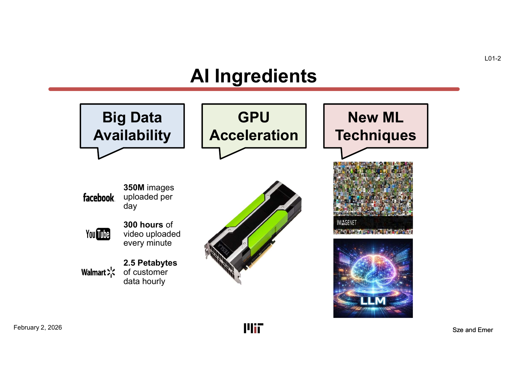
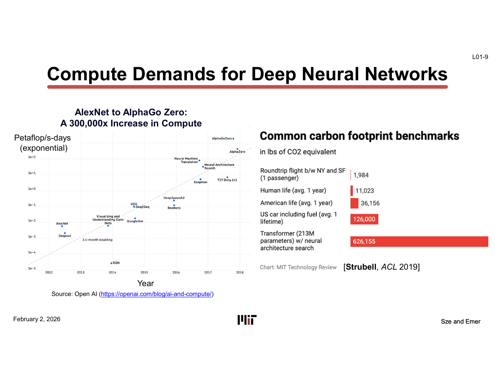
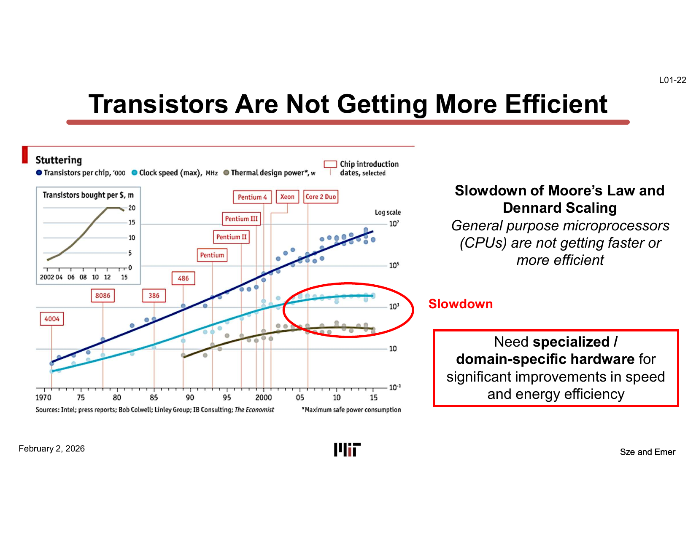
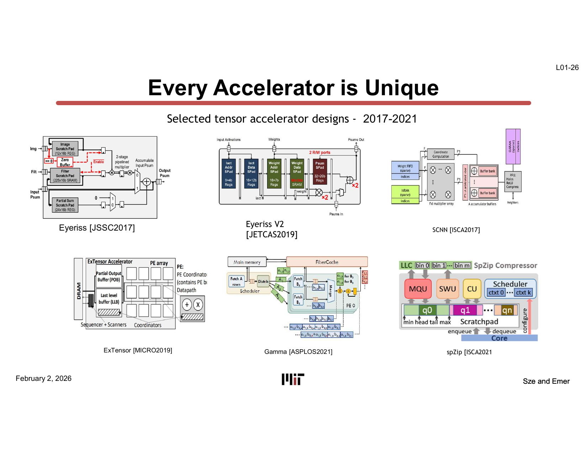
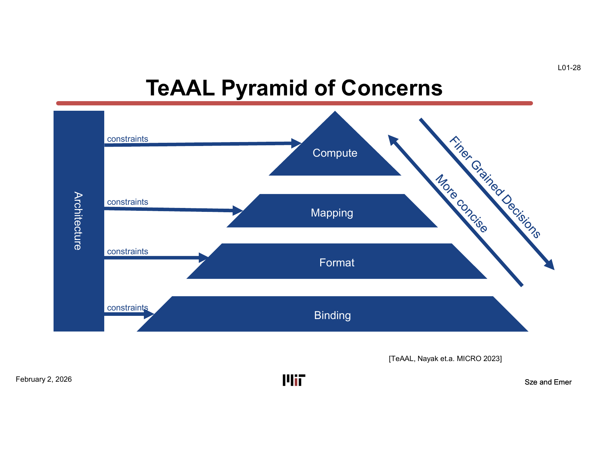
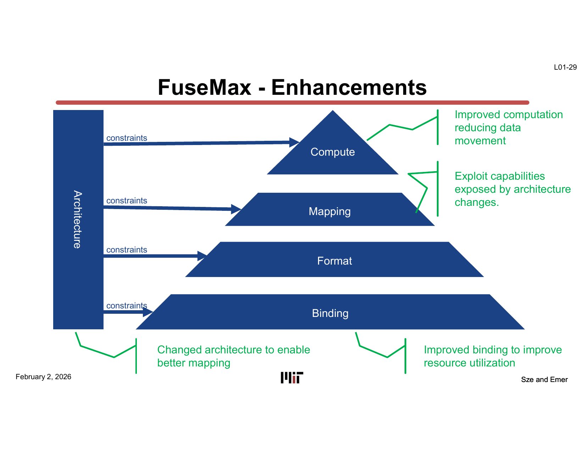
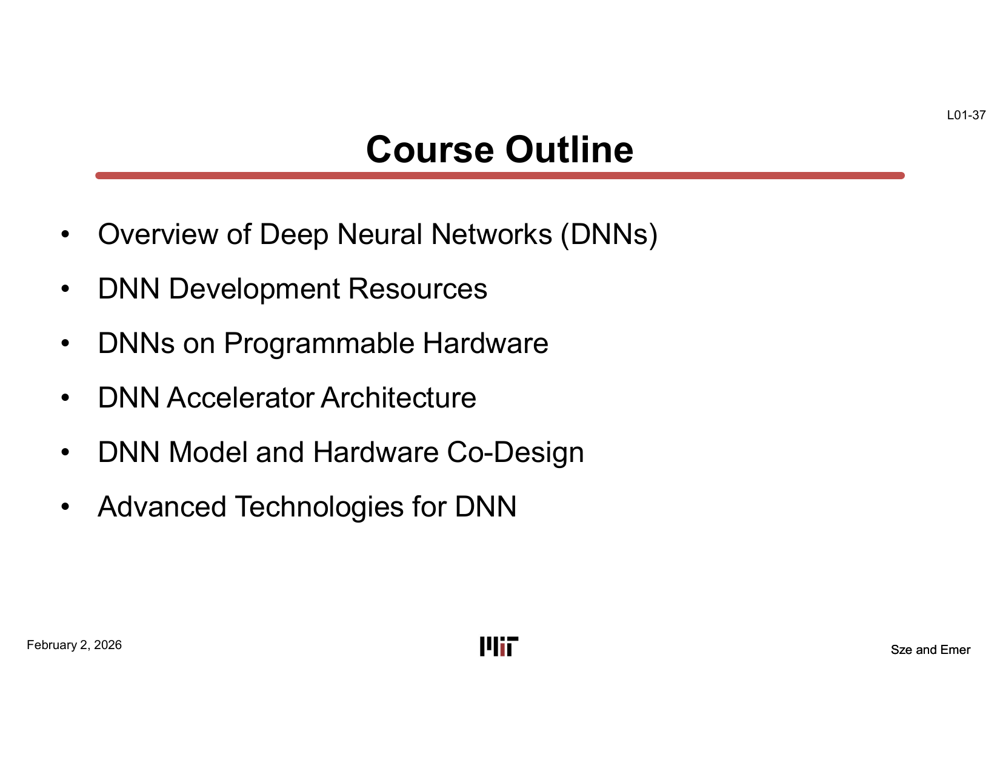
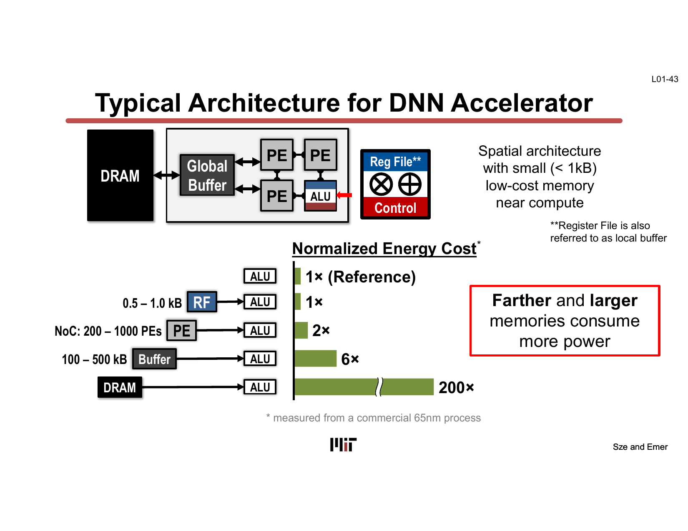
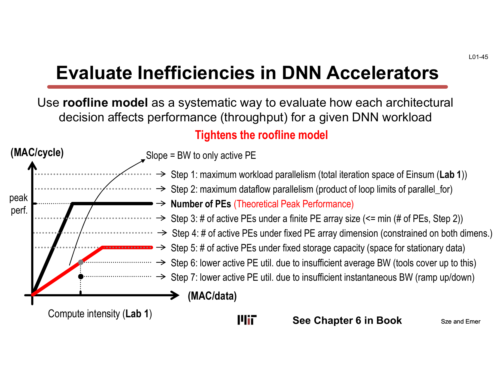

# L01 — Introduction and Applications

> **Course:** 6.5930/1 — Hardware Architectures for Deep Learning
> **Instructors:** Joel Emer & Vivienne Sze (MIT EECS)
> **Lecture date:** February 2, 2026 · **Slides:** 53 · **Source:** [`Lecture/L01-Intro_and_Applications.pdf`](../../Lecture/L01-Intro_and_Applications.pdf)
>
> *This is a conceptual walkthrough that reconstructs the lecture's narrative from the slides. It is organized by idea, not slide-by-slide. Each section cites the slide range it draws from so you can follow along with the original deck.*

---

## TL;DR

Deep learning works, but it is extraordinarily expensive in **compute and energy** — and the hardware substrate we relied on for decades (general-purpose CPUs riding Moore's Law and Dennard scaling) has stopped delivering the free improvements. The answer is **domain-specific (specialized) hardware** for deep neural networks (DNNs). This course teaches you to *read and reason about* any DNN accelerator through a small set of attributes — the order of computation, how it is partitioned, how data flows, where data lives in the memory hierarchy, and how sparsity and reduced precision are exploited. Lecture 1 motivates *why* this matters, introduces the **TeAAL "Pyramid of Concerns"** as the organizing framework for the whole course, and lays out the canonical accelerator template whose **energy is dominated by data movement, not arithmetic**.

---

## Learning Objectives

After this lecture you should be able to:

- Explain **why deep learning created a hardware crisis**, in terms of both compute growth and energy/cost.
- Explain **why general-purpose processors are no longer sufficient**, citing the slowdown of Moore's Law and Dennard scaling.
- Distinguish **training vs. inference** workloads and why inference dominates deployed energy.
- Name the **layers of the TeAAL Pyramid of Concerns** (Architecture → Compute, Mapping, Format, Binding) and what each one decides.
- Describe the **canonical DNN accelerator template** and articulate the central fact that *data movement, not computation, dominates energy*.
- State the **vocabulary of design attributes** this course will use to compare accelerators.

---

## Chapter 1 — Why build hardware for deep learning?

> *Slides: L01-2 … L01-17*

### The three ingredients, and the one that bites

Modern AI rests on three ingredients: **big data availability**, **GPU acceleration**, and **new ML techniques**. The slide quantifies the data side dramatically — hundreds of millions of images uploaded per day, hundreds of hours of video per minute, petabytes of customer data per hour.

Of the three, the one that drives this *course* is the second. As Ilya Sutskever put it at the ACM Turing Award celebration: **"Compute has been the oxygen of deep learning."** Progress has been bought with ever-larger amounts of computation, and that is exactly the resource hardware architects control.

### The compute explosion

The headline number: from **AlexNet (2012) to AlphaGo Zero (2017), the compute required for landmark models grew ~300,000×** — an exponential curve measured in petaflop/s-days. This is not a smooth Moore's-Law-paced growth; it is far faster than hardware improves on its own.

### The energy and money it costs

That compute appetite shows up as **energy** and **dollars**:

- **Data centers** consumed ~3% of US/global electricity demand in 2022, projected to reach **~8% by 2030**.
- **Training GPT-3** (a 96-layer, 175-billion-parameter model needing ~3.14×10²³ FLOPs) would take **~355 years on a single Tesla V100**, and cost **~$4.6M** at the cheapest cloud GPU pricing. **GPT-4 is estimated at >$100M.**
- **Inference** is cheap per query but runs constantly: ChatGPT's estimated inference cost was **$1.5–8M per month**.

### Training vs. inference — the key distinction

This distinction recurs throughout the course:

- **Training:** *high cost per iteration, low frequency.*
- **Inference:** *low cost per iteration, high frequency.*

Because inference runs all the time, it dominates deployed energy. At Google (2019–2021), **~3/5 of ML energy went to inference**; at Meta, the AI infrastructure power split was roughly **10:20:70** across experimentation, training, and inference. The financial scramble around this — Meta buying 350,000 H100 GPUs, industry-wide GPU shortages — is the macroeconomic backdrop for why efficient hardware matters.

> **Why it matters:** The demand for DNN compute is growing far faster than general-purpose hardware can keep up with, and the bottleneck is increasingly **energy**, not raw arithmetic capability. That gap is the reason this course exists.

---

## Chapter 2 — Why *specialized* hardware?

> *Slides: L01-18 … L01-25*

### The free lunch is over

For decades, programs got faster for free as transistors shrank. Two trends made that work, and both have **slowed dramatically**:

- **Moore's Law** — transistor density doubling — has slowed.
- **Dennard scaling** — power density staying constant as transistors shrink — effectively ended around the mid-2000s.

The consequence: **general-purpose CPUs are no longer getting meaningfully faster or more energy-efficient on their own.** To get large improvements in speed and energy efficiency, you must build **specialized / domain-specific hardware**.

### Diminishing returns of CPU complexity

The lecture walks through the evolution of CPU pipelines — **simple in-order → out-of-order → simultaneous multithreading (SMT)** — to make a point: each generation added enormous machinery (branch prediction, register renaming, dependency prediction, smart cache replacement, thread choosing) to squeeze out more performance from general-purpose code. These are clever, but they spend a *lot* of area and energy on overhead that has nothing to do with the actual useful arithmetic. For a workload as regular and arithmetic-heavy as a DNN, most of that machinery is wasted — which is precisely the opening that specialized accelerators exploit.

### Why move computation on-device

Beyond raw efficiency, there are system-level reasons to run DNNs **on the device** instead of in the cloud:

- **Privacy** — data never leaves the device.
- **Latency** — no round-trip to a data center.
- **Communication** — no bandwidth/connectivity dependence.

The **self-driving car** is the extreme case: cameras and radar generate ~6 GB every 30 seconds, prototypes burn ~**2,500 W** of compute (enough to need water cooling), and a single autonomous vehicle running 10 DNNs at 60 Hz on 10 cameras does ~**21.6 million inferences per hour**. It is, in the lecture's phrase, a **"data center on wheels"** — yet it has a tiny power and thermal budget.

> **Why it matters:** General-purpose processors consume too much power (often >10 W where the budget is <1 W) and improve too slowly. The only path to the needed efficiency is hardware specialized to the DNN domain.

---

## Chapter 3 — The accelerator design space

> *Slides: L01-26 … L01-35*

### Every accelerator is unique

The lecture shows a gallery of real tensor accelerators from 2017 onward — Eyeriss, ExTensor, Eyeriss v2, Gamma, SCNN, spZip, ISOSceles, RAELLA, Highlight, Trapezoid, FuseMax — and they all look completely different.

The pedagogical problem this poses: if every design is unique, how do you *understand* a new one without memorizing it? The answer is to have a **framework of concerns** that any accelerator can be decomposed into.

### The TeAAL Pyramid of Concerns

This is the **single most important diagram of the lecture** and the organizing skeleton for the whole course. It separates the concerns of designing/analyzing an accelerator into layered decisions, with the **Architecture** acting as the constraint envelope that bounds every other choice:

Reading the pyramid:

- **Architecture** (the left column) — the hardware structure itself: the PEs, the memory hierarchy, the on-chip network. It imposes **constraints** on all the layers below it.
- **Compute** (top tier) — *what* is computed: the operation / algorithm (e.g., the Einsum being evaluated).
- **Mapping** — *how* that computation is scheduled onto the hardware: loop order (dataflow), tiling/partitioning, parallelism, and where data is placed.
- **Format** — *how data is represented*, especially for compression / sparsity.
- **Binding** — *how* the abstract mapping is bound to concrete hardware resources (which PE, which buffer, when).

Moving up the pyramid means **finer-grained, more concise decisions**; moving down means more concrete, resource-level binding. This separation of concerns is what lets you compare two wildly different accelerators on equal terms: you ask the same questions of each.

### Case study: FuseMax — four levers, four wins

FuseMax (attention acceleration, MICRO 2024) is used to show that the pyramid layers are **independent levers you can pull**. Each enhancement targets a different layer and yields a different kind of improvement:

- **Improved computation** → reduces data movement (a Compute-layer change).
- **Changed architecture** → enables a better mapping (an Architecture-layer change).
- **Better mapping** → exploits the capabilities the new architecture exposes.
- **Improved binding** → improves resource utilization.

The lecture then shows the payoff visually through a sequence of **PE-utilization** slides (baseline → enhanced computation → improved architecture/mapping → improved binding) culminating in a measured **speedup on attention**. The takeaway is not the specific numbers but the *method*: you reason about an accelerator one pyramid layer at a time.

> **Why it matters:** The pyramid turns "every accelerator is unique" into a tractable problem. The rest of the course is essentially a deep dive into each layer — and the labs/project ask you to pull these levers yourself.

---

## Chapter 4 — What this course gives you

> *Slides: L01-36 … L01-53*

### Course outline and objectives

The course is structured to build up the pyramid from the bottom of the stack to advanced techniques:

1. **Overview of DNNs** — the key computations (later lectures formalize them as Einsums).
2. **DNN development resources** — PyTorch, datasets, etc.
3. **DNNs on programmable hardware.**
4. **DNN accelerator architecture.**
5. **DNN model and hardware co-design.**
6. **Advanced technologies for DNNs.**

The stated **course objective** is the real deliverable: by the end you should be able to characterize *any* new design in terms of a fixed vocabulary —

- **Order** of computation
- **Partitioning** of computation
- **Flow of data** for computation
- **Data movement** in the storage hierarchy
- **Data-attribute-specific optimizations** (sparsity, precision)
- **Algorithm/hardware co-design**
- **Degree of flexibility**

Keep this list. It is the lens through which every later lecture should be read.

### The canonical accelerator template — and the one fact that dominates everything

Almost every accelerator in this course is a variation on one template: **DRAM → Global Buffer → an array of Processing Elements (PEs) → a tiny Register File (RF) next to each ALU.** It is a *spatial architecture* with small (<1 kB), low-cost memory placed near the compute, connected by a Network-on-Chip (NoC) spanning 200–1000 PEs.

The crucial insight is the **normalized energy-cost hierarchy** on the right of that slide (measured on a commercial 65 nm process), where the energy of a single multiply-accumulate's *data access* is normalized to the ALU:

| Data source | Relative energy |
|---|---|
| Register File (RF) / within PE | **1× (reference)** |
| Neighbor PE over NoC | **2×** |
| Global Buffer (100–500 kB) | **6×** |
| **DRAM** | **200×** |

**Reading data from DRAM costs ~200× the energy of doing the arithmetic.** This single fact reframes the entire design problem: **energy is dominated by data movement, not computation.** Every technique in the rest of the course — dataflows, tiling, stationarity, fusion, sparsity, reduced precision, compute-in-memory — is, at heart, a strategy to **keep data close and move it less**.

### How you'll explore the design space

- **Design choices** you will manipulate: the PE array (count, NoC topology), the memory hierarchy (levels, capacity, layout), the scheduling/mapping (dataflow, tiling, parallelism, fusion), sparsity handling (gating, skipping, compression formats), and the implementation technology (RRAM, optical, superconductors).
- **The roofline model** is introduced as the systematic way to evaluate how each architectural decision affects throughput for a given workload — a sequence of "tightening" steps from theoretical peak performance down to realistic achievable performance under finite PEs, fixed array dimensions, limited storage, and limited bandwidth.

- **Modeling, not RTL.** Because building each design in RTL would be far too slow, the course uses **architectural modeling tools (Accelergy and AccelForge)** to rapidly explore the design space. (No GPU programming or FPGA implementation in this course.)

### Logistics (brief)

The mechanics, kept short since they are not the intellectual content: the course uses **Python + PyTorch**; the textbook is Sze & Emer's *Efficient Processing of Deep Neural Networks* (free on the MIT network). Assessment is **50% labs / 50% final project**. Labs march up the pyramid: Lab 1 (Einsums/workload analysis) → Lab 2–3 (hardware design & mapping) → Lab 4 (sparsity) → Lab 5 (compute-in-memory). The project applies the tools to a real accelerator study. (See slides L01-40 … L01-53 for staff, schedule, grading, late policy, and prerequisites.)

> **Why it matters:** The course's promise is a *transferable skill* — not knowledge of one chip, but a method for reading any chip. The energy-cost hierarchy is the north star that makes most design decisions make sense.

---

## Key Terms

| Term | Gloss |
|---|---|
| **DNN** (Deep Neural Network) | The workload class this hardware targets. |
| **Training vs. Inference** | Training = high cost / low frequency; inference = low cost / high frequency (and dominates deployed energy). |
| **Moore's Law** | Transistor-density doubling trend; now slowed. |
| **Dennard scaling** | Power density staying constant as transistors shrink; effectively ended ~mid-2000s. |
| **Domain-specific / specialized hardware** | Hardware tailored to a workload domain to gain speed/energy efficiency CPUs can't. |
| **Accelerator** | Specialized hardware block for DNN computation. |
| **PE** (Processing Element) | The basic compute unit (an ALU + small local memory) tiled into an array. |
| **MAC** (Multiply-Accumulate) | The fundamental DNN arithmetic operation. |
| **RF** (Register File) | Tiny (<1 kB) memory next to each ALU; also called a local buffer. |
| **Global Buffer** | On-chip SRAM (100–500 kB) shared across PEs. |
| **NoC** (Network-on-Chip) | Interconnect linking the PE array (200–1000 PEs). |
| **TeAAL Pyramid of Concerns** | The course's framework: Architecture constrains Compute → Mapping → Format → Binding. |
| **Mapping** | How a computation is scheduled onto hardware (dataflow, tiling, parallelism, placement). |
| **Format** | How data is represented, especially for sparsity/compression. |
| **Binding** | Assignment of the abstract mapping to concrete hardware resources. |
| **Einsum** | The notation this course uses to express DNN computations (introduced in later lectures). |
| **Roofline model** | A method to bound achievable throughput vs. compute intensity. |
| **Accelergy / AccelForge** | Architectural modeling tools used in the labs. |
| **Normalized energy cost** | Relative energy of accessing data at each level of the hierarchy (RF 1× … DRAM 200×). |

---

## Takeaways

- Deep learning's compute demand grew **~300,000×** in five years; the binding constraint is increasingly **energy**.
- **Moore's Law / Dennard scaling have slowed**, so general-purpose CPUs can't deliver the needed gains — **specialized hardware** is the answer.
- **Inference dominates deployed energy** (e.g., ~3/5 at Google, ~70% of Meta's AI power) even though training is costlier per iteration.
- The **TeAAL Pyramid of Concerns** (Architecture → Compute, Mapping, Format, Binding) is the framework for reasoning about *any* accelerator.
- The canonical accelerator is **DRAM → Global Buffer → PE array → RF/ALU**, and **data movement dominates energy**: DRAM access ≈ **200×** an ALU operation.
- The course's goal is a **transferable method**: characterize any design by its order, partitioning, dataflow, memory movement, data-specific optimizations, co-design, and flexibility.

---

## Connections to Later Lectures

- **DNN components & computations** → L02–L04 (overview of DNN layers, memory/metrics, **Einsums**, Transformers).
- **Mapping & dataflows** (the Mapping layer of the pyramid) → **L05–L06** (dataflows, partitioning).
- **Sparsity** (the Format layer; data-attribute-specific optimization) → **L07–L10** (sparsity and sparse architectures).
- **Advanced techniques** (reduced precision, compute-in-memory) → **L11–L13** (advanced tech, precision, calculating motion).
- The **energy-cost hierarchy** introduced here is the recurring justification for nearly every optimization in those lectures.

---

## Appendix — Slide-to-Section Map

| Slides | Section |
|---|---|
| L01-1 | Title |
| L01-2 … L01-17 | Ch.1 — Why build hardware for deep learning? |
| L01-18 … L01-25 | Ch.2 — Why *specialized* hardware? |
| L01-26 … L01-35 | Ch.3 — The accelerator design space (Pyramid, FuseMax) |
| L01-36 … L01-39 | Ch.4 — Course outline, objectives, takeaways |
| L01-43 … L01-46 | Ch.4 — Accelerator template, energy hierarchy, roofline, modeling tools |
| L01-40 … L01-42, L01-47 … L01-53 | Ch.4 — Logistics (staff, labs, project, grading, prerequisites) |
