# L03 — Memory, Metrics, Einsums and Transformers

> **Course:** 6.5930/1 — Hardware Architectures for Deep Learning
> **Instructors:** Joel Emer & Vivienne Sze (MIT EECS)
> **Lecture date:** February 9, 2026 · **Slides:** 127 · **Source:** [`Lecture/L03-Memory+Metrics+Einsums+Transformers.pdf`](../../Lecture/L03-Memory+Metrics+Einsums+Transformers.pdf)
>
> *This is a conceptual walkthrough that reconstructs the lecture's narrative from the slides. The deck combines four sub-modules — memory technology, evaluation metrics, the Einsum notation for DNN kernels, and attention/Transformer computation — each introduced in its own section. The walkthrough is organized by idea, not slide-by-slide, and every slide range cited can be verified against the original PDF.*

---

## TL;DR

Three facts dominate this lecture and will recur throughout the course:

1. **Data movement costs far more energy than arithmetic.** A 32-bit DRAM read costs 640 pJ; a 32-bit floating-point multiply costs 3.7 pJ — a 170× gap. Everything about how you design or map a DNN accelerator is, at heart, a strategy to keep data closer and move it less.

2. **A single number (GOPS/W) is not a metric.** Evaluating a DNN processor requires a coordinated suite — accuracy, throughput, latency, energy, hardware cost, and flexibility — and each metric must be measured with care (batch size, dataset, off-chip bandwidth included).

3. **Every DNN computation can be written as an Einsum.** This compact notation captures what is computed without prescribing order, making it the formal language for the rest of the course. Fully-connected layers, convolutions, and every step of Transformer self-attention all reduce to matrix multiplications expressed as Einsums.

---

## Learning Objectives

After this lecture you should be able to:

- Explain the **memory hierarchy** design rationale and the tradeoffs among latches, SRAM, DRAM, and Flash in terms of density, latency, bandwidth, and energy.
- Quantify why **data movement dominates energy** using the Horowitz energy table (e.g., 32-bit DRAM read = 640 pJ vs. 32-bit FP multiply = 3.7 pJ).
- List the **seven key evaluation metrics** (accuracy, throughput, latency, energy/power, hardware cost, flexibility, scalability) and explain what specification details must accompany each.
- Understand why **indirect metrics (OPs, weights) do not directly predict latency or energy** and why comprehensive benchmarking (MLPerf) is needed.
- Write and interpret **Einsum notation**: distinguish contracted vs. uncontracted ranks, recognize patterns (matrix-matrix, matrix-vector, element-wise, Cartesian product, convolution), and understand the Operational Definition.
- Trace the Einsum for a **fully-connected (FC) layer**, show how it maps to matrix-vector and matrix-matrix multiplication (after flattening and adding batch), and explain the Toeplitz construction that converts convolution to matrix multiplication.
- Decompose **self-attention** into its constituent Einsums (embedding → Q, K, V projections → QK product → softmax → AV product → output projection), name the rank variables, and extend to batched and multi-headed attention.

---

## Chapter 1 — The Memory Hierarchy and Why It Exists

> *Slides: L03-2 … L03-19 (physical pages 2–19)*

### The central problem: memories cannot be both fast and large

The memory hierarchy is one of the oldest ideas in computer architecture, and L03 gives it a precise quantitative grounding that is essential for DNN accelerator design.

The starting observation is embarrassingly simple: **no single memory technology can simultaneously deliver large capacity, low latency, high bandwidth, and low energy per access.** The laws of physics — specifically, Energy = Capacitance × Voltage² — mean that larger arrays have longer bit-lines, larger capacitance, and therefore more energy per read. This creates an inescapable tradeoff.

The solution is to build a **hierarchy** of memories at different sizes and positions:

- **Latches / Flip-flops** (< 0.5 kB): 10+ transistors per bit, not dense, but extremely fast and located right next to the logic. Used for pipeline registers.
- **SRAM** (kB–MB): 6 transistors per bit-cell, denser and slower than flip-flops. The peripheral circuits (word-lines, bit-lines, sense amplifiers) can account for significant area and energy — measured SRAM power is dominated 56% by sensing network and 22% by bit-lines. Bit-lines get longer (and more capacitive) as the array grows.
- **DRAM** (GB): 1 transistor per bit-cell. Needs periodic refresh. Usually off-chip, meaning the interconnect has far higher capacitance than on-chip wiring. Hence the giant energy gap.
- **Flash** (100 GB to TB): Non-volatile, denser than DRAM, but requires high-power writes (changing the threshold voltage of a transistor). Modern 3D NAND stacks have reached 512 Gb per die in 100+ layer, single-stack architecture (Samsung 6th-Gen V-NAND, 2022).

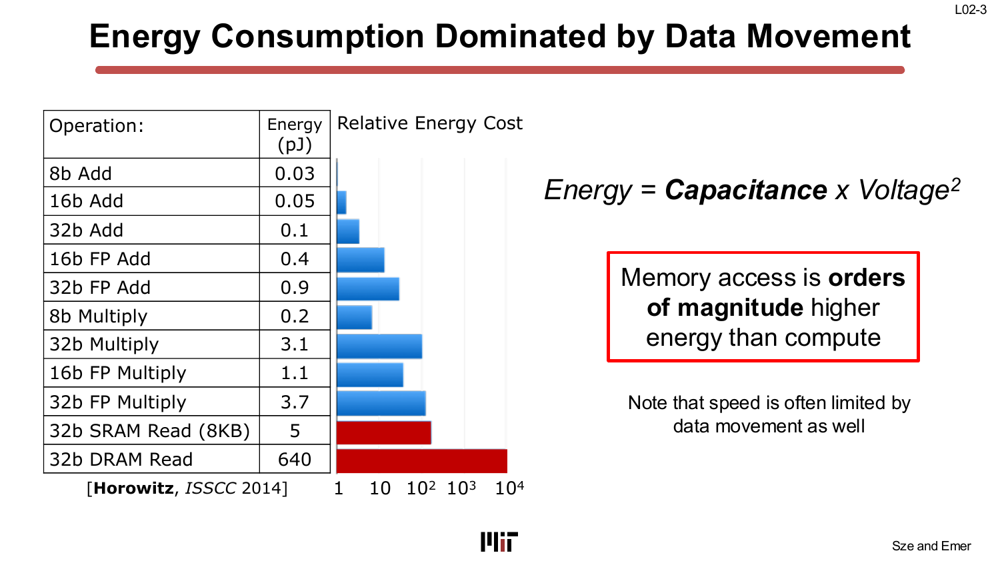

The Horowitz table (ISSCC 2014) that anchors this section is worth memorizing because it is the quantitative justification for almost every design decision in the course:

| Operation | Energy (pJ) |
|---|---|
| 8-bit Add | 0.03 |
| 32-bit Add | 0.1 |
| 32-bit FP Add | 0.9 |
| 8-bit Multiply | 0.2 |
| 32-bit FP Multiply | 3.7 |
| 32-bit SRAM Read (8 kB) | 5 |
| **32-bit DRAM Read** | **640** |

A DRAM read is **128× more expensive than an SRAM read** and **170× more expensive than a 32-bit FP multiply**. Speed follows the same ranking: memory access limits performance just as much as energy.

### The design response: exploit locality

The goal of the memory hierarchy is to **reduce access to large memories** by keeping frequently reused data in small, nearby memories. The two forms of locality exploited are:

- **Temporal locality:** the same data element is used more than once. If it is kept in a small local buffer across those uses, only one expensive DRAM access is needed instead of many.
- **Spatial locality:** nearby data elements are used together. Loading a whole cache line or tile at once amortizes the access cost.

The key insight for DNN accelerators is that **processing order (loop nest ordering) does not change the mathematical result** — MACs are commutative — but it profoundly changes which data is reused at which buffer level, and therefore changes energy and latency. Choosing the right processing order to exploit reuse is the subject of the Mapping lectures (L05–L06).

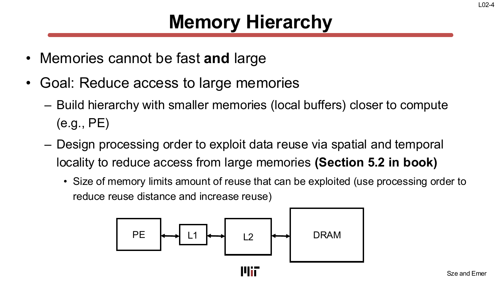

### Memory tradeoffs summary

The tradeoffs across technologies can be organized into five attributes:

- **Cost/bit:** circuit type (smaller transistor → cheaper)
- **Latency:** circuit type (smaller → slower) *and* total capacity (smaller → faster)
- **Bandwidth:** increases with parallelism
- **Energy/access/bit:** total capacity (smaller → less energy) *and* circuit type (smaller → less energy)
- **Density:** circuit type (smaller transistor → denser)

Most attributes improve with technology scaling, lower supply voltage, and smaller capacitance — which is why every process node helps accelerator design, just not as dramatically as it once did.

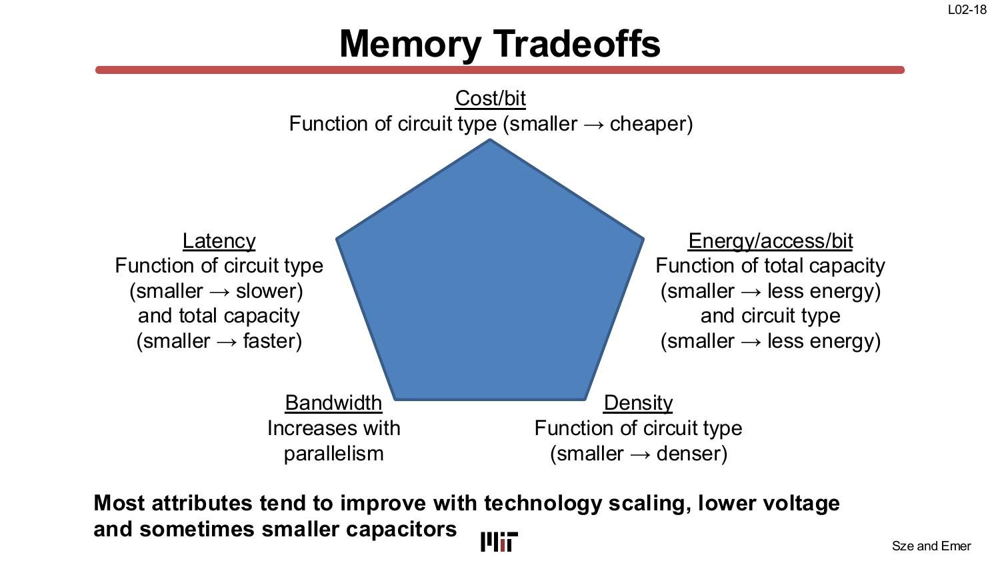

> **Why it matters:** The memory hierarchy is not an abstract concept — it is the physical reason why the DNN accelerator template (DRAM → Global Buffer → PE array → RF) looks the way it does, and it is the quantitative foundation for the claim that "data movement dominates energy." Every architectural decision in this course exists to keep data at the lowest, cheapest level of the hierarchy for as long as possible.

---

## Chapter 2 — Evaluation Metrics: Much More Than GOPS/W

> *Slides: L03-40 … L03-56 (physical pages 40–56)*

### Why a single efficiency number is dangerous

The slide titled "GOPS/W or TOPS/W?" delivers a pointed warning: a chip can achieve high GOPS/W with a **ring oscillator**. A ring oscillator has no compute capability whatsoever, but it toggles bits at a high rate and consumes some power, so the ratio can look impressive. This extreme example makes the point: **peak throughput divided by peak power tells you almost nothing about whether the chip is useful for your workload.**

### The seven metrics you must report

The lecture identifies a comprehensive set of metrics that together give a fair picture:

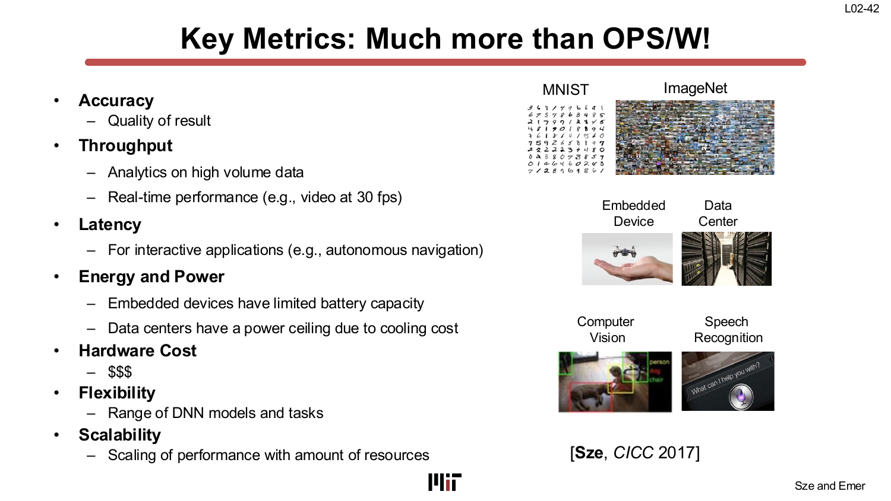

1. **Accuracy** — The quality of the result. Must specify dataset and task difficulty; a chip achieving 99% accuracy on MNIST is not comparable to one achieving 90% on ImageNet.

2. **Throughput** — Operations or inferences per second. Required for analytics pipelines and real-time applications (e.g., video at 30 fps). Must be reported as *actual* throughput on a specific DNN, not just "peak TOPS."

3. **Latency** — Time from input to output. Critical for interactive applications (autonomous navigation, speech recognition). Has the additional constraint of requiring small batch sizes: batching helps throughput but hurts latency.

4. **Energy and Power** — Embedded devices have limited battery capacity; data centers have a power ceiling set by cooling cost. Power consumption limits the maximum number of MACs that can run in parallel (thermal envelope).

5. **Hardware Cost** — Chip area, process technology, and external interface cost. These determine the price.

6. **Flexibility** — The range of DNN models and tasks efficiently supported. Because DNN algorithm designers cannot be guaranteed to use a specific model, hardware must handle variation in layer shapes, precision, and sparsity.

7. **Scalability** — How performance scales with additional resources (PEs, memory bandwidth).

### What to specify when measuring each metric

The lecture is explicit about the specification details that accompany each metric:

- **Accuracy:** specify dataset, task difficulty, and training procedure.
- **Throughput:** specify the number of PEs *with utilization* (not just peak), and report runtime for a specific DNN model.
- **Latency:** specify batch size.
- **Energy/Power:** report power for running specific DNN models, and report **off-chip memory access** (DRAM bandwidth). Without the DRAM bandwidth figure, a chip that just has multipliers can claim low chip power while the system power is dominated by DRAM accesses.
- **Hardware Cost:** report on-chip storage, number of PEs, chip area, and process technology.
- **Flexibility:** report performance across a wide range of DNN models.

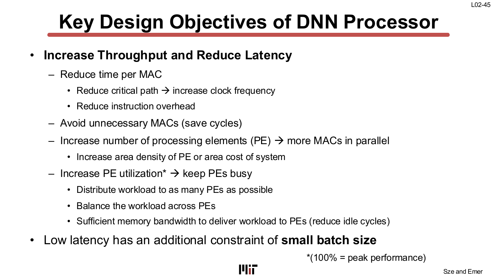

### The evaluation process: a hierarchy of gates

The lecture describes a natural ordering for evaluating a DNN system against an application:

1. **Accuracy** determines whether it can *perform* the task.
2. **Latency and Throughput** determine whether it can run *fast enough* for real-time.
3. **Energy and Power** dictate the form factor (phone, edge server, data center).
4. **Cost** (area + interface) determines the price point.
5. **Flexibility** determines the range of tasks it can serve.

Missing any one metric can lead to a misleading or invalid comparison. The lecture gives two cautionary examples: (a) claiming "low power, high throughput" without accuracy means nothing if the model is trivial; (b) claiming "low chip power" without reporting off-chip bandwidth hides the system-level energy.

### MLPerf: standardized benchmarking

MLPerf (first results December 2018, backed by 23 companies and 7 institutions) is the industry response: **a broad suite of DNN models covering image classification, object detection, translation, speech-to-text, recommendation, sentiment analysis, and reinforcement learning**, used as a common benchmark for hardware, software frameworks, and cloud platforms. It covers both training and inference, cloud and edge, closed and open divisions.

### The warning about indirect metrics

The lecture closes this section with an explicit warning: **fewer weights and fewer MACs do not directly translate to lower energy or lower latency.** Filter shape, batch size, and hardware mapping all matter. A model with fewer parameters can consume more energy on a given piece of hardware than one with more parameters, depending on how the data flows. This is why L03 demands direct metrics rather than proxy counts.

> **Why it matters:** Accelerator papers routinely cherry-pick a single metric. Understanding the full suite — and knowing what specifications must accompany each — is essential for doing fair comparisons and for designing hardware that is actually useful in deployment.

---

## Chapter 3 — Einsum Notation: The Formal Language of DNN Computation

> *Slides: Extended Einsums 2/37 … 18/37 (physical pages 57–72)*

### What is an Einsum and why use it?

A DNN accelerator must perform a fixed set of algebraic operations — multiply-accumulate, reduction, element-wise ops — but those operations can be expressed in many different loop orderings without changing the result. To reason about *what* is computed independently of *how* (in what order), the course adopts **Einsum notation**.

An Einsum is written as:

```
Z_m,n = A_m,k × B_n,k
```

This is simultaneously a declaration of tensors (Z is indexed by m and n; A by m and k; B by n and k) and a computation rule. The **Operational Definition for Einsums (ODE)** states:

> Traverse all points in the space of all legal rank variable values (the **iteration space**). At each point: compute the value on the right-hand side at those rank variable values; assign (or reduce) it into the left-hand side operand at its specified indices. If the left-hand side is non-zero, *reduce* (accumulate) the value into it.

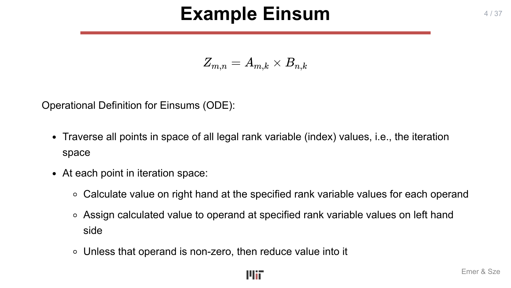

This definition is deceptively simple but extremely powerful: it specifies *what* to compute — the mathematical relation — without saying *in what order* to traverse the iteration space. Any traversal order that visits every point in the iteration space produces the same result.

### Ranks, rank names, and rank shapes

Einsum uses precise terminology:

- **Rank variable** (e.g., k, m): the loop index.
- **Rank name** (e.g., "K", "M"): a label for the dimension.
- **Rank shape** (e.g., K, M): the size (range) of the dimension.

The notation `A^{K,M}_{k,m}` means tensor A has rank names K and M with rank variables k and m ranging over K and M values respectively. When concrete values are specified (e.g., `A^{K=X, M=X}_{k,m}`), both dimensions are of size X.

### Einsum patterns: a taxonomy

The lecture walks through a comprehensive taxonomy of patterns. Every DNN layer is one of these:

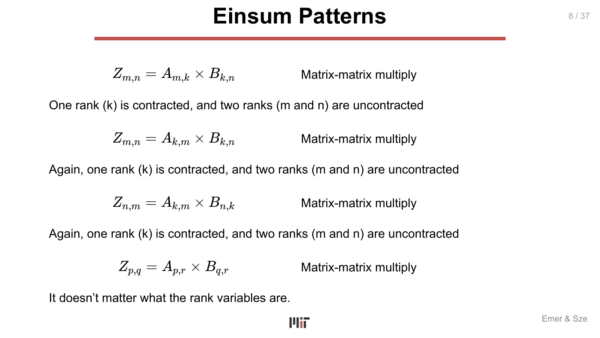

**Contracted (reduced) rank:** a rank variable that appears on the right-hand side but *not* on the left-hand side. The dimension is summed (reduced) away. In `Z_{m,n} = A_{m,k} × B_{k,n}`, rank k is contracted.

**Uncontracted rank:** a rank that appears on both sides and is preserved in the output.

The patterns:

| Einsum | Pattern | Notes |
|---|---|---|
| `Z_{m,n} = A_{m,k} × B_{k,n}` | Matrix-matrix multiply | k contracted |
| `Z_{m,n} = A_{k,m} × B_{k,n}` | Matrix-matrix multiply | same, index order irrelevant |
| `Z_m = A_{k,m} × B_k` | Matrix-vector multiply | k contracted |
| `Z_{m,n} = A_m × B_n` | Cartesian product | no contraction |
| `Z_m = A_m × B_m` | Element-wise multiply | no contraction, no expansion |
| `Z_m = A_m + B_m` | Element-wise addition | different operator (not reduce-multiply) |

Note: the *names* of rank variables do not matter — `Z_{p,q} = A_{p,r} × B_{q,r}` is still a matrix-matrix multiply.

### Rank variable patterns: tuples, partitioning, and flattening

The lecture explores two further operations:

**Partitioning:** a single rank i can be split into a higher-order pair (i₁, i₀) where `i = i₁ × I₀ + i₀`. This adds a rank. The Einsum `Z_i = A_i × B_i` becomes `Z_{i₁,i₀} = A_{i₁,i₀} × B_{i₁,i₀}` after partitioning.

**Flattening (the inverse):** `Z_{(i₁,i₀)} = A_{(i₁,i₀)} × B_{(i₁,i₀)}` — a tuple of rank variables can be treated as a single coordinate where `ij = i × J + j`. This collapses two ranks into one.

These two operations are the formal basis for **tiling** (in the Mapping lectures, L05–L06): tiling *is* partitioning of rank variables, and understanding it at the Einsum level is what allows the course to reason about tiling independently of any particular hardware.

### Convolution as an Einsum

The 1-D convolution `O_q = I_{q+s} × F_s` is the prototype for all convolution Einsums. The key feature is the **change of variables**: there is a relationship between the input index and the output and filter indices (`h = U×p + r`, `w = U×q + s` in 2D, where U is the stride). This structural coupling is absent in fully-connected layers and is what makes convolution somewhat special.

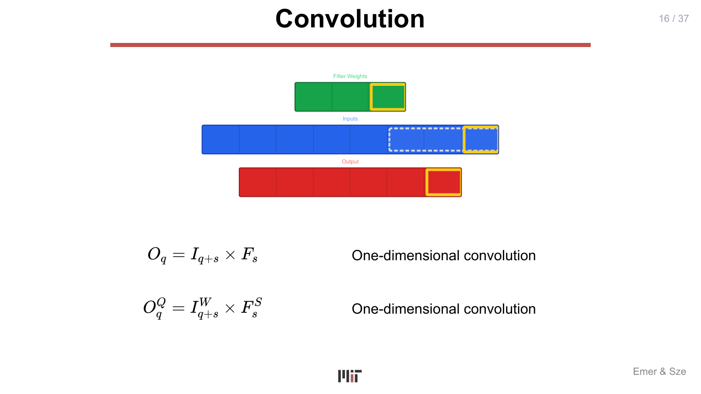

The full 2-D convolution with batches:

```
O_{n,m,p,q} = B_{m} + I_{n,c,(U×p+r),(U×q+s)} × F_{m,c,r,s}
```

where N = batch, M = output channels, P×Q = output spatial, C = input channels, R×S = filter size.

> **Why it matters:** Einsum is the formal backbone of this course. The TeAAL framework's "Compute" layer is precisely the Einsum being evaluated. Without a way to express computations abstractly — independent of order — it is impossible to talk about mapping, tiling, or dataflow in a principled way.

---

## Chapter 4 — Einsums for Fully-Connected and Convolution Layers

> *Slides: Kernel Computation 1 … 37 (physical pages 73–109)*

### Fully-connected layer: from nested loops to matrix multiplication

A **fully-connected (FC) layer** computes `O_m = I_{c,h,w} × F_{m,c,h,w}` (summing over input channels c and spatial dimensions h, w). The Einsum captures this with no loop ordering.

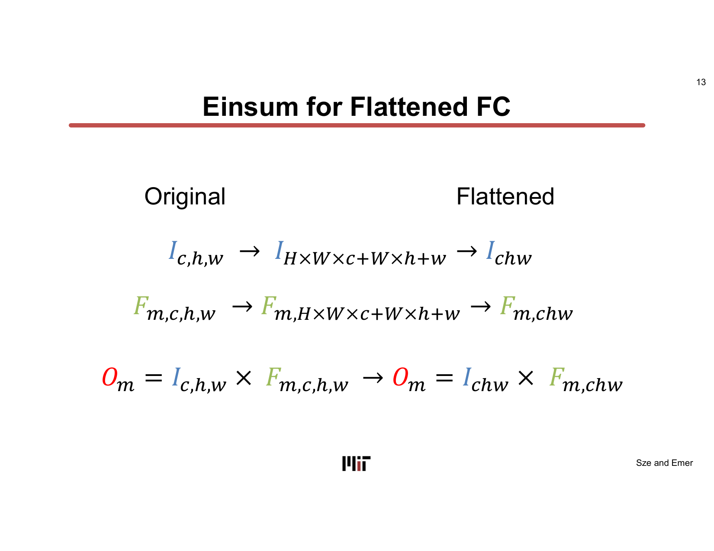

The lecture shows explicitly how to convert this to matrix multiplication:

1. **Flatten** the (C, H, W) dimensions into a single CHW index: `I_{c,h,w} → I_{chw}` and `F_{m,c,h,w} → F_{m,chw}`.
2. The Einsum becomes `O_m = I_{chw} × F_{m,chw}` — a **matrix-vector multiply** (reduction on rank chw).
3. With a **batch of N inputs**: `O_{n,m} = I_{n,chw} × F_{m,chw}` — a **matrix-matrix multiply**.

This is the standard lab notation: `C_{m,n} = A_{m,k} × B_{k,n}` with reduction on k. The order of ranks in an Einsum does not matter; only which ranks are contracted matters.

### Convolution: Toeplitz conversion and the im2col trick

Convolution can also be converted to matrix multiplication — but it requires a structural intermediate step.

For 1-D convolution `O_q = I_{q+s} × F_s`, the conversion is:
1. **Toeplitz conversion (Step 1):** `T_{q,s} = I_{q+s}` — create a 2D Toeplitz matrix T by indexing into the input with offset `q+s`.
2. **Matrix multiply (Step 2):** `O_q = T_{q,s} × F_s`.

The key observation is that the Toeplitz matrix contains **repeated data** — input elements appear in multiple rows shifted by one position. This data replication is what the im2col (image-to-column) transformation does in frameworks like PyTorch.

For 2-D convolution, the dimensions of the matrix multiply are:

```
Filters [M × CRS] × Input_Toeplitz [CRS × PQN] = Output [M × PQN]
```

where P = H−R+1, Q = W−S+1, N = batch size.

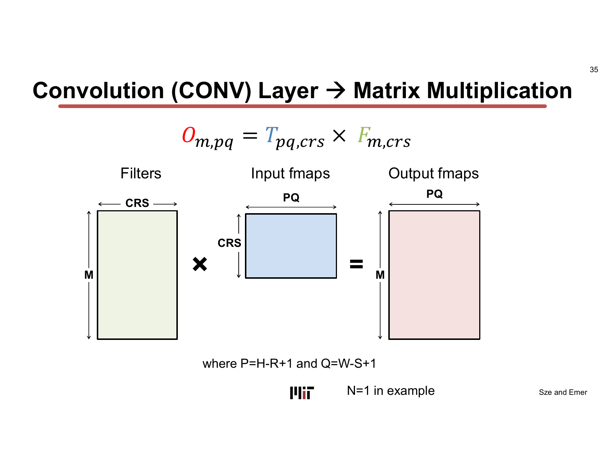

The 2-D Toeplitz Einsum is:

```
T_{q,p,s,r} = I_{p+(r),q+(s)}    (Toeplitz conversion)
T_{qp,sr}  = T_{q,p,s,r}          (flatten ranks)
O_{m,qp}   = T_{qp,sr} × F_{m,sr} (matrix multiply)
```

The Convolution Einsum `O_{n,m,p,q} = I_{n,c,(U×p+r),(U×q+s)} × F_{m,c,r,s}` is therefore equivalent to a matrix-matrix multiplication after the Toeplitz/im2col transform — which is *why* matrix multiplication accelerators (like GPUs) can efficiently handle convolutions.

> **Why it matters:** The conversion of FC and CONV layers to matrix multiplication is the analytical foundation for why DNN accelerators can be built around a general matrix-multiply (GEMM) engine. It also shows that there are *many* ways to compute the same matrix multiplication (many valid loop orderings), and that the choice of order affects how much data movement occurs at each memory level.

---

## Chapter 5 — Transformer Self-Attention as Einsums

> *Slides: Attention Einsums 20/37 … 37/37 (physical pages 110–127)*

### The Transformer encoder structure

The Transformer encoder alternates between two sub-layers: **self-attention** (with Add+Norm residual) and **feed-forward** (with Add+Norm residual). The lecture focuses on the self-attention sub-layer.

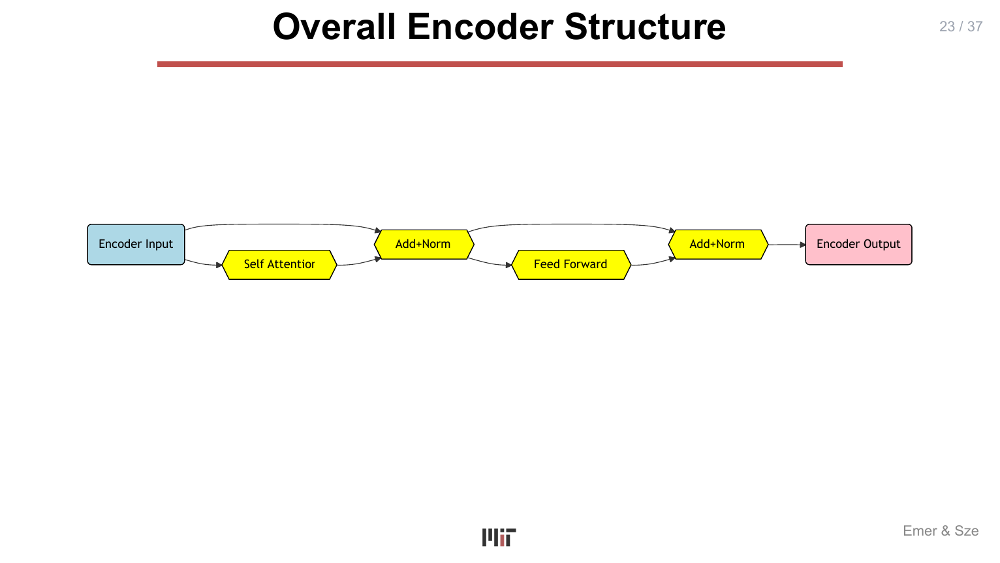

The encoder is a cascade of Einsums. The lecture identifies each step with its Einsum, its rank variables, and the tensor dimensions involved.

### The computation graph of basic self-attention

The data flow through one self-attention block (for a single head, no batch) involves eight operations, each expressible as an Einsum:

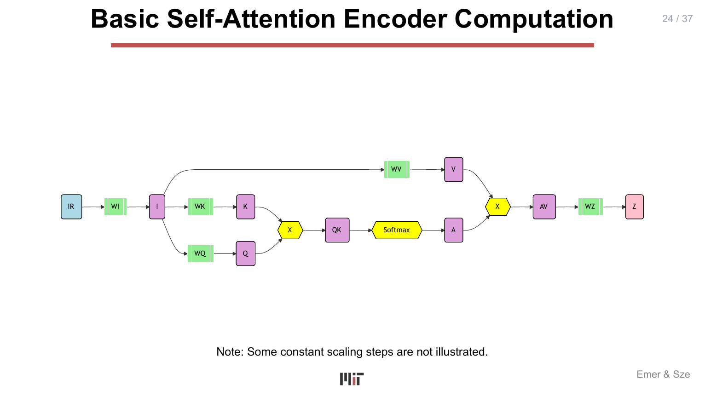

**Step 1 — Input embedding** (first layer only):

```
I_{m,d} = IR_{m,c} × W^I_{c,d}
```

Convert the raw one-hot input IR (sequence length M, vocabulary size C) to a dense embedding I of size d_model (D).

**Step 2 — Project to Query (Q) and Key (K):**

```
Q_{m,e} = I_{m,d} × W^Q_{d,e}
K_{m,e} = I_{m,d} × W^K_{d,e}
```

Project the input I from D-space into E-space (dk dimension) to form Q and K.

**Step 3 — QK product (pre-softmax attention):**

```
QK_{m,p} = Q_{p,e} × K_{m,e}    (reduction on rank E)
```

M and P are both aliases for sequence length; QK is the M×M attention logit matrix.

**Step 4 — Softmax:**

```
SN_{m,p} = exp(QK_{m,p})
SD_p      = Σ_m SN_{m,p}
A_{m,p}   = SN_{m,p} / SD_p
```

The softmax is not an Einsum (it involves exp and division), but its components fit the Einsum framework for the summation step.

**Step 5 — Project to Value (V):**

```
V_{m,f} = I_{m,d} × W^V_{d,f}
```

Project I from D-space to F-space (dv dimension).

**Step 6 — AV product:**

```
AV_{p,f} = A_{m,p} × V_{m,f}    (reduction on rank M)
```

**Step 7 — Output projection:**

```
Z_{p,g} = AV_{p,f} × W^Z_{f,g}
```

Project from F-space to G-space (often same as D).

### Rank dictionary

The lecture provides an explicit name-to-dimension table:

| Rank | Meaning |
|---|---|
| M | Sequence length (for Q, K, V in self-attention) |
| P | Alias of sequence length (for the QK product) |
| R | Sequence length for the query in cross-attention |
| C | Dictionary / vocabulary size |
| D | Global input embedding (d_model) |
| E | Q and K local embedding (dk) |
| F | V local embedding (dv) |
| G | Output embedding |
| B | Batch size |

### Batched and multi-headed attention

Adding **batch dimension B** is mechanical: prepend B to every tensor. The Einsums gain a b index, and the matrix multiplications become batched matrix multiplications.

**Multi-headed attention** (H heads) adds an H rank to the weight tensors:

```
K_{b,h,m,e} = I_{b,m,d} × W^K_{d,h,e}
Q_{b,h,m,e} = I_{b,m,d} × W^Q_{d,h,e}
V_{b,h,m,f} = I_{b,m,d} × W^V_{d,h,f}
QK_{b,h,m,p} = Q_{b,h,p,e} × K_{b,h,m,e}
AV_{b,h,p,f} = A_{b,h,m,p} × V_{b,h,m,f}
```

After all heads compute their AV, a **concatenation and flatten** step merges the H×F dimensions into a single G=H×F dimension:

```
C_{b,p,h×F} = AV_{b,h,p,f}     (reshape/flatten)
Z_{b,p,d}   = C_{b,p,f} × W^Z_{g,d}
```

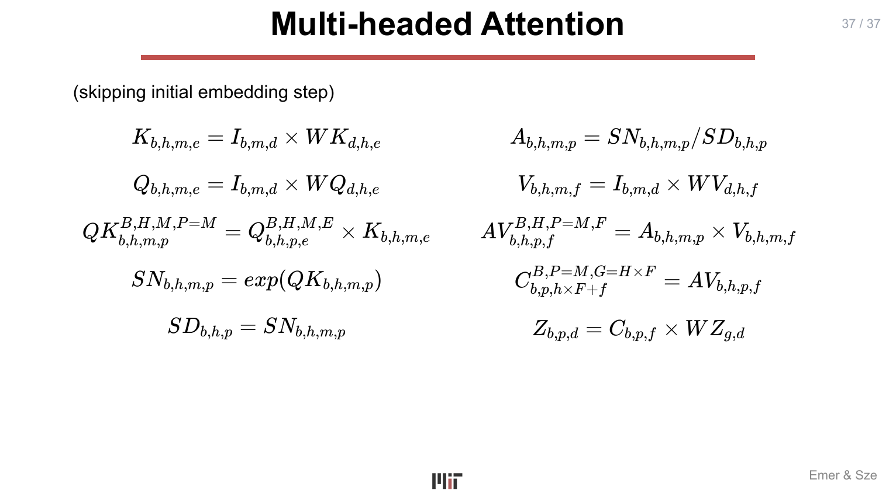

### The full cascade in one view

The full set of Einsums for one attention layer:

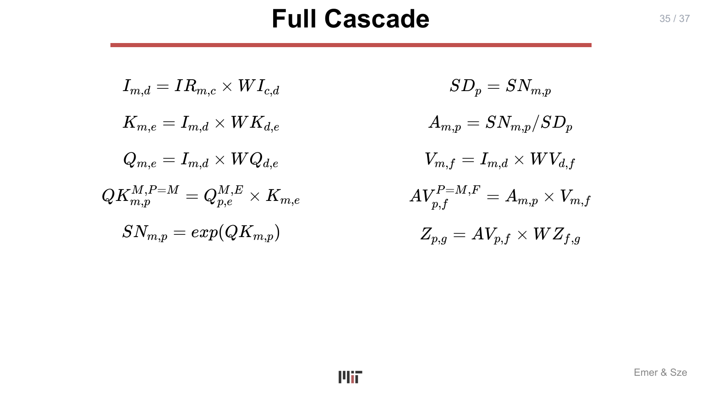

Each step is a matrix multiplication at its core: projection steps are M×D times D×E; QK is M×E times M×E (transposed) = M×M; AV is M×M times M×F = M×F. The Transformer is, computationally, a cascade of matrix multiplications with a non-linear softmax inserted in the middle of the attention computation.

> **Why it matters:** Expressing Transformer self-attention as Einsums gives the accelerator designer the same formal handle on Transformer workloads that L04 gives on convolution workloads. It is the prerequisite for mapping Transformer layers onto hardware (covered in L05–L06), optimizing attention for sparse or approximate computation (L07–L10), and designing attention-specific accelerators (projects). It also makes clear that the QK product creates an O(M²) intermediate, which is the root cause of the quadratic cost of standard attention.

---

## Key Terms

| Term | Gloss |
|---|---|
| **Memory hierarchy** | A multi-level structure (RF → SRAM → DRAM) that trades capacity for speed/energy, placing small fast memories near compute. |
| **Temporal locality** | Reusing the same data element multiple times; if it stays in a nearby buffer, expensive large-memory accesses are avoided. |
| **Spatial locality** | Nearby data elements are accessed together; loading a tile/block amortizes per-access cost. |
| **SRAM** | 6-transistor on-chip memory; forms the Global Buffer and Register File layers of a DNN accelerator. |
| **DRAM** | 1-transistor off-chip memory; massive capacity but 640 pJ per 32-bit read — the dominant energy cost. |
| **Horowitz energy table** | The reference table (ISSCC 2014) quantifying energy in pJ for arithmetic operations and memory accesses. |
| **Throughput** | Inferences or MACs per second; must be reported at actual utilization on a real DNN, not peak. |
| **Latency** | Time from input to output; requires specifying batch size (small batch → low latency). |
| **PE utilization** | Fraction of PEs actually doing useful work; 100% = peak performance. |
| **MLPerf** | Industry DNN benchmarking suite covering training and inference across CNN, RNN, and other models. |
| **Einsum** | An expression of the form `Z_ij = A_ik × B_jk` that specifies tensor contraction without enforcing loop order. |
| **Iteration space** | The set of all legal (i₁, i₂, …, iₙ) tuples formed by rank variable ranges; Einsum traverses this set. |
| **Contracted rank** | A rank variable appearing on the RHS but not the LHS; it is summed (reduced) away. |
| **Uncontracted rank** | A rank variable appearing on both sides; it is preserved in the output. |
| **Partitioning** | Splitting one rank i into (i₁, i₀) via `i = i₁×I₀ + i₀`; adds a dimension. The formal basis of tiling. |
| **Flattening** | The inverse of partitioning; collapsing a tuple rank variable `(i₁, i₀)` into a single index. |
| **Toeplitz matrix / im2col** | The structural transformation that converts a convolution into a matrix multiply by building a matrix of shifted input patches. |
| **Q, K, V** | Query, Key, Value — the three projections of the input sequence in self-attention. |
| **Attention matrix (A)** | The M×M softmax-normalized product of Q and K; each row is a probability distribution over positions. |
| **d_model (D)** | Global embedding dimension of the Transformer model. |
| **dk (E)** | Projection dimension for Q and K in each attention head. |
| **Multi-headed attention** | Running H independent attention heads in parallel by adding an H rank to the weight tensors. |

---

## Takeaways

- **A 32-bit DRAM read costs 640 pJ; a 32-bit FP multiply costs 3.7 pJ** — a 170× gap. This single fact motivates the entire DNN accelerator field.
- The memory hierarchy (RF → SRAM → DRAM → Flash) exists because **no memory technology can be simultaneously large, fast, dense, and cheap**; the hierarchy places fast small memories near compute to exploit data reuse.
- **Processing order does not change the result** (MACs commute), but it profoundly changes how data moves through the hierarchy. Choosing the right order is the mapping problem.
- **GOPS/W alone is not a valid metric.** A comprehensive evaluation requires accuracy, throughput (with utilization), latency (with batch size), energy (with DRAM bandwidth), hardware cost, flexibility, and scalability.
- **Fewer MACs and weights do not guarantee lower energy or latency** — filter shape, batch size, and hardware mapping all determine actual performance.
- **Every DNN computation is an Einsum:** a contracted-rank tensor expression that specifies *what* to compute without specifying *how* (iteration order). FC layers are matrix-vector or matrix-matrix multiplies; convolutions are matrix multiplies after Toeplitz conversion; Transformer self-attention is a cascade of matrix multiplies with softmax.
- Transformer self-attention creates an **O(M²) attention matrix**, which is the fundamental bottleneck that attention-specific accelerators (FuseMax, FlashAttention) target.

---

## Connections to Later Lectures

- **Einsum formalism deepens in L04** — the notation is extended to cover more DNN layer types (pooling, normalization) and edge cases.
- **Mapping (L05–L06)** — given an Einsum and an architecture, mapping decides the loop order, tiling (= partitioning of rank variables), and data placement. The Einsum is the "what"; the mapping is the "how."
- **Sparsity (L07–L10)** — sparsity is a property of the tensors in an Einsum (many elements are zero). Sparse architectures exploit this to skip MACs and reduce data movement.
- **Precision (L12)** — reducing the bit-width of rank variables or tensor elements; precision interacts with energy per MAC and storage cost.
- **Attention accelerators** — FuseMax (mentioned in L01) fuses the QK and AV steps to avoid materializing the M×M attention matrix in DRAM, directly applying the energy-movement principle from Chapter 1.
- The **energy-cost hierarchy** introduced in Chapter 1 is the recurring justification for essentially every optimization discussed in L05 through L13.

---

## Appendix — Slide-to-Section Map

| Physical Pages | Slide Label | Section |
|---|---|---|
| 1 | L02-1 | Title — Memory and Evaluation Metrics |
| 2–19 | L02-2 … L02-19 | Ch.1 — Memory Hierarchy |
| 20–39 | L02-20 … L02-39 | (Efficient CNN models — background for L02) |
| 40–56 | L02-40 … L02-56 | Ch.2 — Evaluation Metrics |
| 57 | Einsums 2/37 | Ch.3 — Extended Einsums (title) |
| 58–59 | Einsums 3/37 … 4/37 | Ch.3 — Einsum ODE, example |
| 60–61 | Einsums 5/37 … 6/37 | Ch.3 — Matrix multiply traversal animations |
| 62–69 | Einsums 7/37 … 13/37 | Ch.3 — Tensor references, patterns, rank variables, partitioning, flattening |
| 69–72 | Einsums 14/37 … 18/37 | Ch.3 — MM variants, convolution Einsum, rank shapes |
| 73 | Kernel 1 | Ch.4 — Kernel Computation (title) |
| 74–85 | Kernel 2 … 13 | Ch.4 — FC computation, Einsum, flatten, matrix-vector |
| 85–90 | Kernel 13 … 18 | Ch.4 — FC with batch → matrix-matrix multiply |
| 91–109 | Kernel 19 … 37 | Ch.4 — CONV Einsum, Toeplitz, conv→matrix multiply |
| 110 | Attention 20/37 | Ch.5 — Attention Einsums (title) |
| 111–114 | Attention 21/37 … 24/37 | Ch.5 — Diagram conventions, encoder structure, basic self-attention |
| 115–120 | Attention 25/37 … 30/37 | Ch.5 — I, Q, K, softmax, V, Z steps |
| 121–123 | Attention 31/37 … 33/37 | Ch.5 — Rank names, input and weight tensors |
| 124–125 | Attention 34/37 … 35/37 | Ch.5 — Intermediate tensors, full cascade |
| 126 | Attention 36/37 | Ch.5 — Batched attention |
| 127 | Attention 37/37 | Ch.5 — Multi-headed attention |
