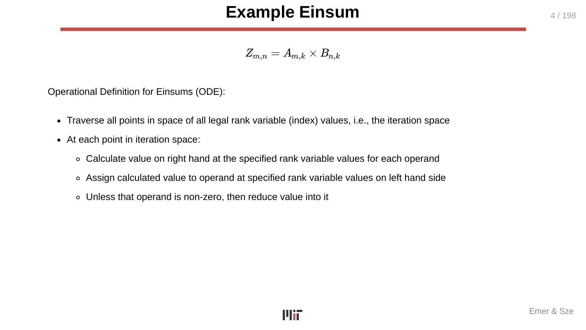
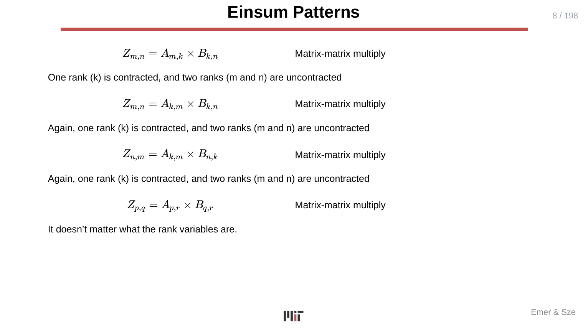
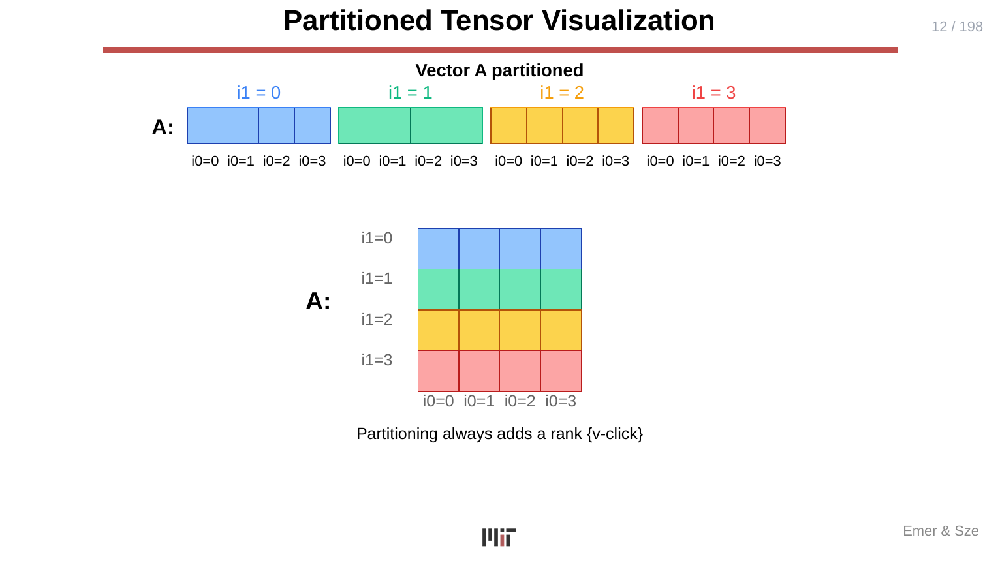
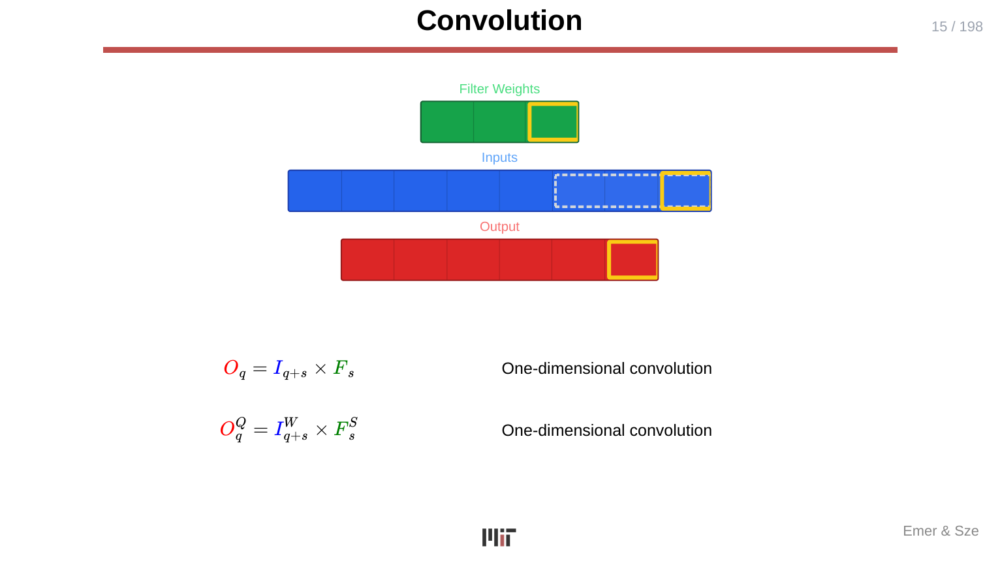
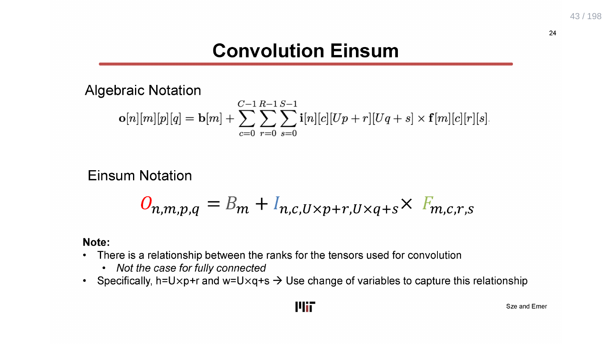
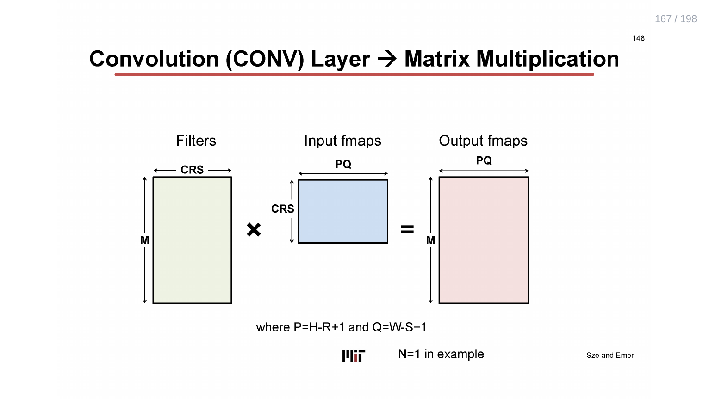
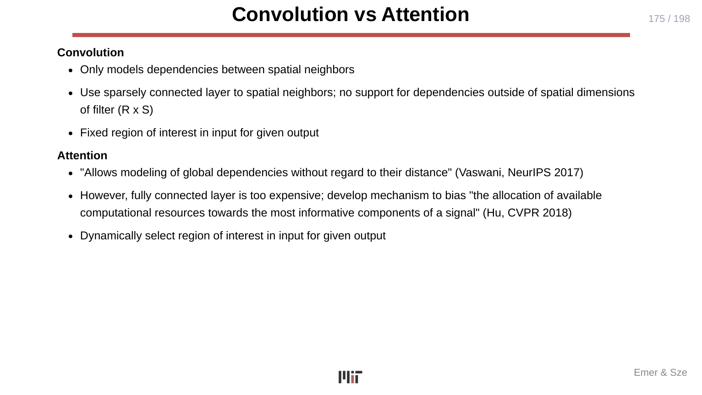
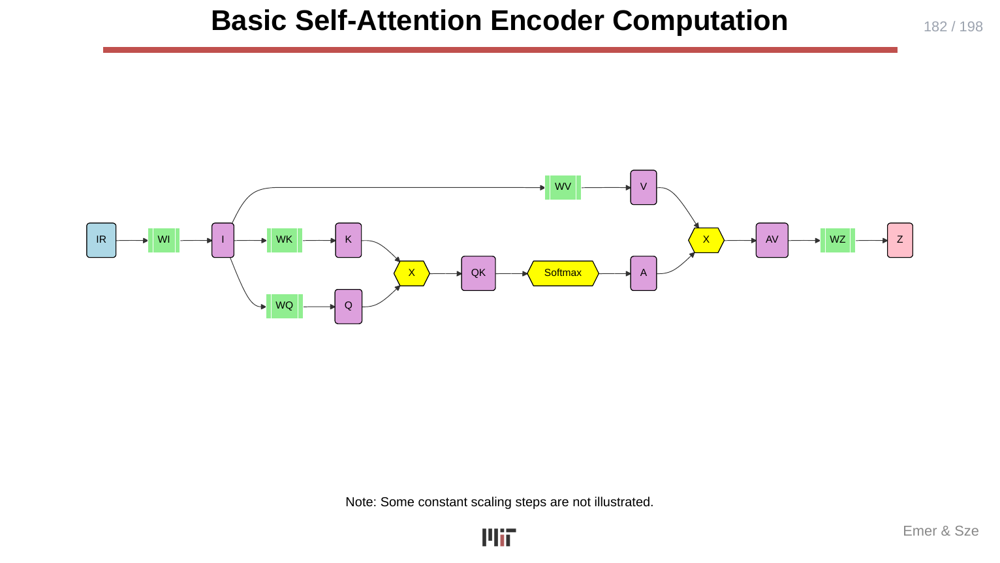
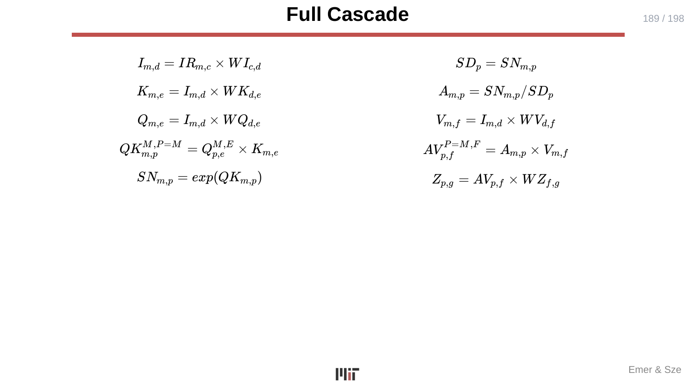
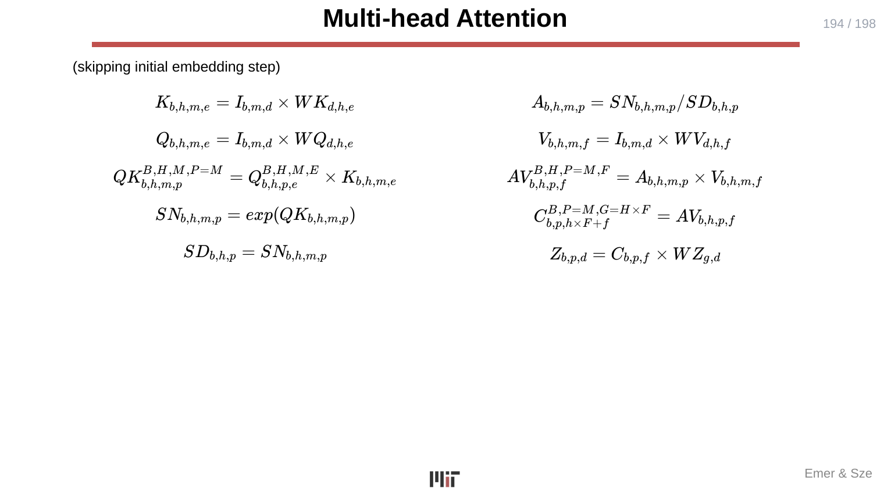

# L04 — Einsums and Transformers

> **Course:** 6.5930/1 — Hardware Architectures for Deep Learning
> **Instructors:** Joel Emer & Vivienne Sze (MIT EECS)
> **Lecture date:** February 13, 2026 · **Slides:** 198 · **Source:** [`Lecture/L04-Einsums+Transformers.pdf`](../../Lecture/L04-Einsums+Transformers.pdf)
>
> *This is a conceptual walkthrough that reconstructs the lecture's narrative from the slides. The deck is animation-heavy (198 physical pages condense to roughly 50 unique concept slides, with the remainder being incremental build states of the same figure). This walkthrough synthesizes each build sequence into a single, complete explanation. Each section cites the slide range it draws from so you can follow along with the original deck.*

---

## TL;DR

The course's notation for describing DNN computations is the **Einsum** — a compact algebraic expression that names every tensor operand, every rank (index), and the arithmetic operator, but deliberately says *nothing* about the order in which the computation is carried out. This lecture defines Einsums precisely through an **Operational Definition (ODE)**, shows how rank variables encode contracted vs. uncontracted dimensions, and demonstrates that **every canonical DNN layer** — matrix–vector multiply, matrix–matrix multiply, fully connected (FC), and 2-D convolution (CONV) — can be expressed as, and reduced to, a single Einsum. The second half pivots to **Transformer attention**: Einsums spell out every step of the Q/K/V computation chain, making the structure of self-attention as transparent as a matrix multiply. The central hardware insight is that the *Einsum* is the "Compute" specification at the top of the TeAAL pyramid — it answers *what* is computed but leaves *how* (mapping, dataflow, tiling) entirely open for later lectures.

---

## Learning Objectives

After this lecture you should be able to:

- State the **Operational Definition for Einsums (ODE)** and apply it to evaluate any Einsum.
- Distinguish **contracted** and **uncontracted ranks** in an Einsum and identify which determines reduction vs. iteration.
- Recognize that Einsum expressions for the **same computation** can be written in multiple equivalent forms (different index letter names, different rank orderings).
- Describe **partitioning** (splitting a rank into two) and **flattening** (merging two ranks into one) as complementary operations that leave the underlying computation unchanged.
- Write the Einsum for a **1-D convolution**, a **2-D CONV layer**, and an **FC layer**, and convert any of them to a matrix multiplication.
- Trace all seven Einsum steps of **basic self-attention** (embedding → Q/K projection → QK product → softmax → V projection → AV product → output projection).
- Extend single-head attention to **multi-head attention (MHA)** by adding an H rank.
- Explain why the number of MACs in attention **scales quadratically** with the sequence length M.

---

## Chapter 1 — The Einsum: A Precise Language for DNN Computation

> *Slides: L04-1 … L04-19*

### The Operational Definition for Einsums (ODE)

The lecture opens with a motivating example:

$$Z_{m,n} = A_{m,k} \times B_{n,k}$$

This expression is an **Einsum**. Every subscript is a **rank variable** (an index ranging over some dimension). The lecture defines evaluation via the **Operational Definition for Einsums (ODE)**:

1. Traverse **all points** in the space of all legal rank-variable values — the **iteration space**.
2. At each point, compute the right-hand side using the operand values at the specified rank coordinates.
3. **Assign** the result to the left-hand operand at the specified rank coordinates — unless that operand is non-zero, in which case **reduce** (accumulate) the value into it.



The ODE is deliberately order-agnostic. It tells you *what* to compute (the result at every point in iteration space) but says nothing about the sequence of operations. That freedom is the whole point: the same Einsum can be evaluated by any legal loop nest, and different loop nests correspond to different hardware **dataflows** — the subject of L05–L06.

### Contracted vs. uncontracted ranks

In the matrix–matrix multiply `Z_{m,n} = A_{m,k} × B_{k,n}`:

- `k` appears on the right-hand side only, *not* on the left. It is a **contracted rank**: its values are summed over (reduced) to produce each output element.
- `m` and `n` appear on both sides. They are **uncontracted ranks**: each distinct (m, n) pair yields one independent output element.

The distinction is fundamental. Contracted ranks determine the arithmetic work for each output point; uncontracted ranks determine the shape of the output tensor.

### Tensor references and rank naming

The slides introduce a notation for specifying rank names and rank shapes independently of the index letters used as variables. A tensor `A_{k,m}` with rank names "K", "M" and rank shapes K, M can also be written `A^{K,M}_{k,m}` to be explicit. Crucially, **the order of rank variables in the subscript does not affect what the Einsum computes** — the pairing of variable to rank is positional but the iteration space is the Cartesian product regardless of listing order.

### Einsum patterns: the whole DNN zoo in one slide

Slide 8 catalogs the main pattern families:

| Einsum | Operation |
|---|---|
| `Z_{m,n} = A_{m,k} × B_{k,n}` | Matrix–matrix multiply (k contracted) |
| `Z_m = A_{k,m} × B_k` | Matrix–vector multiply |
| `Z_{m,n} = A_m × B_n` | Cartesian (outer) product |
| `Z_m = A_m × B_m` | Element-wise multiply |
| `Z_m = A_m + B_m` | Element-wise addition (operator is + not ×) |

The key observation: the *name* of the rank variables is irrelevant (`Z_{p,q} = A_{p,r} × B_{q,r}` is still matrix–matrix multiply). What matters is which variables are shared, which appear only on the right (contracted), and which appear on both sides (uncontracted).



### Rank variable patterns: tuples as single indices

When two or more rank variables always appear together as a coordinate pair — `Z_{i,j} = A_{i,j} × B_{i,j}` — they can be flattened into a single compound index `ij = i × J + j`, yielding `Z_{ij} = A_{ij} × B_{ij}`. This is a pure notational convenience; the iteration space is the same.

### Partitioning: splitting one rank into two

Given `Z_i = A_i × B_i`, if we substitute `i = i1 × I0 + i0`, we obtain:

$$Z_{i1,i0} = A_{i1,i0} \times B_{i1,i0}$$

This is a **partitioned Einsum**. The original vector index `i` has been split into a coarse index `i1` and a fine index `i0`. The computation is identical; we have only changed how we *label* elements of the iteration space. **Partitioning always adds a rank.** Flattening always removes a rank. Together they are inverses.



> **Why it matters:** Partitioning is the algebraic foundation of **tiling** — the mapping technique (L05–L06) that breaks a large computation into chunks that fit in a small buffer. The Einsum notation makes tiling explicit and correct by construction.

---

## Chapter 2 — Convolution as an Einsum

> *Slides: L04-15 … L04-18*

### 1-D convolution

The simplest case is one-dimensional convolution with input `I`, filter `F`, and output `O`:

$$O_q = I_{q+s} \times F_s$$

The output rank `q` (position in the output) is uncontracted. The filter rank `s` (position within the filter) is contracted. The input is accessed at a *shifted* index `q+s` — capturing the sliding-window nature of convolution.

With rank shapes made explicit this becomes:

$$O_q^Q = I_{q+s}^W \times F_s^S$$

where Q = W − S + 1 (valid convolution).



The rank-shape slide (slide 18) also introduces a general graphical example: an adjacency matrix `G^{S=6,D=6}` — showing that Einsums can describe graph operations just as naturally as convolutions.

> **Why it matters:** The `q+s` index dependency (a Toeplitz structure) is what distinguishes convolution from a plain matrix multiply. When we later convert CONV to matmul (Chapter 3), the key step is precisely "breaking out" this Toeplitz relationship.

---

## Chapter 3 — Kernel Computation: FC and CONV as Matrix Multiplications

> *Slides: L04-20 … L04-172*

This is the longest section of the deck, driven by incremental animation. The core idea is that both FC and CONV layers can be **algebraically reduced to matrix multiplication** through rank flattening — with profound implications for how hardware executes them.

### Fully connected (FC) as Einsum and matrix–vector multiply

An FC layer maps input activations of shape (C, H, W) to M output neurons. Its Einsum is:

$$O_m = I_{c,h,w} \times F_{m,c,h,w}$$

(`c`, `h`, `w` are contracted ranks; `m` is uncontracted.) A loop-nest implementation:

```
for m in [0, M):
  o[m] = 0
  for c in [0, C):
    for h in [0, H):
      for w in [0, W):
        o[m] += i[c][h][w] * f[m][c][h][w]
```

If we **flatten** the three input ranks C, H, W into a single compound rank `chw = H×W×c + W×h + w`, the Einsum becomes:

$$O_m = I_{chw} \times F_{m,chw}$$

This is now a **matrix–vector multiply** (Filters: M×CHW; Input: CHW×1; Output: M×1).

With a batch of N input samples, the input becomes I_{n,chw} (shape N×CHW) and the output O_{n,m} (N×M), converting the computation into a **matrix–matrix multiply**:

$$O_{n,m} = I_{n,chw} \times F_{m,chw}$$

The slide explicitly notes: "For Einsum, the order of ranks does not matter" — `O_{n,m} = I_{n,chw} × F_{m,chw}` and the typical lab notation `Z_{m,n} = A_{m,k} × B_{k,n}` describe the same abstract computation with different rank-name conventions.

### Convolution (CONV) as Einsum

The full 2-D CONV layer with batch N, M output channels, C input channels, output spatial size P×Q, and filter spatial size R×S has Einsum:

$$O_{n,m,p,q} = B_m + I_{n,c,\,U \times p+r,\,U \times q+s} \times F_{m,c,r,s}$$

(U is stride; B is bias, ignored for simplicity.) The key structural fact: the input is indexed by a *combined* expression `U×p+r` for height and `U×q+s` for width. This is the Toeplitz relationship that distinguishes CONV from FC — in FC, every output sees every input; in CONV, each output sees only the local patch of the input determined by the filter position.



### Converting CONV to matrix multiplication (im2col / Toeplitz)

The conversion from CONV to matmul proceeds in three steps:

1. **Extract the Toeplitz structure:** Define a Toeplitz tensor `T_{c,p,q,r,s} = I_{c,p+r,q+s}` that pre-populates each patch of the input.
2. **Flatten ranks:** Compress `(c,r,s)` → `crs` and `(p,q)` → `pq`.
3. **The resulting Einsum** is:

$$O_{m,pq} = T_{pq,crs} \times F_{m,crs}$$

This is a matrix multiplication: Filters (M×CRS) × Toeplitz-input (PQ×CRS) = Output (M×PQ).



Including batch N: `O_{m,pqn} = T_{pqn,crs} × F_{m,crs}` — still a matrix multiply.

### The summary insight

The "Summary" slide (p. 172 / slide 153) states the takeaway cleanly:

- We have shown how FC and CONV can be converted into matrix multiplication.
- There are **many ways** to compute this matrix multiplication (MACs can be performed in any order and produce the same output).
- However, the **processing order impacts hardware metrics** such as energy and latency — specifically, processing order determines how much data must be moved.

This is the bridge from the Einsum (what to compute) to the mapping problem (how to compute it) that dominates L05–L06.

> **Why it matters:** Any hardware that can execute a general matrix multiply can execute FC and CONV. But *how* it executes that matmul — which loop runs in the innermost position, what data is cached where — determines whether energy cost is near the RF floor or approaches the DRAM ceiling.

---

## Chapter 4 — From Convolution to Attention

> *Slides: L04-174 … L04-178*

Before deriving Transformer Einsums, the lecture provides motivation: why is attention preferred over convolution for certain tasks?

### Convolution vs. attention

| | Convolution | Attention |
|---|---|---|
| Dependency range | Local neighbors only (R×S filter) | Global — any token to any other |
| Region of interest | Fixed (determined by filter position) | Dynamic (query-dependent) |
| Cost | Linear in input size | Quadratic in sequence length |

The quote from Vaswani et al. (NeurIPS 2017): **"Allows modeling of global dependencies without regard to their distance."** Attention biases compute toward the most *informative* parts of the input rather than a fixed spatial window.

### Transformers — where attention lives

The Transformer architecture (Vaswani, NeurIPS 2017) is built from attention blocks. It has been applied to:

- Natural language processing (GPT-3, Brown et al., NeurIPS 2020)
- Audio (AST, Gong et al., Interspeech 2021)
- Vision (ViT, Dosovitskiy et al., ICLR 2021)

Input is broken into **tokens** (words for text, image patches for vision, spectrogram patches for audio). The attention mechanism allows each token to dynamically weight every other token.



---

## Chapter 5 — Self-Attention as Einsums

> *Slides: L04-179 … L04-198*

This section derives the full Einsum chain for self-attention. Every step is one Einsum; together they form the complete computation.

### Diagram conventions

The slides use a consistent visual language:
- **Rounded box** → tensor (e.g., A, Q, K, V, Z)
- **Hexagonal box** → operation (×, softmax)
- **Vertical-lined box** → projection (multiplication by a weight matrix W)

### Step 0 — Input embedding

Convert raw one-hot tokens IR (shape M×C) to dense embeddings I (shape M×D):

$$I_{m,d} = IR_{m,c} \times WI_{c,d}$$

(Only applies to the first layer; subsequent layers receive the previous layer's output.)

### Step 1 — Project to Query (Q) and Key (K)

Project embeddings from D-space into E-space for both Q and K:

$$Q_{m,e} = I_{m,d} \times WQ_{d,e}$$
$$K_{m,e} = I_{m,d} \times WK_{d,e}$$

Both are matrix multiplies of shape (M×D) × (D×E) → (M×E). WQ and WK are **static** (shared across all inputs at inference time).

### Step 2 — Compute QK (pre-softmax attention scores)

$$QK_{m,p} = Q_{p,e} \times K_{m,e}$$

Note: p is an alias for m (both index the sequence length M). This computes the dot product between every query vector and every key vector — an (M×E) × (E×M) → (M×M) matrix multiply. The cost is O(M² E).

### Step 3 — Softmax to form attention weights A

$$SN_{m,p} = \exp(QK_{m,p})$$
$$SD_p = \sum_m SN_{m,p}$$
$$A_{m,p} = SN_{m,p} / SD_p$$

The softmax normalizes each row of QK into a probability distribution over the M keys. A is the **attention tensor** (shape M×M).

### Step 4 — Project to Value (V)

$$V_{m,f} = I_{m,d} \times WV_{d,f}$$

Projects embeddings from D-space into F-space (shape M×F). WV is also static.

### Step 5 — Weighted sum of values (AV)

$$AV_{p,f} = A_{m,p} \times V_{m,f}$$

Multiply the attention weights by the value vectors. Shape: (M×M) × (M×F) → (M×F). This is the step that "attends" — it takes a weighted combination of all value vectors for each output position.

### Step 6 — Output projection

$$Z_{p,g} = AV_{p,f} \times WZ_{f,g}$$

Projects from F-space to G-space (the output embedding dimension, often equal to D). Shape: (M×F) × (F×G) → (M×G). WZ is static.



### Full cascade

Putting all six steps together:



The five weight matrices WI, WQ, WK, WV, WZ are **static** (do not change with input). All other tensors (I, Q, K, V, QK, SN, SD, A, AV, Z) are **dynamic** (recomputed for every input sequence).

### Computation properties

- **Total matrix multiplications:** 5 (WI, WQ, WK for projections; QK dot product; AV weighted sum) + 1 output projection (WZ) = 6 in total.
- **Parallelism:** The Q, K, V projections are independent and can run in parallel.
- **Sequential dependency:** QK must precede AV (AV depends on A which depends on QK); projections must precede the core attention computation.
- **Quadratic scaling:** The QK matrix multiply is M×E × E×M = O(M²E). The AV multiply is M×M × M×F = O(M²F). Both scale **quadratically** with sequence length M — the dominant cost in long-context scenarios.

### Batched attention

Adding a batch rank B is straightforward: every tensor gains a leading B dimension and all Einsums gain a `b` subscript. The weight tensors WQ, WK, WV, WZ remain 2-D (they are shared across batch elements).

### Multi-head attention (MHA)

Different attention heads can learn to attend to different aspects (e.g., local vs. global dependencies) by using separate Q/K/V projections per head:

$$K_{b,h,m,e} = I_{b,m,d} \times WK_{d,h,e}$$
$$Q_{b,h,m,e} = I_{b,m,d} \times WQ_{d,h,e}$$
$$V_{b,h,m,f} = I_{b,m,d} \times WV_{d,h,f}$$

The head rank H is added throughout. After computing per-head attention outputs, they are **concatenated** across H and F dimensions, then projected:

$$C_{b,p,h \times F + f} = AV_{b,h,p,f}$$
$$Z_{b,p,d} = C_{b,p,f} \times WZ_{g,d}$$



### Rank name glossary (slides 195–198)

| Rank | Meaning |
|---|---|
| **M** | Sequence length (query/key/value) |
| **P** | Alias for M (output sequence position) |
| **C** | Dictionary size (vocabulary) |
| **D** | Global embedding (d_model) |
| **E** | Q/K local embedding (d_k) |
| **F** | V local embedding (d_v) |
| **G** | Output embedding |
| **B** | Batch size |
| **H** | Number of heads (MHA) |

> **Why it matters:** Expressing attention as Einsums reveals its structure with the same clarity as any other matrix multiply. Every optimization available for GEMM — tiling, pipelining, sparsity exploitation — potentially applies here. This is the foundation for accelerators like FuseMax (mentioned in L01) that target attention specifically.

---

## Key Terms

| Term | Gloss |
|---|---|
| **Einsum** | A compact algebraic notation for DNN computations specifying operands, ranks, and the operator — but not the order of evaluation. |
| **ODE (Operational Definition for Einsums)** | The definition: traverse all points in the iteration space; at each point, compute the RHS and assign/reduce into the LHS. |
| **Rank variable** | An index over one dimension of a tensor (e.g., m, n, k). |
| **Rank name** | The semantic name of a dimension (e.g., "M", "K"); distinct from the rank variable letter. |
| **Rank shape** | The size (extent) of a dimension. |
| **Contracted rank** | A rank that appears only on the right-hand side; its values are summed (reduced) over. |
| **Uncontracted rank** | A rank that appears on both sides; each value yields an independent output element. |
| **Partitioning** | Splitting one rank into two (e.g., i → i1, i0 where i = i1×I0 + i0). Always adds a rank. |
| **Flattening** | Merging two or more ranks into one compound index. Always removes a rank. |
| **FC layer** | Fully connected layer; Einsum O_m = I_{c,h,w} × F_{m,c,h,w}; equivalent to matrix–vector multiply after flattening. |
| **CONV layer** | 2-D convolution; Einsum O_{n,m,p,q} = I_{n,c,Up+r,Uq+s} × F_{m,c,r,s}; equivalent to matmul after Toeplitz conversion. |
| **Toeplitz tensor / im2col** | The pre-populated patch tensor T_{pq,crs} = I_{c,p+r,q+s} that converts CONV to matmul. |
| **Attention** | A mechanism that dynamically selects regions of interest; "allows modeling of global dependencies" (Vaswani 2017). |
| **Token** | The basic input unit of a Transformer (word, image patch, spectrogram patch). |
| **Q, K, V** | Query, Key, Value — the three linear projections of the input in self-attention. |
| **Attention tensor A** | The M×M softmax-normalized matrix of dot-product scores between every query and key. |
| **Self-attention** | Attention where Q, K, and V all derive from the same input sequence. |
| **Multi-head attention (MHA)** | Attention with H independent Q/K/V heads, enabling multiple parallel "views" of the input. |
| **Quadratic scaling** | The QK and AV matrix multiplies both grow as O(M²) with sequence length M. |
| **Static tensors** | Weight matrices (WQ, WK, WV, WZ) that do not change with each input. |
| **Dynamic tensors** | All intermediate activations (Q, K, V, QK, A, AV, Z) that are recomputed per input. |

---

## Takeaways

- An **Einsum** has a precise operational semantics (the ODE): traverse the iteration space, compute, assign/reduce. It is completely **order-agnostic**.
- The single most important structural concept: a rank that appears only on the right-hand side is **contracted** (summed over); a rank on both sides is **uncontracted** (produces a distinct output element).
- **Partitioning** and **flattening** are complementary: they change the algebraic form of an Einsum without changing the result, and they are the algebraic basis for hardware tiling.
- Both **FC** (flattened) and **CONV** (via Toeplitz / im2col) reduce to **matrix multiply** — the universal primitive for DNN accelerator design.
- The CONV-to-matmul reduction shows why "the processing order impacts hardware metrics": the same matmul result can be achieved with wildly different data movement patterns depending on which dimension is innermost.
- **Self-attention** in Transformers is a sequence of six Einsum steps; five of them are matrix multiplies, plus a softmax. Total: 6 matrix multiplies (including the output projection), with quadratic dependence on sequence length.
- **Multi-head attention** adds an H rank to all per-head tensors and concatenates outputs before the final projection.
- Expressing attention as Einsums puts it on the same footing as CONV and FC: the same mapping, tiling, and sparsity analysis tools apply.

---

## Connections to Later Lectures

- **Mapping and dataflow (L05–L06):** The Einsum is the "Compute" input to the Mapping layer of the TeAAL pyramid. L05–L06 enumerate all valid loop orderings over the ranks of an Einsum and measure their data-movement implications.
- **Sparsity (L07–L10):** Attention weight matrices (A) are often sparse after softmax thresholding; activations in CONV/FC have structured sparsity. The Einsum's Format layer (sparsity representation) interacts directly with how contracted ranks are traversed.
- **Advanced techniques / precision (L11–L12):** Reduced-precision arithmetic applies per-Einsum-operand; Einsum structure determines what approximations are safe.
- **FuseMax (L01 case study):** FuseMax exploits the Einsum structure of attention to fuse operations across the softmax boundary, eliminating intermediate DRAM traffic. The Einsum for attention (specifically AV_{p,f} = A_{m,p} × V_{m,f}) is the direct target of that optimization.

---

## Appendix — Slide-to-Section Map

| Slides (PDF page) | Section |
|---|---|
| L04-1 | Title — "Einsums + Transformers", February 13, 2026 |
| L04-2 | Section divider — "Extended Einsums" |
| L04-3 | Acknowledgements |
| L04-4 … L04-18 | Ch.1 — Einsum ODE, tensor references, rank patterns, partitioning, flattening |
| L04-19 | Blank animation frame |
| L04-20 | Second lecture title — "Kernel Computation", February 9, 2026 |
| L04-21 … L04-41 | Ch.3 — FC computation: Einsum, loop nest, matrix–vector and matrix–matrix multiply |
| L04-42 … L04-59 | Ch.3 — CONV layer visualization (animation build) |
| L04-60 … L04-159 | Ch.3 — CONV animation builds (incremental); rank shape and Toeplitz derivation |
| L04-160 … L04-171 | Ch.3 — 2-D Toeplitz Einsum and CONV → matrix multiplication |
| L04-172 | Ch.3 — Summary (FC and CONV → matmul; processing order matters) |
| L04-173 | Blank animation frame |
| L04-174 | Section divider — "Attention" |
| L04-175 | Ch.4 — Convolution vs. Attention |
| L04-176 | Ch.4 — Transformers overview (Vaswani 2017, GPT-3, ViT, AST) |
| L04-177 | Ch.4 — Format of input (tokens) |
| L04-178 | Ch.4 — Multi-head attention diagram (jalammar.github.io) |
| L04-179 | Section divider — "Attention Mechanisms as Einsums" |
| L04-180 | Ch.5 — Diagram conventions |
| L04-181 | Ch.5 — Overall encoder structure |
| L04-182 … L04-188 | Ch.5 — Basic self-attention steps (embed, Q/K, QK, softmax, V, AV, Z) |
| L04-189 | Ch.5 — Full cascade (all Einsums in one slide) |
| L04-190 … L04-191 | Ch.5 — Computation properties (parallelism, dependencies, quadratic cost, static vs. dynamic) |
| L04-192 | Ch.5 — Batched attention |
| L04-193 … L04-194 | Ch.5 — Multi-head attention (MHA) |
| L04-195 … L04-198 | Ch.5 — Rank name glossary (word/token ranks, embedding ranks, other ranks) |
