# L05 — Mapping: Dataflows

> **Course:** 6.5930/1 — Hardware Architectures for Deep Learning
> **Instructors:** Joel Emer & Vivienne Sze (MIT EECS)
> **Lecture date:** February 17, 2026 · **Slides:** 111 · **Source:** [`Lecture/L05-Mapping.pdf`](../../Lecture/L05-Mapping.pdf)
>
> *This is a conceptual walkthrough that reconstructs the lecture's narrative from the slides. It is organized by idea, not slide-by-slide. Each section cites the slide range it draws from so you can follow along with the original deck.*

---

## TL;DR

Once the architecture (the PE array and memory hierarchy) is fixed, **mapping** is the set of decisions that determines how a DNN computation is scheduled onto that hardware. Of all the mapping decisions — partitioning, dataflow, data placement, compute placement, and partition sizing — **dataflow** (the loop order) is the one this lecture examines in depth. Changing the loop order changes *which data type stays stationary in local storage*, which in turn determines how many expensive DRAM accesses can be avoided. The lecture introduces three canonical dataflows for CNNs — **Output Stationary (OS)**, **Weight Stationary (WS)**, and **Input Stationary (IS)** — and shows, using energy comparisons on AlexNet, that no single dataflow dominates all others. It closes by introducing **LoopTree** as a formal language for expressing both dataflow (loop ordering) and data placement (storage plans) in a single notation.

---

## Learning Objectives

After this lecture you should be able to:

- Name the **five aspects of mapping** (partitioning, dataflow, data placement, compute placement, partition sizing) and state what each one controls in a loop nest.
- Explain **why data movement dominates energy** using the normalized energy-cost hierarchy and a concrete AlexNet example.
- Identify the **three types of data reuse** in CNNs (convolutional reuse, fmap reuse, filter reuse) and connect each to the opportunities for reducing DRAM traffic.
- State the defining property of **Output Stationary, Weight Stationary, and Input Stationary** dataflows, and read a loop nest to determine which dataflow it implements.
- Explain how **loop order encodes stationarity**: the data type whose ranks appear in the *outermost* loops changes slowest and is therefore the most stationary.
- Compare the energy efficiency of OS, WS, and IS variants on the same workload and explain why no single dataflow is universally best.
- Describe how **LoopTree** represents dataflow and data placement as a unified tree structure.

---

## Chapter 1 — The Five Aspects of Mapping

> *Slides: L05-1 … L05-8*

The first part of the lecture situates today's topic inside the broader "Separation of Concerns" framework introduced in L01. **Mapping** is the layer of the TeAAL Pyramid that sits between the fixed architecture and the algorithm. Within mapping, the slides identify five distinct aspects, each with its own goal and its own impact on the loop nest:

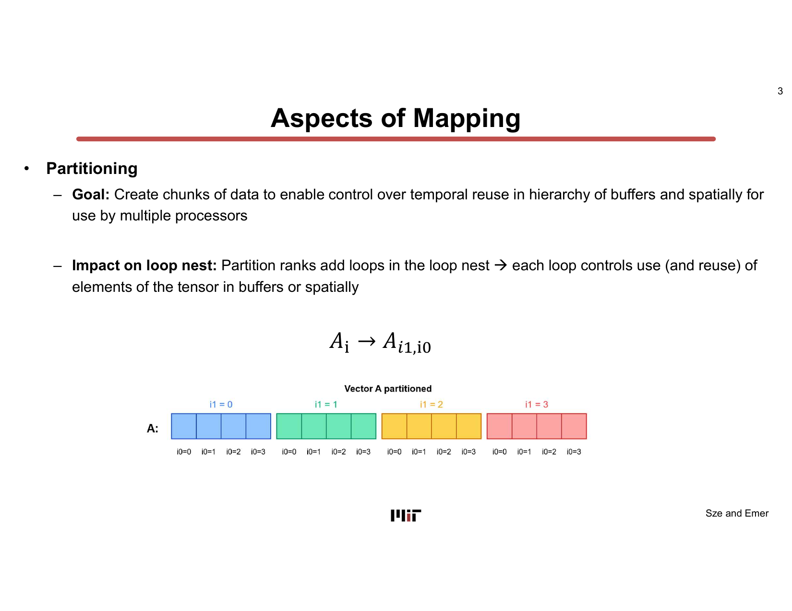

1. **Partitioning** — Breaks tensors into tiles so that each tile fits into a given level of the memory hierarchy (temporal reuse) or can be spread across multiple PEs (spatial reuse). In the loop nest, partitioning adds extra loop levels whose bounds control how much data lives in each buffer.

2. **Dataflow** — Sets the *order* of the for-loops. The data type whose rank dimensions appear in the outermost loops is the one that changes the slowest — it is the most *stationary* — and therefore benefits from reuse in low-cost local storage. This is the main focus of today's lecture.

3. **Data placement** — Controls *which buffer* each partitioned tensor tile is placed in. A tensor tile that fits in the register file costs 1× per access; the same tile in global buffer costs 6×; in DRAM it costs 200×. Data placement augments the loop nest with annotations showing which memory level holds which tensor at each loop level.

4. **Compute placement** — Distinguishes *temporal* loops (one MAC at a time on a single ALU) from *parallel* loops (many MACs simultaneously across an array of PEs). Parallelism is expressed as `parallel_for` in the loop nest. It reduces cycle count and may also enable spatial data sharing across PEs.

5. **Partition sizing** — Sets the exact numeric bounds of each loop level (tile sizes), balancing the capacity constraints of each buffer level against the desired degree of reuse.

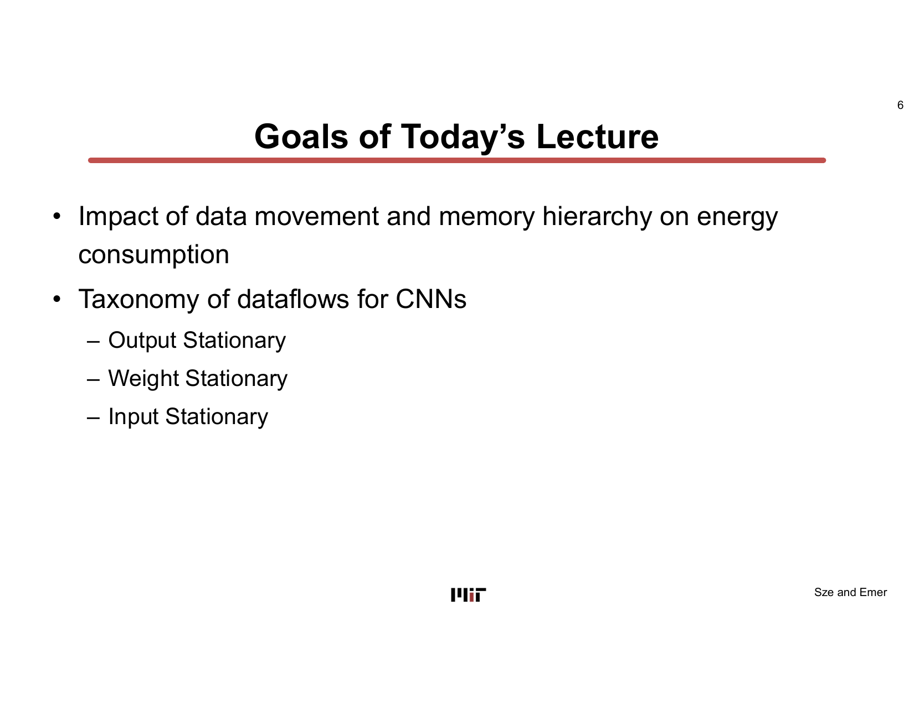

Today's lecture focuses specifically on **dataflow** because loop order is the primary lever for controlling *stationarity* — keeping a given data type in cheap local storage for as long as possible before fetching new data. Background reading: Sze & Emer *Efficient Processing of Deep Neural Networks*, Chapter 5, sections through 5.7.1 and 5.8.

> **Why it matters:** The five aspects are independent levers you can pull. Understanding what each one controls — and how it expresses itself in the loop nest — is the prerequisite for reasoning about any accelerator design. The rest of this lecture is a deep dive into one of those levers: dataflow.

---

## Chapter 2 — Why Data Movement Dominates Energy

> *Slides: L05-8 … L05-27*

### The worst-case baseline

The lecture uses a **1-D convolution** Einsum `O[q] = I[q+s] × F[s]` as the running example. For every multiply-accumulate (MAC), four memory read/write operations are needed: read filter weight, read input activation, read partial sum, write updated partial sum. If all four happen at DRAM, then for AlexNet's 724 million MACs, roughly **2,896 million DRAM accesses** are required — a staggering cost given that DRAM access costs ~200× an ALU operation.

### Two opportunities: reuse and local accumulation

Extra levels of local memory hierarchy break the worst case in two complementary ways:

1. **Data reuse** — if a weight or activation is reused across multiple MACs, it only needs to be fetched from DRAM once. The slides identify three forms of reuse in CNNs:
   - **Convolutional reuse** (CONV layers only): the sliding window means a single input activation participates in multiple filter positions.
   - **Fmap reuse** (CONV and FC): the same activation is multiplied by multiple filters.
   - **Filter reuse** (CONV and FC, batch > 1): the same weight is multiplied by activations from multiple images in a batch.

2. **Local accumulation** — partial sums do not have to be written back to DRAM after each MAC. If they accumulate locally, only the final complete output activation needs a DRAM write.

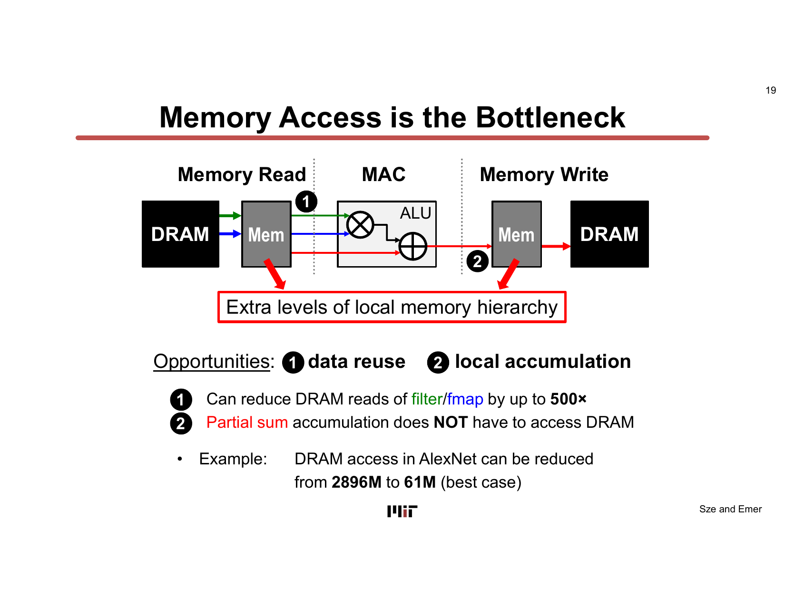

The combined effect is dramatic: for AlexNet CONV layers, DRAM access can be reduced from **2,896 million to 61 million** — a **~47× reduction**. Fmap/filter DRAM reads alone can be cut by up to **500×** (relative to worst-case) by keeping hot data in local buffers.

### The spatial accelerator and its energy hierarchy

Real DNN accelerators are **spatial architectures**: a DRAM feeds a Global Buffer (100–500 kB of on-chip SRAM), which feeds an array of Processing Elements (PEs), each containing an ALU and a small Register File (0.5–1.0 kB). PEs are connected via a Network-on-Chip spanning 200–1,000 PEs.

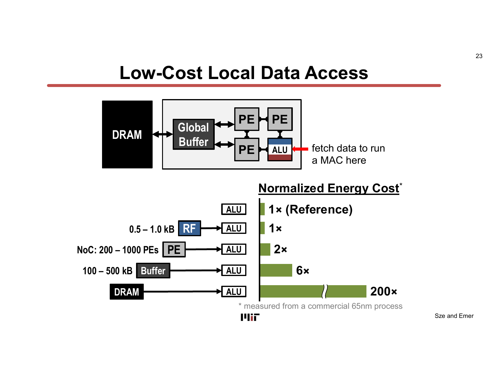

The normalized energy costs (measured on a commercial 65 nm process) are:

| Data source | Relative energy |
|---|---|
| ALU operation | **1× (reference)** |
| Register File / within PE | **1×** |
| Neighbor PE over NoC | **2×** |
| Global Buffer (100–500 kB) | **6×** |
| **DRAM** | **200×** |

This hierarchy makes the goal explicit: **keep data in the register file or global buffer as long as possible**. The mechanism for achieving this is the *dataflow* — choosing which loops are outermost so that the data type you care about changes least frequently, staying stationary in cheap storage.

> **Why it matters:** The 200× energy gap between DRAM and the ALU means that data movement — not arithmetic — is the binding energy constraint. Every dataflow in the taxonomy below is ultimately a strategy to exploit local accumulation and data reuse in order to minimize costly DRAM traffic.

---

## Chapter 3 — Output Stationary (OS) Dataflow

> *Slides: L05-28 … L05-48*

### The taxonomy

The lecture introduces three canonical CNN dataflows, first codified in Chen et al., ISCA 2016:

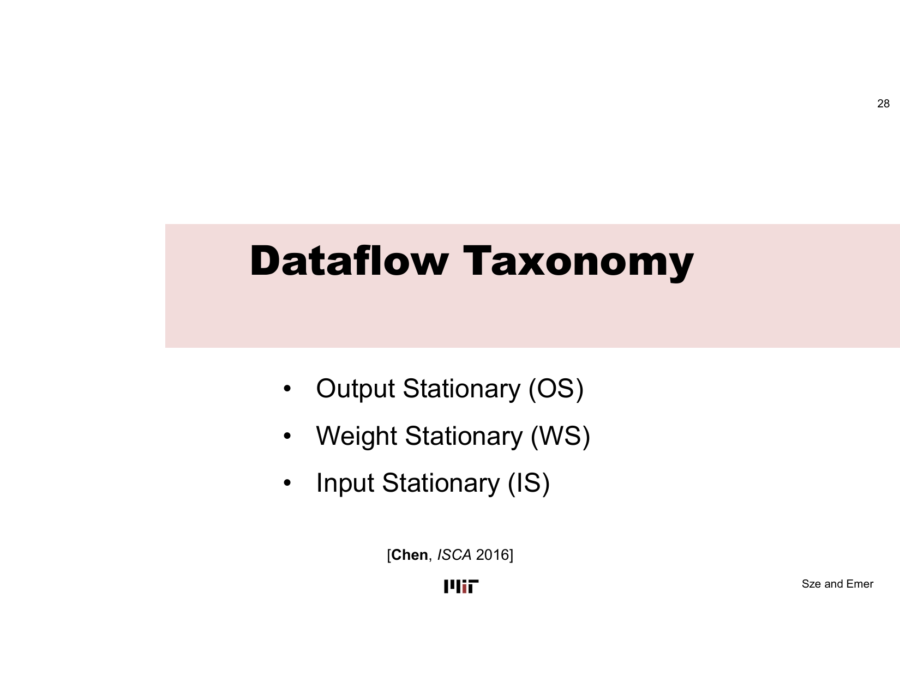

### How to read a loop nest for stationarity

The key insight is: **the data type whose index ranks appear exclusively in the inner loops (and whose outer-loop index is held fixed) is the stationary type**. Equivalently, the loops associated with the *output* tensor's spatial dimensions (P, Q) appear outermost in OS; the loops associated with the *filter* tensor's dimensions (R, S) appear outermost in WS; and the input's dimensions appear outermost in IS.

### Output Stationary: minimize partial-sum movement

In Output Stationary (OS), the **partial sums of one output activation accumulate locally** — they never leave the PE's register file until the output is complete. Weights and input activations are cycled (streamed) through.

For 1-D convolution the loop nest is:

```
for q in [0, Q):          ← output index is OUTER → output stationary
  for s in [0, S):
    o[q] += i[q+s] * f[s]
```

The outer loop is over `q` — the output position. For any fixed `q`, the partial sum `o[q]` accumulates over all `s` without leaving local storage. Weights `f[s]` and activations `i[q+s]` are streamed in; the partial sum stays.

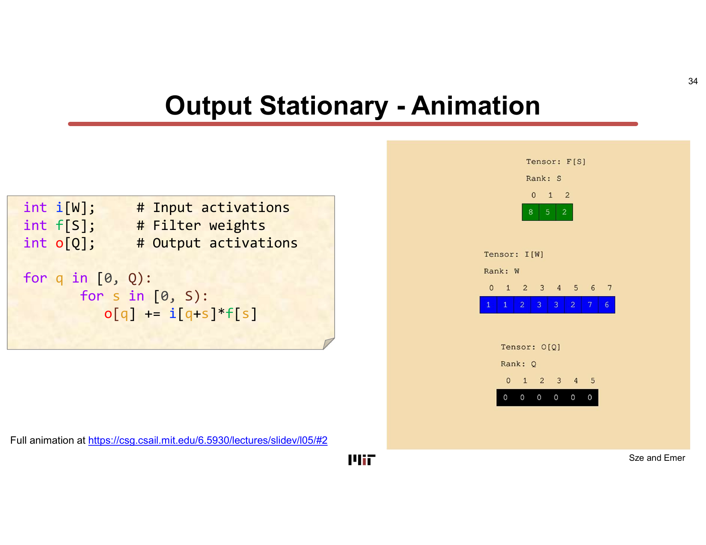

For a full CONV layer (6 tensor ranks: C, M, P, Q, R, S), the OS loop nest keeps P and Q outermost and parallelizes over C and M:

```
for p in [0, P):
  for q in [0, Q):
    for r in [0, R):
      for s in [0, S):
        parallel-for c in [0, C):
          parallel-for m in [0, M):
            o[m][p][q] += i[c][p+r][q+s] * f[m][c][r][s]
```

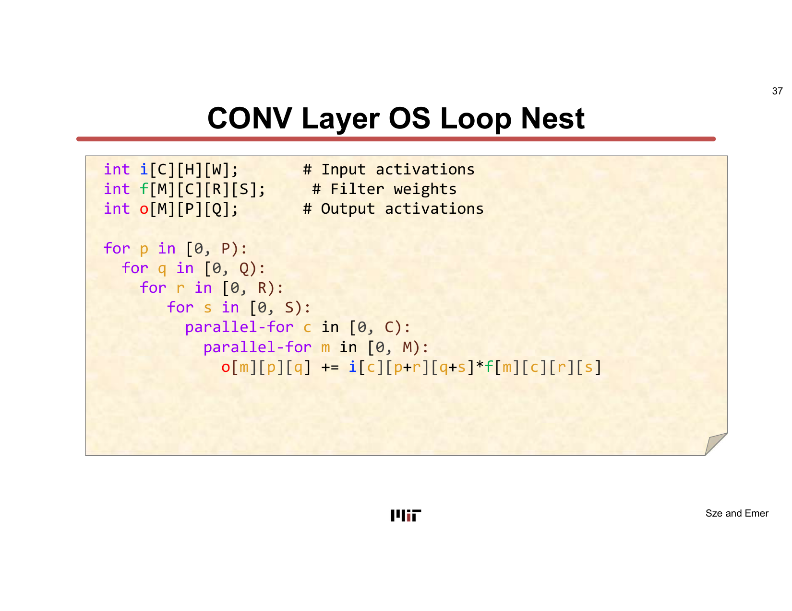

**OS in hardware:** ShiDianNao (ISCA 2015) and KU Leuven (VLSI 2016 / ISSCC 2017) are cited as OS examples. In ShiDianNao, input activations stream through the array, weights are broadcast, and partial sums accumulate inside each PE before streaming out.

> **Why it matters:** OS minimizes the energy cost of partial-sum reads and writes — the most numerous operation in a dense CONV. By keeping the partial sum stationary, you avoid the 200× DRAM penalty on every intermediate accumulation step.

---

## Chapter 4 — Weight Stationary (WS) Dataflow

> *Slides: L05-48 … L05-84*

### Loop nest

In Weight Stationary (WS), **filter weights are held stationary** in the register file — they never move once loaded. Input activations and partial sums are streamed through.

For 1-D convolution the WS loop nest is:

```
for s in [0, S):          ← filter index is OUTER → weight stationary
  for q in [0, Q):
    o[q] += i[q+s] * f[s]
```

The outer loop is over `s` — the filter position. For any fixed `s`, the weight `f[s]` stays constant while all output positions `q` are computed against it.

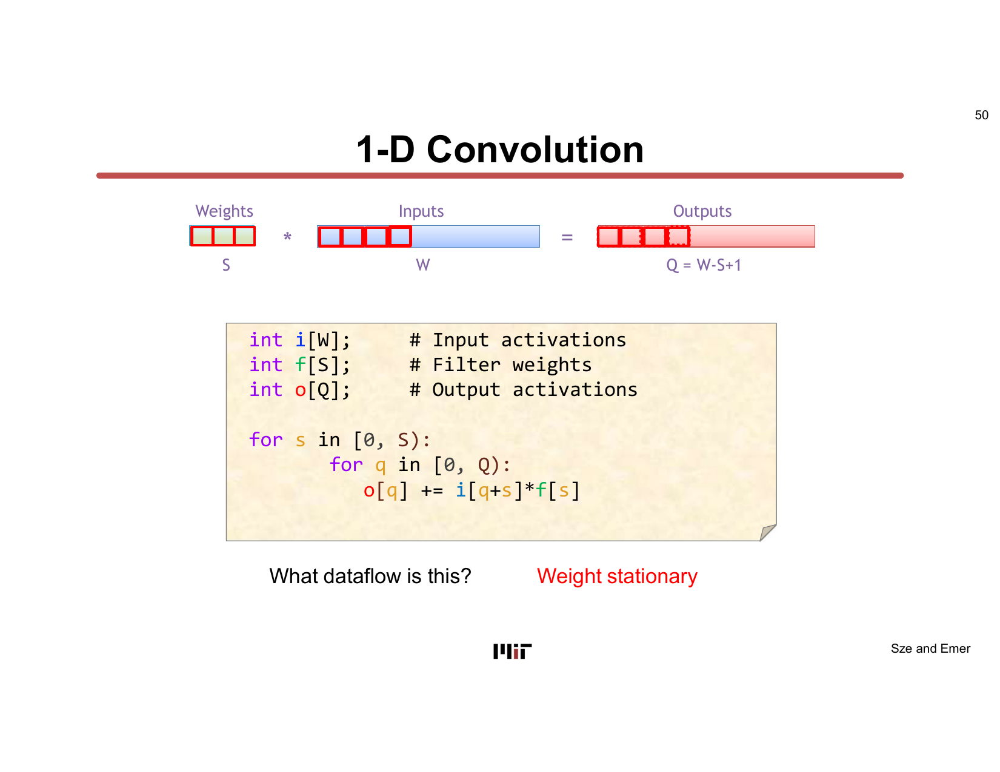

For the parallel WS design (where filter positions are parallelized with `parallel_for s`), all weights are simultaneously active across PEs — each PE holds one weight value. Input activations are **multicast** to all PEs, and each PE accumulates its own partial output.

### NVDLA as a WS example

The NVIDIA Deep Learning Accelerator (NVDLA, released September 2017) is a concrete WS implementation. Its PE array has M × C MACs where M is the number of output channels and C is the number of input channels. The full CONV loop nest for NVDLA is:

```
for r in [0, R):          ← filter spatial dims outermost → weight stationary
  for s in [0, S):
    for p in [0, P):
      for q in [0, Q):
        parallel-for m in [0, M):
          parallel-for c in [0, C):
            o[m][p][q] += i[c][p+r][q+s] * f[m][c][r][s]
```

The outermost loops are `r` and `s` — the filter spatial dimensions. For a fixed `(r, s)`, the loaded filter weights `f[m][c][r][s]` for all `m` and `c` stay fixed while the computation cycles through all `(p, q)` output positions and their corresponding input windows.

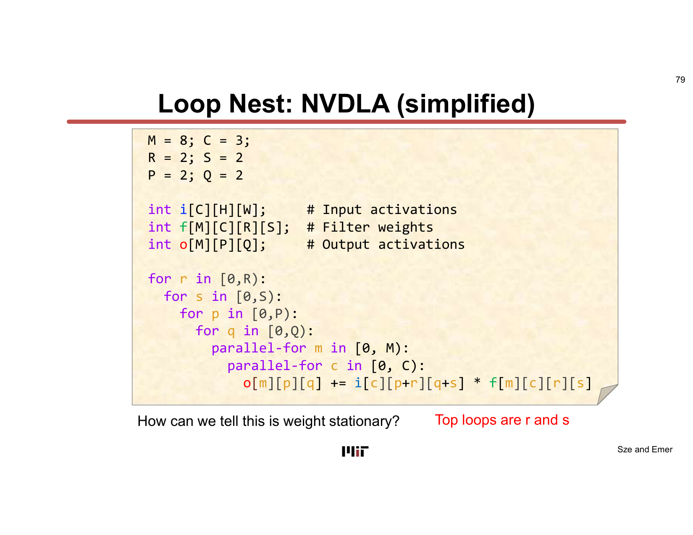

NVDLA's Convolution Buffer stores both weights and activations; the ratio of weights to activations in the buffer varies across layers. Other WS examples cited: Chakradhar (ISCA 2010), nn-X/NeuFlow (CVPRW 2014), TPU (ISCA 2017), ISAAC (ISCA 2016).

> **Why it matters:** WS maximizes convolutional reuse and filter reuse of weights — each weight loaded from DRAM is reused across all output positions (P × Q) and across the full batch. This is effective when weights are large relative to activations, i.e., for layers with small input maps but many filters.

---

## Chapter 5 — Input Stationary (IS) Dataflow

> *Slides: L05-85 … L05-90*

In Input Stationary (IS), **input activations are held stationary** while weights and partial sums move. IS is especially beneficial for *sparse* CNNs (e.g., SCNN, Parashar et al., ISCA 2017), where many weights are zero. When inputs are larger than weights, keeping inputs stationary reduces reads from larger (more expensive) memory.

Because the 1-D convolution Einsum `O[q] = I[q+s] × F[s]` uses a compound index `q+s` for the input, achieving IS requires a change of variable. We replace `w = q + s` (so `q = w − s`) and iterate over the raw input index `w`:

```
for w in [0, W):          ← input index is OUTER → input stationary
  for s in [0, S):
    q = w - s
    o[q] += i[w] * f[s]  ← guard: q must be in [0, Q)
```

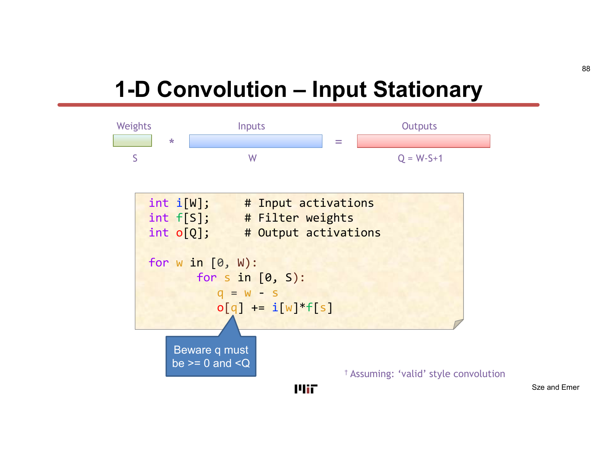

In Einsum notation, introducing the rank `W` as an explicit index (with `W = Q + S − 1`) and expressing `q = w − s` via a co-rank produces the IS Einsum `O[w-s] = I[w] × F[s]`. The traversal order (fastest to slowest) becomes S first, then W.

> **Why it matters:** IS is used for sparse CNNs where the input activation tensor is much larger than the weight tensor. Keeping inputs stationary avoids repeated costly fetches of the large input from DRAM. For dense CNNs it is not typically analyzed because the other dataflows offer better trade-offs.

---

## Chapter 6 — Energy Comparison and Design Trade-offs

> *Slides: L05-91 … L05-95*

### Variants of OS

The lecture examines three OS variants with different output tile shapes:

| Variant | # Output channels | # Output activations | Target |
|---|---|---|---|
| **OSA** | Single M | Multiple P×Q | CONV layers |
| **OSB** | Multiple M | Multiple P×Q | FC layers |
| **OSC** | Multiple M | Single P×Q | — |

Each variant uses a different Einsum with different parallel rank sets (e.g., OSA parallelizes over P0 and Q0; OSC parallelizes over M0).

### Energy comparison on AlexNet

The lecture shows a normalized energy-per-MAC comparison across WS, OSA, OSB, OSC, and a "No Local Reuse" (NLR) baseline. All designs use the same total area (256 PEs) and are benchmarked on AlexNet CONV layers with batch size 16.

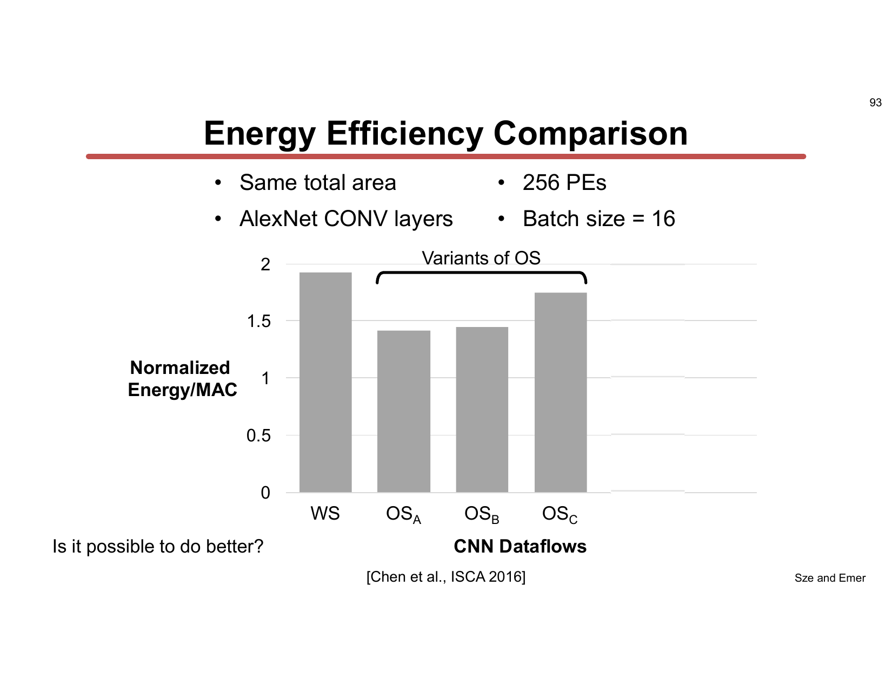

Key finding: **no single dataflow wins on all axes**. WS, OSA, OSB, and OSC cluster near each other, all substantially better than NLR, but their relative ordering depends on the layer's dimensions (channel counts, filter size, activation map size). This motivates the idea that a *flexible* accelerator (one that can change its dataflow based on the layer) may outperform a *fixed-dataflow* design on diverse workloads.

> **Why it matters:** The comparison tells you that picking the right dataflow for a given layer's dimensions can noticeably reduce energy per MAC. It also shows that no one dataflow is universally optimal — a result that motivates both the study of more sophisticated mappings and the pursuit of reconfigurable architectures (covered in later lectures).

---

## Chapter 7 — LoopTree: Expressing Dataflow and Data Placement

> *Slides: L05-95 … L05-111*

The final section of the lecture introduces **LoopTree**, a formal notation for specifying mapping decisions — particularly dataflow and data placement — in a unified tree structure. While loop nests written in pseudocode capture the order of computation, they do not directly express *where* data lives in the memory hierarchy. LoopTree fills that gap.

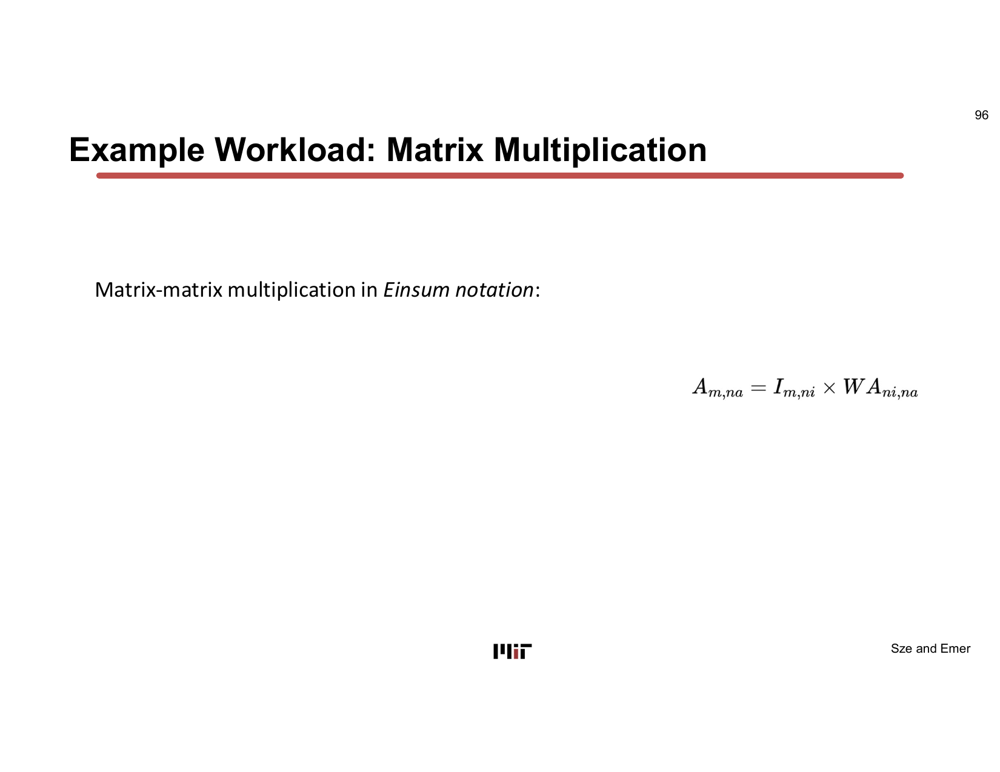

### Dataflow in LoopTree

In LoopTree, **loop nodes** represent individual for-loops. Their order in the tree encodes the loop order — outermost loops are higher in the tree, innermost are lower. For matrix multiplication `Z[m][n] = A[m][ni] × B[ni][n]`, choosing an OS-like traversal means placing the M and N loop nodes above the NI loop node.

### Partitioning a rank

Partitioning in LoopTree splits a rank (e.g., NI) into an outer tile dimension (NI₁) and an inner dimension (NI₀). This is expressed in the Einsum by *swizzling* ranks — introducing the partitioned sub-ranks explicitly. The resulting LoopTree has separate loop nodes for NI₁ and NI₀, with different storage nodes between them.

### Specifying a storage plan (data placement)

**Storage nodes** in the LoopTree mark where data is fetched into each level of the memory hierarchy. For example:

- DRAM (root): holds all tensors (A, B, Z) as backing storage.
- Global Buffer: all weights fetched once (`WA` fetched at the M-loop level); activations fetched in chunks (a slice of A fetched each iteration of the `for m` loop; a chunk of B fetched each iteration of the `for ni1` loop).

Storage nodes express the **dataplacement** aspect of mapping. Together, the loop nodes (dataflow) and storage nodes (dataplacement) in the LoopTree constitute a complete specification of how a computation is mapped onto the memory hierarchy.

> **Why it matters:** LoopTree is the formal language used in the course's TeAAL simulation toolchain. Being able to write a LoopTree is the prerequisite for the lab exercises and the final project, both of which require you to express mappings programmatically and evaluate their energy/performance trade-offs.

---

## Standalone Study Guide

### What to master before moving on

- Define mapping as loop order, loop bounds, partitioning, parallelism, and memory placement.
- Compare output-stationary, weight-stationary, and input-stationary dataflows by what value is kept close to the MAC.
- Explain why dataflow changes memory traffic without changing the mathematical operation.
- Read LoopTree notation as a compact description of loop nesting and data placement.

### Self-check questions

1. For a 1-D convolution, which tensor is reused most directly in OS, WS, and IS?
2. Why can two dataflows perform exactly the same MACs but consume different energy?
3. What information does LoopTree add beyond the Einsum itself?

### Exercises

1. Rewrite the 1-D convolution loop nest in OS, WS, and IS order. Mark where each tensor is read and written.
2. For one dataflow, choose a small buffer size and explain which tensor would spill first.
3. Use the energy hierarchy to argue which dataflow is preferable for a layer with very large filters but small output maps.

### Common traps

- Calling a dataflow "better" without specifying layer shape and memory sizes.
- Confusing stationarity with immobility. Stationary data is reused locally for a useful interval, not permanently fixed.
- Ignoring partial sums: output traffic can dominate if accumulation is poorly placed.

---

## Key Terms

| Term | Gloss |
|---|---|
| **Mapping** | The set of decisions scheduling a DNN computation onto hardware: partitioning, dataflow, data placement, compute placement, partition sizing. |
| **Dataflow** | The loop order in a loop nest; determines which data type is most stationary (changes slowest) and therefore benefits from local storage reuse. |
| **Stationarity** | The property of a data type that stays resident in low-cost local storage (RF or global buffer) while other data streams through. |
| **Output Stationary (OS)** | Dataflow where output partial sums accumulate locally; output indices (P, Q) are outermost in the loop nest. |
| **Weight Stationary (WS)** | Dataflow where filter weights are held stationary; filter spatial indices (R, S) are outermost in the loop nest. |
| **Input Stationary (IS)** | Dataflow where input activations are held stationary; raw input index (W) is outermost in the loop nest. |
| **Loop nest** | The nested for-loops that express the traversal order of a tensor computation; loop order directly encodes the dataflow. |
| **Parallel loop (parallel\_for)** | A loop whose iterations execute simultaneously across multiple PEs; expresses compute placement. |
| **Convolutional reuse** | Input activations reused across multiple filter positions due to the sliding window; unique to CONV layers. |
| **Fmap reuse** | Input activations reused across multiple filters (same activation × multiple weights). |
| **Filter reuse** | Filter weights reused across multiple images in a batch. |
| **Partitioning** | Tiling a tensor so that each tile fits into a given memory level; introduces extra loop dimensions. |
| **Data placement** | Choice of which buffer level holds each tensor tile at each loop level; controls spatial and temporal locality. |
| **LoopTree** | A tree-structured notation combining loop nodes (dataflow) and storage nodes (data placement) to formally specify a mapping. |
| **NLR (No Local Reuse)** | Baseline dataflow with no caching; all accesses go to DRAM — the worst-case energy reference. |
| **AlexNet** | The benchmark CNN used in the energy comparisons (724 M MACs; DRAM access reducible from 2,896 M to 61 M). |

---

## Takeaways

- **Mapping has five aspects**: partitioning, dataflow, data placement, compute placement, and partition sizing. Each controls a different dimension of the loop nest and a different kind of data movement.
- **Data movement dominates energy**: DRAM access costs ~200× an ALU operation; local accumulation and data reuse can cut AlexNet DRAM traffic from 2,896 M to 61 M accesses.
- **Dataflow = loop order = stationarity**: the data type whose indices occupy the *outermost* loops is the stationary type. Reading the outer loop immediately tells you the dataflow.
- **Three canonical CNN dataflows**: Output Stationary (OS) keeps partial sums local; Weight Stationary (WS) keeps weights local; Input Stationary (IS) keeps input activations local.
- **No dataflow is universally optimal**: WS vs. OS variants trade off differently depending on layer dimensions (filter size, channel depth, activation map size). Flexible architectures can exploit this.
- **LoopTree** unifies dataflow (loop node order) and data placement (storage node positions) in a single formal representation — the language of the course's simulation tools.

---

## Connections to Later Lectures

- **Partitioning deep-dive** — L06 examines partitioning in detail: how to tile ranks, how tile sizes set buffer occupancy, and how to choose sizes that balance bandwidth and capacity.
- **Einsum formalism** — L04 introduced Einsums; this lecture shows how the loop-nest traversal order is a mapping *on top of* an Einsum, not inherent to it. The same Einsum can be traversed in multiple orders.
- **Energy hierarchy from L01** — the 1× / 2× / 6× / 200× cost table first seen in L01 is the quantitative backbone of every trade-off analysis in this lecture.
- **Sparse dataflows** — L07–L10 (sparsity) extend IS and other dataflows to exploit zero-valued activations or weights, which changes the energy balance dramatically.
- **Reconfigurable architectures** — later lectures on systolic arrays and flexible accelerators explore how to support multiple dataflows on the same hardware, motivated directly by the finding here that no single dataflow wins on all layers.

---

## Appendix — Slide-to-Section Map

| Slides | Section |
|---|---|
| L05-1 | Title |
| L05-2 | Separation of Concerns — Mapping context |
| L05-3 … L05-5 | Ch.1 — Five aspects of mapping |
| L05-6 … L05-7 | Ch.1 — Goals of today's lecture; background reading |
| L05-8 … L05-27 | Ch.2 — Data movement and energy hierarchy |
| L05-28 … L05-35 | Ch.3 — Dataflow taxonomy; OS definition; 1-D OS loop nest |
| L05-36 … L05-48 | Ch.3 — CONV-layer OS loop nest; OS hardware examples (ShiDianNao, KU Leuven) |
| L05-49 … L05-57 | Ch.4 — WS definition; 1-D WS loop nest; parallel WS animation |
| L05-58 … L05-84 | Ch.4 — NVDLA WS loop nest and animation; WS hardware examples |
| L05-85 … L05-90 | Ch.5 — IS definition; 1-D IS loop nest; IS Einsum |
| L05-91 … L05-93 | Ch.6 — OS variants (OSA, OSB, OSC); energy comparison |
| L05-94 … L05-95 | Ch.6 — Summary of mapping aspects |
| L05-96 … L05-111 | Ch.7 — LoopTree: dataflow and data placement notation |
