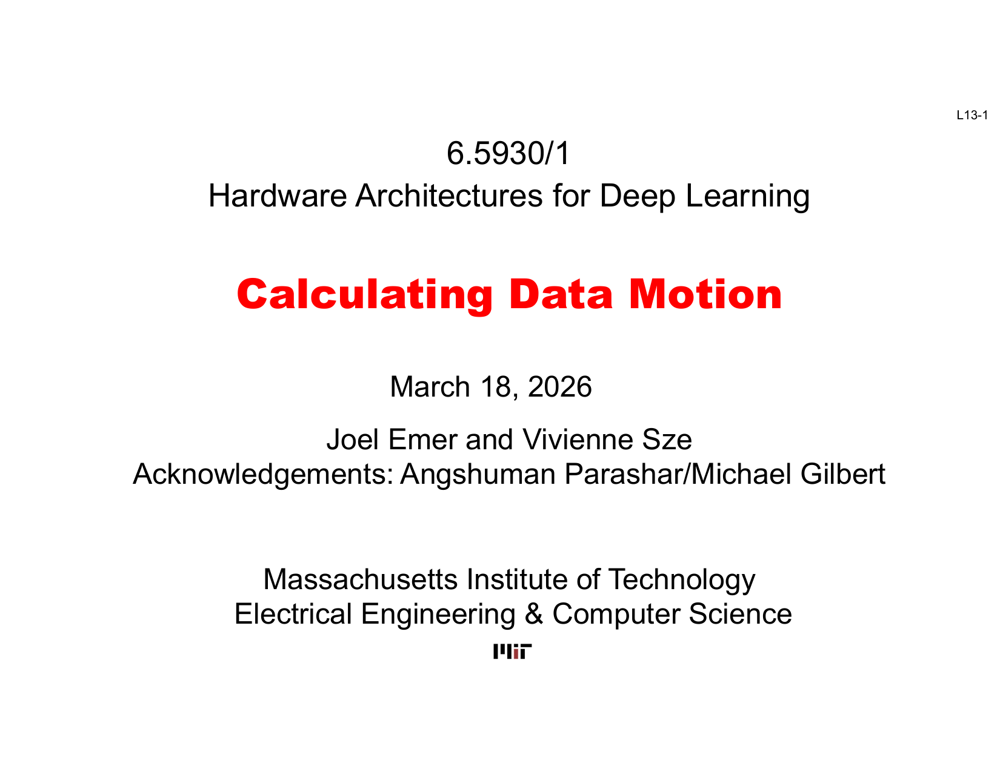
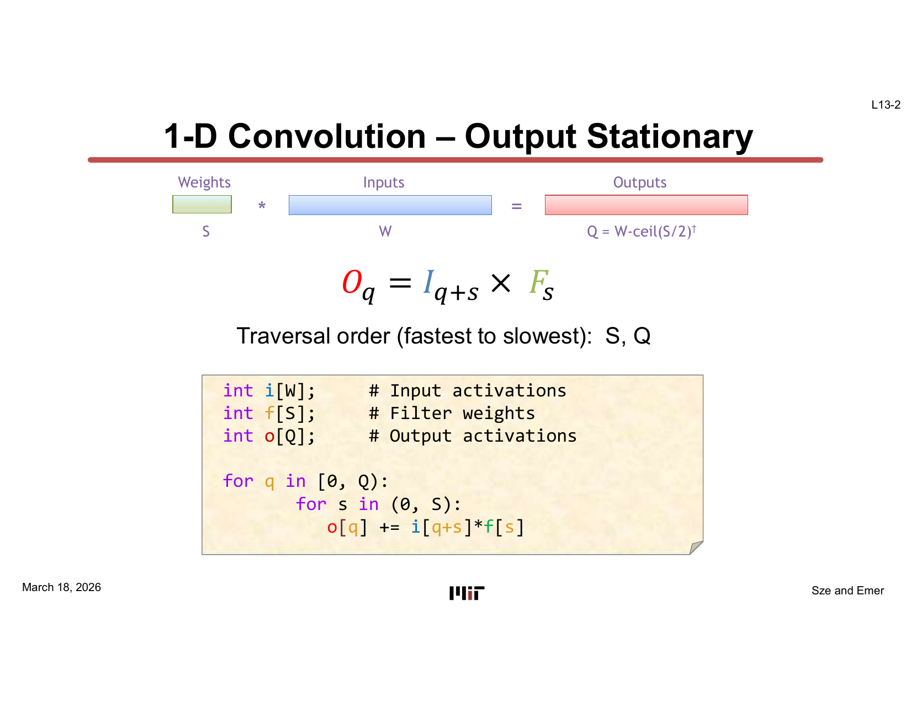
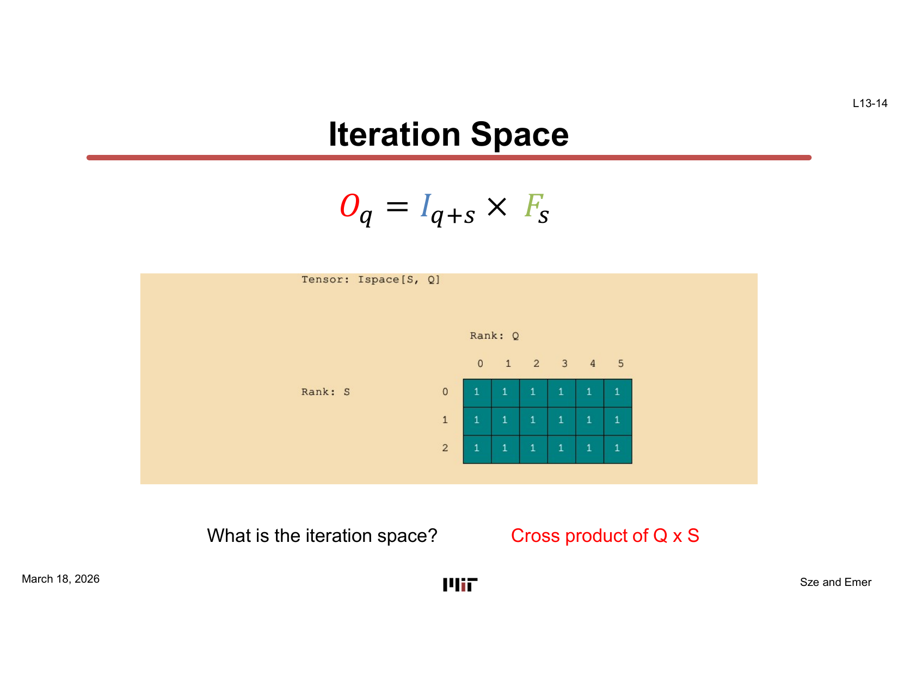
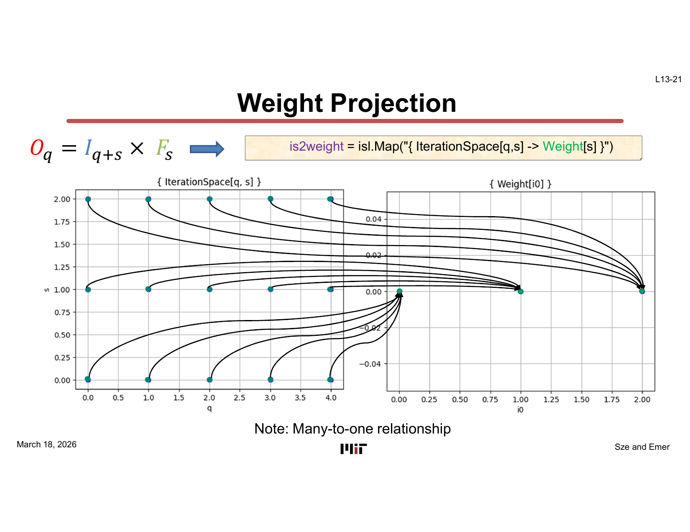
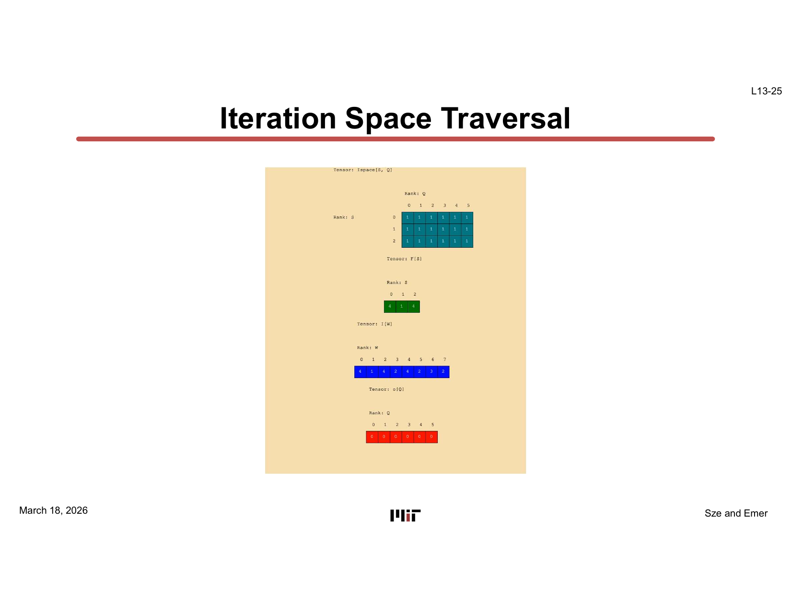
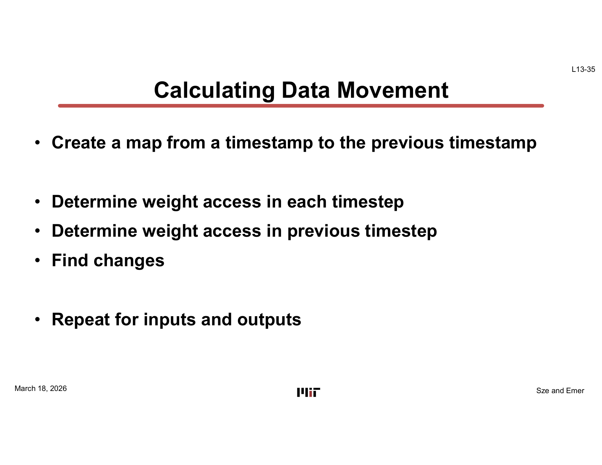
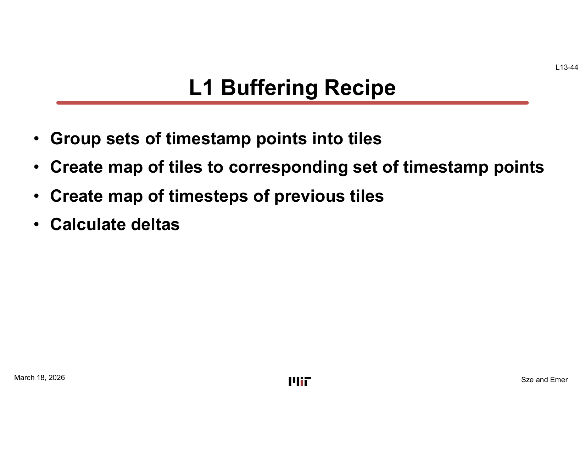
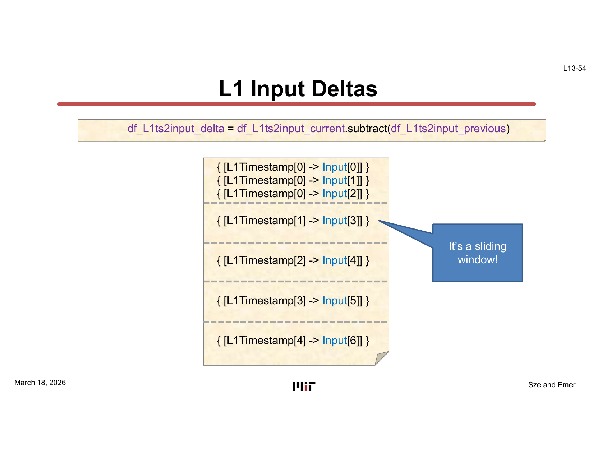
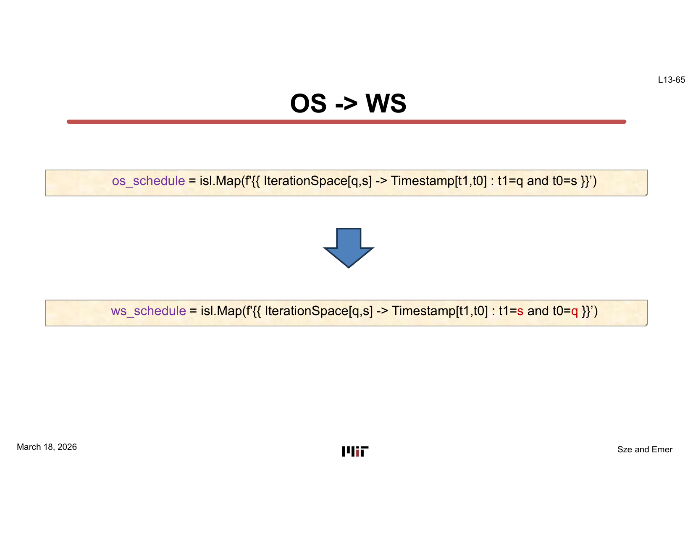

# L13 — Calculating Data Motion

> **Course:** 6.5930/1 — Hardware Architectures for Deep Learning
> **Instructors:** Joel Emer & Vivienne Sze (MIT EECS)
> **Lecture date:** March 18, 2026 · **Slides:** 66 · **Source:** [`Lecture/L13-Calculating_Motion.pdf`](../../Lecture/L13-Calculating_Motion.pdf)
>
> *Acknowledgements: Angshuman Parashar / Michael Gilbert.*
>
> *This is a conceptual walkthrough that reconstructs the lecture's narrative from the slides. It is organized by idea, not slide-by-slide. Each section cites the slide range it draws from so you can follow along with the original deck.*

---

## TL;DR

Knowing *what* dataflow a DNN accelerator uses is not enough — you need to know exactly **how many times each data element moves between every level of the memory hierarchy**. This lecture develops a rigorous, algebraic method for doing exactly that. Using **ISL (Integer Set Library)** as the mathematical substrate, it constructs: (1) an *iteration space* that enumerates every multiply-accumulate (MAC) a computation requires; (2) projection maps that link iteration-space points to the data elements they touch; (3) a *timestamp* map that imposes a schedule (dataflow) on the iteration space; and (4) a *delta* calculation that counts precisely how many new data elements must be fetched at each time step. The same machinery is then lifted to **L1 tiles** to compute the data movement at the buffer level, and the recipe extends naturally to *shrink* (eviction) calculations. The lecture closes by demonstrating how a simple change of schedule — from output-stationary to weight-stationary — produces a completely different data-movement profile, showing that the formal tools can directly compare competing dataflows.

---

## Learning Objectives

After this lecture you should be able to:

- Define an **iteration space** as an ISL set, and write the projection maps from iteration-space points to data elements (inputs, weights, outputs).
- Construct a **timestamp map** that encodes a dataflow (loop order), and derive its inverse and compositions.
- Use the **delta calculation** (current minus previous) to count new data fetches at the finest granularity.
- Extend the single-timestep delta to the **L1 tile level** by tiling the timestamp dimension, and compute both *fill* (new accesses) and *shrink* (evictions).
- Show how switching the loop order in the timestamp map changes the data-movement profile, and articulate why this connects to the dataflow comparisons discussed in earlier lectures.

---

## Chapter 1 — The Running Example: 1-D Convolution

> *Slides: L13-1 … L13-3*

The lecture grounds every abstraction in a single concrete computation: **1-D convolution**, one of the simplest DNN-kernel primitives.



The operation is:

```
O[q] += I[q + s] * F[s]
```

with dimensions W (input width), S (filter size), and Q = W − ⌈S/2⌉ (output width). In Python loop form:

```python
for q in [0, Q):
    for s in [0, S):
        o[q] += i[q + s] * f[s]
```



The slide labels this traversal **Output Stationary (OS)**: the inner loop iterates over `s` while the outer loop walks `q`, so each output accumulates all its partial sums before the schedule moves on. This is the *reference mapping* against which all subsequent analysis is performed.

> **Why it matters:** 1-D convolution is simple enough to trace by hand, yet it contains all the structure of a full DNN kernel — inputs, weights, outputs, a reduction dimension, and reuse of data. Every formula derived here applies directly to 2-D convolution and other Einsums.

---

## Chapter 2 — ISL Primer: Sets, Maps, and the Iteration Space

> *Slides: L13-4 … L13-24*

Before calculating data movement, the lecture establishes the algebraic vocabulary using ISL — a library for polyhedral arithmetic over integer sets.

### Sets

An **ISL set** is a collection of integer-coordinate points defined by a *space name* and *constraints*. The space name is significant: `SetXY[x, y]` and `SetWX[x, y]` occupy different spaces and are *not* equal even when their coordinate ranges coincide (slides L13-4 … L13-7). Similarly, coordinate order matters: `SetXY[x, y]` and `SetXY[y, x]` are distinct sets (L13-8 … L13-9).

### The Iteration Space

The **iteration space** for 1-D convolution is the Cartesian product Q × S — every `(q, s)` pair that corresponds to one multiply-accumulate:

```python
ispace = isl.Set('{ IterationSpace[q, s] : 0 <= q < Q and 0 <= s < S }')
```



The iteration space is purely a combinatorial object; it carries no notion of time or memory location. Those concepts are introduced by the *projection* and *timestamp* maps.

### Projection Maps

An ISL **map** is a relation `Domain[...] -> Range[...]` constrained by affine equalities. Three projection maps link iteration-space points to data elements:

- **Weight projection** (`is2weight`): `IterationSpace[q, s] -> Weight[s]` — every point in the same `s`-column maps to the same weight.



  This many-to-one relationship is exactly what weight-stationarity exploits: the weight `F[s]` is *reused* across all `q` positions.

- **Output projection** (`is2output`): `IterationSpace[q, s] -> Output[q]` — every point in the same `q`-row maps to the same output accumulator.
- **Input projection** (`is2input`): `IterationSpace[q, s] -> Input[q + s]` — the more complex map, reflecting the sliding-window nature of convolution where each input element is potentially shared across multiple (q, s) pairs.

Maps can be composed with `apply_range`, enabling chains like Timestamp → IterationSpace → Data.

> **Why it matters:** The projection maps are the algebraic formalization of *data reuse*. The many-to-one patterns they reveal determine which tensor is stationary in which dataflow — and quantifying that reuse is the first step toward counting memory traffic.

---

## Chapter 3 — Adding Time: Schedules and Timestamps

> *Slides: L13-25 … L13-34*

The iteration space has no ordering — it is just a set. A **schedule** (dataflow) imposes a total order by mapping each iteration-space point to a *timestamp* (logical time step).

### The Timestamp Map

For output-stationary traversal (outer loop `q`, inner loop `s`), the timestamp is:

```python
df_is2ts = isl.Map('{ IterationSpace[q, s] -> Timestamp[t1, t0] : t1 = q and t0 = s }')
```

The timestamp is a two-component tuple `(t1, t0)` with `t1` being the slower (outer) dimension. Its inverse gives the iteration-space point executing at any given logical time:

```python
df_ts2is = df_is2ts.reverse()
```



### Composing Maps to Reach Data

By composing maps through `apply_range`, the timestamp can be connected directly to any data element:

```python
df_ts2weight = df_ts2is.apply_range(is2weight)   # Timestamp -> Weight
df_ts2input  = df_ts2is.apply_range(is2input)    # Timestamp -> Input
df_ts2output = df_ts2is.apply_range(is2output)   # Timestamp -> Output
```

These composed maps answer: *"At time step (t1, t0), which weight / input / output is accessed?"* — a prerequisite for counting how often data changes between consecutive steps.

> **Why it matters:** Separating the schedule (timestamp map) from the algorithm (projection maps) means you can swap one dataflow for another simply by changing the timestamp map — every downstream calculation (delta, tile data movement) updates automatically. This is what makes the method *compositional*.

---

## Chapter 4 — Computing Data Movement: The Delta Calculation

> *Slides: L13-35 … L13-43*

With every time step mapped to a data element, the lecture introduces the core recipe for **calculating data movement**.



The recipe is:

1. Create a map from each timestamp to its **previous** timestamp.
2. Determine which data element is accessed at the current time step.
3. Determine which data element was accessed at the previous time step.
4. Take the **set difference** (current minus previous) — these are the *new* data elements that must be fetched.
5. Repeat for each data tensor (inputs, weights, outputs).

### The Previous-Timestamp Map

```python
timestamp_previous = isl.Map(f'{{ Timestamp[t1p, t0p] -> Timestamp[t1, t0] :
    t1p = t1 and t0p = t0 + 1
    or
    t1p = t1 + 1 and t0p = 0 and t0 = T0_MAX - 1 }}')
```

This captures that `t0` wraps around when it reaches its maximum, incrementing `t1`.

### Delta for Weights

The **weight delta** is:

```python
df_ts2weight_previous = timestamp_previous.apply_range(df_ts2weight_current)
df_ts2weight_delta = df_ts2weight_current.subtract(df_ts2weight_previous)
```

Under output-stationary traversal, every time step uses a new weight (since `s` is the fast index), yielding Q × S delta entries — every weight is fetched once per output.

### Delta for Inputs and Outputs

- **Input delta:** also one new input per time step (the sliding-window access pattern means each advance of `s` reaches a new `I[q + s]`).
- **Output delta:** only Q entries — one new output accumulator is opened at the start of each `q`-tile (when `s = 0`). Subsequent `s` steps accumulate into the same `O[q]`.

These deltas represent the data movement at the *finest* granularity — what would have to cross the lowest-level register file boundary on every clock cycle.

> **Why it matters:** The delta calculation converts an abstract schedule into a concrete count of data transfers. Summing the delta set over all timestamps gives total data movement, which can be compared directly against the memory bandwidth budget of a hardware design.

---

## Chapter 5 — L1 Buffering: Tiling the Timestamp

> *Slides: L13-44 … L13-56*

In a real accelerator, data is staged in an **L1 (on-chip) buffer**, not transferred one element per MAC. The lecture shows how to lift the per-timestep analysis to the **tile level** using a straightforward timestamp-tiling map.



### Tiling the Timestamps

Group fine-grained timestamps into L1 tiles by projecting out the fast dimension:

```python
timestamp2L1timestamp = isl.Map('{ Timestamp[t1, t0] -> L1Timestamp[t1] }')
L1timestamp2timestamp = timestamp2L1timestamp.reverse()  # one-to-many
```

Each L1 tile `L1Timestamp[t1]` corresponds to all the fine-grained steps sharing the same `t1` — i.e., one complete inner loop sweep over `s`.

### L1 Delta Calculation

The same delta recipe applies at the tile level:

```python
df_L1ts2weight_current = L1timestamp2timestamp.apply_range(df_ts2weight_current)
L1timestamp_previous = isl.Map("{ L1Timestamp[tp] -> L1Timestamp[t] : tp = t + 1 }")
df_L1ts2weight_previous = L1timestamp_previous.apply_range(df_L1ts2weight_current)
df_L1ts2weight_delta = df_L1ts2weight_current.subtract(df_L1ts2weight_previous)
```

For **weights** under OS: all S weights are needed by every L1 tile. Tile 0 is the initial load (3 weights), but subsequent tiles find the same weights already present → delta = 3 for tile 0, 0 for all others. **Weight is perfectly stationary across tiles.**

For **inputs**: the analysis reveals a **sliding window** pattern:

```
Tile 0 loads: Input[0], Input[1], Input[2]   (3 new)
Tile 1 loads: Input[3]                        (1 new)
Tile 2 loads: Input[4]                        (1 new)
...
```

Each successive tile only needs one new input element, reflecting the unit stride of the 1-D convolution. This is a classic result: the input reuse pattern of a sliding-window convolution is exactly one new element per output position.



For **outputs**: each tile writes exactly one new output accumulator (the one for the current `q`), draining it as a complete partial sum, yielding Q delta entries total.

> **Why it matters:** The tile-level delta is what a hardware designer actually uses to size the L1 buffer and estimate the bandwidth required between the L1 buffer and the global buffer (or DRAM). Identifying the sliding-window pattern in inputs, for instance, immediately suggests a *line buffer* micro-architecture.

---

## Chapter 6 — Shrink Calculation and Comparing Dataflows

> *Slides: L13-57 … L13-66*

### Shrink: When Does Data Leave the Buffer?

The *fill* delta (computed above) tells when data enters the buffer. The lecture also introduces the **shrink** calculation — when data can be *evicted*:

```python
L1timestamp_next = L1timestamp_previous.reverse()  # tile t -> tile t+1
df_L1ts2weight_shrink = df_L1ts2weight_current.subtract(df_L1ts2weight_next)
```

A data element shrinks at tile `t` if it is in the buffer at tile `t` but not needed at tile `t+1`. For weights under OS: all S weights are needed by every tile, so the shrink is zero until the last tile — all three weights can be evicted only at the end of the computation. For inputs: the sliding-window slides one step, so the oldest input `I[q]` is no longer needed after tile `t`, meaning it can be evicted exactly one tile after its last use.

Together, fill and shrink bound the **minimum live-set** that an L1 buffer must hold at any given tile, which determines the minimum required buffer capacity.

### Comparing Output-Stationary to Weight-Stationary

The lecture closes by swapping the schedule to **Weight Stationary (WS)**:

```python
ws_schedule = isl.Map('{ IterationSpace[q, s] -> Timestamp[t1, t0] : t1 = s and t0 = q }')
```

The outer loop now walks `s` (slow) and the inner loop walks `q` (fast). Running the same delta pipeline through this new timestamp map produces a completely different data-movement profile: under WS, weights are stationary (zero delta after tile 0), while inputs must be loaded afresh for each `s`-tile, and outputs accumulate partial sums across all tiles, resulting in Q × (S − 1) partial-sum read-back events.



This closing comparison makes the payoff of the whole lecture concrete: **the formal ISL framework lets you mechanically compute and compare the data-movement cost of any two dataflows** without building hardware — exactly the kind of analysis that drives the Mapping layer of the TeAAL Pyramid of Concerns.

> **Why it matters:** Dataflow selection is one of the highest-leverage decisions in accelerator design. The ISL method turns that decision from intuition into arithmetic: you write down the timestamp map, run the delta pipeline, and read off the memory traffic figures. This is the foundation of automated design-space exploration tools.

---

## Key Terms

| Term | Gloss |
|---|---|
| **ISL** (Integer Set Library) | A C/Python library for polyhedral arithmetic on integer sets and relations; the computational substrate of this lecture. |
| **Iteration space** | The set of all `(loop-variable)` tuples that correspond to individual MAC operations in a computation. |
| **Projection map** | An ISL map from iteration-space points to data elements (inputs, weights, or outputs) they access. |
| **Timestamp map** | An ISL map that assigns a lexicographic time coordinate to each iteration-space point, encoding a schedule / dataflow. |
| **Output Stationary (OS)** | A dataflow where the outer loop traverses output positions `q` and the inner loop traverses reduction positions `s`; outputs accumulate locally before moving on. |
| **Weight Stationary (WS)** | A dataflow where the outer loop traverses filter positions `s`; each weight is held fixed while all `q` outputs accumulate one partial sum from it. |
| **Delta (fill)** | The set of data elements accessed at time step `t` that were *not* accessed at time step `t-1`; counts new fetches / data movement into a buffer. |
| **Shrink (eviction)** | The set of data elements present at tile `t` that are *not* needed at tile `t+1`; identifies when data can leave a buffer. |
| **L1 timestamp / tile** | A coarser time granularity obtained by grouping fine-grained timestamps into tiles, corresponding to one inner-loop sweep. |
| **Sliding window** | The input access pattern of convolution: each advance of the output position introduces exactly one new input element, creating a Q + S − 1 total live set at any time. |
| **Live set** | The set of data elements that must reside in a buffer simultaneously; determined by the union of fill and carry-over from previous tiles. |
| **Many-to-one reuse** | A property of a projection map where multiple iteration-space points map to the same data element — the formal basis for data stationarity. |

---

## Takeaways

- Every DNN mapping can be decomposed into an **iteration space + projection maps + timestamp map**, and that decomposition fully determines data movement.
- The **delta calculation** — set-difference of current vs. previous data access — mechanically counts new data fetches at any memory-hierarchy level without simulation.
- At the **L1 tile level**, the same delta recipe reveals structure: under output-stationary, weights are perfectly stationary (loaded once, never reloaded), while inputs follow a **sliding-window** pattern (one new element per tile after the initial load).
- The **shrink calculation** is the dual of the fill, and together they determine the minimum buffer capacity needed for a given mapping.
- Swapping the timestamp map from output-stationary to weight-stationary immediately produces a different (and quantitatively precise) data-movement profile — demonstrating that **dataflow comparison is now arithmetic, not intuition**.
- This lecture provides the mathematical engine that underlies automated mapping tools such as **TeAAL**: given a hardware description and a mapping, the tool computes data traffic in closed form.

---

## Connections to Later Lectures

This is the final lecture of 6.5930/1. It completes the arc that L01 initiated:

- **L01** established that *data movement dominates energy* (DRAM ≈ 200× an ALU operation) and introduced the TeAAL Pyramid of Concerns.
- **L02–L04** formalized DNN computations as Einsums and catalogued the iteration spaces and data tensors encountered in real networks.
- **L05–L06** introduced dataflows (output-stationary, weight-stationary, row-stationary) qualitatively and showed how they affect reuse.
- **L07–L10** extended the framework to sparse data, where the iteration space itself becomes irregular.
- **L11–L12** covered advanced implementation technologies (reduced precision, compute-in-memory) that change the energy cost at each memory level.
- **L13 (this lecture)** closes the loop: it provides the *quantitative* method for computing exactly how much data moves under any mapping, at any level of the memory hierarchy, for any computation expressed as an Einsum. The ISL framework directly enables the automated analysis that tools like TeAAL and Accelergy perform internally, and it is the rigorous foundation on which every design-space exploration and mapping optimization in the course ultimately rests.

---

## Appendix — Slide-to-Section Map

| Slides | Section |
|---|---|
| L13-1 | Title |
| L13-2 … L13-3 | Ch.1 — 1-D convolution running example, output-stationary traversal |
| L13-4 … L13-12 | Ch.2 — ISL sets: space names, coordinate order, constraints |
| L13-13 … L13-16 | Ch.2 — Defining the iteration space |
| L13-17 … L13-18 | Ch.2 — ISL maps, domain/range, bounded maps |
| L13-19 … L13-24 | Ch.2 — Projection maps: weight, output, input, compute |
| L13-25 … L13-29 | Ch.3 — Timestamp map, traversal visualization, inverse |
| L13-30 | Ch.3 — Composing maps with apply_range |
| L13-31 … L13-34 | Ch.3 — Timestamp-to-data compositions, probing the schedule |
| L13-35 … L13-43 | Ch.4 — Delta calculation (fill) for weights, inputs, outputs |
| L13-44 … L13-56 | Ch.5 — L1 buffering: tiling timestamps, L1 fill deltas |
| L13-57 … L13-64 | Ch.6 — Shrink calculation for weights, inputs, outputs |
| L13-65 | Ch.6 — Comparing OS vs. WS by swapping the timestamp map |
| L13-66 | Closing |
