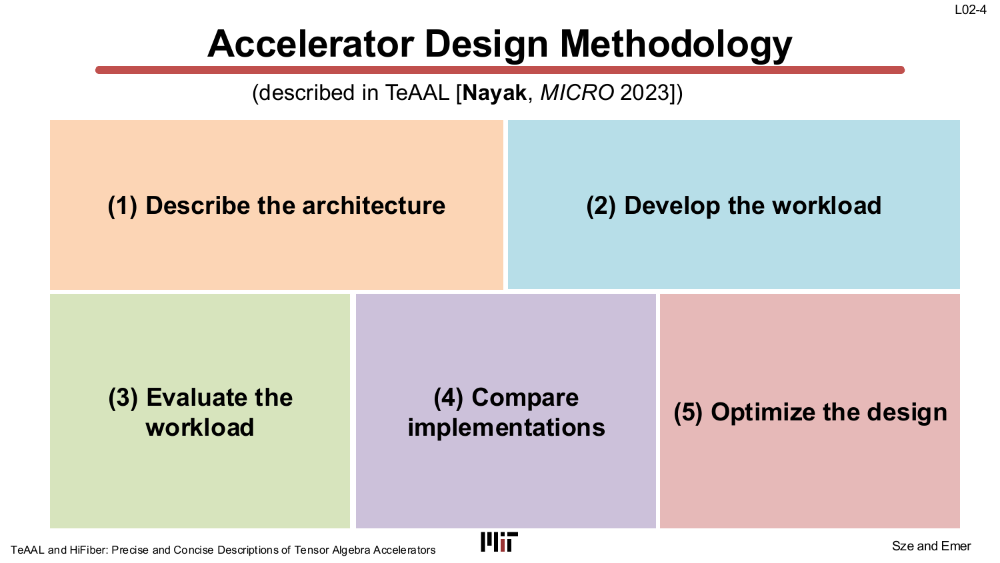
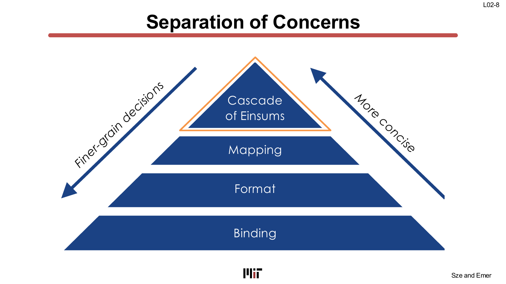
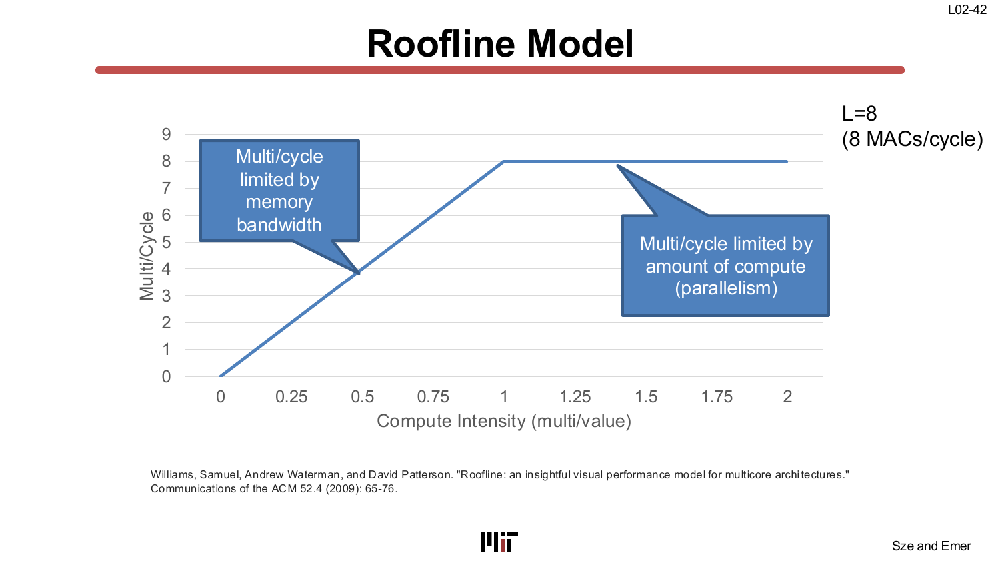
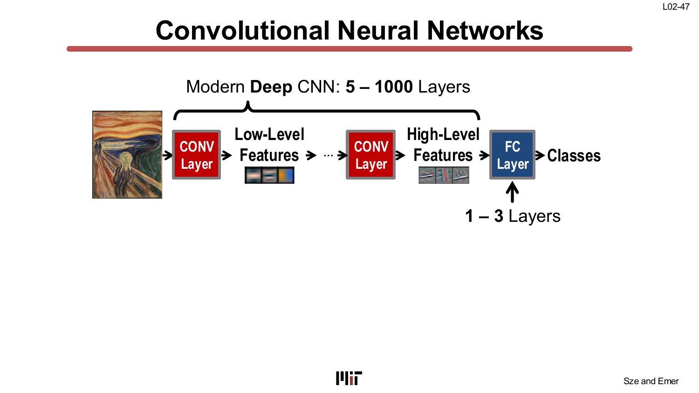
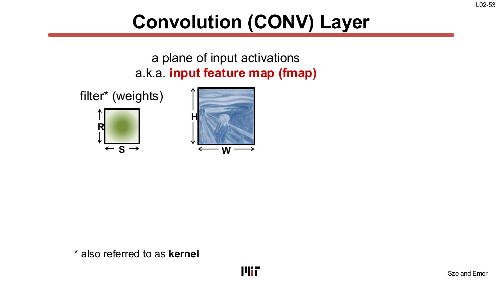
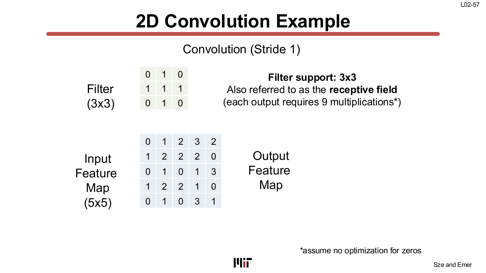
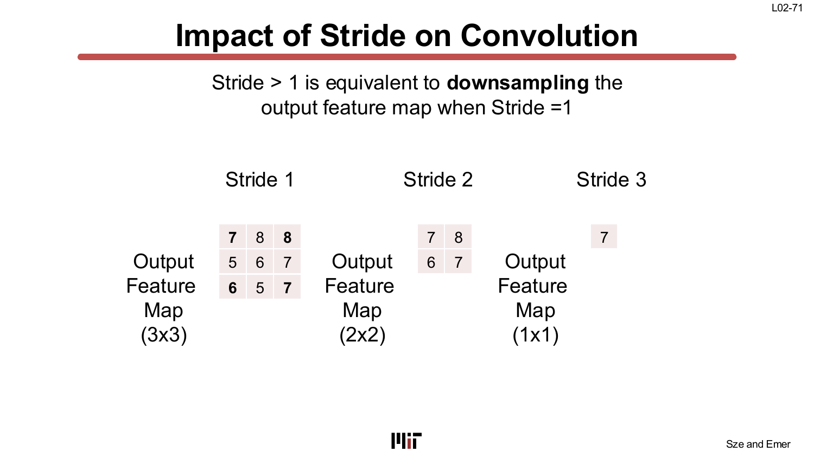
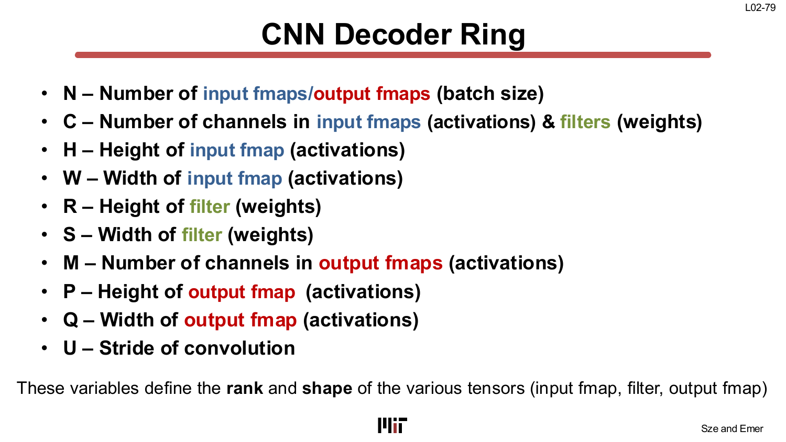
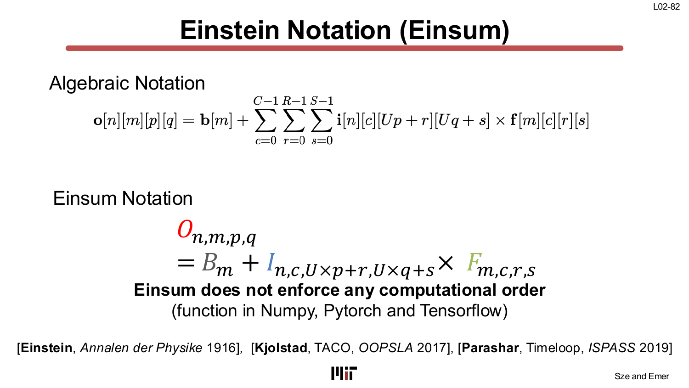
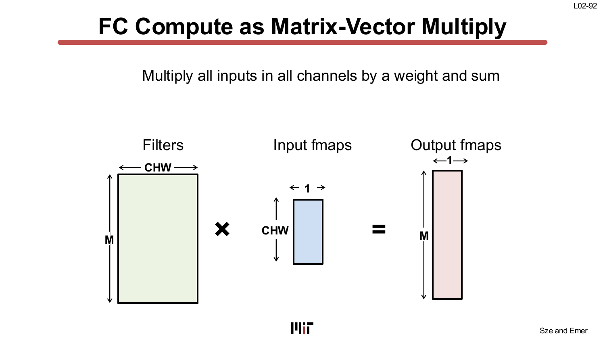

# L02 — DNN 元件概論（Overview on DNN Components）

> **課程：** 6.5930/1 — 深度學習硬體架構（Hardware Architectures for Deep Learning）
> **講師：** Joel Emer 與 Vivienne Sze（MIT EECS）
> **講授日期：** 2026 年 2 月 4 日 · **投影片：** 102 頁 · **來源：** [`Lecture/L02-Overview_on_DNN_components.pdf`](../../Lecture/L02-Overview_on_DNN_components.pdf)
>
> *本文是以「概念」為單位重建講課脈絡的導讀（walkthrough），依主題而非逐頁編排。每一節都標註其對應的投影片範圍，方便你對照原始投影片閱讀。*

---

## 一句話總結（TL;DR）

本講建立了每位硬體架構師在分析 DNN 工作負載時必備的語言。前半段以 TeAAL 框架形式化**加速器設計方法論**——以 Einsum（愛因斯坦求和符號）作為工作負載的規格格式，推導出**運算強度（compute intensity）**這個關鍵的效率指標，並將兩者與**屋頂線模型（Roofline Model）**串聯。後半段則有系統地解剖**卷積神經網路（Convolutional Neural Network, CNN）的各層元件**：CONV 層（含滑動視窗運算、步幅、填補、多通道擴展）、全連接層（FC 層；即濾波器大小等於特徵圖大小的 CONV，化簡為矩陣–向量或矩陣–矩陣乘法）、以及輔助的 NORM 與 POOL 層。貫穿全講的主線是**資料重用（data reuse）**：每一個架構維度——空間、通道、批次——都創造了攤銷權重或激活值記憶體存取的機會，而硬體架構師的挑戰正是有效地利用這種重用。

---

## 學習目標（Learning Objectives）

讀完本講後，你應該能夠：

- 描述 **TeAAL 五步加速器設計方法論**，並說明每一步各自決定什麼。
- 將一個 **CONV 層運算寫成 Einsum**，從中讀出迭代空間大小，以及七個標準迴圈變數（N、C、H、W、R、S、M、P、Q、U）。
- 以「乘法次數/值」定義**運算強度（CI）**，計算給定 Einsum 的最優 CI，並用**屋頂線模型**解讀吞吐量的瓶頸所在。
- 說明**步幅（stride）**與**零填補（zero padding）**如何控制 CONV 輸出的空間維度。
- 說明 **FC 層是 CONV 層的特例**（R = H，S = W），以及當批次大小 N > 1 時它如何化簡為**矩陣–矩陣乘法**。
- 指出 NORM 與 POOL 是輔助層，並陳述 CONV 在典型 CNN 中佔**超過 90%** 的整體運算量。

---

## 第一章 — 加速器設計方法論

> *投影片：L02-3 … L02-44*

### 從工作負載到硬體：五步循環

本講開門見山地指出，硬體架構師需要一套**有原則、可重複執行的方法論**，才能從 DNN 工作負載規格一路推導到最佳化的加速器。TeAAL 框架（Nayak, MICRO 2023）將這個過程形式化為五個可迭代的步驟：

1. **描述架構（Describe the architecture）** — 從硬體元件庫（含 ALU 與暫存器檔的 PE、全域 SRAM 緩衝區、DRAM）中選取元件，組織成加速器規格。
2. **開發工作負載（Develop the workload）** — 寫出描述運算的 Einsum 串接（cascade），以及映射（mapping）、格式（format）與綁定（binding）規格。
3. **評估工作負載（Evaluate the workload）** — 在硬體上對工作負載建模：計算運算次數、記憶體流量，並推導運算強度。
4. **比較實作方案（Compare implementations）** — 在硬體參數正規化後重新評估，公平地比較各種設計選項。
5. **最佳化設計（Optimize the design）** — 逐步修改一項或多項規格（架構、映射、格式、綁定）並重新評估。

這個循環並非嚴格線性；最佳化往往會把你帶回步驟 1 或 2。步驟 3–4 是 **Lab 1** 的核心；步驟 2–3（映射／迭代空間的走訪順序）則是 **Lab 2–3** 的重點。

### 步驟 2 內部的「關注點分離」

在「開發工作負載」這一步中，TeAAL 劃定了一個嚴格的層次——從最粗粒度、最精簡到最細粒度：

- **Einsum 串接（Cascade of Einsums）** — *算什麼*。
- **映射（Mapping）** — *如何*走訪迭代空間（迴圈順序、分塊、平行性）。
- **格式（Format）** — *資料如何編碼*（稠密 vs. 稀疏、壓縮方案）。
- **綁定（Binding）** — *哪個*硬體資源執行映射的哪個部分。

這呼應了 L01 的 TeAAL 關注點金字塔，也是本課程能夠在不更動硬體描述的情況下單獨討論迴圈順序改變的原因。

### 張量（tensor）、秩（rank）與 Einsum

**張量（tensor）**是多維陣列。本課程將維度數稱為**秩（rank）**的數量，各秩的大小稱為其**形狀（shape）**，張量的大小則是所有秩形狀的乘積。

矩陣乘法是最典型的例子，Einsum 符號可以用一行式子捕捉它：

$$Z_{m,n} = A_{k,m} \times B_{k,n}$$

所有出現在右側但未出現在左側的下標索引，都隱含地被求和（稱為「歸約索引（reduction index）」）。矩陣–向量乘法同理：

$$Z_m = A_{k,m} \times B_k$$

**Einsum 的操作型定義（Operational Definition of an Einsum, ODE）**將此嚴格化：

1. 構成**迭代空間（iteration space）** — 所有合法索引值的笛卡爾積（如 K × M）。
2. 對迭代空間中的每個點，讀取指定索引的運算元值，相乘後累加到左側索引對應的輸出位置。
3. 只出現在右側的索引為**歸約索引**，隱含地求和。

迭代空間的大小（K × M）就是這個 Einsum 所需的乘法次數，即工作量（amount of work）。

### 運算強度（compute intensity）與屋頂線模型

**運算強度（CI）**定義為*乘法次數/存取值數*（而非容易產生歧義的 FLOPs/byte）：

$$\text{CI} = \frac{\text{乘法次數}}{\text{存取值數}}$$

以矩陣–向量 Einsum $Z_m = A_{k,m} \times B_k$ 為例：

- **最優 CI（best-case CI）**（最少流量、最大重用）：分子為 K×M 次乘法；分母為 K×M（載入 A）+ K（載入 B）+ M（儲存 Z）= K×M + K + M 個值。當 K=250、M=100 時，最優 CI ≈ **0.99 乘法/值**。

- **實現 CI（achieved CI）**（由特定迴圈巢結構決定）：若外層迴圈走 k、內層走 m，已實現的流量為 K×M（載入 A）+ K（載入 B）+ (K−1)×M（載入 Z 的部分和）+ K×M（儲存 Z）≈ 3K×M 個值。當 K=250、M=100 時，實現 CI ≈ **0.33 乘法/值**。

實現 CI 永遠 ≤ 最優 CI。兩者之間的落差來自重用未被充分利用——在這個例子中，由於只有一個暫存器（沒有分塊），Z[m] 的部分和在 k 迴圈的每次迭代都要重新從 DRAM 載入。

**屋頂線模型（Roofline Model）**將 CI 轉化為吞吐量預測：

- 水平的「屋頂」是**運算上限（compute ceiling）**（例如 L=8 個並行乘法器時為 8 MACs/cycle），受限於平行乘法單元的數量。
- 斜面（ramp）是**記憶體頻寬上限**——吞吐量 = CI × 頻寬。
- 工作負載的 CI 決定了它在 x 軸上的位置：落在**記憶體受限區（斜面上）**或**運算受限區（屋頂以下）**。

關鍵含義：當工作負載處於記憶體受限區時，增加更多運算通道**並不會**提升吞吐量——只有降低記憶體流量（即提升 CI）才有幫助。

> **為什麼重要：** 運算強度是連結工作負載規格與硬體設計的最重要單一數字。它告訴架構師瓶頸在記憶體頻寬還是算術吞吐量——也因此指明了該拉哪根槓桿。

---

## 第二章 — CNN 的結構與各層類型

> *投影片：L02-45 … L02-52*

### CNN：多種異質層的深度堆疊

現代 CNN 是一個包含 **5 到 1000 層**的序列，用以將原始輸入（影像、語音頻譜圖、遊戲狀態或醫學影像）轉換為預測結果：

標準層類型如下：

| 層類型 | 作用 |
|---|---|
| **CONV（卷積層）** | 以學習到的濾波器提取空間特徵，由淺層的低階邊緣特徵逐步到深層的高階語意。 |
| **激活函數（Activation, 非線性）** | 逐元素的非線性轉換，施加於每個 CONV 或 FC 之後（例如 ReLU）。使網路能學習非線性決策邊界。 |
| **NORM（正規化層）** | 穩定訓練；位於 CONV 與 POOL 之間。 |
| **POOL（池化層）** | 對特徵圖進行空間降採樣，降低後續計算量並提供平移不變性。 |
| **FC（全連接層）** | 從高階特徵產生最終類別分數向量；通常為網路末端的 1–3 層。 |

關鍵定量事實：在典型 CNN 中，**CONV 層佔整體運算量超過 90%**，主導了運行時間與能耗。這個數字說明了本講其餘部分——以及整門課程的大部分——為何聚焦於理解和最佳化 CONV 運算。

深度造就層次：每一層連續的 CONV 層都結合了前一層輸出的局部區塊，因此到第三、四層時，每個輸出激活值「看到」的區域已涵蓋了大部分原始輸入。淺層對邊緣和紋理有響應；深層則對零件、物體和場景有響應。

> **為什麼重要：** 了解各層類型各自消耗多少資源——以及 CONV 的主導地位——是制定硬體預算的第一步。NORM、POOL 和激活函數的架構選擇，基本上是 CONV 與 FC 引擎的附帶乘客。

---

## 第三章 — CONV 層深度解析

> *投影片：L02-53 … L02-83*

### 一個 CONV 層的解剖

一個 CONV 層將一個**濾波器（filter）**（學習到的權重張量）滑過**輸入特徵圖（input feature map, fmap）**，產生**輸出特徵圖（output feature map）**：

以二維情形為例：

- **輸入特徵圖（fmap）**是一個 H × W 的激活值平面。
- **濾波器（filter）**是一個 R × S 的權重網格（R 和 S 通常為 1×1、3×3、5×5 或 7×7）。
- 濾波器以**滑動視窗（sliding window）**的方式掃過輸入：在每個位置，濾波器覆蓋下方的 R×S 個激活值，與 R×S 個權重做逐元素乘法並求和，產生一個**輸出激活值**（部分和累加的結果）。
- 最終得到的**輸出特徵圖**在空間維度上為 P × Q。

### 二維卷積範例

投影片以具體的 5×5 輸入、3×3 濾波器、步幅 1 的例子進行逐步示範：

每個輸出激活值需要 3×3 = 9 次逐元素乘法和 8 次加法。以步幅 1 滑動濾波器並走過所有合法位置，產生一個 **3×3 的輸出**（因為 (5−3+1)/1 = 3）。輸出特徵圖的大小公式為：

$$P \times Q = \left\lfloor\frac{H - R + U}{U}\right\rfloor \times \left\lfloor\frac{W - S + U}{U}\right\rfloor$$

其中 **U** 為步幅（stride）。

### 步幅（stride）與零填補（zero padding）

**步幅**控制濾波器在相鄰輸出位置之間移動多少個像素：

- 步幅 1 → 3×3 輸出（9 個值）。
- 步幅 2 → 2×2 輸出（4 個值），等價於對步幅 1 結果做降採樣。
- 步幅 3 → 1×1 輸出（1 個值）。

步幅 > 1 是一種空間降採樣機制：在不額外加入池化層的情況下，減少輸出激活值的數量（以及後續的運算量）。

**零填補（zero padding）**在輸入邊界補零，以控制輸出的大小。若不加填補，每個 CONV 層都會縮小空間維度——對深層網路而言，這很快就會把特徵圖壓縮到零。將填補設為各空間方向 (R−1)/2（步幅 U=1 時），可使輸出保持與輸入相同的空間大小，大幅簡化網路設計。

### 多通道：C 個輸入通道、M 個輸出通道

上述二維描述假設了單通道輸入。實際上：

- 輸入特徵圖有 **C 個通道**（第一層時 C=3 對應 RGB；後續各層，C 等於前一層的輸出通道數）。
- 濾波器現在是 **R × S × C** 的張量——每個輸入通道對應一個 R×S 平面。
- 每個濾波器同時作用於所有 C 個輸入通道，對所有 R×S×C 個乘積求和，產生一個純量輸出激活值。
- 共有 **M 個這樣的濾波器**，每個對應一個所需的輸出通道。
- 因此，輸出特徵圖有 **M 個通道**，每個通道是一個 P×Q 的空間圖。

加入批次大小 **N**（同時處理 N 張影像），四個張量的形狀為：

| 張量 | 形狀 |
|---|---|
| 輸入特徵圖 | N × C × H × W |
| 濾波器權重 | M × C × R × S |
| 輸出特徵圖 | N × M × P × Q |
| 偏置（Bias） | M（每個輸出通道一個） |

### CNN「解碼環」（CNN decoder ring）

本講提供了所有 CONV 層迴圈變數的一覽表——即 **CNN 解碼環**：

| 變數 | 含義 |
|---|---|
| **N** | 批次大小（輸入／輸出特徵圖的數量） |
| **C** | 輸入通道數 |
| **H** | 輸入特徵圖高度 |
| **W** | 輸入特徵圖寬度 |
| **R** | 濾波器（卷積核）高度 |
| **S** | 濾波器（卷積核）寬度 |
| **M** | 輸出通道數（濾波器數量） |
| **P** | 輸出特徵圖高度 |
| **Q** | 輸出特徵圖寬度 |
| **U** | 步幅（stride） |

這十個符號將在整門課程中反覆出現。每個 CONV 層都可藉由指定這些變數的值來完整描述。

### CONV 層的 Einsum 與七重迴圈巢實作

完整的 CONV 運算可以緊湊地表示為 Einsum：

$$O_{n,m,p,q} = B_m + I_{n,c,U\cdot p + r,\; U\cdot q + s} \times F_{m,c,r,s}$$

樸素的實作是一個七重迴圈巢：外層迴圈走 n（批次）、m（輸出通道）、q 與 p（輸出空間位置）；內層迴圈走 c（輸入通道）、r 與 s（濾波器位置）。內層主體對每個輸出激活值執行一次乘加，並在最外層一次加上偏置。總工作量為 N × M × P × Q × C × R × S 次乘加運算（MAC）。

Einsum 比迴圈巢更具一般性：它指定*計算什麼*，但不固定任何迴圈順序——那個選擇正是**映射（mapping）**，將在 L05–L06 中深入探討。

> **為什麼重要：** CONV 的 Einsum 是流經整個 TeAAL 流程的工作負載規格。其七個索引（n、m、p、q、c、r、s）對應七個迴圈層級，而選擇哪些層級做分塊、重排或平行化，正是本課程核心的硬體設計問題。

---

## 第四章 — 全連接層（FC 層）

> *投影片：L02-84 … L02-102*

### FC 層是使用全尺寸濾波器的 CONV 層

全連接層（Fully-Connected layer）將每個輸入神經元連接到每個輸出神經元。從 CONV 層的角度來看，這只是一個濾波器大小等於輸入特徵圖大小的 CONV 層：**R = H，S = W**。沒有滑動視窗——每個濾波器覆蓋輸入的整個空間範圍。

FC 層（單張影像）的 Einsum 為：

$$O_m = I_{c,h,w} \times F_{m,c,h,w}$$

透過將三個秩 C、H、W **展平（flatten）**成單一秩 CHW（大小為 C×H×W），這個 Einsum 化簡為**矩陣–向量乘法（matrix-vector multiply）**：

$$O_m = I_{chw} \times F_{m,chw}$$

權重矩陣 F 的形狀為 M × CHW；輸入向量 I 的形狀為 CHW × 1；輸出向量 O 的形狀為 M × 1。

### 批次大小 N > 1 時提升為矩陣–矩陣乘法

當同時處理 N 張影像（批次模式）時，輸入變為 N × CHW 的矩陣，輸出變為 N × M 的矩陣：

$$O_{n,m} = I_{n,chw} \times F_{m,chw}$$

這就是標準的**矩陣–矩陣乘法（matrix-matrix multiply）**——正是稠密線性代數函式庫（cuBLAS、MKL）高度最佳化的運算。這個等價關係說明了為什麼大批次下 GPU 上的 FC 層往往能接近峰值算術吞吐量，而 CONV 層則因為濾波器感受野帶來的複雜位址模式而通常無法匹敵。

展平後帶有批次的 FC 層 Einsum：

$$O_{n,m} = I_{n,chw} \times F_{m,chw}$$

直接類比於一般矩陣乘法 $C_{m,n} = A_{m,k} \times B_{k,n}$，索引對應為 k ↔ chw，歸約發生在 chw 秩，自由秩（free ranks）為 n 和 m。

> **為什麼重要：** 認識到 FC 是 CONV 的特例，統一了硬體設計：同一套 PE 陣列與記憶體階層既能跑 CONV，也能跑 FC。但同時，FC 的運算強度很低（每個權重僅用於一個輸出），這使得批次大小為 1 時它是記憶體頻寬受限的——這是一個有別於 CONV 頻寬挑戰的硬體難題。

---

## 獨立學習指南（Standalone Study Guide）

### 進入下一講前必須掌握

- 將 FC 與 CONV 層轉成 Einsum 記法與迴圈巢。
- 辨認卷積中的張量秩：batch、channel、filter、輸出空間、輸入空間與 kernel 空間秩。
- 說明 stride、padding、filter size 與 channel count 如何改變工作量與資料搬移。
- 用 arithmetic intensity 與 Roofline 推理比較「層」，而不只比較整個網路。

### 自我檢核問題

1. 為什麼全連接層可以視為卷積的一個特例？
2. 在 2-D convolution 中，哪些秩是自由輸出秩，哪些秩是 reduction rank？
3. 為什麼 MAC 較少的層仍可能更難有效加速？

### 練習

1. 寫出 batched matrix-vector FC 層的 Einsum，再寫出同一層以 batch 形成 matrix-matrix multiply 時的 Einsum。
2. 對一個簡單 CONV 層，列出最內層迴圈會碰到的每個張量，並說明哪些值會在相鄰輸出像素間重用。
3. 從投影片選一個 CNN 架構，說明它透過哪些設計降低 spatial size、channels 或 filters。

### 常見誤區

- 以為「CONV 可化成矩陣乘法」就代表資料搬移自動相同。lowering 可能複製或重排資料。
- 忘記 `C` 是 reduction rank，而 `M` 是輸出秩。
- 比較 FC 與 CONV 效率時忽略 batch size。

---

## 關鍵詞彙（Key Terms）

| 詞彙 | 說明 |
|---|---|
| **張量（Tensor）** | 多維陣列；由秩的數量及各秩的形狀來刻畫。 |
| **秩（Rank）** | 張量的一個維度（本課優先使用此詞而非 "dimension"）。 |
| **Einsum（愛因斯坦求和）** | 緊湊地指定運算內容而不固定迴圈順序的符號；只出現在右側的索引隱含地被求和。 |
| **迭代空間（Iteration space）** | Einsum 中所有合法索引值的笛卡爾積；其大小即乘法次數。 |
| **運算強度（Compute intensity, CI）** | 乘法次數/存取值數；衡量資料重用的潛力。 |
| **最優 CI（Best-case CI）** | 每個值被存取最少次（最大重用）時的 CI。 |
| **實現 CI（Achieved CI）** | 由特定迴圈順序／映射所達到的 CI；永遠 ≤ 最優 CI。 |
| **屋頂線模型（Roofline Model）** | 以 CI、記憶體頻寬和運算平行性為函數，視覺化可達吞吐量的模型。 |
| **CONV 層（卷積層）** | 以 R×S×C 的濾波器滑過 H×W×C 的輸入，產生 P×Q×M 的輸出。 |
| **FC 層（全連接層）** | R=H、S=W 的特殊 CONV；等價於矩陣–向量（或矩陣–矩陣）乘法。 |
| **輸入特徵圖（Input fmap）** | 輸入到一個層的激活值張量。 |
| **輸出特徵圖（Output fmap）** | 一個層所產生的激活值張量。 |
| **濾波器／卷積核／權重（Filter / kernel / weight）** | CONV 或 FC 層的學習權重張量。 |
| **步幅（Stride, U）** | 滑動視窗的步進大小；步幅 > 1 會對輸出進行降採樣。 |
| **零填補（Zero padding）** | 在輸入邊界補零以控制輸出的空間大小。 |
| **N、C、H、W、R、S、M、P、Q、U** | 十個標準 CONV 迴圈變數（CNN 解碼環）。 |
| **部分和（Partial sum, psum）** | CONV 內層迴圈的中間累加結果；在對 c、r、s 求和完畢前須保留。 |
| **批次大小（Batch size, N）** | 同時處理的影像/樣本數；N > 1 時 FC 層提升為矩陣–矩陣乘法。 |
| **感受野（Receptive field）** | 對某個輸出激活值有貢獻的輸入特徵圖區域；隨深度與濾波器大小而增大。 |
| **Einsum 串接（Cascade of Einsums）** | 描述網路完整前向傳播的 Einsum 序列（TeAAL 工作負載規格）。 |
| **駐留性（Stationarity）** | 在多次 MAC 中讓某個資料運算元保持在暫存器內以利用重用（例如在 m 迴圈中保持 B[k] 駐留）。 |

---

## 重點回顧（Takeaways）

- **TeAAL 五步方法論**（描述架構 → 開發工作負載 → 評估 → 比較 → 最佳化）是本課程採用的加速器設計結構化方法。
- **Einsum** 精確地指定 DNN 層計算什麼，而不強加任何迴圈順序。迴圈順序就是**映射**——一個獨立且對硬體至關重要的決策。
- **運算強度（乘法/值）**是工作負載最根本的刻畫。最優 CI 與實現 CI 之間的落差直接反映了未被利用的資料重用。
- **屋頂線模型**揭示設計是**記憶體受限**（CI 太低 → 增加重用，而非增加通道數）還是**運算受限**（CI 夠高 → 增加平行度）。
- **CONV 層主導 CNN 運算（>90%）**：七重迴圈嵌套，走訪 N、M、P、Q、C、R、S；總工作量為 N × M × P × Q × C × R × S 次 MAC。
- **步幅**控制空間降採樣；**零填補**控制輸出大小的保留。兩者都出現在輸出大小公式 P = (H − R + U) / U 中。
- **FC 層是 R = H、S = W 時的 CONV 特例**（濾波器覆蓋整個輸入）。加入批次大小 N 後，它化簡為**矩陣–矩陣乘法**——一個經過充分研究的高吞吐量算術核心。

---

## 與後續講次的連結（Connections）

- **Einsum 作為通用工作負載語言** → **L03–L04**（記憶體流量分析、Transformer 與注意力機制的 Einsum）。此處引入的 Einsum 框架是所有實驗建模工具的標準輸入格式。
- **運算強度與屋頂線模型** → **L03**（記憶體與量測指標）：此處開始的 CI 分析將延伸到完整的記憶體階層，並結合現實硬體頻寬限制。
- **CONV 映射——哪個迴圈做分塊、以何種順序** → **L05–L06**（資料流與切分）。七重巢狀 CONV 迴圈正是那幾講的核心設計變數——迴圈順序與分塊方式。
- **資料重用與駐留性** → **L05**（資料流）：權重駐留（weight-stationary）、輸出駐留（output-stationary）與輸入駐留（input-stationary）資料流，是讓三個 CONV 張量（權重 F、輸出部分和 O、輸入激活值 I）其中之一駐留在暫存器檔中以最大化重用的策略。
- **CONV 運算量計算與稀疏 CONV** → **L07–L10**（稀疏性）：知道稠密運算量（N × M × P × Q × C × R × S）之後，權重或激活值的稀疏性可縮小有效迭代空間——但前提是硬體能找到並跳過零值。
- **FC 層化簡為矩陣乘法** → **L11–L13**（降低精度、記憶體內運算）：批次 FC 的矩陣–矩陣乘法結構是記憶體內運算（compute-in-memory）和降低精度算術示範的標準核心運算。

---

## 附錄 — 投影片對照表（Slide-to-Section Map）

| 投影片 | 章節 |
|---|---|
| L02-1 | 標題 |
| L02-2 | 大綱 |
| L02-3 … L02-8 | 第一章 — TeAAL 設計方法論與關注點分離 |
| L02-9 … L02-20 | 第一章 — 張量、秩與 Einsum 定義（ODE） |
| L02-21 … L02-43 | 第一章 — 工作負載評估：運算強度、屋頂線模型 |
| L02-44 | 第一章 — 完整方法論回顧 |
| L02-45 … L02-52 | 第二章 — CNN 結構與各層類型 |
| L02-53 … L02-75 | 第三章 — CONV 層解剖、二維範例、步幅、零填補 |
| L02-76 … L02-83 | 第三章 — 多通道 CONV（C 輸入、M 輸出）、解碼環、Einsum、迴圈巢 |
| L02-84 … L02-91 | 第四章 — FC 層定義與其和 CONV 的等價關係 |
| L02-92 … L02-102 | 第四章 — FC 化簡為矩陣–向量與矩陣–矩陣乘法、批次 Einsum |
