# L06 — 映射：切分（Mapping: Partitioning）

> **課程：** 6.5930/1 — 深度學習硬體架構（Hardware Architectures for Deep Learning）
> **講師：** Joel Emer 與 Vivienne Sze（MIT EECS）
> **講授日期：** 2026 年 2 月 18 日 · **投影片：** 76 頁 · **來源：** [`Lecture/L06-Mapping-Partitioning.pdf`](../../Lecture/L06-Mapping-Partitioning.pdf)
>
> *本文是以「概念」為單位重建講課脈絡的導讀（walkthrough），依主題而非逐頁編排。每一節都標註其對應的投影片範圍，方便你對照原始投影片閱讀。*

---

## 一句話總結（TL;DR）

切分（partitioning）是映射層的核心決策——它將張量（tensor）的索引空間拆分成更小的分塊（tile），每切一個維度就為 Einsum 增加一個新的秩（rank）。切分服務於兩個彼此正交的目標：**(1) 時間性複用（temporal reuse）** ——把工作集（working set）縮小到足以放入快速緩衝區並跨迴圈迭代複用；**(2) 空間平行性（spatial parallelism）** ——把獨立的子任務分配到多個處理單元（PE）同時執行。本講由淺入深地展開這個概念——從對一維向量做切分，到二維矩陣，再到完整的切分矩陣-向量計算——並透過兩個實質案例研究加以深化：**分散式矩陣乘法**（基於 ThunderKittens 演算法）與 **Transformer 注意力機制的三種切分策略**。關鍵代數事實是：切分一個秩就新增一層下標，迴圈巢狀（loop nest）相應擴充，而哪些迴圈是時間性（`for`）、哪些是空間性（`spatial-for`）的選擇，決定了*資料在何處停留、停留多久*。

---

## 學習目標（Learning Objectives）

讀完本講後，你應該能夠：

- 說出**切分的兩大目標**：控制複用距離以使緩衝區能保留資料，以及實現平行運算。
- 解釋為何**切分必然新增秩**：把索引 `i` 拆成 `(i1, i0)`，其中 `i = i1 × I0 + i0`。
- 追蹤張量被切分後迴圈巢狀的變化（新的外層迴圈、不變的內層迴圈、縮小的工作集）。
- 區分**時間性切分**（`for` 迴圈）與**空間性切分**（`spatial-for` / `parallel_for`）。
- 分析**分散式矩陣乘法**案例研究（ThunderKittens）：A、B、Z 如何在 G 個 PE 間切分，如何引入延遲規約（delayed reduction），以及 Einsum 如何串聯。
- 比較**三種注意力切分策略**——張量平行（Tensor Parallel）、頭平行（Head Parallel）、資料平行（Data Parallel）——在切分哪個秩、哪些維度並行執行上的差異。

---

## 第一章 — 什麼是切分，為什麼需要它

> *投影片：L06-2 … L06-8*

### 切分要解決的問題

不做切分時，矩陣-向量乘法對每個輸出元素都要遍歷整個張量 A。任一 A 元素的**複用距離（reuse distance）**——同一值兩次被存取之間的間隔——會隨著問題規模增大而增大。一旦複用距離超過緩衝區容量，資料就必須被驅逐（evict）並從更慢的記憶體層重新載入，而 L01 已確立 DRAM 存取的能耗約為 ALU 運算的 200 倍。

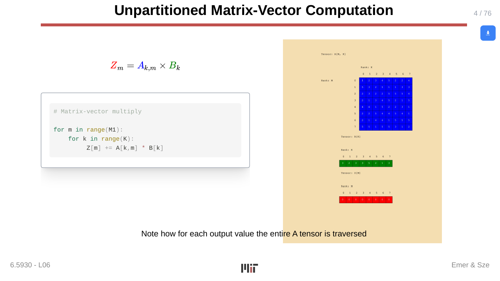

投影片展示了 `Zm = Ak,m × Bk` 未切分的迴圈巢狀：

```python
for m in range(M):
    for k in range(K):
        Z[m] += A[k, m] * B[k]
```

對每個 `m` 值，內層的 `k` 迴圈會遍歷 A 的所有 `K` 列。若 A 放不進本地緩衝區，則每次外層迴圈迭代都必須從 DRAM 重新取回整列資料。

投影片 3 明確指出切分的兩大目標：

1. **降低複用距離**，使張量值能在需要它的那些存取之間被保留在快速緩衝區中。
2. **識別可平行計算的獨立資料集**，分配給不同的 PE 同時運算。

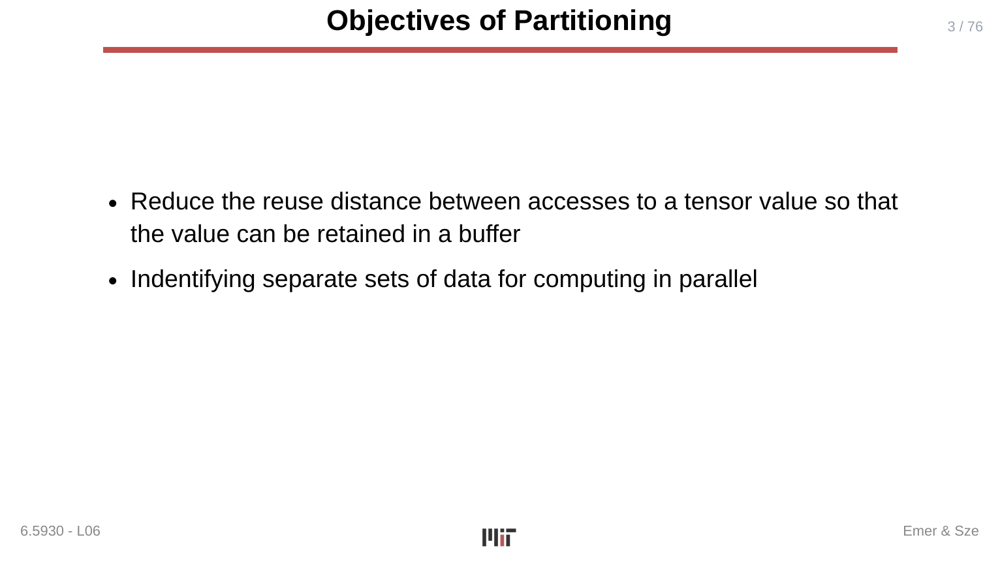

### 切分必然新增秩

切分的基本代數操作，是用一對索引取代單一索引。對於以 `i` 為索引的一維張量：

```
i  →  (i1, i0)   其中  i = i1 × I0 + i0
```

原來的範圍 `I` 被因式分解為 `I = I1 × I0`。張量 `A_i` 變成 `A_{i1,i0}`。這不是不同的張量——它持有相同的值，只是以不同方式定址。

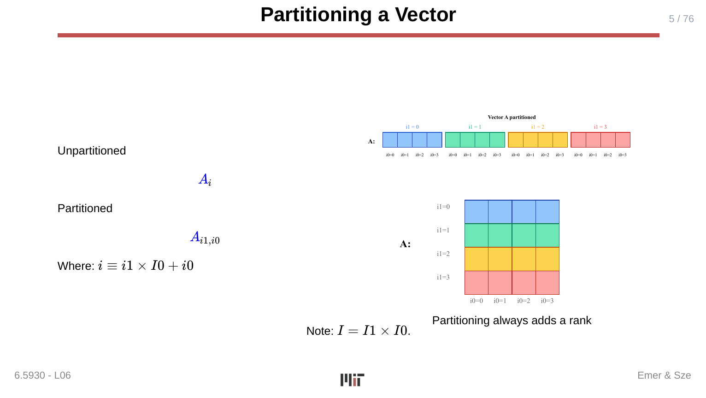

> **為什麼重要：** 切分所引入的每個秩都會在迴圈巢狀中產生一個新的迴圈。**外層迴圈**控制哪一個分塊（tile）是當前活躍的；**內層迴圈**在分塊內部迭代。正是這種結構性的新增，創造了本課用來推理資料搬移的時間性迴圈與空間性迴圈的層次結構。

### 切分矩陣——兩個維度，兩次秩分裂

當二維張量 `A_{k,m}` 在兩個維度上都被切分時，`k` 與 `m` 都各自被拆分：

```
k → (k1, k0)   其中  k = k1 × K0 + k0
m → (m1, m0)   其中  m = m1 × M0 + m0
```

張量變為 `A_{k1,k0,m1,m0}`。視覺上，矩陣被劃分成一個分塊網格，每個分塊的形狀為 `K0 × M0`。

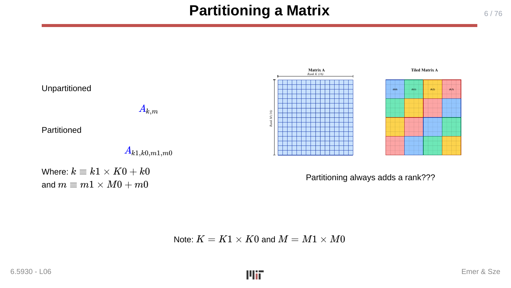

分塊邊界正是約束工作集的關鍵。當外層迴圈 `(m1, k1)` 固定時——也就是選定某一特定分塊時——計算只會觸及 A 的 `K0 × M0` 子區塊和 B 中對應的 `K0` 個元素。

### 切分後的迴圈巢狀

在矩陣-向量範例中同時切分 A 和 B 後，Einsum 變為：

```
Z_{m1,m0} = A_{k1,k0,m1,m0} × B_{k1,k0}
```

迴圈巢狀變為：

```python
for m1 in range(M1):
    for k1 in range(K1):
        for m0 in range(M0):
            for k0 in range(K0):
                Z[m1, m0] += A[k1, k0, m1, m0] * B[k1, k0]
```

在內層 `(m0, k0)` 迴圈執行期間，計算始終停留在 A 的 `M0 × K0` 分塊和 B 的 `K0` 個元素之中。若分塊能放入片上緩衝區，這些值就能以 SRAM 的成本（6×）而非 DRAM 的成本（200×）被複用。

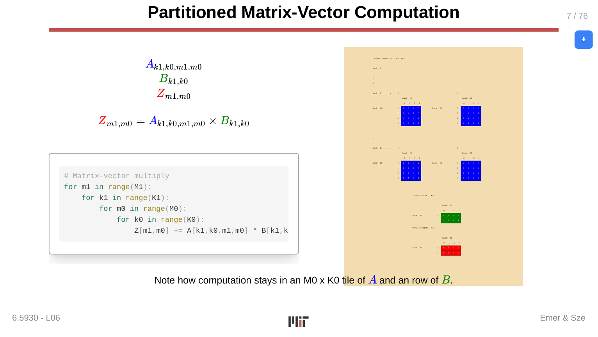

### 空間性切分：parallel_for

以上描述的都是**時間性切分（temporal partitioning）**：外層迴圈依序執行，內層迴圈在分塊內利用複用。切分的第二種用途是**空間性（spatial）**：把不同的分塊指派給不同的 PE，並行執行。

空間執行的記法是 `spatial-for`（亦寫作 `parallel_for`）：

```python
spatial-for i1 in range(I1):      # 在 I1 個不同的 PE 上並行執行
    for i0 in range(I0):
        Z[i1, i0] = A[i1, i0] * B[i1, i0]
```

在這個逐元素乘法的例子中，`i1` 將輸出切分為 `I1` 個彼此獨立的子問題，各自指派給一個 PE。不同的 `i1` 值之間沒有資料相依，因此可以真正地平行執行。

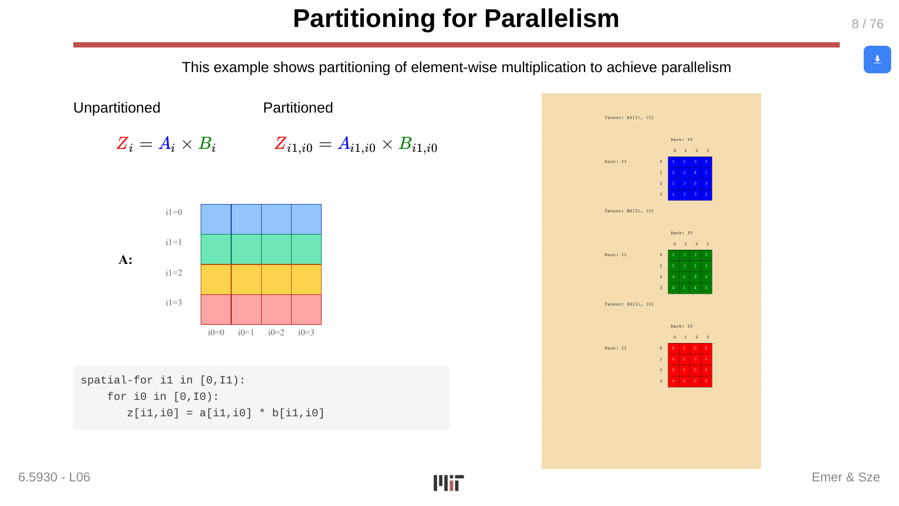

> **為什麼重要：** 產生時間性外層迴圈（用於複用）的同一個秩分裂，也可以改為空間性。`for` 與 `spatial-for` 之間的選擇，是決定加速器 PE 利用率與資料搬移模式的核心設計旋鈕。許多實際的映射同時混用兩者：部分秩是時間性的（外層迴圈餵入緩衝區），其他秒則是空間性的（平行 PE 指派）。

---

## 第二章 — 案例研究：分散式矩陣-矩陣乘法

> *投影片：L06-9 … L06-18*

### 動機與問題設置

第一個完整案例研究將切分應用於**多 PE（多 GPU）環境下的稠密矩陣-矩陣乘法**，採用的演算法來自 [Spector 等人，*ThunderKittens*，ICLR 2025]。基礎運算為：

```
Z_{m,n} = A_{k,m} × B_{k,n}
```

限制條件是：沒有任何單一 PE 能容納完整的 A、B 或 Z——張量必須分散到 `G` 個 PE，使每個 PE 只持有並操作屬於自己的那一部分。

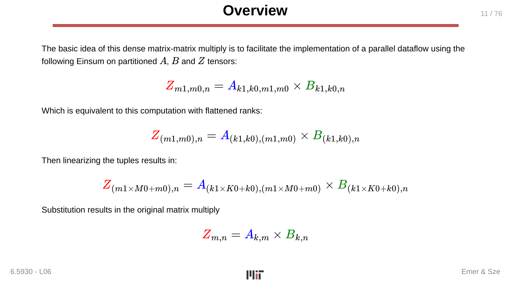

### 切分策略

同時切分 `k` 與 `m`：

```
k → (k1, k0)   K = K1 × K0，  G = K1
m → (m1, m0)   M = M1 × M0
```

設 `G = K1`，意味著 G 個 PE 各自負責 `k` 維度中一個不同的 `k1` 切片——即運算 `k` 維度的一個不同分區。切分後張量上的 Einsum 為：

```
Z_{m1,m0,n} = A_{k1,k0,m1,m0} × B_{k1,k0,n}
```

透過展開元組索引並代回，可驗證其在數學上等價於原始式：

```
Z_{(m1×M0+m0),n} = A_{(k1×K0+k0),(m1×M0+m0)} × B_{(k1×K0+k0),n}
→  Z_{m,n} = A_{k,m} × B_{k,n}   ✓
```

### 分散張量的形狀

每個 PE `g`（對應某個 `k1` 值）接收到：

- **分散 A**（`AD_{g,k0,m1,m0}`）：G 個矩陣，每個形狀為 `K0 × (M1×M0)`，行以展平的 `(m1,m0)` 對為索引，列以 `k0` 為索引。
- **分散 B**（`BD_{g,k0,n}`）：G 個矩陣，每個形狀為 `K0 × N`。
- **分散 Z**（`ZD_{g,m0,n}`）：G 個矩陣，每個形狀為 `M0 × N`，以 `m1` 為索引。

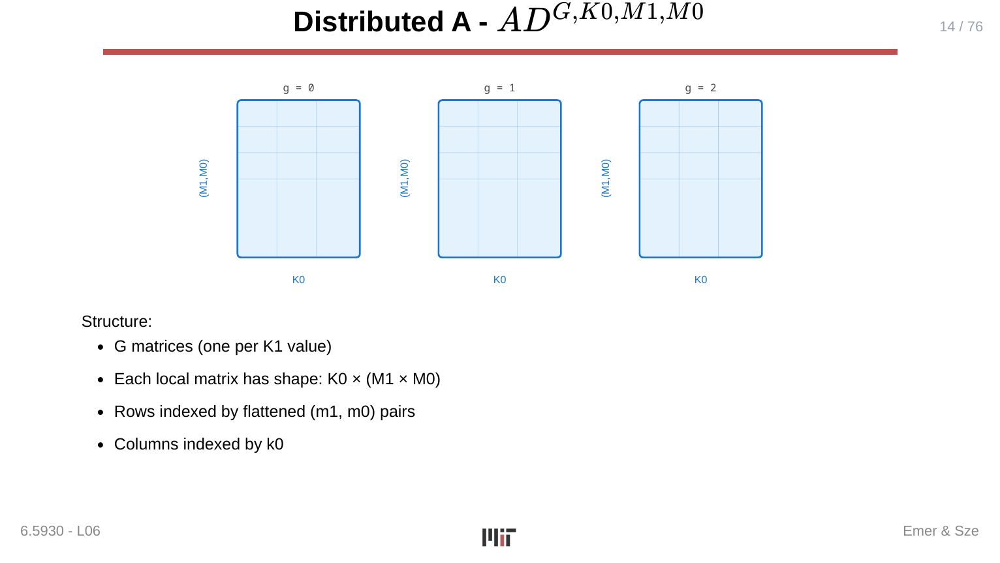

### 延遲規約（Delayed Reduction）

一個關鍵挑戰在於：每個 PE 用自己的 `k1` 切片計算出本地的 `Z_{m1,m0,n}` 之後，所有 PE 的部分結果都需要被**規約（reduce，即求和）**。若直接歸約，需要一個集中式收集步驟；ThunderKittens 的做法是採用**延遲規約**來重整計算：

1. **把 `k1` 移到 Einsum 的左側**，推遲對 `k1` 的求和：
   ```
   ZT_{k1,m1,m0,n} = A_{k1,k0,m1,m0} × B_{k1,k0,n}
   ```
   現在 `ZT` 具有顯式的 `k1` 維度——每個 PE 產生 `ZT` 的一個 `k1` 切片。

2. **在獨立的步驟中執行規約**：
   ```
   Z_{m1,m0,n} = sum over k1 of ZT_{k1,m1,m0,n}
   ```

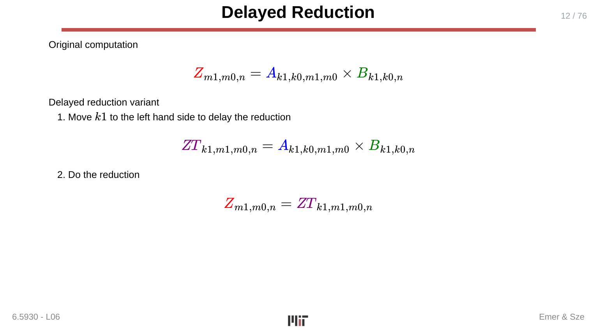

這樣做的回報是：規約可以與計算重疊，並以高效的全規約（all-reduce）模式在 PE 間執行，而非在每次本地乘法後強制設置同步屏障。

### 完整 Einsum 鏈

整個演算法由三個階段的 Einsum 構成：

**分散（Distribution）**（從全域儲存將切分後的張量載入每個 PE 的本地儲存）：

```
AD_{g,k0,m1,m0} = A_{g,m1,k0,m0}   （重排／置換）
BD_{g,k0,n}     = B_{g,k0,n}        （選取 k1=g 的切片）
```

**主要計算（Main computation）**（本地矩陣乘法＋部分累加）：

```
ZL_{g,m1,m0,n}  = AD_{g,k0,m1,m0} × BD_{g,k0,n}
ZD_{g,m0,n}     = ZL_{h,g,m0,n}     （對 h 規約——跨 PE 的規約）
```

**收尾（Finalization）**（從分散結果組裝最終 Z）：

```
ZM_{g,m0,n} = ZD_{g,m0,n}
```

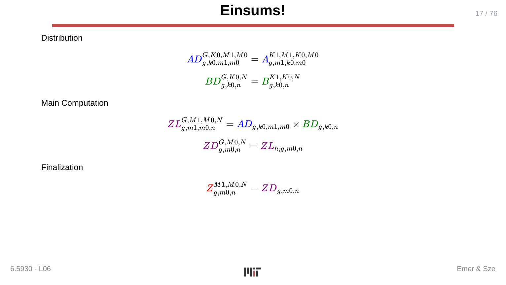

> **為什麼重要：** 這個案例研究表明，切分不僅僅是一個軟體迴圈排序技巧——它直接決定了資料如何在平行機器上分散、通訊（規約）如何組織，以及每個 PE 的工作集是什麼。用 Einsum 鏈來表達演算法，使每個階段的資料搬移與規約都變得顯式，從而能使用 Timeloop 等工具進行系統性分析。

---

## 第三章 — 案例研究：Transformer 注意力機制的切分

> *投影片：L06-19 … L06-22*

### 為什麼要切分注意力機制

Transformer 注意力（attention）涉及多個大型矩陣乘法的鏈式計算（Q/K/V 投影、QK^T、softmax、AV 縮并、輸出投影）。這些操作記憶體密集，天然適合在多個 PE 間切分執行。本講提出**三種不同的切分策略**，各自切分不同的秩：

### 策略一 — 張量平行（Tensor Parallel，切分批次維度 B）

批次索引 `b` 被拆分：`b → (b1, b0)`。

所有以 `b` 為自由索引（free index）的矩陣乘法都以拆分後的索引重複執行。由於 `b1` 的各分區彼此獨立（前向傳播中不同批次元素不共享資料），`b1` 可以用 `spatial-for` 執行——將每個 `b1` 切片指派給不同的 PE（或 PE 群組）。

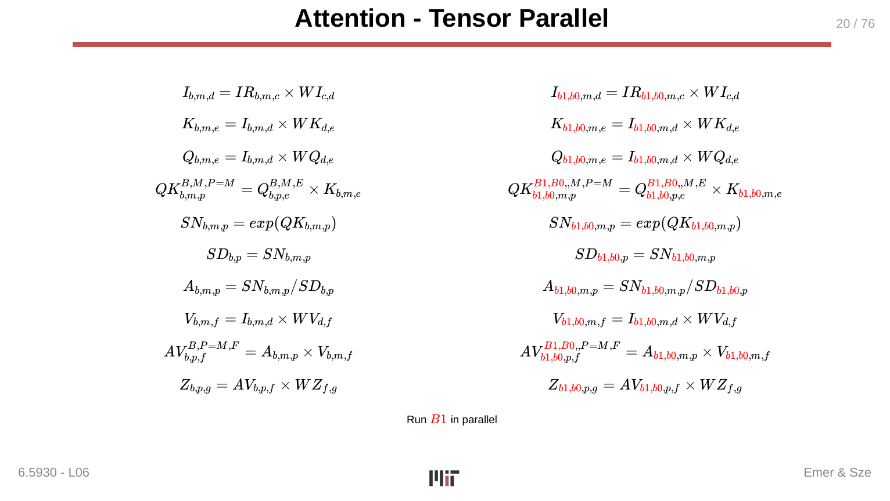

權重矩陣 `W_I, W_Q, W_K, W_V, W_Z` 在所有 `B1` 個 PE 間**複製（replicated）**（因為它們與 `b` 無關）。每個 PE 持有完整的權重副本，但只持有 `B0` 大小的激活值切片。當批次大小相對於權重大小較大時，張量平行的優勢最為顯著。

### 策略二 — 頭平行（Head Parallel，切分頭維度 H）

頭索引 `h` 被拆分：`h → (h1, h0)`。

不同的注意力頭之間彼此獨立；每個頭都有自己的 Q、K、V 與輸出投影。切分 `h` 並用 `spatial-for` 執行 `h1`，就能把不同頭的群組指派到不同的 PE。每個 PE 持有完整的輸入 `I_{b,m,d}`，但只持有屬於自己的那部分頭的權重與激活值。

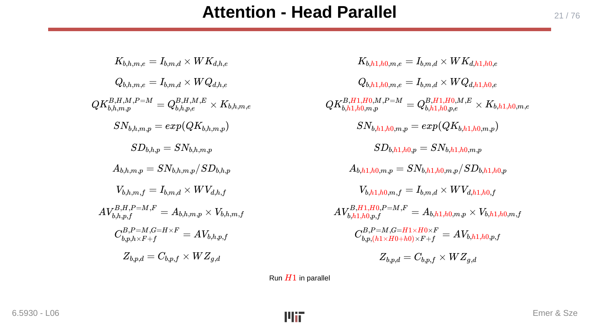

頭平行是目前多 GPU 系統中最常見的注意力切分方式（例如 Megatron-LM 中的張量平行性正是採用這種策略）。輸出串接 `C_{b,p,(h1×H0+h0)×F+f}` 將各頭的輸出重新組合。

### 策略三 — 資料平行（Data Parallel，同時切分 H 與 D）

最激進的策略同時切分頭維度 `h → (h1, h0)` *和*模型維度 `d → (d1, d0)`。對 `h1` 和 `d1` 進行空間性執行，可達到更高的平行度，代價是需要通訊來合并部分 `d` 的求和（因為 `d` 在 Q/K/V 投影中是縮并索引）。

三種策略都展示了同一個模式：**選擇一個可將計算切分為獨立（或近乎獨立）子問題的秩，拆分該秩，並將外層迴圈標記為空間性**。

> **為什麼重要：** 現代大規模推論與訓練系統正是建立在這些切分選擇之上。了解哪個秩被切分——以及它是否引入規約相依性（如矩陣乘法中的 `k`）還是自由秩（如 `b` 或 `h`）——決定了平行執行是否需要全規約（all-reduce），或者是令人省心的「令人尷尬地可平行（embarrassingly parallel）」。架構師必須在設計階段就對此做出推理。

---

## 第四章 — 迴圈巢狀框架中的切分

> *投影片：L06-2 … L06-8（在兩個案例研究的背景下回顧）*

### 代數規則總結

每一個切分決策都遵循同一個模板：

| 切分前 | 切分後 |
|---|---|
| 索引 `i`，範圍 `I` | 索引 `(i1, i0)`，範圍 `(I1, I0)`，其中 `I = I1 × I0` |
| Einsum 中的一個秩 `i` | Einsum 中的兩個秩 `(i1, i0)` |
| 一個迴圈 | 兩個迴圈：外層迭代 `i1`，內層迭代 `i0` |

多個獨立維度可以同時被切分；結果是所有切分的乘積被體現在 Einsum 中。

### 時間性迴圈 vs. 空間性迴圈

秩一旦被拆分，外層迴圈 `i1` 可以是：

- **時間性（temporal）**（`for i1 in range(I1)`）：迭代在*同一個* PE 上依序執行。好處是內層分塊（`i0`）能放入本地緩衝區，緩衝區內容在內層迴圈迭代中被**複用**，然後再被驅逐。
- **空間性（spatial）**（`spatial-for i1 in range(I1)`）：迭代被指派給*不同的* PE 並行執行。每個 PE 持有自己的 `i0` 大小的工作集，並獨立執行內層迴圈。

單一 Einsum 可能有多個被切分的秩，部分是時間性的，部分是空間性的。完整的映射是所有這些選擇在所有秩上的組合。

### 與 L05（映射——資料流）的連結

L05 引入了 DNN 運算的迴圈巢狀表示，並將**資料流（dataflow）**描述為迴圈執行的*順序*以及資料在記憶體階層中的*放置方式*。L06 透過加入**切分（partitioning）**完成了映射的圖景：哪些維度邊界被分塊、分塊的形狀是什麼、哪些迴圈是空間性的。迴圈順序＋分塊大小＋空間性／時間性標記，合起來構成了 Timeloop 等工具所評估的完整映射規格。

> **為什麼重要：** 切分是將抽象演算法帶入與硬體有限資源（有限的 PE 數、有限的緩衝區容量、有限的頻寬）相對應的機制。正確地設定分塊大小，是使硬體達到算術強度（arithmetic intensity）閾值——在該閾值以上硬體受計算限制而非記憶體頻寬限制——的首要槓桿。

---

## 關鍵詞彙（Key Terms）

| 詞彙 | 說明 |
|---|---|
| **切分（Partitioning）** | 將張量索引範圍拆分為分塊；每次切分都為 Einsum 新增一個秩。 |
| **分塊（Tiling）** | 時間性切分的同義詞；將迭代空間劃分為固定大小的區塊以改善資料局部性。 |
| **秩（Rank）** | Einsum 記法中張量的一個維度（下標）；切分會增加秩。 |
| **分塊／分區（Tile / Partition）** | 能放入記憶體階層某一層或被指派給一個 PE 的張量子區塊。 |
| **複用距離（Reuse distance）** | 同一資料值兩次被存取之間的間隔存取次數；分塊可降低複用距離。 |
| **時間性切分（Temporal partitioning）** | 對外層（分塊）索引使用 `for` 迴圈；在同一個 PE 上依序執行，以在內層分塊內實現資料複用。 |
| **空間性切分（Spatial partitioning）** | 對外層（分塊）索引使用 `spatial-for` / `parallel_for`；不同分塊指派給不同 PE 並行執行。 |
| **工作集（Working set）** | 內層迴圈中被主動使用的資料集合；分塊將工作集縮小以放入快速本地緩衝區。 |
| **延遲規約（Delayed reduction）** | 將對切分索引的求和（規約）推遲為一個獨立的、後續的 Einsum 步驟，從而使規約能與計算重疊。 |
| **分散式矩陣乘法（Distributed matrix multiply）** | 基於切分的平行演算法（此處為 ThunderKittens），G 個 PE 各持有 `k` 維度的 `1/G`，然後規約部分結果。 |
| **張量平行（Tensor Parallel）** | 切分批次維度 B 的注意力切分策略；權重在所有 PE 間複製。 |
| **頭平行（Head Parallel）** | 切分注意力頭維度 H 的注意力切分策略；不同的頭在不同的 PE 上執行。 |
| **資料平行（Data Parallel）** | 同時切分 H 和 D 的注意力切分策略；實現更高的 PE 數，但需要對 D 維度做規約。 |
| **spatial-for / parallel_for** | 迴圈標記，表示該迴圈的各次迭代在不同的 PE 上同時執行（空間性，而非時間性）。 |
| **Einsum** | 本課程貫穿始終使用的張量縮并記法；切分透過新增下標的方式在現有 Einsum 中表達。 |
| **ThunderKittens** | 高效能 GPU 矩陣乘法核心 [Spector 等人，ICLR 2025]，作為分散式切分矩陣乘法的案例研究。 |

---

## 重點回顧（Takeaways）

- **切分必然新增秩。** 將索引 `i` 拆分為 `(i1, i0)` 在 Einsum 中引入了新的下標層次，在迴圈巢狀中引入了新的迴圈。每一個切分決策都具有這種形式。
- **時間性切分控制複用距離。** 透過分塊，內層迴圈能將工作集保留在快速片上緩衝區（SRAM ≈ 6×）中，而非反覆從 DRAM（≈ 200×）取回資料。
- **空間性切分實現平行性。** 將外層迴圈標記為 `spatial-for`，使每個分塊被指派給不同的 PE。自由秩的切分（如批次 `b` 或頭 `h`）可令人尷尬地平行（embarrassingly parallel）；縮并秩的切分（如 `k`）則需要規約步驟。
- **兩大目標正交卻常常組合。** 實際的加速器映射通常在同一迴圈巢狀中同時包含空間性迴圈（用於 PE 平行性）和時間性迴圈（用於緩衝區複用）。
- **延遲規約將計算與同步解耦。** 透過將 `k1` 求和改為獨立的 Einsum 步驟，ThunderKittens 演算法使每個 PE 能計算完整的本地分塊而無需等待，然後再非同步地規約。
- **注意力機制有多種切分策略。** 張量平行（切分 B）、頭平行（切分 H）、資料平行（切分 H+D）代表了在複製成本與通訊成本之間的不同權衡。頭平行是目前部署的多 GPU 推論中最常見的方式。

---

## 與後續講次的連結（Connections）

- **與 L05 共同完成映射層。** L05 涵蓋了迴圈排序與資料流（哪些迴圈在最內層、資料如何放置）。L06 加入了切分（分塊大小與空間性指派）。兩者合起來完整地規格化了 TeAAL 關注點金字塔的映射節點。
- **稀疏架構（L07–L10）** 將同樣的切分思路擴展到*非均勻*的分塊大小——跳過零元素的分塊——但秩分裂的代數運算完全相同。
- **記憶體階層與頻寬**（在 L04 中討論，並貫穿各講）：正確地調整切分大小以適應緩衝區階層的每一層（RF → 本地 SRAM → 全域緩衝區 → DRAM）是分塊重要性的根本原因；這在 L01 的能耗表中已建立。
- **分散式推論系統**：本講介紹的張量平行、頭平行、資料平行策略，正是實際分散式推論框架（Megatron-LM、DeepSpeed、TensorRT-LLM）中所使用的策略，使本講直接適用於系統層級的 DNN 部署。

---

## 附錄 — 投影片對照表（Slide-to-Section Map）

| 投影片 | 章節 |
|---|---|
| L06-1 | 標題 |
| L06-2 | 第一章 — 切分小節標頭 |
| L06-3 | 第一章 — 切分的目標 |
| L06-4 … L06-5 | 第一章 — 未切分矩陣-向量乘法；切分一維向量 |
| L06-6 … L06-7 | 第一章 — 切分矩陣；切分後的矩陣-向量計算 |
| L06-8 | 第一章 — 為平行性而切分（spatial-for） |
| L06-9 | 第二章 — 分散式矩陣乘法小節標頭 |
| L06-10 … L06-11 | 第二章 — 目標與概觀 |
| L06-12 | 第二章 — 延遲規約 |
| L06-13 … L06-16 | 第二章 — 分散張量的形狀（AD、BD、ZD） |
| L06-17 … L06-18 | 第二章 — 完整 Einsum 鏈；方法總結 |
| L06-19 | 第三章 — 切分注意力機制小節標頭 |
| L06-20 | 第三章 — 注意力：張量平行 |
| L06-21 | 第三章 — 注意力：頭平行 |
| L06-22 | 第三章 — 注意力：資料平行 |
| L06-23 … L06-76 | 動畫影格（迴圈巢狀視覺化與執行追蹤） |
