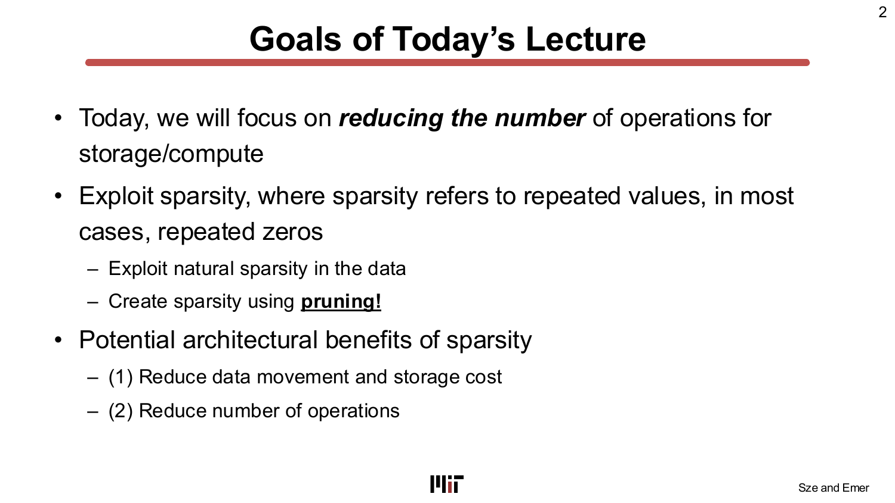
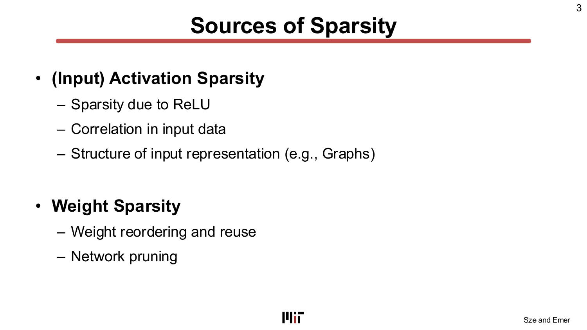
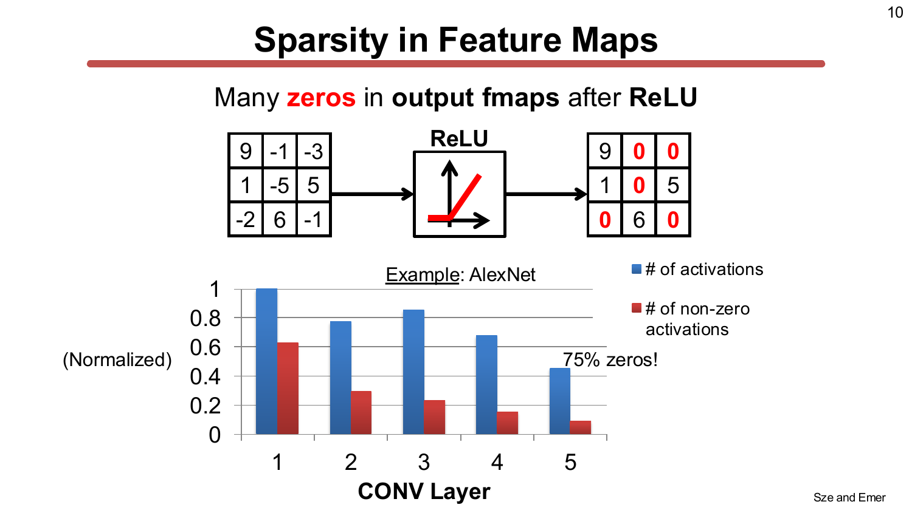
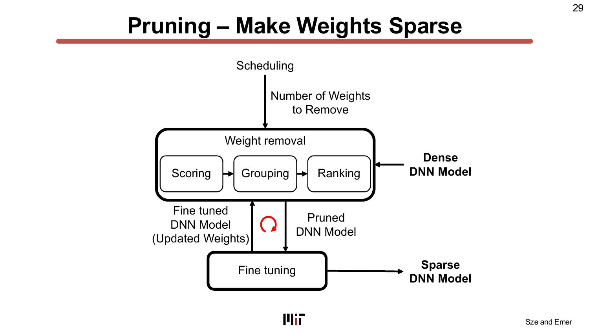
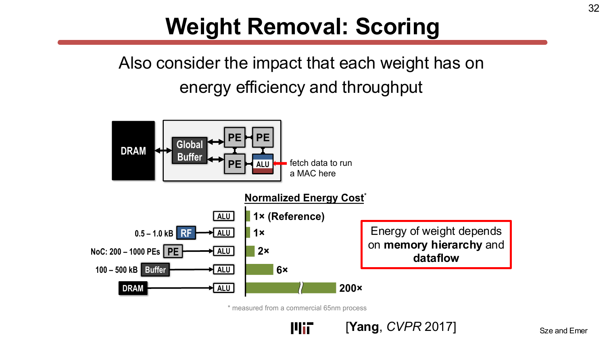
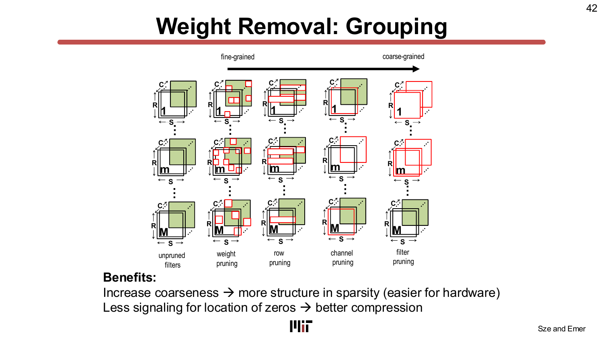
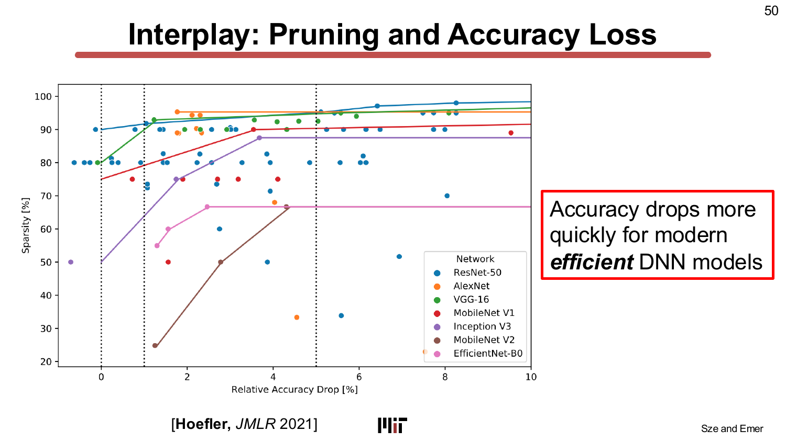
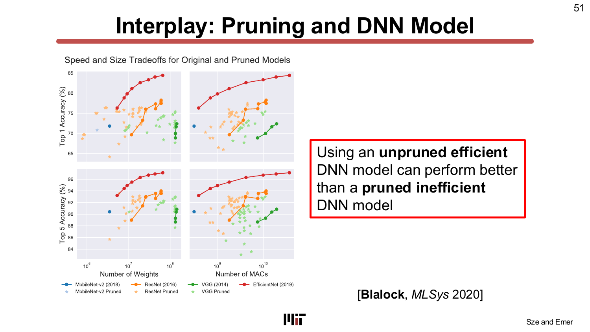
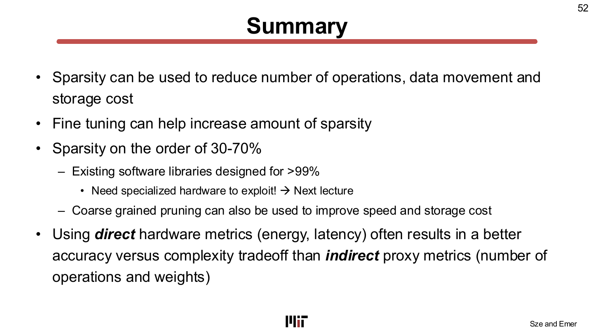

# L07 — DNN 模型與硬體協同設計：稀疏性（Co-Design of DNN Models and Hardware: Sparsity）

> **課程：** 6.5930/1 — 深度學習硬體架構（Hardware Architectures for Deep Learning）
> **講師：** Joel Emer 與 Vivienne Sze（MIT EECS）
> **講授日期：** 2026 年 2 月 25 日 · **投影片：** 53 頁 · **來源：** [`Lecture/L07 - Sparsity.pdf`](../../Lecture/L07%20-%20Sparsity.pdf)
>
> *本文是以「概念」為單位重建講課脈絡的導讀（walkthrough），依主題而非逐頁編排。每一節都標註其對應的投影片範圍，方便你對照原始投影片閱讀。*

---

## 一句話總結（TL;DR）

深度神經網路（Deep Neural Network, DNN）裡充滿了**零**——而如果硬體知道如何跳過它們，零就是免費的。本講橫跨 TeAAL 關注點金字塔（Pyramid of Concerns）中 **Format（格式）** 層（資料如何表示）與 **Compute（運算）** 層（計算什麼）的邊界，說明這些零從何而來，以及如何製造更多。**激活稀疏性（activation sparsity）** 自然地由 ReLU 與圖（graph）等結構化輸入資料產生；**權重稀疏性（weight sparsity）** 則可透過**剪枝（pruning）**——一個評分、分組、排名、微調的迭代循環——刻意引入。兩大硬體收益是：**(1) 降低資料搬移與儲存成本**（零不必被取出或傳輸）以及 **(2) 減少運算量**（任何數乘以零等於零）。難點在於：在硬體中充分利用稀疏性並非易事，需要特化支援——而這正是 L08–L10 的主題。

---

## 學習目標（Learning Objectives）

讀完本講後，你應該能夠：

- 區分**激活稀疏性**（自然產生）與**權重稀疏性**（透過剪枝刻意製造）。
- 說明稀疏性帶來的兩項**硬體層級收益**：降低資料搬移／儲存成本，以及減少運算量。
- 定義**有效運算（effectual operation）** 與**無效運算（ineffectual operation）**，並理解後者在硬體上引發的成本取捨。
- 追溯**剪枝管線（pruning pipeline）** 的四個步驟（評分 scoring → 分組 grouping → 排名 ranking → 微調 fine-tuning → 排程 scheduling）。
- 比較**基於量級（magnitude-based）** 與**能量感知（energy-aware）** 的剪枝準則，並說明為何 MAC 數等間接指標可能產生誤導。
- 區分**細粒度（非結構化，unstructured）** 與**粗粒度（結構化，structured）** 的權重稀疏性，並說明各自的硬體含義。
- 說明為何 **30–70%** 量級的稀疏性對 DNN 硬體已然重要，儘管現有軟體庫針對的是 >99% 的情境。

---

## 第一章 — 稀疏性帶來什麼（以及它的代價）

> *投影片：L07-2 … L07-8*

### 兩個目標

本講開門見山地聲明範圍：今日聚焦於透過利用稀疏性（sparsity）——廣義上指重複出現的值，在大多數 DNN 場景中特指**重複出現的零**——來**減少儲存與運算所需的操作次數**。

張量中出現一個零，可帶來兩種截然不同的硬體收益：

1. **降低資料搬移與儲存成本** —— 由於 `任何數 × 0 = 0` 以及 `任何數 + 0 = 任何數`，零值根本不需要從記憶體中取出，也不需要跨晶片上網路（Network-on-Chip, NoC）傳輸。省去讀取與通訊直接轉化為能耗節省——正如 L01 所建立的，DRAM 存取耗能約為算術運算的 200 倍。
2. **減少運算次數** —— 當一個運算元為零時，乘加運算（MAC）可以完全繞過，同時省下運算時間與 ALU 本身的能耗。

### 有效運算 vs. 無效運算

本講引入了一套精確的核算框架：

> **演算法總操作數** = 有效運算（effectual）+ 無效運算（ineffectual）

**有效運算**是指會改變輸出結果的運算；**無效運算**（涉及零的運算）則不改變結果。充分利用稀疏性的硬體只需執行有效的部分。然而現實中：

> **實際執行的操作數** = 有效運算 + *未被利用的*無效運算

完全避免*所有*無效運算非常困難——硬體需要在執行時知道哪些輸入是零，繞過它們並維持有效吞吐量。這造成一個核心矛盾：更精密的稀疏性利用機制**能跳過更多運算，但每次運算的成本（面積、功耗、控制開銷）也隨之上升**。投影片 L07-7 與 L07-8 以圖形呈現這個取捨：吞吐量與能量效率同時取決於硬體複雜度與工作負載中實際的稀疏程度。正確的設計點因部署情境而異。

> **為什麼重要：** 稀疏性並非免費——它創造了一個機會，而硬體必須被設計來捕捉它。理解有效／無效運算的區別，是設計或評估稀疏加速器的第一步。

---

## 第二章 — 激活稀疏性：自然零值從哪裡來

> *投影片：L07-9 … L07-23*

### 稀疏性的來源

本講識別出兩大類零值的起源：

**激活稀疏性**（特徵圖／中間張量中的零）：
- **ReLU 非線性函數** —— 最主要的來源：任何負的預激活值都被夾至零。
- **輸入的空間與時間相關性** —— 特徵圖中鄰近像素高度相關；影片中相鄰幀高度相似。
- **輸入表示的結構稀疏性** —— 例如圖（graph）的鄰接矩陣（adjacency matrix）通常非常稀疏。

**權重稀疏性**（學到的參數中的零）：
- **冗餘權重** —— 許多權重近乎相同，可在執行前合併（而不影響模型）。
- **網路剪枝** —— 刻意移除對準確率影響很小的權重。

### ReLU 與 AlexNet 的激活稀疏性

標誌性的結果：在 **AlexNet** 上，所有五個卷積層在 ReLU 之後的輸出特徵圖中含有**約 75% 的零**。投影片第 10 頁的長條圖顯示，五個 CONV 層中非零激活值的比例從未超過約 25%。這意味著在樸素的稠密（dense）實作中，每四個激活值中有三個是零——它們所對應的所有乘法運算都是無效的。

### 硬體對激活稀疏性的因應

本講調查了幾種利用激活零值的架構技術：

- **壓縮（Compression）** —— 只儲存非零值及其索引或長度編碼，縮小儲存佔用與記憶體頻寬需求——意味著在記憶體階層的每一層可以保存更多有用資料。
- **跳過零激活（Cnvlutin, ISCA 2016）** —— 建立在 DaDianNao 之上，避免取出並乘以零激活值，以 4.49% 的面積開銷實現 1.37 倍加速（加上激活值剪枝可達 1.52 倍）。
- **激活值剪枝（Minerva, ISCA 2016）** —— 更進一步移除小但非零的激活值；在 ImageNet 上加速 11%，在 MNIST 上降低 2 倍功耗。
- **SnaPEA（ISCA 2018）** —— 在完成卷積*之前*預測 ReLU 的輸出是否為零。若部分和已超過閾值表明結果為負，則跳過剩餘計算。需要額外硬體來決定何時安全終止。
- **PredictiveNet / Song（ISCA 2018）** —— 簡化預測：只對每個權重的高位元進行計算；若高位元結果已為負，則跳過低位元計算。

### 空間與時間相關性

除了 ReLU，稀疏性還可從輸入的結構中提取：

- **空間相關性（Diffy, MICRO 2018）** —— 特徵圖中相鄰激活值差異很小。對相鄰值之間的**差量（delta）**進行處理，而非完整值，可在差量表示中引入稀疏性。
- **時間相關性** —— 連續影片幀大幅重疊。EVA2、Euphrates、FAST（均為 2018 年）等架構利用幀間冗餘跳過重複計算，代價是需要額外儲存和動態向量計算。此方法限於影片應用，並假設每幀執行相同操作。

### 圖神經網路（GNN）：結構稀疏性

圖神經網路（Graph Neural Network, GNN）在圖（分子、社群網路、生物網路、金融網路）上運算。圖的拓樸以**鄰接矩陣（adjacency matrix）**編碼，通常極度稀疏——大多數節點彼此並不相連。GNN 每層的運算為：

> X_(l+1) = σ(Â · X_(l) · W_(l))

其中 Â 為正規化鄰接矩陣（稀疏），X 為節點特徵矩陣（稠密），W 為權重矩陣（稠密）。兩個矩陣乘法的執行順序——`Â × (X × W)` 或 `(Â × X) × W`——對中間結果的有效密度有根本影響，進而決定稀疏性被利用的程度。

> **為什麼重要：** CNN 中的激活稀疏性是結構性的——ReLU 保證了它的存在。在 AlexNet 等標準網路中，約 75% 的激活值為零。任何針對 CNN 推論的加速器都可以將這一事實納入設計規劃。GNN 與影片模型引入了額外的結構稀疏性，但硬體挑戰各有不同。

---

## 第三章 — 權重稀疏性：對 DNN 模型進行剪枝

> *投影片：L07-24 … L07-51*

### 冗餘權重與高斯技巧

在討論剪枝之前，本講指出有時可以在不損失準確率的情況下利用權重冗餘。若卷積核中有兩個相等的權重（例如 [A B A]），可以先對對應輸入求和，再乘以該權重，從而將 3 次乘法減少為 2 次。這是 **UCNN（ISCA 2018）** 的核心思想——對權重進行預處理以找出並利用此類冗餘。這個洞見是高斯乘法演算法（以加法換乘法）在 DNN 卷積上的推廣。

### 剪枝管線

現代網路剪枝是一個四階段的迭代循環：

**1. 評分（Scoring）** —— 為每個權重（或一組權重）賦予一個反映其對準確率或效率重要性的分數：
- **基於量級的剪枝（Magnitude-based pruning）**（最常見）：分數即 |w|。大量級權重視為重要；小量級者為移除候選。典型結果：不重新訓練可達 50% 稀疏性，重新訓練後可達 80%【Han, NeurIPS 2015】。
- **基於特徵的剪枝（Feature-based pruning）**：根據對輸出特徵圖的影響評分，而非權重量級【Yang, CVPR 2017】。

**2. 分組（Grouping）** —— 決定移除的*粒度*：個別權重、整行（row）、整個通道（channel）或整個濾波器（filter）。這就是結構化／非結構化這個維度。

**3. 排名（Ranking）** —— 按分數對權重（或組）排序，選出低於閾值者進行移除。

**4. 微調與排程（Fine-tuning & Scheduling）** —— 每次剪枝後，重新訓練存活的權重以恢復準確率。排程決定每次迭代的剪枝力度。一項重要改進：**拼接（splicing, Guo, NeurIPS 2016）** 允許已被剪掉的權重在梯度顯示其重要時被**恢復**，與不可逆剪枝相比，可將保持準確率所需的非零權重數量減少約一半。

經典演算法是**最優腦損傷（Optimal Brain Damage, LeCun, NeurIPS 1989）**：訓練 → 計算每個權重的二階導數 → 計算顯著性（saliency） → 刪除低顯著性權重 → 微調 → 重複。

### 能量感知評分

關鍵洞見：**權重數量本身不是能量的好代理指標（proxy）**。一個權重的能量成本取決於*它在記憶體階層中的位置*以及*所使用的資料流（dataflow）*。在 65 nm 製程上，階層如下（L01 已建立）：

| 資料來源 | 相對能耗 |
|---|---|
| 暫存器檔（RF） | 1×（基準） |
| 鄰近 PE（NoC） | 2× |
| 全域緩衝區（Global Buffer） | 6× |
| DRAM | 200× |

DRAM 中的權重存取成本是暫存器檔中的 200 倍。**能量感知剪枝（Energy-Aware Pruning, EAP, Yang, CVPR 2017）** 將此直接納入評分指標：優先剪枝消耗最多能量的層。

成效顯著：EAP 將 AlexNet 的能耗降低 **3.7 倍**，而基於量級的剪枝僅降低 2.1 倍，EAP **額外改善了 1.7 倍**。投影片 L07-34 的 GoogLeNet 能耗分解揭示了 MAC 數為何具有誤導性：輸出特徵圖（43%）、輸入特徵圖（25%）、權重（22%）合計遠超運算（10%）的總能耗佔比。

### 平台感知適應：NetAdapt

即使是能量，有時也不是正確的指標。**NetAdapt【Yang, ECCV 2018】** 揭示了更深層的觀點：相關指標是**在實際目標平台上經實測的裝置端延遲或能量**，而非分析估算。原因在於編譯器、執行時期（runtime）與硬體架構的交互作用，使 MAC 數成為真實延遲的糟糕預測指標。

NetAdapt 的演算法：
1. 從預訓練網路出發。
2. 每次迭代提出多個精簡網路（透過縮減各層的通道數或濾波器數）。
3. 在目標平台上實測每個提案的延遲／能量。
4. 在滿足資源預算的提案中，選擇準確率最高者。
5. 微調所選網路，重複直到達到目標預算。

結果：NetAdapt 在 Google Pixel 1 CPU 上將 MobileNet 的真實推論速度提升最高 **1.7 倍**，準確率相當。關鍵在於：以 MAC 數（而非延遲）引導的 NetAdapt 版本在 MAC vs. 準確率上表現更好，但這並**不**代表更低的延遲。結論：**使用直接指標（direct metrics）**。

### 結構化 vs. 非結構化權重稀疏性

剪枝粒度的選擇——管線的**分組**維度——對硬體有深遠影響：

從細到粗的連續譜：

| 粒度 | 移除什麼 | 硬體收益 | 準確率代價 |
|---|---|---|---|
| **權重（非結構化）** | 個別純量權重 | 最大壓縮比 | 最小 |
| **行剪枝（Row pruning）** | 權重矩陣的整行 | 部分向量化 | 中等 |
| **通道剪枝（Channel pruning）** | 整個輸入通道 | 消除整批 MAC | 較高 |
| **濾波器剪枝（Filter pruning）** | 整個輸出濾波器 | 剩餘稠密子矩陣 | 最高 |

**非結構化稀疏性（unstructured sparsity）** 壓縮比最高、準確率損失最小，但產生的不規則零值模式難以在稠密硬體上利用。**結構化（粗粒度）稀疏性（structured/coarse-grained sparsity）** 產生可自然映射到 SIMD 單元、脈動陣列（systolic array）或其他並行資料路徑硬體的規則零值，代價是在給定稀疏度下準確率更高的損失。

**Scalpel【Yu, ISCA 2017】** 透過使剪枝符合底層硬體的資料並行組織（data-parallel organization）來彌合這一差距。對於 2-way SIMD 單元，它確保零值成對出現，相比完全非結構化剪枝實現 1.92 倍加速。

**基於模式的剪枝（Pattern-based pruning）【PCONV, AAAI 2020；PatDNN, ASPLOS 2020】** 取中間路線：在每個濾波器內按一組小型結構化零值模式進行剪枝，比非結構化剪枝更具硬體規律性，比通道／濾波器剪枝的準確率損失更小。

**混合專家（Mixture of Experts, MoE）** 模型也可理解為一種粗粒度稀疏性：推論時，對任何給定輸入只啟動一小部分「專家」子網路，其餘保持閒置。

### 剪枝與準確率：與模型效率的交互

兩個重要的微妙之處為本章收尾：

1. **高效模型更難剪枝。** 現代緊湊型模型（MobileNets、EfficientNets）在設計上已移除大部分冗餘。對它們進行剪枝比對 AlexNet 等過度參數化的舊模型剪枝，準確率下降更快。起始模型越優化，「免費壓縮」的空間越小。

2. **從更好的模型出發比剪枝差模型更重要。** 在相同的計算預算下，未剪枝的高效 DNN 模型可以勝過剪枝後的低效模型【Blalock, MLSys 2020】。言下之意：**架構搜索（architecture search）與剪枝是互補的策略，而非可互換的替代品**。

> **為什麼重要：** 剪枝是創造權重稀疏性的主要槓桿，但其設計空間廣闊——評分、分組、排程、微調與起始模型的選擇都相互影響。能量感知與平台感知方法（EAP、NetAdapt）系統性地優於單純基於量級的方法，因為它們從一開始就針對正確的目標優化。

---

## 第四章 — 硬體的缺口與前行之路

> *投影片：L07-52 … L07-53*

### 本講的結論

總結投影片凝結了 L07 的核心訊息：

- 稀疏性可同時降低**運算次數、資料搬移量與儲存成本**。
- **微調（fine-tuning）** 至關重要：它讓模型在移除權重後恢復準確率，並在不崩潰的情況下達到更高稀疏度。
- 實際 DNN 的稀疏性在 **30–70%** 量級——雖然有意義，但遠低於現有稠密軟體庫（cuSPARSE、MKL-sparse）開始顯現收益的 >99% 閾值。現成軟體在這裡幫不上忙。
- **粗粒度剪枝** 也可在不需要自訂稀疏硬體的情況下改善速度與儲存成本。
- 直接以硬體指標（能量、延遲）為目標，比間接代理指標（運算次數、權重數量）產生更好的準確率 vs. 複雜度取捨。

### 缺失的一塊：特化硬體

L07 的最後訊息是一個前向指引：**利用 30–70% 的稀疏性需要特化硬體**。即使軟體知道零值的存在，稠密加速器也會在零乘法上浪費時鐘週期與能量。有效跳過這些零需要：

- 在 PE 層級（或資料取出之前）偵測零運算元。
- 允許非零值在無需零鄰居開銷的情況下儲存與讀取的壓縮格式。
- 當某一輸入資料流比另一個更稠密時，防止 PE 閒置的負載平衡機制。

這些正是 L08–L10 的主題。

> **為什麼重要：** 沒有硬體支援，稀疏性只是理論上的收益。有了正確的硬體（接下來三講的主題），30–70% 的權重或激活稀疏性可直接轉化為近乎等比例的能耗與執行時間減少。

---

## 關鍵詞彙（Key Terms）

| 詞彙 | 說明 |
|---|---|
| **稀疏性（Sparsity）** | 張量中為零（或低於某閾值）的值所占的比例。稀疏性越高，零越多。 |
| **密度（Density）** | 稀疏性的互補量：*非零*值所占的比例。75% 稀疏的張量密度為 25%。 |
| **激活稀疏性（Activation sparsity）** | 中間特徵圖中的零，主要由 ReLU 產生。 |
| **權重稀疏性（Weight sparsity）** | 學習到的模型參數中的零，主要由剪枝製造。 |
| **有效運算（Effectual operation）** | 改變輸出的乘加運算（兩個運算元均非零）。 |
| **無效運算（Ineffectual operation）** | 至少一個運算元為零的乘加運算；結果恆為 0 或不變。 |
| **剪枝（Pruning）** | 將模型權重設為零（或移除）以減少運算與儲存的過程。 |
| **基於量級的剪枝（Magnitude-based pruning）** | 移除絕對值最小的權重；最常見的評分方法。 |
| **能量感知剪枝（Energy-Aware Pruning, EAP）** | 將權重存取的能量成本（由其在記憶體階層中的位置決定）納入剪枝評分。 |
| **顯著性（Saliency）** | 衡量移除一個權重對訓練誤差影響程度的指標（源自最優腦損傷）。 |
| **微調（Fine-tuning）** | 剪枝後對存活權重進行重新訓練以恢復準確率。 |
| **拼接（Splicing）** | 在微調過程中允許已被剪掉的權重在重新變得重要時被恢復。 |
| **排程（Scheduling）** | 決定剪枝循環每次迭代中移除多少權重。 |
| **非結構化稀疏性（Unstructured sparsity）** | 零值散布在任意位置（個別權重）。彈性最高，硬體最難利用。 |
| **結構化稀疏性（Structured sparsity）** | 零值出現在規則模式中（整行、整個通道或整個濾波器）。硬體更容易利用，準確率代價更高。 |
| **基於模式的剪枝（Pattern-based pruning）** | 折中方案：在濾波器內按一組小型結構化零值模式剪枝。 |
| **NetAdapt** | 以實測延遲／能量引導剪枝的平台感知 DNN 適應演算法。 |
| **Cnvlutin** | 跳過零激活值乘法的硬體架構（ISCA 2016）。 |
| **SnaPEA** | 提前終止部分和計算（當 ReLU 輸出可預測為零時）的預測器（ISCA 2018）。 |
| **混合專家（Mixture of Experts, MoE）** | 推論時對每個輸入只啟動部分「專家」子網路的模型架構；是一種動態粗粒度稀疏性。 |
| **圖神經網路（GNN）** | 在稀疏鄰接矩陣上運算的神經網路，是結構稀疏性的一種形式。 |

---

## 重點回顧（Takeaways）

- DNN 張量含有大比例的零：**AlexNet 卷積激活值的約 75%** 在 ReLU 後為零；權重剪枝可在不顯著損失準確率的情況下創造 **50–80% 的權重稀疏性**。
- 稀疏性帶來兩項硬體收益：**降低資料搬移／儲存**（跳過零值取出）與**減少運算**（跳過有零運算元的乘加）。
- **有效／無效運算**框架精確定義了機會的大小：實際硬體僅能在複雜度預算允許的範圍內捕捉這部分機會。
- **剪枝**是四階段迭代循環：**評分 → 分組 → 排名 → 微調**。排程控制每次迭代的剪枝力度。
- **能量感知評分**（EAP）在 AlexNet 能耗上比基於量級的評分多改善 **1.7 倍**，因為它針對的是真實目標而非代理指標。
- **MAC 數是真實延遲的糟糕代理**（NetAdapt）：始終在實際平台上量測。
- **非結構化稀疏性**壓縮最多但硬體最難利用；**結構化稀疏性**以部分準確率換取硬體規律性。
- 實際 DNN 稀疏性在 **30–70%** 量級——標準軟體庫無濟於事，**需要特化硬體**。
- 從設計良好的高效模型出發，與剪枝同等重要：在相同計算預算下，未剪枝的高效模型可勝過剪枝後的低效模型。

---

## 與後續講次的連結（Connections）

- **L08–L10（稀疏架構，Sparse Architectures）：** 直接續集。L07 建立稀疏性的*來源與量級*；L08–L10 展示硬體（Eyeriss v2、SCNN、ExTensor 等）如何被設計來有效地偵測、壓縮並利用稀疏性。
- **L01 關注點金字塔——Format 層：** 權重與激活稀疏性是 **Format（格式）** 層的體現。選擇使用稠密或壓縮表示、以及在何種粒度下使用，是 Format 層的決策，與其上下的 Mapping 層和 Architecture 層相互作用。
- **L01 能耗階層：** 能量感知剪枝（EAP）與平台感知適應（NetAdapt）的全部動機，都可追溯到 L01 的洞見：DRAM 存取耗能約為 ALU 運算的 200 倍。跳過一次從 DRAM 取出的零值權重，節省的能量是被跳過的乘法的 200 倍。
- **L05–L06（映射／切分，Mapping/Partitioning）：** EAP 中一個權重存取的能量成本取決於資料流（mapping）：不同的迴圈順序導致同一個權重從 DRAM、全域緩衝區或暫存器檔中讀取。忽略這一點的剪枝評分是次優的。
- **L12（精度，Precision）：** 降低精度（量化，quantization）與稀疏性是互補的壓縮技術：兩者都減少了需要儲存和搬移的值的位元寬度與數量。許多量產加速器同時採用兩種技術。

---

## 附錄 — 投影片對照表（Slide-to-Section Map）

| 投影片 | 章節 |
|---|---|
| L07-1 | 標題 |
| L07-2 … L07-8 | 第一章 — 稀疏性帶來什麼（以及它的代價） |
| L07-9 … L07-23 | 第二章 — 激活稀疏性：自然零值從哪裡來 |
| L07-24 … L07-51 | 第三章 — 權重稀疏性：對 DNN 模型進行剪枝 |
| L07-52 … L07-53 | 第四章 — 硬體的缺口與前行之路 |
