# L08 — 稀疏架構（Sparse Architectures）

> **課程：** 6.5930/1 — 深度學習硬體架構（Hardware Architectures for Deep Learning）
> **講師：** Joel Emer 與 Vivienne Sze（MIT EECS）
> **講授日期：** 2026 年 3 月 2 日 · **投影片：** 96 頁 · **來源：** [`Lecture/L08 - Sparse Architectures.pdf`](../../Lecture/L08%20-%20Sparse%20Architectures.pdf)
>
> *本文是以「概念」為單位重建講課脈絡的導讀（walkthrough），依主題而非逐頁編排。每一節都標註其對應的投影片範圍，方便你對照原始投影片閱讀。*

---

## 一句話總結（TL;DR）

現代 DNN 具有**稀疏性（sparsity）**：大量的權重與激活值為零，因此約一半（甚至更多）的乘加運算是*無效（ineffectual）*的——它們對最終結果毫無貢獻。問題不在於要不要利用稀疏性，而在於*如何*利用、*代價*是多少。本講介紹三種硬體策略——**閘控（gating）**、**跳過（skipping）**，以及**壓縮格式表示（compressed-format representation）**——合稱**稀疏加速特性（Sparse Acceleration Feature, SAF）**。講義透過一個具體的一維點積（dot product）範例精確推算各策略節省了多少次讀取與週期，推導四種**表示格式（representation format）**（未壓縮、位元遮罩、座標載荷、遊程編碼）之間的取捨，接著探討**結構化稀疏性（structured sparsity）**、**階層化結構稀疏性（Hierarchical Structured Sparsity, HSS）**，以及**稀疏張量分塊（tiling sparse tensors）**的棘手問題——後者需要**超額預訂（overbooking）**策略（如 Tailors + Swiftiles）才能最大化緩衝區（buffer）利用率。全程以 Eyeriss、SCNN、ExTensor、HighLight 等具體加速器設計說明學術理論如何化為矽晶片實作。

---

## 學習目標（Learning Objectives）

讀完本講後，你應該能夠：

- 說明 DNN 中稀疏性的兩大根源（**激活值稀疏性（activation sparsity）** 來自 ReLU；**權重稀疏性（weight sparsity）** 來自剪枝），並定義*有效（effectual）*與*無效（ineffectual）*運算。
- 區分**閘控（gating）**與**跳過（skipping）**，並準確說明各自節省了什麼（僅節省能量 vs. 同時節省能量與時間）。
- 解釋**單邊（single-sided）**與**雙邊（dual-sided）**交集運算，並推導各情況下的讀取次數與週期數。
- 說出四種標準表示格式（未壓縮、位元遮罩、座標載荷、遊程編碼）並在密度（density）全域上比較其**壓縮效率（compression efficiency）**與**存取效率（access efficiency）**。
- 對比**非結構化（unstructured）**與**結構化（structured）**稀疏性，並解釋 **G:H 稀疏**（例如 NVIDIA 的 2:4）及 **HSS** 如何在保持硬體簡單的前提下拓展稀疏度範圍。
- 描述**均勻佔用率（uniform occupancy）vs. 均勻形狀（uniform shape）**的分塊困境，並說明 **Tailors + Swiftiles 超額預訂**如何為 ExTensor 式稀疏加速器解決此問題。

---

## 第一章 — 稀疏性為何重要（以及為何它很難處理）

> *投影片：L08-1 … L08-8*

### 零值的兩大來源

稀疏性源自兩個大致獨立的現象：

- **激活值（輸入）稀疏性（activation sparsity）** ——ReLU 非線性將所有負值截斷為零，常使 50–80% 的特徵圖（feature map）值為零。輸入資料中的相關性與某些表示形式的結構（例如圖鄰接矩陣）可使激活值稀疏性更高。
- **權重稀疏性（weight sparsity）** ——網路剪枝（Han 等人，NeurIPS 2015）移除小幅度權重，可在不顯著損失精度的情況下生成 50–90% 參數為結構性零值的模型。

兩種類型互相疊加：一個被剪枝的零權重乘以一個零激活值，是雙重無效的運算。

### 無效運算的算術

本講定義了兩個計數量：

- **總運算數（total operations）** = 有效運算數 + **無效運算數（ineffectual operations）**
- **實際執行運算數（total operations performed）** = 有效運算數 + **未利用的無效運算數（unexploited ineffectual operations）**

任何涉及零值的運算都是無效的：`任何值 × 0 = 0`，`任何值 + 0 = 任何值`。若硬體無法偵測並壓制這些運算，它們雖對最終輸出毫無貢獻，卻仍會消耗儲存頻寬、PE 週期與能量。稀疏加速的目標就是將*未利用的無效運算數*趨近於零——但這並不是免費的。

### 不規則性（irregularity）問題

利用稀疏性會使處理流程**不規則（irregular）**。非零值計數在張量內部與張量之間不一致，造成：

- **週期數的變化** ——不同的分塊（tile）在不同時刻完成，導致 PE 閒置。
- **儲存需求的波動** ——壓縮後的分塊大小各異，使緩衝區管理複雜化。
- **非零位置未知** ——硬體必須事先探索或預計算非零值的所在位置。

不規則性問題是本講所有設計選擇的根本動機。

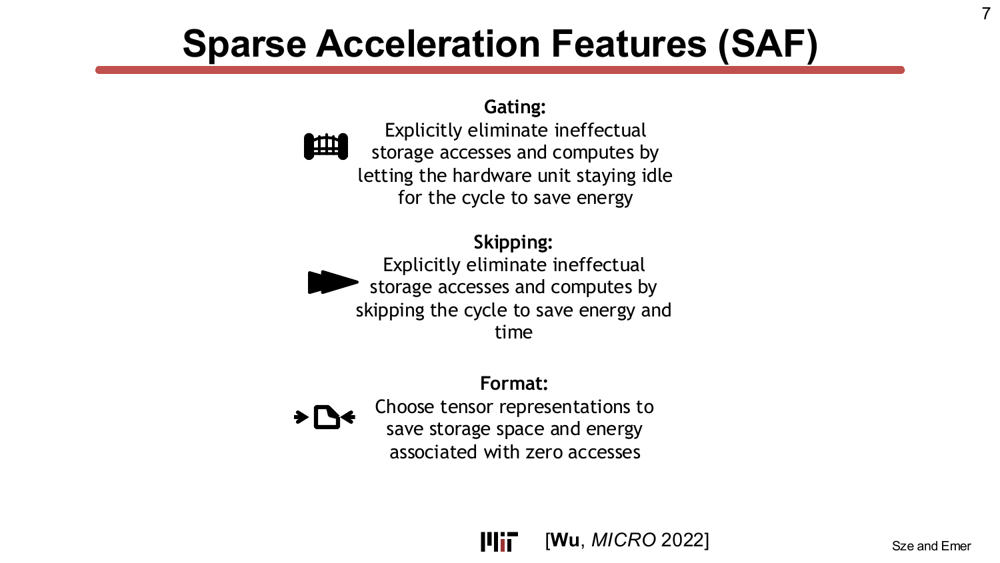

> **為什麼重要：** 訓練端（剪枝）與推論端（ReLU）都會產生充滿零值的張量。忽視這一點的硬體設計至少浪費了一半的記憶體頻寬與運算週期——而 DRAM 存取的能耗約為 ALU 運算的 200 倍，這直接轉化為浪費的能量與時間。

---

## 第二章 — 閘控與跳過：稀疏加速的兩種模式

> *投影片：L08-9 … L08-22*

### 貫穿本章的範例

本講以兩個 6 元素向量的一維點積作為直觀建立的基礎：

```
A = [ 0  0  c  d  0  f ]
B = [ g  h  0  j  k  l ]
Z = A · B = c·0 + d·j + f·l = dj + fl
```

總運算數 = 6；有效運算數 = 2；無效運算數 = 4。

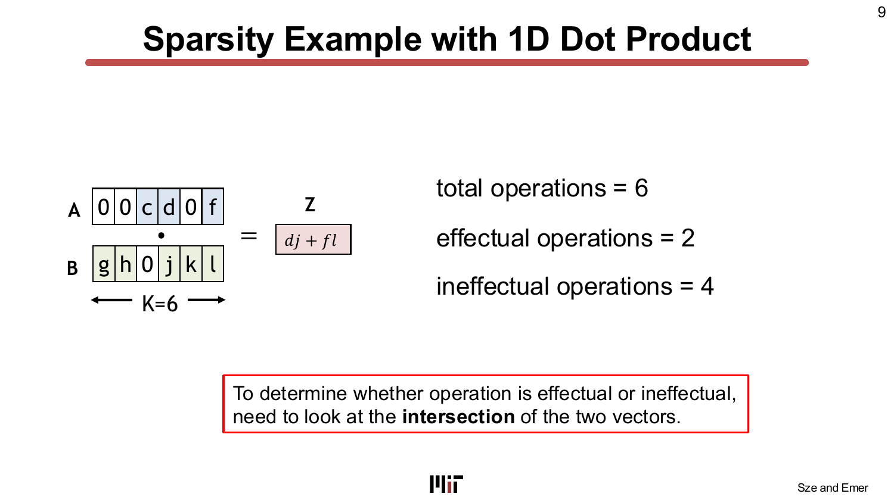

### 尋找交集（intersection）

為了知道哪些運算是有效的，硬體必須確定 A 和 B 中哪些位置同時為非零——這就是**交集（intersection）**問題。設計空間有兩個正交的維度：

1. **單邊 vs. 雙邊**：硬體檢查一個運算元（*領導者 leader*）還是兩個？
   - *單邊（leader → follower）*：掃描領導者的非零值；只有在領導者非零時才讀取跟隨者（follower）。
   - *雙邊（dual-sided）*：掃描兩個運算元並計算其非零座標集合的交集。

2. **閘控 vs. 跳過**：當領導者讀取到零值時，硬體*怎麼做*？
   - **閘控（gating）**：週期仍然執行，但硬體壓制對跟隨者的記憶體讀取與乘法運算，在該週期保持閒置——**節省能量，但不節省週期**。
   - **跳過（skipping）**：硬體直接跳到領導者（或交集）中的*下一個非零座標*，完全省略該週期——**同時節省能量與時間**。

### 週期與讀取次數的量化

本講以 A-B 範例推導了所有四種組合的結果，整理成表格：

| 策略 | 週期數 | A 讀取次數 | B 讀取次數 | 實際執行運算數 |
|---|---|---|---|---|
| 無（基準） | 6 | 6 | 6 | 6 |
| 閘控（Gate B ← A） | 6 | 6 | 3 | 3 |
| 跳過（Skip B ← A） | 3 | 3 | 3 | 3 |
| 雙邊跳過（A ⋂ B） | 2 | 2 | 2 | 2 |

閘控能減少讀取次數與運算次數，但週期數不變——因為即使領導者為零，硬體仍須在每個週期*檢查*它。跳過則要求下一個非零座標的資訊在週期開始**之前**就已知——這正是**表示格式（representation format）**的工作。

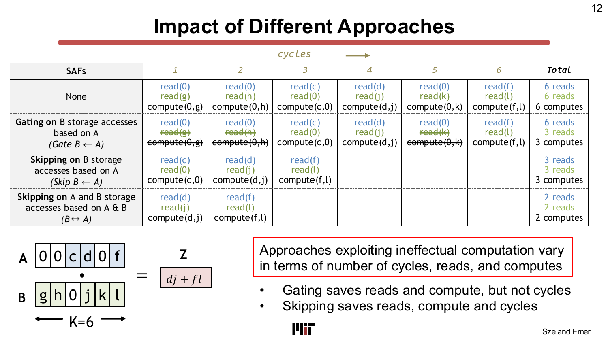

### 閘控 vs. 跳過——實際意義

因為閘控不減少週期數，硬體可以**即時（in real time）**發現零值，無需預計算。跳過則要求非零座標的位置*事先*可得——這就是為何本講立即轉向壓縮張量格式的討論。

真實加速器所採用的 SAF 策略（投影片 11）：

| 加速器 | SAF 策略 |
|---|---|
| Eyeriss [JSSC 2017] | 單邊閘控：Gate W ← I，Gate O ← I |
| Eyeriss v2 [JETCAS 2019] | 單邊跳過：Skip W ← I，Skip O ← I & W |
| SCNN [ISCA 2017] | 單邊跳過：Skip W ← I，Skip O ← I & W |
| ExTensor [MICRO 2019] | 雙邊跳過：Skip A ⋂ B，Skip Z ← A & B |
| DSTC [ISCA 2021] | 雙邊跳過：Skip A ⋂ B，Skip Z ← A & B |

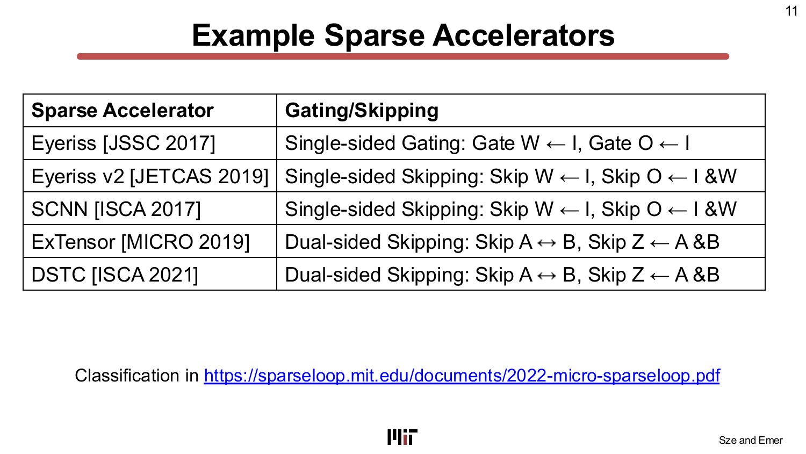

### 雙邊交集的機制

雙邊跳過需要同時在 A 和 B 中找到*配對的*非零座標——這是個更困難的問題。本講描述了一種串行合併掃描的方法：比較兩個運算元當前最前端的座標；將座標較小的那個前進；重複直到找到匹配或其中一個列表耗盡。ExTensor [MICRO 2019] 改用對剩餘座標的**二分搜尋（binary search）**，在下一個匹配座標很遠時特別有效。設計選擇之一是設定**最大迭代次數（maximum iteration count）**：若在該次數內找不到匹配，則發射一個閒置週期並繼續。

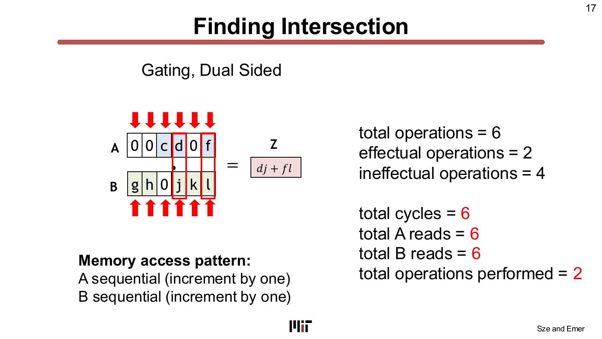

> **為什麼重要：** 閘控容易實作，但僅節省能量；跳過同時節省能量與時間，可提供與*有效密度（effectual density）*相當的加速比，但需要壓縮元資料（metadata）來定位非零值。壓縮格式的選擇因此成為整個系統的關鍵承重構件。

---

## 第三章 — 表示格式：壓縮稀疏張量

> *投影片：L08-23 … L08-48*

### 兩個目標：壓縮與存取

TeAAL 金字塔中的 **Format（格式）** 層同時服務兩個目的：

1. **壓縮效率（compression efficiency）** ——減少儲存張量所需的位元數。記憶體中位元數更少，意味著緩衝區更小（更便宜、更省電），或在同樣大小的緩衝區中存放更大的分塊，從而增加資料重用並減少 DRAM 流量。
2. **存取效率（access efficiency）** ——快速且低代價地定位下一個非零值。這正是*跳過*操作所需的能力。

這兩個目標存在張力：在高稀疏度時壓縮效果好的格式（例如座標載荷，CP），每個非零值的元資料位元較少，但在密度變化時定位下一個非零值可能需要更多計算。本講評估四種標準格式。

### 四種格式

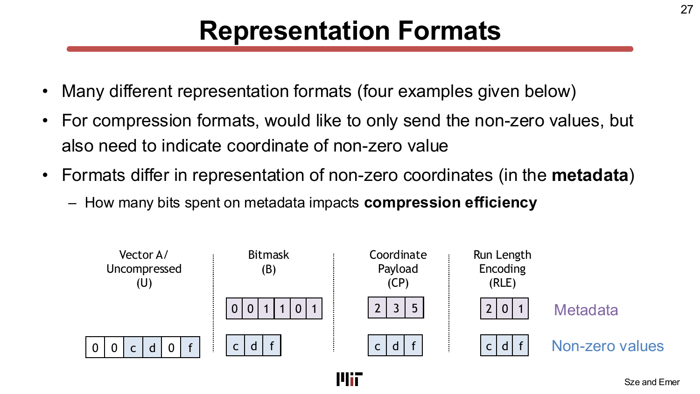

**未壓縮（Uncompressed, U）：** 儲存每個值，包括零。無元資料。壓縮比（compression ratio）始終為 1。
- 最適合：稠密（dense）資料。

**位元遮罩（Bitmask, B）：** 每個座標一個位元，指示該位置是零（0）還是非零（1）；非零值另行儲存。
- 元資料開銷：完整向量中每個座標佔 1 位元。
- 最適合：中等稀疏度。最大壓縮比為 1 /（每個非零值的位元數）——例如 8 位元值最多壓縮到未壓縮大小的 1/8。
- 定位下一個非零值：循序掃描位元遮罩（每個座標讀取 1 位元）。

**座標載荷（Coordinate Payload, CP）：** 每個非零值與其 n 位元座標索引配對儲存。
- 元資料開銷：每個非零值 n 位元，n = ⌈log₂(向量長度)⌉。
- 最適合：極高稀疏度。
- 定位下一個非零值：直接讀取下一個（座標, 值）配對，無需計算。
- 注意：在低稀疏度時，CP 的儲存量*大於*未壓縮（每個非零值的元資料增長速度超過節省量）。

**遊程編碼（Run-Length Encoding, RLE）：** 儲存連續非零值之間的*遊程長度（run length，即零值個數）*，以 r 位元欄位表示。
- 元資料開銷：每個遊程段 r 位元。當連續零值超過 2^r − 1 時，需要多個元資料條目。
- 最適合：極高稀疏度且有長連續零值段（structured data）。
- 定位下一個非零值：累積遊程長度——需要加法器與累計計數器。當 r = 1 時，RLE 退化為位元遮罩。
- 設計選擇：r 的值應根據預期遊程長度分佈決定。

### 壓縮效率與密度的關係

本講提供了一個具體例子（K=16，8 位元值）：

| 格式 | 1 個非零（6.25% 密度） | 8 個非零（50%） | 16 個非零（100%） |
|---|---|---|---|
| 未壓縮 | 128 位元 | 128 位元 | 128 位元 |
| 位元遮罩（每座標 1 位元） | 24 位元 | 80 位元 | 144 位元 |
| CP（每座標 4 位元） | 12 位元 | 96 位元 | 192 位元 |
| RLE（每遊程 4 位元） | 12 位元 | 96 位元 | 192 位元 |

關鍵洞見：**位元遮罩在 100% 密度時比未壓縮更大**（因為元資料本身也佔用空間）；**CP 和 RLE 在 50% 密度時比位元遮罩差**。沒有哪種格式在所有情況下都優勝——正確的選擇取決於張量的預期密度。

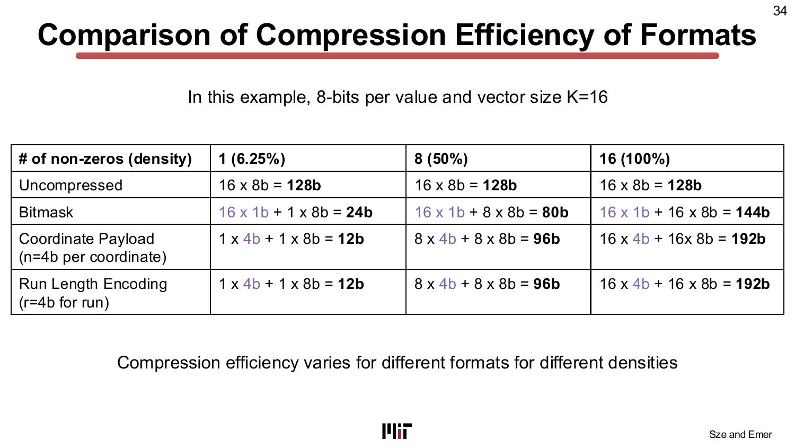

一個重要的實踐觀點（投影片 35）：對於*非結構化*稀疏性，用來編碼座標的元資料約佔壓縮後總儲存量的**一半**（來自 Han, ICLR 2016）。因此，最小化元資料開銷與最小化零值儲存同樣重要。

### Eyeriss：實際應用中的遊程編碼

Eyeriss（Chen, ISSCC 2016）對輸入激活值和輸出特徵圖的片外 DRAM 鏈路實施 RLE 壓縮。編碼使用 5 位元遊程長度欄位與 16 位元值，透過 64 位元寬的 DRAM 匯流排傳輸。結果顯示，RLE 壓縮在 AlexNet 各卷積層中實現了 **1.2× 至 1.9× 的 DRAM 存取量縮減**——在理論熵限的 5–10% 以內。

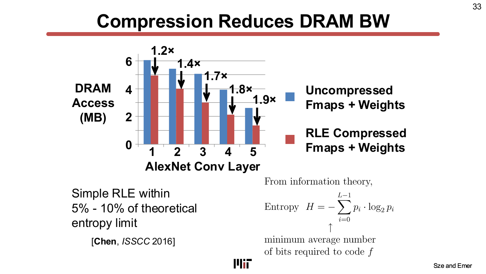

### 存取效率與「協調遍歷（concordant traversal）」的要求

對於跳過操作，硬體必須快速找到*下一個非零值的座標*。存取效率總結：

| 格式 | 定位下一個非零值的步驟 | 隨何者擴展 |
|---|---|---|
| 未壓縮 | 逐個座標比較直到找到非零值 | 向量大小 |
| 位元遮罩 | 逐個座標讀取 1 位元元資料 | 向量大小 |
| RLE | 累積遊程長度 | 遊程數量 |
| CP | 直接讀取下一個（座標, 值）配對 | 非零值數量 |

重要注意事項：以上分析均假設**協調遍歷（concordant traversal）**——即硬體以資料壓縮的同一順序遍歷張量。若資料流需要不同的遍歷順序（**非協調遍歷，discordant traversal**），壓縮資料必須重新索引或解壓縮，代價極高。因此，表示格式的選擇與資料流（迴圈順序）密切相關。

> **為什麼重要：** 壓縮不是免費的。編碼座標的元資料代價可能抵消大部分收益。正確的格式應同時匹配預期的密度分佈與硬體的遍歷順序——而這種耦合關係一路向上影響到 TeAAL 金字塔的映射（Mapping）層。

---

## 第四章 — 結構化稀疏性與階層化結構稀疏性（HSS）

> *投影片：L08-49 … L08-66*

### 取捨：靈活性 vs. 硬體簡單性

**非結構化稀疏性（unstructured sparsity）** 允許非零值出現在任何座標。這讓模型設計具有最大靈活性（通常精度最高），但硬體代價高：找到非零值需要搜尋完整座標範圍，且元資料開銷大。

**結構化稀疏性（structured sparsity）** 限制非零值可出現的位置，縮小搜尋空間並減少元資料開銷，代價是模型設計靈活性降低（可能損失精度）。本講展示了粒度（granularity）的光譜：

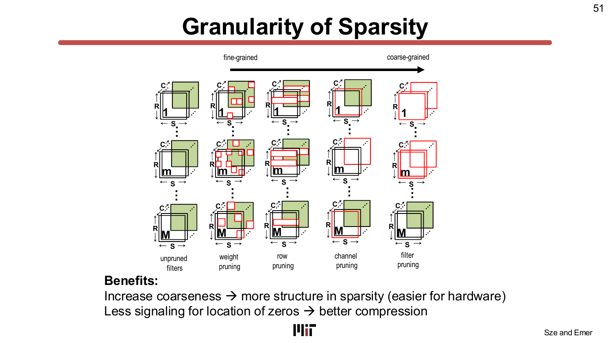

從細粒度到粗粒度：*權重剪枝（weight pruning）* → *濾波器剪枝（filter pruning）* → *行剪枝（row pruning）* → *通道剪枝（channel pruning）*。粒度越粗，硬體越簡單（非零位置可預測），但模型在維持精度方面的自由度越少。

### G:H 結構化稀疏性（NVIDIA 稀疏張量核心）

NVIDIA 的 2:4 結構化稀疏性（亦稱**稀疏張量核心（Sparse Tensor Core）**模式）規定：在每組連續的 4 個值中，恰好有 2 個非零值（精確的 50% 稀疏度）。這是 G=2、H=4 的典型 **G:H 模式**。

硬體收益顯著：每個 H 元素組內非零值的位置只需 ⌈log₂(C(H,G))⌉ 位元的元資料——對於 2:4，每對非零值僅需 2 位元。與非結構化稀疏性相比，元資料開銷極小，能夠實現非常高效的跳過操作。

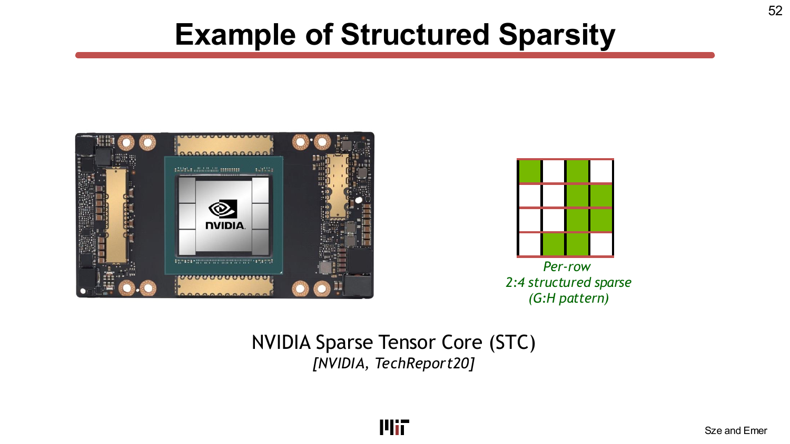

其局限性在於：設計鎖定在 50% 稀疏度。若模型僅有 30% 稀疏度，沒有加速；若有 80% 稀疏度，硬體仍只能以 50% 的利用率運行。單一 G:H 值不夠靈活。

### 靈活性問題

現代 DNN 使用各種操作的混合：
- **剪枝（Han, NeurIPS 2015）** → 稀疏權重，程度可變。
- **激活函數（ReLU 等）** → 視輸入而定的稀疏或稠密激活值。
- **注意力模組（Vaswani, NeurIPS 2017）** → 稠密或可變稀疏注意力映射。
- **深度可分離層（Howard, CVPR 2017）** → 稠密權重，但參數更少。

單一 G:H 值無法高效服務所有這些情況。幼稚的解決方案——在硬體中支援多個 G:H 比率（2:4、2:6、2:8 ...）——難以擴展：硬體複雜度大約與支援的稀疏度數量成正比增長。

### 階層化結構稀疏性（HSS）

Wu 等人 [MICRO 2023] 提出 **HSS** 作為可組合（composable）的解決方案。HSS 不是為每個 G:H 比率分別設計硬體，而是**階層式地組合簡單的 G:H 模式**：

N 階（N-rank）HSS 模式在 N 個嵌套粒度上分別應用 G:H 規則。例如 **3:4 → 2:4** 模式：
- **第 1 階（Rank 1，外層）**：在每 4 個塊（block）中選擇 3 個非空塊。
- **第 0 階（Rank 0，內層）**：在每個塊內，從 4 個元素中保留 2 個非零值（標準 2:4）。

3:4→2:4 模式的有效稀疏度為 1 − (3/4)(2/4) = 1 − 6/16 = 62.5%。

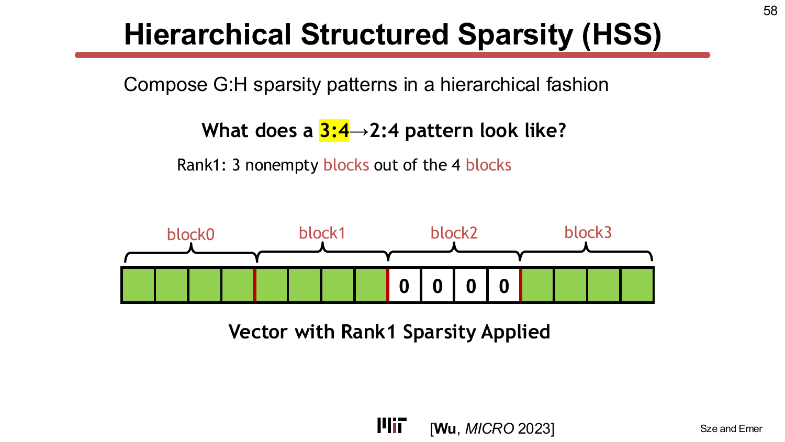

因為稀疏度分數相乘，一個 2 階 HSS（有 m 個第 1 階選項和 n 個第 0 階選項）能覆蓋 m×n 個不同的稀疏度——遠多於 m+n 個比率的情況。投影片 64 的具體例子：將第 1 階選項 {4:4, 4:5, 4:6, 4:7} 與第 0 階選項 {4:4, 2:4, 1:4} 組合，可產生**跨越 0% 到 86% 的 12 個不同稀疏度**。

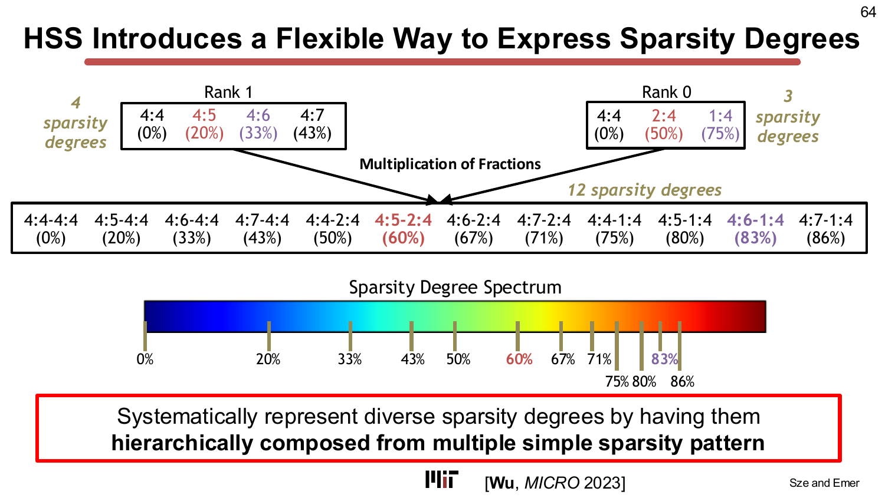

關鍵硬體優勢：**硬體只需在每個階層獨立實作簡單的 G:H 加速**——階層式組合是表示格式的選擇，而非額外的硬體模式。這使稀疏加速的開銷保持在低水準。

### HighLight：HSS 落地為矽晶片

**HighLight** 加速器 [Wu, MICRO 2023] 在 16×16 PE 陣列上實作 HSS，具有兩個層次的跳過（skipping）階層：
- **第 1 階加速（Rank-1 acceleration）**：透過跳過整個空塊來降低儲存需求與能耗。
- **第 0 階加速（Rank-0 acceleration，PE 內部）**：透過跳過塊內的零元素來降低延遲與能耗。

壓縮表示採用基於 HSS 的格式，硬體解碼效率高。HighLight 在 ResNet50 和 Transformer-Big 上以多種剪枝稀疏度評估，達到了在 STC 和 DSTC 基準上的**精度—能量延遲積（accuracy–EDP）帕雷托前沿（Pareto frontier）**——意即在稀疏度全域上都取得了模型精度與硬體效率之間的最佳折衷。

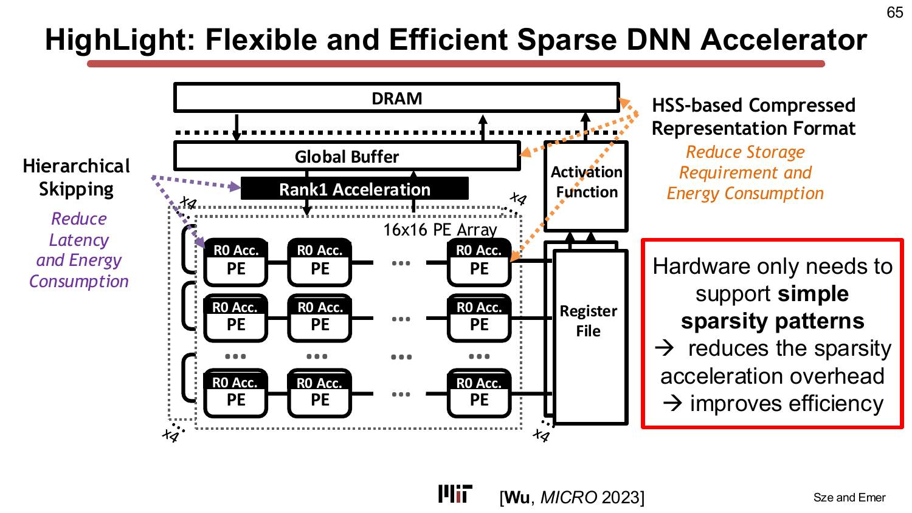

> **為什麼重要：** 部署模型的稀疏度並非固定——它因層、因剪枝方法、因輸入資料而異。能在稀疏度全域高效利用稀疏性（而非鎖定在單一 G:H 比率）的硬體，對於在多樣模型與工作負載上的實際部署至關重要。

---

## 第五章 — 稀疏張量的分塊：超額預訂問題

> *投影片：L08-67 … L08-94*

### 為什麼稀疏性讓分塊變難

前幾講的基本原則：為了最大化能效，你希望選擇**能放入片上緩衝區（on-chip buffer）的最大分塊**，因為更大的分塊能實現更多的資料重用，並減少 DRAM 流量。對於稠密張量，分塊大小由張量維度和一個簡單的容量限制決定。

對於稀疏張量，一個分塊中的非零值數量（其**佔用率，occupancy**）是不可預測的。形狀相同的兩個分塊可能有截然不同的非零值數量。稀疏度不僅在不同工作負載之間有差異，即使在同一個張量內也會變化，就如投影片 68 中針對圖計算、科學模擬和推薦系統的展示。

挑戰在於：若你按**最大佔用率**分塊來規劃緩衝區大小，大多數分塊將只有部分填滿——浪費緩衝區空間，並減少有效分塊大小（進而降低資料重用）。

### 兩種不完美的分塊策略

**均勻佔用率（uniform occupancy）**（按非零值計數均等化選擇分塊大小）：
- 佔用率變化小——所有分塊的非零值數量大致相同。
- 問題：不均勻的形狀使伴隨運算元難以分塊（不規則尋址）。

**均勻形狀（uniform shape）**（按張量維度選擇分塊大小，與稀疏度無關）：
- 兩個運算元都容易同時分塊（規則尋址）。
- 問題：佔用率變化大——有些分塊稠密，有些幾乎為空。若為最壞情況（最大佔用率）分塊規劃緩衝區，平均利用率極低。

這兩種策略單獨使用都不令人滿意。

### 超額預訂（overbooking）：航班座位的類比

本講引入**超額預訂（overbooking）**作為解決方案，並以航班座位做類比：
- 航空公司超額預訂航班，因為平均來說並非所有持票乘客都會出現。實際登機的乘客數量接近座位數。
- 類似地：若分塊超額預訂（名義上大於緩衝區），*平均來看*，實際落入緩衝區的非零值數量將接近緩衝區容量——因為大多數分塊是稀疏的。

當某個分塊的非零值超出緩衝區容量（**「被擠出的資料（bumped data）」**）時，超出的部分被**串流（stream）**直接送往計算端，而不放入緩衝區（失去這些值的重用機會，但不阻塞進度）。

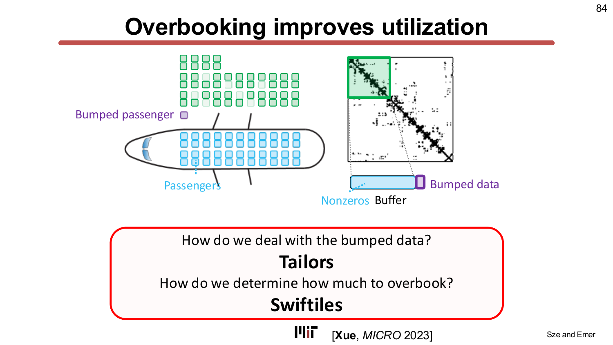

### Tailors：處理被擠出的資料

**Tailors** 機制 [Xue, MICRO 2023] 管理兩種資料串流：
- **未被擠出資料（unbumped data）**：正常載入緩衝區，並在遍歷迴圈的多次遍歷中重複使用。
- **被擠出資料（bumped data）**：在單獨的流程中從 DRAM 串流——這些資料失去重用機會，但遍歷繼續不中斷。

被擠出資料的遍歷順序被調整，以在串流限制下盡可能維持重用。

### Swiftiles：預測分塊佔用率

為了確定*超額預訂多少*，硬體需要估計分塊的佔用率分佈。對整個張量進行完整遍歷（計算每個分塊中的所有非零值）代價太高。**Swiftiles** [Xue, MICRO 2023] 使用**隨機採樣（random sampling）**：採樣一小部分分塊，建立近似的佔用率分佈，然後按緩衝區大小縮放。目標是設定超額預訂比率，使選定百分位數（例如第 90 百分位）的分塊能放入緩衝區。

在 ExTensor [Hegde, MICRO 2019] 上的評估：
- **ExTensor-Naive（天真）**：無稀疏感知分塊；分塊大小按稠密情況計算（最壞情況）。第 90 百分位佔用率僅為緩衝區的 6%；分塊大小嚴重低估。
- **ExTensor-Overbooking**（Tailors + Swiftiles，目標第 90 百分位）：相較 ExTensor-Naive 實現了 **52.7× 的加速**和 **22.5× 的能效提升**。
- **ExTensor-Prescient**（先知型：事先知道每個分塊的精確佔用率）：超額預訂即使相對於這個理想基準，仍實現了 **2.3× 加速**和 **2.5× 能效提升**——因為 Swiftiles 的預測已足夠準確，大多數分塊都能放入，而更大分塊（更多重用）的收益超過了偶發被擠出資料串流的代價。

> **為什麼重要：** 為稀疏資料選擇正確的分塊大小與選擇正確的壓縮格式同樣重要。天真地確定分塊大小幾乎浪費了所有的緩衝區容量；配合輕量佔用率預測的超額預訂則能在不需要完整預掃描的情況下，恢復大部分理論最大效率。

---

## 第六章 — 與資料流的交互作用及總結

> *投影片：L08-94 … L08-96*

### 資料流影響稀疏性利用

本講最後將稀疏性與 TeAAL 金字塔的 **Mapping（映射）** 層相連。迴圈順序（資料流，dataflow）必須與表示格式的儲存順序對齊，以實現**協調遍歷（concordant traversal）**——即硬體按資料在記憶體中儲存的順序存取非零值。非協調遍歷（discordant traversal）需要對元資料進行隨機存取，代價高昂。

額外的資料流考量：
- **增加某種資料類型的駐留性（stationarity）**（將其迴圈移至最外層/空間維度）可將每次存取的元資料解碼代價分攤到更多計算上。
- **平行性與工作負載平衡（workload balance）**：當迴圈跨 PE 並行化（spatial_for）時，稀疏性造成*工作負載不平衡*——某些 PE 獲得稠密分塊，需要執行更多週期，而其他 PE 很快完成。應考慮預期的稀疏度變化來選擇要並行化哪個迴圈。

這些交互作用在 Lab 4（SparseLoop 工具）和期末專題（教科書第 8.3 章）中深入探討。

### 本講總結

本講以對挑戰與代價的精確陳述作結：

**稀疏性帶來的不規則性**導致：緩衝區與 PE 的未充分利用；PE 陣列間的工作負載不平衡；不規則的資料存取模式。

**不得超過稀疏性收益的開銷**：座標元資料的儲存；用於檢查運算元是否為零的交集邏輯。

本講中的每個設計——Eyeriss、SCNN、ExTensor、HighLight、Swiftiles——都代表**利用稀疏性**與**為找到、壓縮和求交集稀疏資料而付出硬體複雜度代價**之間折衷曲線上的一個點。

> **為什麼重要：** 稀疏性不是小的最佳化——它是生產 DNN 加速器中能效與吞吐量的一階決定因素。但正確利用它的硬體代價（交集邏輯、元資料解碼器、分塊控制器）需要在金字塔的格式（Format）、映射（Mapping）和架構（Architecture）三層之間進行仔細的協同設計。後兩講（L09–L10）將更深入地研究具體的稀疏加速器架構。

---

## 獨立學習指南（Standalone Study Guide）

### 進入下一講前必須掌握

- 區分 gating、skipping 與 compressed-format representation 這三種 sparse acceleration features。
- 依 compression efficiency 與 access efficiency 比較 uncompressed、bitmask、coordinate-payload、run-length formats。
- 說明 structured sparsity 為何降低 metadata 與 decoder cost。
- 說明 sparse tiling 問題：occupancy 會變動，因此固定形狀的 dense-style tile 會浪費 buffer。
- 描述 Tailors 與 Swiftiles 如何以 overbooking 處理 sparse tiles。

### 自我檢核問題

1. 哪一種 sparse acceleration feature 省能但不省 cycles？
2. 為什麼高密度時 compressed format 可能比 uncompressed storage 更大？
3. Tailors 中 bumped tile 與 unbumped tile 的差異是什麼？

### 練習

1. 對一個長度 16、含 4 個非零值的向量，分別用 bitmask 與 coordinate-payload 編碼，並分開計算 metadata bits 與 payload bits。
2. 選一組 2:4 sparse group，計算需要多少 bits 來編碼非零位置。
3. 說明為什麼用 maximum occupancy 選 tile size 會破壞 average tile 的重用。

### 常見誤區

- 把 compression ratio 當成唯一格式指標。Access efficiency 可能主導 runtime。
- 假設 structured sparsity 永遠較好。它可能降低模型彈性或準確度。
- 忽略 workload balance：skipping 可能讓不同 PE 在不同時間完成。

---

## 關鍵詞彙（Key Terms）

| 詞彙 | 說明 |
|---|---|
| **有效運算（effectual operation）** | 兩個運算元均非零的運算；對輸出有貢獻。 |
| **無效運算（ineffectual operation）** | 至少一個運算元為零的運算；`任何值 × 0 = 0`。 |
| **閘控（gating）** | 一種 SAF：壓制對零值運算元的記憶體讀取和乘法，節省能量但不節省週期。週期仍然發生。 |
| **跳過（skipping）** | 一種 SAF：完全省略零值或非交集運算元配對的整個週期，同時節省能量和時間。需要預計算的非零座標。 |
| **SAF（稀疏加速特性，Sparse Acceleration Feature）** | 閘控、跳過和壓縮格式策略的總稱（Wu, MICRO 2022）。 |
| **單邊交集（single-sided intersection）** | 一個運算元（領導者）驅動存取模式；另一個（跟隨者）僅在領導者非零時讀取。 |
| **雙邊交集（dual-sided intersection）** | 搜尋兩個運算元的非零座標集合以找到配對；只處理配對的非零值。 |
| **表示格式（representation format）** | 稀疏張量在記憶體中的編碼方式，包括值和座標元資料。 |
| **未壓縮（Uncompressed, U）** | 儲存每個值，包括零；無元資料開銷；最適合稠密資料。 |
| **位元遮罩（Bitmask, B）** | 每個座標一個位元；最適合中等稀疏度。 |
| **座標載荷（Coordinate Payload, CP）** | 每個非零值儲存顯式座標；最適合高稀疏度；存取直接。 |
| **遊程編碼（Run-Length Encoding, RLE）** | 儲存非零值之間的零值計數；最適合高稀疏度與長零值段；需要累加才能找到下一個座標。 |
| **壓縮效率（compression efficiency）** | 壓縮後表示大小與未壓縮大小之比；取決於密度和元資料開銷。 |
| **存取效率（access efficiency）** | 從元資料定位下一個非零值的計算代價；決定跳過硬體的複雜度。 |
| **協調遍歷（concordant traversal）** | 以資料儲存的相同順序存取非零值——高效的預設方式。 |
| **非協調遍歷（discordant traversal）** | 以不同於儲存順序的方式存取資料——代價高昂；需要對元資料進行隨機存取。 |
| **結構化稀疏性（structured sparsity）** | 非零值僅出現在可預測位置的稀疏模式；降低硬體複雜度。 |
| **非結構化稀疏性（unstructured sparsity）** | 對非零位置無限制；模型靈活性最大，但硬體代價較高。 |
| **G:H 稀疏性** | 在每組連續 H 個值中恰好有 G 個非零值。NVIDIA 的 2:4 是典型例子。 |
| **HSS（階層化結構稀疏性，Hierarchical Structured Sparsity）** | 在巢狀粒度上組合多個 G:H 模式，以簡單硬體覆蓋廣泛的稀疏度範圍（Wu, MICRO 2023）。 |
| **分塊佔用率（tile occupancy）** | 給定分塊中的非零值數量；在非結構化稀疏性下不可預測地變化。 |
| **超額預訂（overbooking）** | 提名比緩衝區容量更大的分塊；有效，因為大多數分塊是稀疏的，其實際佔用率平均而言能放入緩衝區。 |
| **Tailors** | 處理「被擠出（bumped）」分塊資料的硬體機制——以串流而非緩衝方式處理，不阻塞計算 [Xue, MICRO 2023]。 |
| **Swiftiles** | 使用隨機採樣預測分塊佔用率分佈並設定超額預訂比率的輕量分塊演算法 [Xue, MICRO 2023]。 |
| **工作負載不平衡（workload imbalance）** | 分配給不同 PE 的分塊之間非零值計數的差異，導致部分 PE 提前完成並閒置。 |

---

## 重點回顧（Takeaways）

- 每次 DNN 推論運算都可分類為**有效（effectual）**或**無效（ineffectual）**；利用無效運算是稀疏加速的全部目標。
- **閘控（gating）**僅節省能量；**跳過（skipping）**同時節省能量和時間，但需要預計算的非零位置元資料——使**表示格式（representation format）**成為一等架構關注點。
- 四種標準格式（未壓縮、位元遮罩、CP、RLE）各有其最優的密度範圍；沒有單一格式在所有稀疏度下都占優勢。
- **結構化稀疏性**（G:H、HSS）以模型靈活性為代價降低硬體複雜度；**HSS** 透過階層式組合簡單模式，拓展了對廣泛稀疏度的覆蓋。
- **稀疏張量分塊**與稠密張量分塊有根本差異：分塊佔用率不可預測地變化，天真的最壞情況規劃幾乎浪費所有緩衝區容量。**Tailors + Swiftiles 超額預訂**在 ExTensor 案例中相比天真分塊實現了 52.7× 的加速。
- 稀疏性、資料流（迴圈順序）和表示格式緊密耦合：格式必須匹配遍歷順序，平行性選擇必須考量工作負載不平衡。

---

## 與後續講次的連結（Connections）

- **L07（稀疏性）** ——前一講建立了 DNN 中*為什麼*以及*有多少*稀疏性的基礎；L08 接著探討硬體*如何*利用它。
- **L09–L10（稀疏架構 II & III）** ——更深入地研究具體稀疏加速器架構，涵蓋 SCNN、ExTensor 及更進階的交集硬體。
- **Format 層（TeAAL 金字塔，L01）** ——此處介紹的表示格式是導論講次中首次提及之 *Format* 層的具體實現。
- **Mapping 層（L05–L06，資料流）** ——此處的協調/非協調遍歷討論表明，資料流（迴圈順序）的選擇不能獨立於稀疏表示格式的選擇。
- **Lab 4（SparseLoop）** ——使用 SparseLoop 工具（sparseloop.mit.edu）在真實工作負載上評估 SAF 策略和壓縮格式；本講的理論在此直接操作化。
- **教科書** ——*Efficient Processing of Deep Neural Networks*（Sze & Emer）第 8.2 節（壓縮）和第 8.3 節（稀疏資料流）。

---

## 附錄 — 投影片對照表（Slide-to-Section Map）

| 投影片 | 章節 |
|---|---|
| L08-1 | 標題 |
| L08-2 … L08-8 | 第一章 — 稀疏性為何重要（來源、算術、不規則性） |
| L08-9 … L08-22 | 第二章 — 閘控 vs. 跳過（交集、單邊/雙邊、量化） |
| L08-23 … L08-48 | 第三章 — 表示格式（U、B、CP、RLE；壓縮/存取效率；Eyeriss RLE） |
| L08-49 … L08-66 | 第四章 — 結構化稀疏性與 HSS（G:H、2:4 STC、HSS、HighLight） |
| L08-67 … L08-93 | 第五章 — 稀疏張量分塊（均勻佔用率/形狀困境、超額預訂、Tailors、Swiftiles、ExTensor 評估） |
| L08-94 … L08-96 | 第六章 — 資料流交互作用、總結、推薦閱讀 |
