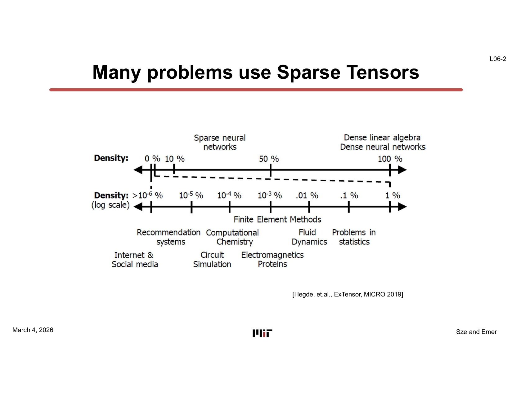
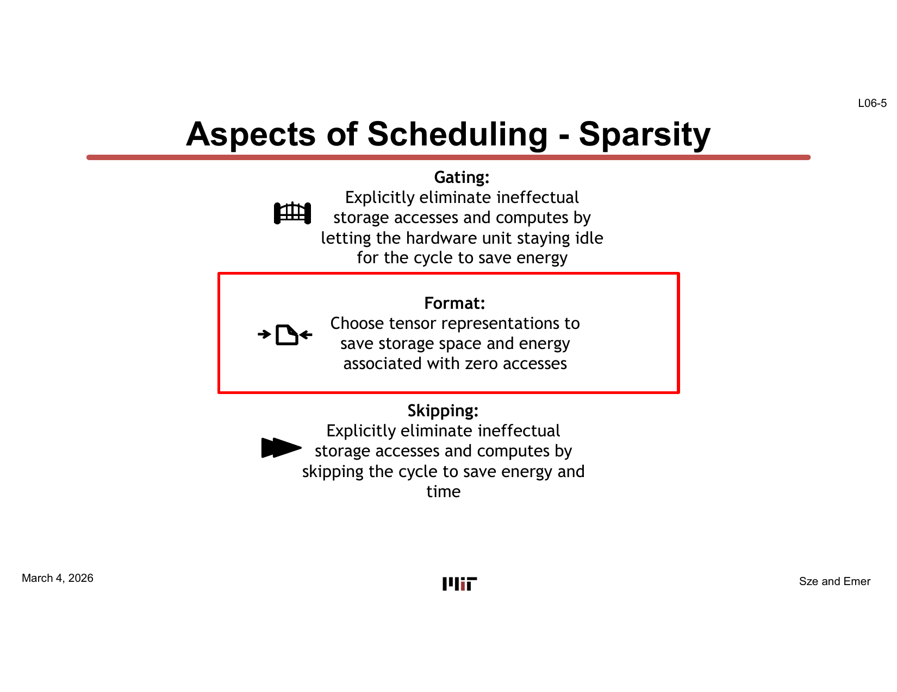
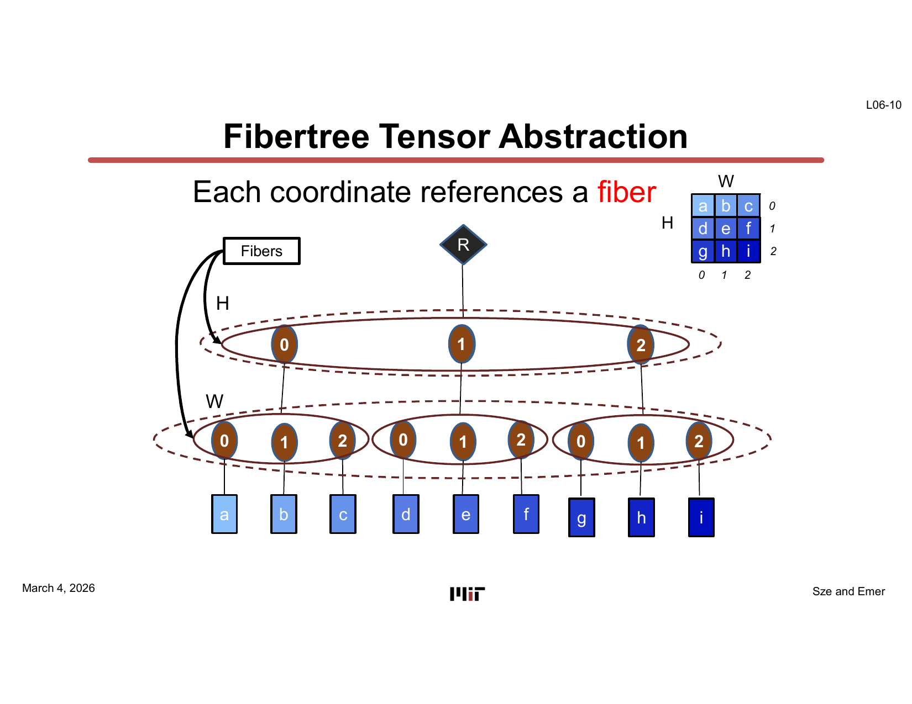
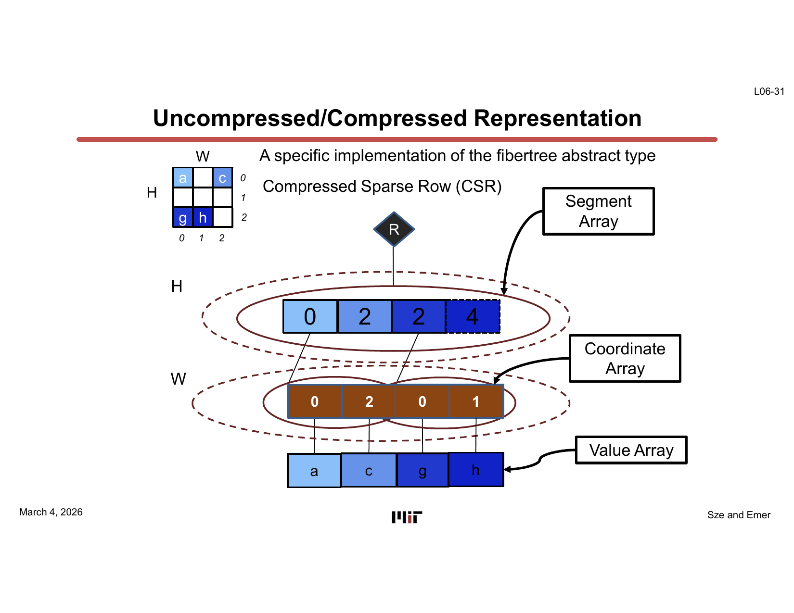
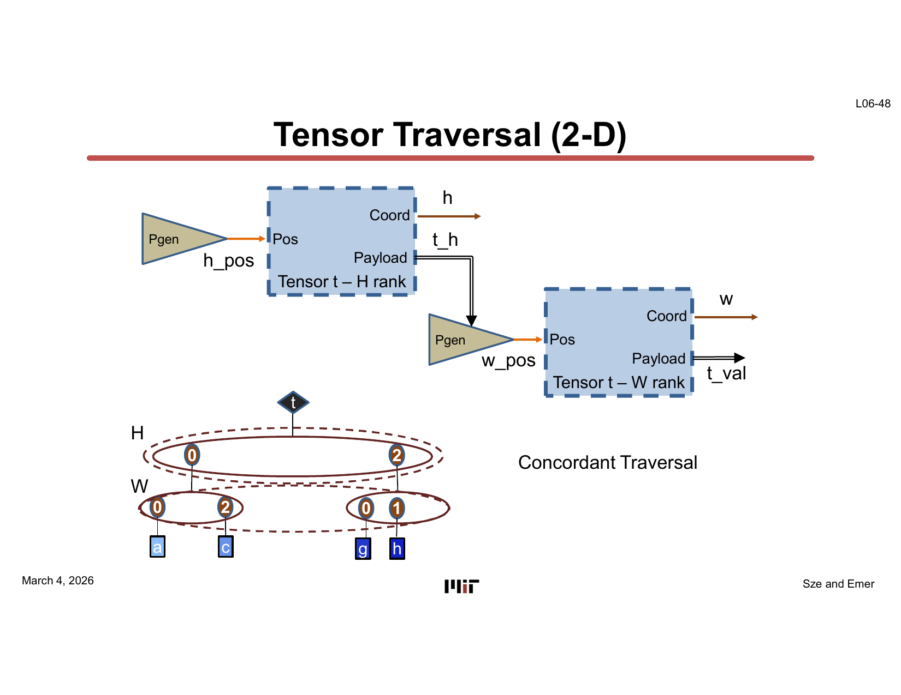
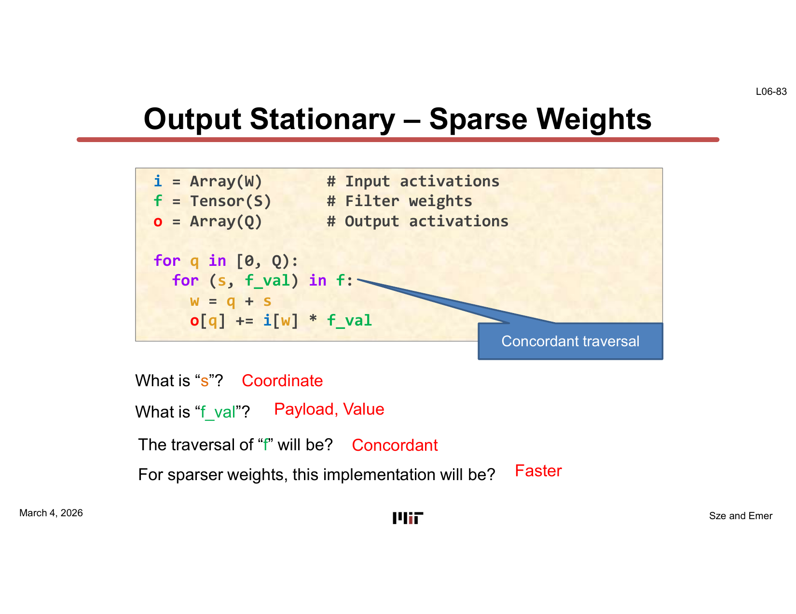
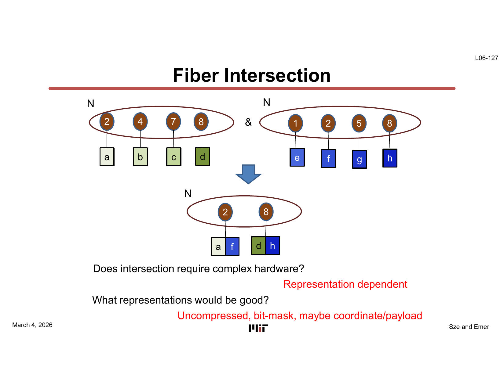
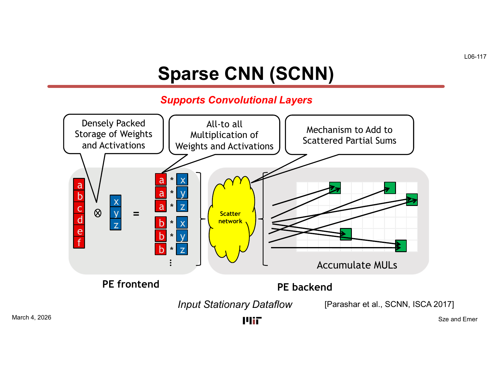
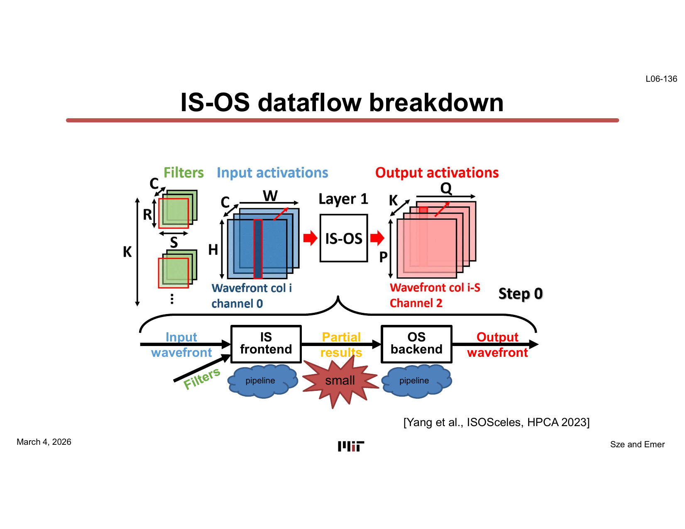
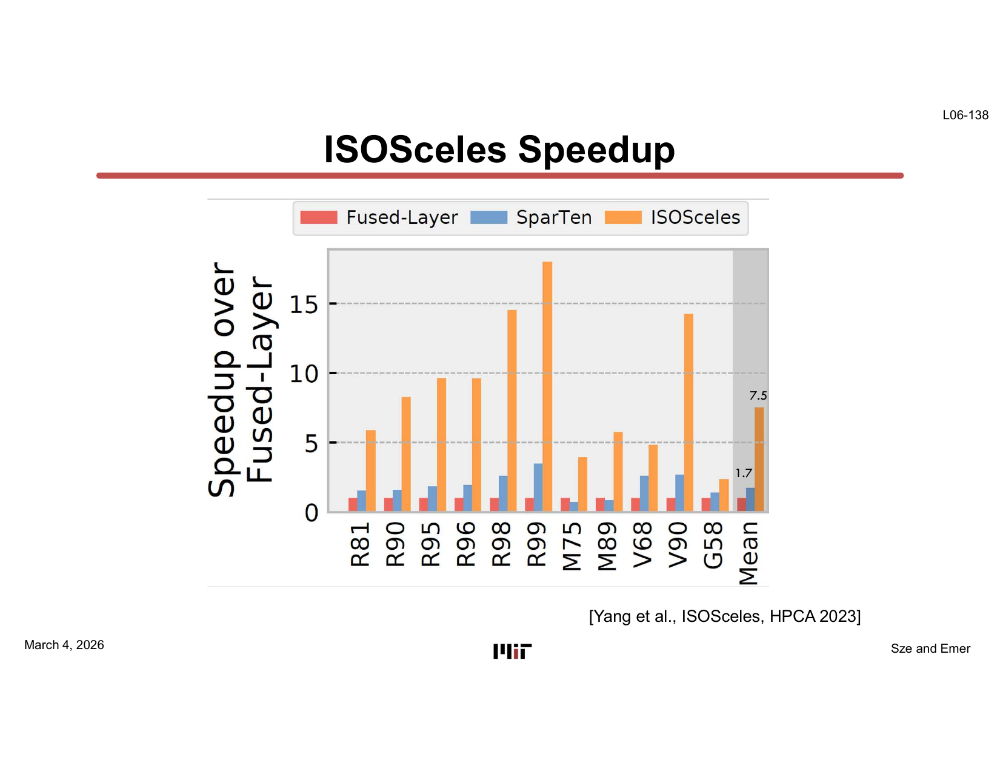

# L09 — 稀疏架構，第二部分（Sparse Architectures, Part 2）

> **課程：** 6.5930/1 — 深度學習硬體架構（Hardware Architectures for Deep Learning）
> **講師：** Joel Emer 與 Vivienne Sze（MIT EECS）
> **講授日期：** 2026 年 3 月 4 日 · **投影片：** 138 頁 · **來源：** [`Lecture/L09-Sparse_Architectures-2.pdf`](../../Lecture/L09-Sparse_Architectures-2.pdf)
>
> *本文是以「概念」為單位重建講課脈絡的導讀（walkthrough），依主題而非逐頁編排。本講投影片包含大量動畫漸進建構，每一節都標注其綜合的投影片範圍，並展示各張圖的最完整版本，方便對照原始投影片閱讀。*

---

## 一句話總結（TL;DR）

稀疏性（sparsity）在真實 DNN 工作負載中無處不在，但要把這份潛在的加速與節能真正實現，需要兩件事同時成立：一個**壓縮張量表示法（compressed tensor representation）**，讓零值不佔用儲存空間；以及**能高效遍歷與求交（traverse and intersect）這些表示法的硬體**。本講建立起整套正式詞彙——纖維樹（fibertree）、纖維表示法（uncompressed、coordinate/payload list、CSR/CSC）、協調與非協調遍歷（concordant vs. discordant traversal）、座標投影（coordinate projection）與纖維求交（fiber intersection）——然後把這套詞彙應用到一系列從簡到難的稀疏摺積（sparse-CONV）迴圈巢（loop nest），最終介紹三個真實加速器：**Cambricon-X**、**SCNN** 與 **ISOSceles**。

---

## 學習目標（Learning Objectives）

讀完本講後，你應該能夠：

- 定義**纖維樹（fibertree）抽象**，並說明秩（rank）、纖維（fiber）、座標（coordinate）與承載值（payload）如何表示任意張量（稠密或稀疏）。
- 列舉主要的**纖維表示法**（uncompressed array、coordinate/payload list、bitmask、CSR、CSC、COO），以及各自的 `getPayload()` 與 `getNext()` 時間複雜度。
- 區分**協調遍歷（concordant traversal）**（按儲存順序的步進）與**非協調遍歷（discordant traversal）**（隨機存取），並解釋為何非協調遍歷代價高昂。
- 撰寫**輸出駐留（output-stationary）、權重駐留（weight-stationary）、輸入駐留（input-stationary）** 摺積的迴圈巢，分別利用權重稀疏性、輸入稀疏性，以及兩者同時利用。
- 解釋**座標投影（coordinate projection）**與**纖維求交（fiber intersection）**這兩個組合稀疏運算元的關鍵原語（primitive）。
- 描述 **Cambricon-X**、**SCNN**、**ISOSceles** 的硬體資料流與微架構，說明各自利用的稀疏性及所達到的 PE 利用率增益。

---

## 第一章 — 稀疏動機與纖維樹抽象

> *投影片：L09-1 … L09-17*

### 稀疏性無所不在

真實的 DNN 張量遠非稠密。開場投影片（引自 ExTensor，MICRO 2019）展示了廣泛的問題領域——自然語言處理、圖分析、推薦系統、科學模擬、影像分類——它們都以**稀疏張量（sparse tensor）**作為主要輸入或中間狀態。



另一張投影片（引自 SCNN，ISCA 2017）深入探討 AlexNet：所有摺積層的**輸入激活密度（input-activation density，非零值的比例）**在 ReLU 後都遠低於 1.0，**權重密度（weight density）**也在整個網路中下降。關鍵是：工作量（乘加次數）正比於兩個密度的乘積——因此若同時利用權重與激活值的稀疏性，理論上可把工作量降至 `d_W × d_I × 稠密工作量`。硬體挑戰在於如何在實際中實現這個潛力。

本講將處理稀疏性的工具組織成三個正交手段：



- **閘控（Gating）：** 執行與稠密情形相同的迴圈排程，但一旦偵測到零運算元，就抑制讀取、乘法與寫入。*省能耗，不省時間。*
- **格式（Format）：** 壓縮張量表示法，使零值不佔用儲存空間，降低記憶體佔用量與串流所需的頻寬。*省儲存空間與頻寬。*
- **跳過（Skipping）：** 重構迴圈遍歷本身，只對非零座標進行迭代，完全消除浪費的時脈週期。*同時省時間與能耗。*

本講的重點落在**格式**與**跳過**，因為它們能帶來最顯著的加速。

### 纖維樹抽象

為了以統一的方式對任何張量表示法進行推理，本課程引入了**纖維樹（fibertree）**抽象。一個具有 *n* 個秩（rank）的張量被表示為一棵有 *n* 層的樹：

- 每個**秩（rank）**對應樹的一層。
- 每個節點持有一個**座標（coordinate）**與一個**承載值（payload）**。對非葉層節點，承載值是指向子纖維（child fiber）的引用；對葉層節點，承載值是數值。
- **纖維（fiber）**是一個節點之所有子節點的有序（座標，承載值）元組列表。



在稠密情形下（所有元素非零），每一層都出現每個合法座標。在稀疏情形下，只有非零座標出現——完全為零的行（或更高秩的切片）直接消失，使樹縮小。

驅動所有張量遍歷的兩個操作：

- **`getPayload(coordinate)`** — 對纖維中指定座標的承載值進行隨機存取。
- **`getNext()`** — 依遍歷順序（協調遍歷）前進到下一個座標的循序迭代器。

這兩個操作的效率高度依賴所選的纖維表示法，下一章介紹。

> **為什麼重要：** 纖維樹抽象把「張量表示什麼」與「如何儲存」分離開來。任何正確實作 `getPayload` 與 `getNext` 的硬體，都能利用稀疏性，而不受特定儲存格式的影響——這在稀疏格式層與運算層之間建立了乾淨的架構介面。

---

## 第二章 — 張量表示法與遍歷效率

> *投影片：L09-18 … L09-51*

### 纖維表示法的選擇

纖維可以以多種方式儲存，各有不同的空間與存取時間權衡：

| 表示法 | 描述 | `getPayload` 代價 | `getNext`（協調遍歷）代價 |
|---|---|---|---|
| **未壓縮（U，Uncompressed）** | 稠密陣列；位置 = 座標 | O(1) | O(1) |
| **遊程長度編碼（R，Run-length）** | （零連長度，非零承載值）對 | O(n) 線性掃描 | O(1) |
| **座標／承載值列表（C，Coordinate/Payload List）** | 有序的（座標，值）對列表 | O(log n) 二分搜尋 | O(1) |
| **雜湊表（Hf/Hr，Hash Table）** | 座標映射到承載值的雜湊 | O(1) 平攤 | O(n)（局部性差） |
| **座標位元遮罩（Coordinate Bitmask）** | 每個座標一個位元，1 = 非零 | O(popcount) | O(1) |

對於**協調遍歷**（按儲存順序迭代），座標／承載值列表的效率與未壓縮陣列相同。對於**非協調遍歷**（任意座標的隨機存取），只有未壓縮陣列和雜湊表能提供 O(1) 查詢。位元遮罩格式也允許在不壓縮的情況下快速做零值檢查，正如 Eyeriss 閘控中所使用的那樣。

### 壓縮稀疏行（CSR）——一個具體實作

最廣泛使用的二維格式是 **CSR（Compressed Sparse Row，壓縮稀疏行）**，以纖維樹記法寫作 `Tensor<U,C>(H,W)`：

- **H 秩為未壓縮（U）：** 行索引等於其位置，因此無需座標後設資料（metadata）。一個長度為 H+1 的**段陣列（segment array）**儲存每行纖維在承載值陣列中的起始位置和長度。
- **W 秩為壓縮（C）：** 只儲存非零的列座標，存於**座標陣列（coordinate array）**。對應的值存於同一位置的**值陣列（value array）**。



交換秩的順序則得到 **CSC（Compressed Sparse Column，壓縮稀疏列）**：`Tensor<U,C>(W,H)`。兩種格式對相同資料的記憶體佔用完全相同，但**協調遍歷方向不同**——CSR 適合行主序（row-major）掃描，CSC 適合列主序（column-major）掃描。強制以與儲存順序相反的方向遍歷，就是**非協調遍歷（discordant traversal）**，每個元素可能需要 O(log n) 的隨機存取。

合併兩個秩為一個平坦座標，得到 **COO（Coordinate List）**：`Tensor<C2>(H,W)`，直接儲存 (H,W) 座標元組。更多合併選項與記法（`U2`、`R2`、`H2`）允許其他權衡。

### 協調遍歷的硬體

下圖展示二維協調遍歷（例如以行主序掃描 CSR 張量）的硬體結構。兩個位置產生器（Pgen，Position Generator）與座標／承載值提取器構成流水線（pipeline）：H 秩階段產生纖維邊界，W 秩階段在每條纖維內依序掃描座標。



硬體中每個秩都直接實作 `getNext()` 迭代器。對未壓縮秩，位置產生器就是一個計數器；對座標／承載值列表秩，則是一個沿著儲存列表前進的指標。每個秩的輸出都是（座標，承載值）對——一個乾淨、與表示法無關的介面。

> **為什麼重要：** 在座標／承載值列表上的協調遍歷，與未壓縮陣列的 O(1) 每元素代價相同，同時只讀取非零元素。這正是從稀疏性獲得**時間節省**的關鍵。非協調遍歷會破壞這個優勢，這也是迴圈巢的設計——哪個運算元被迭代、哪個被查詢——如此關鍵的原因。

---

## 第三章 — 在摺積中利用稀疏權重

> *投影片：L09-72 … L09-96*

### 摺積迴圈巢與座標算術

一維摺積 `O[q] += I[w] * F[s]`（在索引約束 `w = q + s` 下）是本講這一部分的貫穿範例。稠密實作對所有 (q, s) 對進行迭代；兩個內部索引始終同時是座標與位置（未壓縮張量）。

當過濾器（filter）稀疏（許多零權重）時，自然的做法是把 F 壓縮為座標／承載值列表並協調遍歷。**哪個迴圈在外面**決定了資料流：

**輸出駐留（output-stationary）搭配稀疏權重：**
```
for q in [0, Q):
    for (s, f_val) in f:        # 協調遍歷壓縮過濾器
        w = q + s               # 座標投影
        o[q] += i[w] * f_val   # 以計算出的座標查詢輸入
```
此遍歷對 F 是協調的。計算出的 `w = q+s` 就是一次**座標投影（coordinate projection）**——所需輸入激活值的座標由輸出座標與權重座標推導而來。輸入激活值 `i` 保持未壓縮，使 `i[w]` 為 O(1)。



投影片對比了壓縮過濾器排程（右）與未壓縮排程（左）：若 5 個權重中有 2 個非零，壓縮版本的內迴圈只執行 2 次而非 5 次——這是一個直接正比於權重密度的加速。

**權重駐留（weight-stationary）搭配稀疏權重：** 迴圈順序反轉（`for (s,f_val) in f: for q in [0,Q):`），讓每個權重駐留，同時掃過所有輸出。投影 `w = q+s` 依然適用。兩種資料流達到相同的工作量縮減；差異在於哪個緩衝區持有駐留資料。

### 硬體微架構

輸出駐留稀疏權重排程的硬體有三條資料流：

1. **過濾器纖維** — 一個 Pgen + 座標／承載值階段，依序輸出非零的 (s, f_val) 對。
2. **輸入激活陣列** — 以計算出的 `w = q + s` 索引的未壓縮陣列。
3. **部分和（partial sum）陣列** — 以 `q` 索引；用 MAC 單元累積結果。

一個座標產生器（Cgen，Coordinate Generator）從遍歷狀態計算 `w` 與 `q`。**Cambricon-X** 加速器（Zhang 等，Micro 2016）正是使用這個結構：每個權重旁儲存的後設資料（metadata）標識需要哪些輸入激活值，PE 以計算出的位址載入這些激活值，而非串流稠密的滑動視窗。

> **為什麼重要：** 稀疏權重遍歷是跳過（skipping）的最簡單形式。若權重 50% 稀疏，內迴圈執行次數減半，過濾器讀取與輸出讀寫的時間和能耗均減半。關鍵硬體需求是快速的座標投影單元，以及能以計算座標隨機存取的未壓縮輸入緩衝區。

---

## 第四章 — 利用稀疏輸入，以及兩者同時利用

> *投影片：L09-97 … L09-128*

### 稀疏輸入：滑動視窗問題

當輸入激活值稀疏（ReLU 後許多零）但權重稠密時，對偶方法是把 `i` 壓縮為座標／承載值列表，並協調遍歷非零輸入。對於權重駐留資料流：

```
for s in [0, S):
    for (w, i_val) in i if s <= w < Q+s:  # 窗口式協調遍歷
        q = w – s
        o[q] += i_val * f[s]
```

`if s <= w < Q+s` 的約束是一個**稀疏滑動視窗（sparse sliding window）**：對每個權重位置 `s`，只有落在合法摺積視窗內的輸入座標 `w` 才對任何輸出有貢獻。隨著投影片動畫中 `q` 增大，活躍視窗滑過輸入纖維，撿取非零值並投影到對應的輸出座標。**CNVLUTIN** 加速器正是利用這個結構：壓縮零激活值，對每個非零輸入查詢對應的權重並累積到對應輸出。

輸出駐留搭配稀疏輸入：
```
for q in [0, Q):
    for (w, i_val) in i if q <= w < q+S:
        s = w – q
        o[q] += i_val * f[s]   # 以計算出的 s 查詢權重
```
每個輸出 `q` 迭代其視窗內的（稀疏）輸入，並以推導出的 `s = w - q` 查詢權重（建議使用未壓縮過濾器以保持 O(1) 查詢）。

### 雙稀疏：投影後求交

當**權重與輸入都**稀疏時，最大的工作量縮減需要只對 `i[w] ≠ 0` 且 `f[s] ≠ 0` 的 (w, s) 對進行迭代。輸出駐留的公式化表述如下：

```
for q in [0,Q):
    for (s, (f_val, i_val)) in f.project(+q) & i:
        o[q] += i_val * f_val
```

這裡串聯使用了兩個原語：

1. **座標投影（`f.project(+q)`）：** 把每個非零權重的座標偏移 `+q`，計算出各個 `s` 所需的 `w`。這在 `w` 座標空間中產生一條新的（虛擬）纖維。
2. **纖維求交（`&`）：** 只保留同時出現在投影過濾器纖維與輸入激活值纖維中的座標。



投影片展示：對座標集合 {2,4,7,8} 與 {1,2,5,8} 做求交，結果為 {2,8}——只有公共座標才執行乘加。對稠密核（一個纖維包含所有 8 個座標），求交退化為簡單查詢；對稀疏核加稀疏激活值，則達到密度乘積的工作量縮減。

座標位元遮罩與未壓縮表示法讓求交特別快（按位元 AND），代價是要為所有座標（包括零值）儲存後設資料。座標／承載值列表則需要類似歸併排序的一遍掃描。

輸出駐留雙稀疏排程的硬體，把投影後的過濾器纖維與輸入纖維同時送入一個共享的**求交單元（Intersection unit）**，該單元輸出匹配的 (s, f_val, i_val) 三元組給 MAC 單元。

> **為什麼重要：** 纖維求交是實現**乘法式（multiplicative）**工作量縮減的關鍵原語——若權重密度為 `d_W`、輸入密度為 `d_I`，工作量正比於 `d_W × d_I`。沒有求交，最好也只能利用一個運算元的稀疏性，工作量正比於較稠密的那個。要實現完整的雙稀疏縮減，需要顯式的座標匹配硬體。

---

## 第五章 — SCNN：笛卡兒積稀疏加速

> *投影片：L09-112 … L09-124*

### SCNN 的輸入駐留資料流

**SCNN**（Sparse CNN，Parashar 等，ISCA 2017）採用**輸入駐留（input-stationary）**資料流，將內迴圈置於權重之上：

```
for (w, i_val) in i:
    for (s, f_val) in f if w-Q <= s < w:
        q = w – s
        o[q] += i_val * f_val
```

對每個非零輸入 `i[w]`，SCNN 迭代所有能與之互動的非零權重 `f[s]`（落在合法視窗內的那些）。這同時利用了輸入與權重的稀疏性——外迴圈跳過零輸入，內迴圈跳過零權重。

### 全對全乘法與散射網路

為了最大化 PE 利用率，SCNN 對輸入纖維與權重纖維都按位置（position space）分塊，然後對每個分塊內的非零元素做**笛卡兒積（Cartesian product，全對全）**乘法：



若一個分塊有 4 個非零輸入 {i₁, i₂, i₃, i₄} 和 4 個非零權重 {w₁, w₂, w₃, w₄}，PE 一次就產生 16 個部分積，使用 4×4 乘法器陣列。每個部分積的座標由 `q = w – s` 決定它屬於哪個輸出累加器；積再由**散射網路（scatter network）**路由到正確的輸出部分和緩衝區。

SCNN PE 微架構反映了這一點：一個稠密打包的前端儲存壓縮後的權重與激活值（附帶後設資料），送入全對全乘法器陣列，散射網路再把積路由到輸出駐留後端的累加器組。

SCNN 的量測結果顯示：在真實 CNN 稀疏性等級下，**延遲大致隨聯合密度（joint density，兩個密度的乘積）線性縮放**，且**每個非零乘法的能耗**相比稠密基準顯著下降——確認笛卡兒積加散射網路的方法能有效地把聯合稀疏性轉化為相應的節省。

> **為什麼重要：** SCNN 展示了帶笛卡兒積乘法的輸入駐留資料流在硬體中實現完整雙稀疏工作量縮減的可行性。散射網路是這種普適性的硬體代價——部分積落在散亂的輸出位址，需要彈性的路由網路，而非簡單的原地累加結構。

---

## 第六章 — ISOSceles：IS-OS 流水線資料流

> *投影片：L09-129 … L09-138*

### IS-OS 兩步驟計算

**ISOSceles**（Yang 等，HPCA 2023）引入了一種 **IS-OS（Input-Stationary / Output-Stationary，輸入駐留 / 輸出駐留）流水線（pipelined）資料流**，設計目標是結合兩種資料流的優點，同時規避各自的缺點。關鍵觀察是，摺積的 Einsum：

```
O[n,p,q,m] = I[n,h,w,c] × F[m,c,r,s]   (h=p+r, w=q+s)
```

可以引入一個中間張量 T，拆分為兩個步驟：

**步驟一（IS 前端）：**
```
T[h,w,r,s] = I[h,w,c] × F[m,c,r,s]
```
此步驟以輸入駐留的方式迭代非零輸入 `(h,w)`，與非零過濾器 `(c,r,s)` 求交，並累積到以 `(h, w-s, r)` 索引的 T。`w-s` 投影把每個（輸入，權重）對映射到 T 中正確的位置。

**步驟二（OS 後端）：**
```
O[p,q] = T[h,w,r,s]   (h=p+r, q=w-s)
```
此步驟以輸出駐留的方式讀取 T，把部分結果累積到最終輸出。

難點在於：T 以 IS 順序寫入（以輸入座標 `h,w` 索引），但以 OS 順序讀取（以輸出座標 `p,q` 索引）。這是對 T 的**非協調遍歷**。ISOSceles 透過在兩個步驟之間對 T 的儲存佈局做**秩交換（rank swizzle，rank reordering）**來解決這個問題——把儲存的張量從 `(H,R,Q)` 重新索引為 `(Q,R,H)`——使 OS 後端可以協調遍歷 T。

### 流水線微架構



ISOSceles 流水線有三個階段：

1. **IS 前端** — 處理一個輸入波前（input wavefront），計算當前批次非零輸入的所有部分積，並把結果寫入小型中間張量 T。
2. **小型 T 緩衝區** — 持有兩個流水線階段之間秩交換後的中間結果。保持 T 足夠小是關鍵；ISOSceles 對計算進行分塊，使 T 能放入本地緩衝區。
3. **OS 後端** — 協調遍歷 T，把結果累積到輸出波前（output wavefront）。

流水線在稀疏 CNN 基準測試上量測到**7.5 倍的延遲加速**，以及 **1.7 倍的能耗改善**。這些結果出現在最後一張投影片：



IS 前端利用輸入稀疏性（跳過零激活值）；OS 後端利用輸出稀疏性（跳過零部分和）；步驟一中的求交在兩個運算元都稀疏時進一步縮減工作量。秩交換的開銷是對 T 一次性的重新索引，相較於節省的總計算量而言微乎其微。

> **為什麼重要：** ISOSceles 展示了單一加速器可以透過精心設計的兩階段流水線同時利用輸入與權重稀疏性，實現比純 IS 或純 OS 更佳的 PE 利用率。秩交換是一個軟硬體協同設計（co-design）的技巧，把非協調存取模式轉換為協調存取——這是 TeAAL 金字塔中 Format 層與 Binding 層協同運作的具體範例。

---

## 關鍵詞彙（Key Terms）

| 詞彙 | 說明 |
|---|---|
| **纖維樹（Fibertree）** | 張量的樹狀抽象：每層對應一個秩，每個節點持有（座標，承載值）對，每個子節點列表是一個纖維。 |
| **纖維（Fiber）** | 纖維樹一層中某節點的有序（座標，承載值）元組列表。 |
| **座標（Coordinate）** | 在一個秩中識別元素的索引（等同於數學意義上的下標）。 |
| **位置（Position）** | 記憶體中的實體儲存位置（偏移量）；僅對未壓縮秩才與座標相等。 |
| **承載值（Payload）** | 纖維節點中儲存的資料：非葉層節點是指向下一層纖維的引用，葉層節點是數值。 |
| **`getPayload(c)`** | 對纖維中座標 `c` 的承載值進行隨機存取查詢。 |
| **`getNext()`** | 依遍歷順序前進到纖維中下一個（座標，承載值）對的迭代器（協調遍歷）。 |
| **未壓縮（U，Uncompressed）** | 每個座標都儲存、且位置＝座標的纖維表示法；`getPayload` 與 `getNext` 均為 O(1)。 |
| **座標／承載值列表（C，Coordinate/Payload List）** | 只儲存非零（座標，值）對的壓縮纖維；`getPayload` 為 O(log n)，協調 `getNext` 為 O(1)。 |
| **CSR（Compressed Sparse Row，壓縮稀疏行）** | `Tensor<U,C>(H,W)` — H 秩未壓縮，W 秩壓縮。 |
| **CSC（Compressed Sparse Column，壓縮稀疏列）** | `Tensor<U,C>(W,H)` — 秩順序與 CSR 對調。 |
| **COO（Coordinate List，座標列表）** | `Tensor<C2>(H,W)` — 兩個秩合併為一個平坦的 (H,W) 座標元組列表。 |
| **協調遍歷（Concordant traversal）** | 按儲存順序迭代纖維（在座標／承載值列表上每步 O(1)，代價低）。 |
| **非協調遍歷（Discordant traversal）** | 不按儲存順序存取纖維，例如查詢任意座標（在 C 列表上為 O(log n)，代價高）。 |
| **座標投影（Coordinate projection）** | 透過算術從一個運算元的座標推導另一個所需的座標（如 `w = q + s`）。 |
| **纖維求交（Fiber intersection）** | 只保留同時出現在兩個纖維中的座標位置；實現雙稀疏工作量縮減的硬體原語。 |
| **按位置空間分裂纖維（Fiber split, position space）** | 按位置（非零數）把纖維等分為大小相等的塊，以供並行處理。 |
| **閘控（Gating）** | 當運算元為零時抑制讀取與計算；省能耗，不省時間。 |
| **跳過（Skipping）** | 重構迴圈只對非零座標迭代；同時省時間與能耗。 |
| **Cambricon-X** | 稀疏加速器（Zhang 等，Micro 2016），透過後設資料引導的輸入載入利用權重稀疏性。 |
| **SCNN** | 稀疏 CNN 加速器（Parashar 等，ISCA 2017），使用輸入駐留笛卡兒積乘法加散射網路實現雙稀疏縮減。 |
| **ISOSceles** | IS-OS 流水線加速器（Yang 等，HPCA 2023），結合 IS 前端與 OS 後端及秩交換後的中間張量 T；延遲加速 7.5 倍。 |
| **秩交換（Rank swizzle）** | 重新排列（轉置）張量的秩順序，以把非協調遍歷轉換為協調遍歷。 |

---

## 重點回顧（Takeaways）

- **纖維樹統一了所有張量表示法：** 具有未壓縮、座標／承載值、遊程長度、雜湊或合併（CSR/CSC/COO）秩實作的纖維樹，全都實作相同的 `getPayload`/`getNext` 介面；硬體可以針對抽象設計，再針對具體表示法特化。
- **協調遍歷便宜；非協調遍歷不便宜。** 稀疏迴圈巢的設計，必須確保被協調迭代的運算元是壓縮的，而被查詢的運算元要麼未壓縮（O(1) 隨機存取），要麼足夠小。
- **座標投影**是摺積中跨運算元索引空間映射的算術（如 `w = q+s`）；代價低，但必須由硬體顯式計算。
- **纖維求交**實現了乘法式（密度乘積）的工作量縮減；它是區分「只利用一個稀疏運算元」與「兩者都利用」的關鍵原語，需要顯式的座標匹配硬體。
- **三個真實加速器**代表設計空間中的三個點：Cambricon-X（只利用權重稀疏性，權重駐留）、SCNN（兩者都稀疏，輸入駐留加笛卡兒積）、ISOSceles（兩者都稀疏，IS-OS 流水線加秩交換，最佳 PE 利用率）。
- **資料佈局（Format）與迴圈順序（Mapping）在稀疏加速器中緊密耦合：** 改變哪個秩被壓縮或哪個迴圈在外面，可能把協調遍歷翻轉為非協調遍歷，使每步的 O(1) 操作變成 O(log n)。這正是 TeAAL 金字塔的 Format 層與 Mapping 層在實際中共同運作的體現。

---

## 與其他講次的連結（Connections）

- **L08（稀疏架構 1）：** 引入了稀疏性的動機與基本的閘控/格式概念；本講（L09）把那些基礎延伸到完整的纖維樹抽象與跳過的迴圈巢設計。
- **L10（稀疏架構 3）：** 繼續稀疏加速器的探討，涉及更多設計以及用於正式規範稀疏張量代數硬體的 TeAAL 框架，終結三講的弧線。
- **Einsum 記法（L04 / L07）：** 本講中使用的 `Z[m,n] = A[m,k] × B[k,n]` 與摺積 Einsum 記法在更早的課程中引入；本講以求交（`&`）與投影（`.project()`）算子對其進行稀疏運算元的擴展。
- **纖維表示法與 Format 層：** 本講引入的 CSR/CSC/COO/bitmask 格式，是 L01 首次出現的 TeAAL 關注點金字塔（Pyramid of Concerns）中 **Format 層**的具體實例。

---

## 附錄 — 投影片對照表（Slide-to-Section Map）

| 投影片 | 章節 |
|---|---|
| L09-1 | 標題 |
| L09-2 … L09-5 | 第一章 — 動機：無所不在的稀疏張量；三個稀疏性槓桿 |
| L09-6 … L09-17 | 第一章 — 纖維樹抽象：秩、座標、承載值、纖維 |
| L09-18 … L09-35 | 第二章 — 纖維表示法選擇；CSR/CSC/COO 記法 |
| L09-36 … L09-51 | 第二章 — 遍歷效率：協調 vs. 非協調；硬體資料路徑 |
| L09-52 … L09-71 | 第二章 — 合併/分裂秩；稀疏性規格（通道、子核、2:4、HSS）；Einsum 回顧 |
| L09-72 … L09-96 | 第三章 — CONV 中的稀疏權重：輸出駐留與權重駐留迴圈巢；Cambricon-X |
| L09-97 … L09-111 | 第四章 — 稀疏輸入：滑動視窗遍歷；CNVLUTIN |
| L09-112 … L09-128 | 第四章 — 雙稀疏：投影加求交；輸出駐留硬體 |
| L09-112 … L09-124 | 第五章 — SCNN：笛卡兒積、散射網路、延遲/能耗 vs. 密度 |
| L09-129 … L09-138 | 第六章 — ISOSceles：IS-OS 兩步驟資料流、秩交換、7.5 倍加速 |
