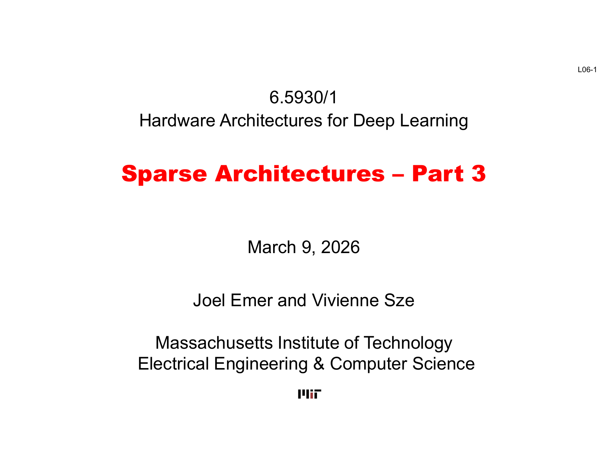
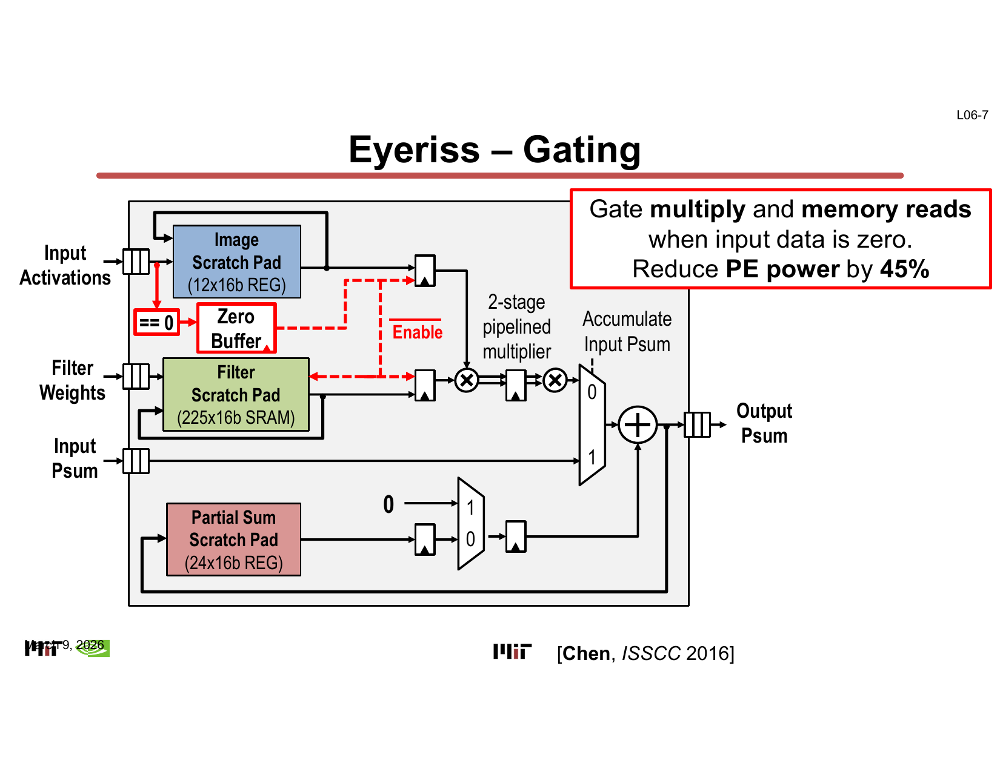
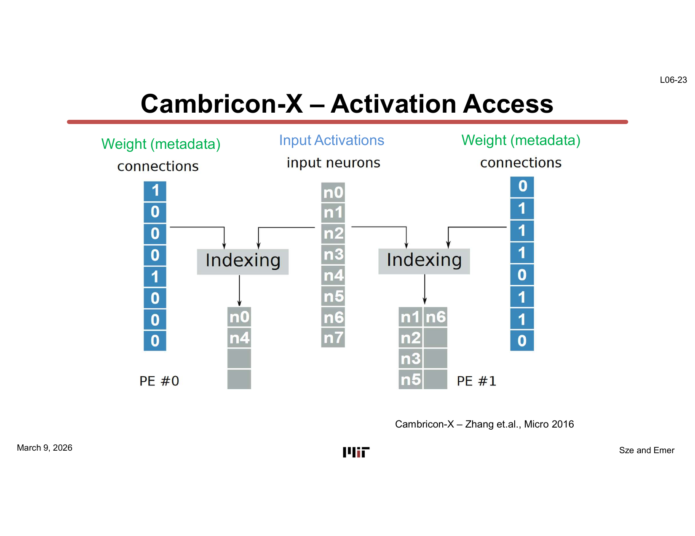
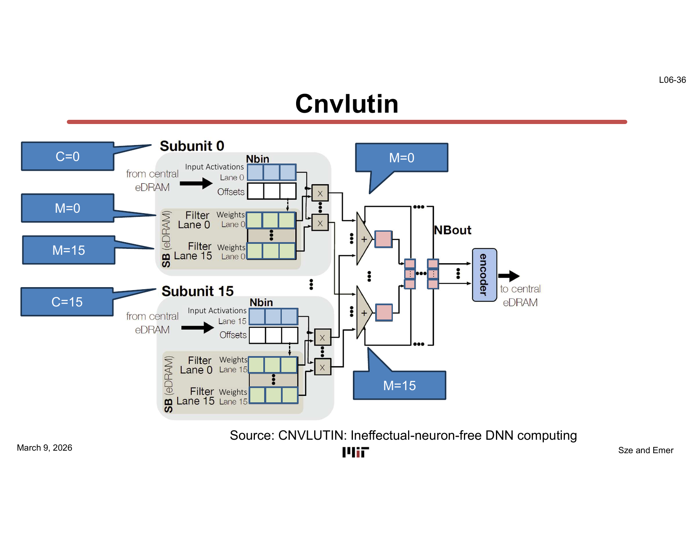
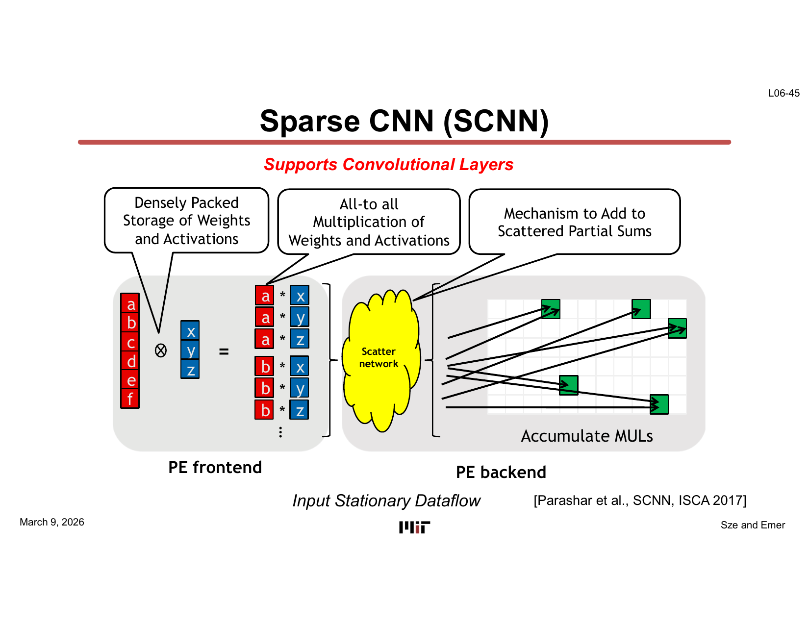
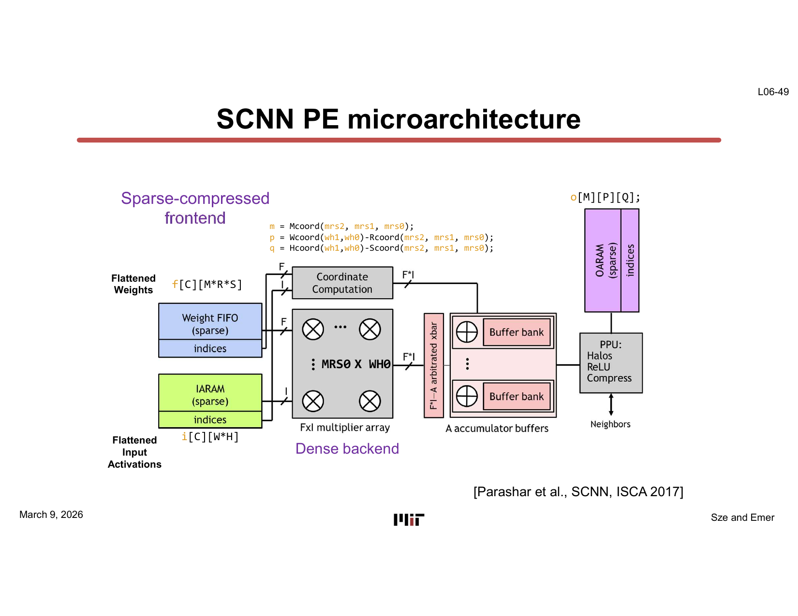
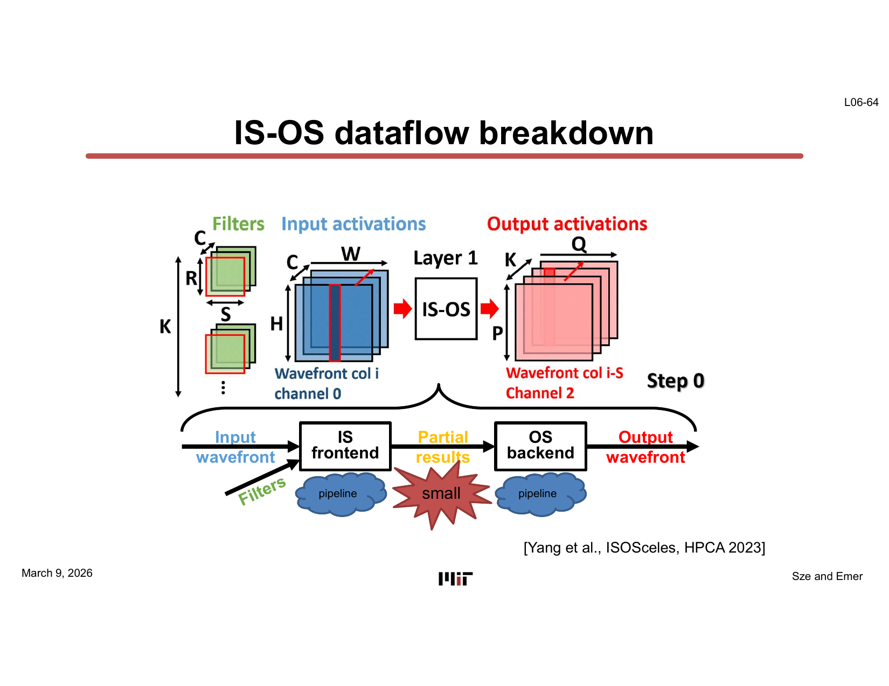
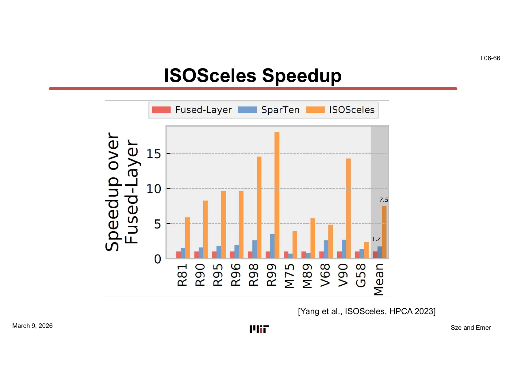

# L10 — 稀疏架構三（Sparse Architectures 3）

> **課程：** 6.5930/1 — 深度學習硬體架構（Hardware Architectures for Deep Learning）
> **講師：** Joel Emer 與 Vivienne Sze（MIT EECS）
> **講授日期：** 2026 年 3 月 9 日 · **投影片：** 66 頁 · **來源：** [`Lecture/L10-Sparse_Architectures-3.pdf`](../../Lecture/L10-Sparse_Architectures-3.pdf)
>
> *本文是以「概念」為單位重建講課脈絡的導讀（walkthrough），依主題而非逐頁編排。每一節都標註其對應的投影片範圍，方便你對照原始投影片閱讀。*

---

## 一句話總結（TL;DR）

稀疏架構系列的第三講、也是最終講，核心問題是：**真實加速器如何同時利用稀疏權重（sparse weights）與稀疏激活值（sparse activations）？** 本講以閘控（gating）和單維稀疏跳過（skipping）的快速回顧開場，隨後逐步深入困難的「聯合稀疏（joint sparsity）」情形。兩個里程碑架構是本講的錨點：**SCNN**（Sparse CNN，ISCA 2017）以卡式積（Cartesian-product）乘法陣列加散射網路（scatter network）處理輸入駐留（input-stationary）的稀疏乘稀疏計算；**ISOSceles**（HPCA 2023）則把計算拆成兩階段的 **IS→OS 資料流（IS-OS dataflow）** 管線，透過纖維交集（fiber intersection）與張量秩重排（tensor swizzling）實現最高 **7.5 倍的加速**。本講把 L08–L09 引入的所有表示法、交集、投影與跳過機制串聯為一幅完整圖像，並展示它們如何落地為真實晶片。

---

## 學習目標（Learning Objectives）

讀完本講後，你應該能夠：

- 解釋**閘控（gating）**（省能源，不省時間）與**跳過（skipping）**（能源與時間均省）對於零值運算元的差異。
- 追蹤從 1-D 卷積迴圈巢（loop nest）推導出**輸出駐留（output-stationary）、權重駐留（weight-stationary）、輸入駐留（input-stationary）** 三種資料流的轉換，並辨識各自利用了哪種稀疏性。
- 描述 **Cambricon-X** 如何透過壓縮權重流（compressed weight stream）加間接激活值查表（indirect activation lookup）處理稀疏權重卷積。
- 說明 **Cnvlutin** 如何藉由跳過零值激活值達到加速，以及它為何需要「每通道編碼器（per-channel encoder）＋重索引權重查表」的機制。
- 描述 **SCNN** 的卡式積架構：全對全乘法為何可行、散射網路的功能，以及**展平（flattening）**如何把 2-D 卷積對應為 1-D 內積。
- 說明 SCNN 的**延遲與能耗**如何隨聯合稀疏度變化。
- 描述 ISOSceles 採用的 **IS-OS 兩階段資料流**，包括張量**秩重排（swizzleRanks）** 在把不協調遍歷（discordant traversal）轉換為協調遍歷（concordant traversal）上扮演的角色。
- 解讀 ISOSceles 加速比圖表，並說明 **IS 前端／OS 後端管線** 為什麼能從聯合稀疏中產生乘法疊加的收益。

---

## 第一章 — 回顧：閘控 vs. 跳過，以及 1-D 卷積範本

> *投影片：L06-1 … L06-9*



### 處理零值運算元的兩種槓桿

每個稀疏加速器都必須決定：當輸入激活值或權重為零時，該怎麼辦？有兩個選項：

- **閘控（Gating）：** 照常執行乘加（MAC）週期，但透過時脈或資料閘控，切斷乘法器與記憶體讀取的電源。這省的是**能源，而非時間**——那個週期的時間槽依然被占用，只是什麼有用的事也沒做。
- **跳過（Skipping）：** 直接把零值運算元的那次操作從排程中刪除，讓硬體根本不發出那個週期。這**能源和時間都省**。

兩者的區別至關重要，因為跳過的實作難度更高：它需要提前（或極快地）知道哪個運算元是零、把資料流壓縮，以及能夠把在不可預知位置抵達的結果正確合併。

### 1-D 輸出駐留卷積——貫穿全講的範例

本講以 `o[q] += i[w] * f[s]`（`w = q + s`）這個簡單的 1-D 卷積作為教學範本。這個輸出駐留迴圈巢是一切推導的起點——透過改變迴圈順序與哪個張量（tensor）被壓縮，可以派生出四種情形：僅稀疏權重、僅稀疏激活值、兩者皆稀疏。

**Eyeriss — 閘控（投影片 L06-7）：**
Eyeriss（Chen et al., ISSCC 2016）在輸入激活值為零時，對兩級流水線乘法器及兩個記憶體讀取埠施加閘控，省下約 **45% 的 PE 功耗**，吞吐量不變。



> **為什麼重要：** 閘控是最簡單的稀疏性利用形式，不需要改變迴圈結構或資料格式。它的限制——省能源但不省時間——正是後續設計採用更複雜跳過機制的動機。

---

## 第二章 — 僅利用稀疏權重

> *投影片：L06-8 … L06-25*

### 輸出駐留＋稀疏權重

當權重稀疏並以壓縮格式（座標＋酬載列表，coordinate + payload list）儲存時，外層迴圈透過**協調遍歷（concordant traversal）**走訪非零的濾波器條目 `(s, f_val)`，直接取得座標 `s`。對每個非零權重，內層輸出迴圈計算 `w = q + s` 並查表（密集、未壓縮）輸入位置 `w`。這就是**輸出駐留稀疏權重**資料流：

```
for q in [0, Q):
  for (s, f_val) in f:          # 稀疏濾波器的協調遍歷
    w = q + s
    o[q] += i[w] * f_val
```

由於濾波器纖維（fiber）以協調方式遍歷，乘加次數恰好正比於非零權重的數量——直接線性加速。

### 權重駐留＋稀疏權重

把迴圈順序調換為 `for (s, f_val) in f: for q in [0, Q):` 即得到**權重駐留**變體。權重 `f[s]` 只載入一次並在所有輸出間複用——這正是權重駐留資料流的標誌。跳過同樣透過對非零權重的協調遍歷實現。

### 平行性：位置空間中的纖維切分（fiber splitting）

為了平行計算多個輸出，濾波器纖維被切分成**在位置空間均等的區塊** `f.splitEqual(K)`，每個 PE 組處理一個區塊。這暴露了對權重區塊的 `spatial-for` 迴圈。一個關鍵細節：按「位置」（而非座標）切分，能確保每個 PE 取得相同數量的權重位置槽——無論稀疏程度如何，這讓同步保持簡單。

### Cambricon-X——工業界實作

**Cambricon-X**（Zhang et al., MICRO 2016）是一個權重駐留的稀疏加速器。壓縮權重（元資料＋數值）以流的方式送入，每個 PE 用權重的座標作為索引，到共享的輸入激活值緩衝區進行查表。



每個非零權重的座標直接定址輸入，查表是一次簡單的索引讀取。這在輸入激活值密集（或接近密集）時效率很高，但無法利用輸入稀疏性。

> **為什麼重要：** 僅稀疏權重的情形有一個乾淨的實作：壓縮權重，協調遍歷，用座標查表取密集輸入。Cambricon-X 表明這可以在不需要過多硬體開銷的情況下規模化。它的限制在於讓激活值的稀疏性白白浪費。

---

## 第三章 — 僅利用稀疏激活值

> *投影片：L06-26 … L06-38*

### 權重駐留＋稀疏輸入

當輸入稀疏（座標＋酬載）而權重密集時，權重 `f[s]` 保持駐留，輸入纖維 `i` 被遍歷。迴圈把輸入座標限制在當前權重視窗範圍內：

```
for s in [0, S):
  for (w, i_val) in i if s <= w < Q + s:   # 視窗化遍歷
    q = w - s
    o[q] += i_val * f[s]
```

濾波器權重每個視窗位置只讀取一次——它是駐留的——而只有非零輸入才產生 MAC。這就是**權重駐留稀疏輸入**跳過資料流。

### 輸出駐留＋稀疏輸入

輸出駐留的變體先迭代輸出，再把輸入纖維限制在對應於每個輸出的視窗：

```
for q in [0, Q):
  for (w, i_val) in i if q <= w < q + S:   # 稀疏滑動視窗
    s = w - q
    o[q] += i_val * f[s]
```

「稀疏滑動視窗（sparse sliding window）」視覺化（投影片 L06-29…L06-34）展示了活躍輸入座標集如何隨 `q` 滑動。權重查表 `f[s]` 需要計算 `s = w - q`——一次簡單減法。

### Cnvlutin——規模化跳過零激活值

**Cnvlutin**（ISCA 2016）在完整的 2-D 多通道卷積中利用稀疏激活值。每通道編碼器壓縮輸入激活值圖，去除零項並記錄座標。輸出駐留的計算隨後透過重索引把每個非零激活值對應到對應的權重：

```
for q in [0, Q]:
  for m, f_c in f:
    for (c, (f_s, i_w)) in f_c & i_c:       # 通道的隱式交集
      for (w, i_val) in getWindow(i_w, q, S):
        s = w - q
        o[m, q] += i_val * f_s.getPayload(s)  # 未壓縮的權重查表
```

保留權重未壓縮，使 `getPayload(s)` 查表代價很低（直接索引）。Cnvlutin 表明，壓縮零激活值並跳過其 MAC 可以直接轉化為吞吐量的加速，收益隨網路激活值稀疏度成比例增長。



> **為什麼重要：** 僅稀疏輸入的情形與稀疏權重互補：壓縮激活值，透過協調遍歷跳過其 MAC，用座標查表取得權重。Cnvlutin 表明這確實帶來實際加速——但與 Cambricon-X 類似，它把另一個維度的稀疏性留在桌上了。

---

## 第四章 — 同時利用稀疏權重與稀疏激活值（SCNN）

> *投影片：L06-39 … L06-51*

### 聯合稀疏的挑戰

當權重**和**激活值都稀疏時，任何一個都無法作為「外層」迴圈的驅動者，同時讓另一個以密集方式查表。兩者都被壓縮，都必須被遍歷，而且它們的乘積必須被**散射（scatter）** 到在執行時才能確定的輸出位置。

### 輸入駐留＋兩者稀疏——卡式積的思路

**輸入駐留（input-stationary）** 資料流讓每個輸入激活值保持駐留，同時乘以所有非零濾波器權重，產生散佈到不同輸出的部分結果：

```
for (w, i_val) in i:
  for (s, f_val) in f if w-Q <= s < w:    # 把權重限制在當前輸入
    q = w - s
    o[q] += i_val * f_val
```

平行化後，輸入切分和濾波器切分都以空間方式遍歷。這產生了**全對全（all-to-all，即卡式積）乘法**：K 個空間活躍的輸入值各自乘以 K' 個空間活躍的濾波器值，同時產生 K×K' 個部分乘積。

### SCNN 架構

**SCNN**（Parashar et al., ISCA 2017）正是這樣實作的：

- **展平（Flattening）：** 透過替換索引變數，把 2-D 卷積重新表述為對展平索引 `(hw)` 和 `(mrs)` 的 1-D 內積，讓全對全乘法變得規整。
- **稀疏壓縮前端（Sparse-compressed frontend）：** 非零輸入 `i[C][W*H]` 與非零權重 `f[C][M*R*S]` 以壓縮格式儲存，PE 前端並行消耗它們。
- **密集後端／散射網路（Dense backend / scatter network）：** 每個 K×K' 乘積附帶計算好的輸出座標 `(m, p, q)`。散射網路把每個乘積路由到輸出部分和緩衝區中正確的累加器。





### 展平：為何能實現卡式積

替換 `h = p + r, w = q + s` 把 2-D 卷積 `O[m,p,q] += I[c,h,w] * F[m,c,r,s]` 轉化為以展平座標索引的形式。把展平後的輸入和權重纖維均等切分，再以空間方式遍歷，就得到全對全結構：

```
for (hw1, i_split) in i.splitEqual(4):
  for (mrs1, f_split) in f.splitEqual(4):
    spatial-for ((h,w), i_val) in i_split:
      spatial-for ((m,r,s), f_val) in f_split if "legal":
        p = h - r;  q = w - s
        o[m,p,q] += i_val * f_val
```

### SCNN 延遲與能耗隨聯合密度的變化

SCNN 的延遲與**激活值密度 × 權重密度**的乘積成正比（兩個張量中非零值的比例）。在高聯合稀疏度下（例如兩個張量各有 90% 的零），SCNN 的 MAC 週期數按比例減少。然而，散射網路引入了面積和能耗開銷，限制了在中等稀疏度下的收益。能耗曲線（投影片 L06-50 和 L06-51）表明 SCNN 的能效隨聯合稀疏度單調改善，但相對密集基準的交叉點取決於散射網路的代價。

> **為什麼重要：** SCNN 表明聯合稀疏可以用相對簡單的硬體機制（卡式積＋散射）加以利用，但不規整的散射步驟是真實的代價。這正是像 ISOSceles 這樣尋求更結構化方式處理聯合稀疏的架構的動機。

---

## 第五章 — IS-OS 兩階段資料流與 ISOSceles

> *投影片：L06-52 … L06-66*

### 權重駐留的迴圈翻轉及其代價

在介紹 ISOSceles 之前，本講展示了聯合稀疏迴圈的**權重駐留變體**（投影片 L06-52），其中濾波器切分是外層迴圈、輸入切分是內層。這種翻轉讓濾波器更加駐留，但*輸入*現在必須更頻繁地從更大的緩衝區讀取——一個明顯的不利之處，說明了資料流選擇對記憶體階層代價的高度敏感性。

### 輸出駐留聯合稀疏情形與纖維交集

**輸出駐留聯合稀疏**資料流迭代輸出 `q`，透過**纖維交集（fiber intersection）**找到同時貢獻到輸出 `q` 的（輸入, 權重）配對：

```
for q in [0,Q):
  for (s, (f_val, i_val)) in f.project(+q) & i:
    o[q] += i_val * f_val
```

`f.project(+q)` 把權重纖維的座標平移 `+q`，使其與輸入座標對齊。交集 `&` 隨後找出同時存在於投影後的權重纖維**和**輸入纖維中的（座標, 酬載）配對。只有在兩個張量中都非零的配對才貢獻一次 MAC——實現了真正的聯合跳過。

硬體元件圖（投影片 L06-56）展示了交集單元位於權重流和輸入流之間，連接至單個 MAC 單元和部分和累加器。

### IS-OS 資料流：把計算拆成兩階段

**ISOSceles**（Yang et al., HPCA 2023）的關鍵洞察是：試圖在單階段輸出駐留迴圈中同時利用兩種稀疏性，會導致對中間張量 `T` 的不協調遍歷。解法是把計算拆成兩個數學等價的階段：

**第一步（IS 輸入駐留階段）：**

```
T[c,h-r,w-s] = I[c,h,w] × F[c,m,r,s]
```

以協調方式遍歷 `i`（輸入駐留），乘以交集得到的濾波器條目，並累加到以 `[h, r, w-s]` 索引的中間張量 `T` 中。

**第二步（OS 輸出駐留階段）：**

```
O[m,p,q] = T[c,p+r,q]
```

遍歷 `T` 並累加到輸出，但 `T` 必須以**不同於寫入時**的秩順序存取。這是**不協調遍歷**——直觀上代價昂貴。

**用秩重排修正遍歷順序：**

修復方法是對 `T` 的秩進行**重排（swizzle）**：

```python
t = t.swizzleRanks(["H", "R", "Q"] -> ["Q", "R", "H"])
```

重排後，第二步的遍歷變為協調的，整條管線為：

- IS 前端處理稀疏輸入和稀疏權重 → 寫入部分結果到 `T`（小）。
- OS 後端（重排後）協調讀取 `T` → 累加到輸出。



### 管線為何有效

IS 前端和 OS 後端形成一條**兩階段管線**：

1. **IS 前端：** 輸入波前（Input wavefront）以協調方式遍歷非零激活值，與非零濾波器條目求交集，把部分和寫入小型 `T` 緩衝區。
2. **OS 後端：** 輸出波前（Output wavefront）協調讀取 `T`（重排後），把部分和排空到輸出圖。

圖中 `T` 緩衝區上的「small」標注強調了一個關鍵實作事實：由於 `T` 以位移後的座標索引，其**任意時刻的活躍佔用空間非常小**，可放入片上記憶體，避免 DRAM 流量。

### ISOSceles 加速比

ISOSceles 相對密集基準的實測加速比最高達 **7.5 倍**，各基準測試的平均約為 **1.7 倍**。



7.5 倍的峰值出現在聯合稀疏度極高時，此時 IS 和 OS 兩個階段都按比例跳過了大量運算。峰值與平均之間的差距，反映了並非所有層都同等稀疏、且重排＋管線開銷為可達加速比設定了下限。

> **為什麼重要：** ISOSceles 為稀疏架構系列畫上了完整的句號。它表明完整的 IS-OS 拆分——結合纖維交集、投影與張量秩重排——可以在真實硬體中實作並帶來可觀的實測加速。兩階段結構以一個小型中間緩衝區替換了 SCNN 的不規整散射網路，這是一個有理論根據的工程取捨，且具有推廣到其他工作負載的潛力。

---

## 關鍵詞彙（Key Terms）

| 詞彙 | 說明 |
|---|---|
| **閘控（Gating）** | 當運算元為零時切斷乘法器／記憶體電源；省能源，不省時間。 |
| **跳過（Skipping）** | 從排程中完全刪除零運算元的週期；能源和時間均省。 |
| **協調遍歷（Concordant traversal）** | 依座標順序迭代壓縮纖維，每個非零元素恰好以線性時間訪問一次。 |
| **不協調遍歷（Discordant traversal）** | 以不符合張量儲存秩順序的方式存取；需要隨機查表或重排。 |
| **纖維（Fiber）** | 多維張量的 1-D 切片，表示為（座標, 酬載）配對的列表。 |
| **纖維切分（splitEqual）** | 按位置把纖維切成均等區塊，用於建立空間平行性。 |
| **纖維投影（project）** | 把纖維的座標偏移一個常數，用於對齊兩條纖維以進行交集。 |
| **纖維交集（&）** | 找出同時存在於兩條纖維中的（座標, 酬載）配對；只產生聯合非零條目。 |
| **輸出駐留（Output-stationary, OS）** | 資料流：每個輸出累加器固定不動，輸入與權重流入。 |
| **權重駐留（Weight-stationary, WS）** | 資料流：每個濾波器權重固定不動，輸入與輸出流動。 |
| **輸入駐留（Input-stationary, IS）** | 資料流：每個輸入激活值固定不動，濾波器權重與輸出循環。 |
| **卡式積乘法（Cartesian product multiplication）** | K 個非零輸入與 K' 個非零權重的全對全相乘，同時產生 K×K' 個部分乘積。 |
| **散射網路（Scatter network）** | 把卡式積乘法器產生的每個部分乘積路由到正確輸出累加器位址的硬體網路。 |
| **展平（Flattening）** | 用單一展平索引 `(hw)` 替換 2-D 空間索引 `(h,w)`，把 2-D 卷積映射為 1-D 內積。 |
| **IS-OS 資料流** | 兩階段計算：IS 階段產生中間張量 T；OS 階段把 T 化約為輸出。 |
| **張量秩重排（swizzleRanks）** | 對張量的秩軸重新排序，把不協調遍歷轉換為協調遍歷。 |
| **Eyeriss** | 權重駐留加速器（ISSCC 2016），帶輸入激活值閘控；省約 45% PE 功耗。 |
| **Cambricon-X** | 權重駐留稀疏加速器（MICRO 2016），透過間接激活值查表利用稀疏權重。 |
| **Cnvlutin** | 輸出駐留稀疏加速器（ISCA 2016），透過每通道編碼利用稀疏激活值。 |
| **SCNN** | 稀疏 CNN 加速器（ISCA 2017），透過卡式積＋散射網路利用聯合稀疏。 |
| **ISOSceles** | IS-OS 稀疏加速器（HPCA 2023），透過兩階段管線加張量秩重排實現最高 7.5 倍加速。 |

---

## 重點回顧（Takeaways）

- **閘控省能源，跳過省時間。** 兩者在架構上有所不同，需要不同的硬體機制。多數高效能稀疏加速器兩者兼顧。
- **單維稀疏設計是可掌握的。** 僅稀疏權重（Cambricon-X）和僅稀疏激活值（Cnvlutin）兩種架構各自相對直接：對一個壓縮張量做協調遍歷，對另一個做密集查表。
- **聯合稀疏需要散射網路或兩階段管線。** SCNN 用卡式積乘法器加散射網路；ISOSceles 用 IS→OS 兩階段管線加纖維交集和張量秩重排。
- **SCNN 的卡式積概念乾淨**，但為散射網路付出了面積和能耗代價。其收益與權重密度和激活值密度的**乘積**成正比。
- **ISOSceles 的 IS-OS 拆分把不規整的散射轉化為結構化管線**，把部分結果存在小型中間張量 `T` 中，再對 `T` 的秩重排使第二階段協調。實測加速最高達 **7.5 倍**。
- **纖維交集是實現聯合跳過的數學原語**，在輸出駐留和 IS-OS 資料流中均可使用。硬體代價取決於表示法（位元遮罩和未壓縮最廉價；座標列表需要排序或合併邏輯）。
- **資料流選擇與稀疏性利用相互耦合。** 從輸出駐留切換到權重駐留會改變哪個張量更駐留、哪個資料必須從更大的緩衝區讀取——說明映射決策（TeAAL 的 Mapping 層）直接與格式層（Format 層）的稀疏選擇交互作用。

---

## 與後續講次的連結（Connections）

- **本講結束了稀疏架構系列（L07–L10）。** L07 引入稀疏性動機與格式；L08 引入纖維表示、協調／不協調遍歷與閘控；L09 涵蓋單維稀疏的跳過；L10（本講）涵蓋聯合稀疏與兩個案例研究加速器（SCNN 和 ISOSceles）。
- **L11 — 進階技術：** 下一講轉向新穎元件技術（RRAM、光學、超導），這些技術可能在物理層面實現不同的稀疏性利用策略。
- **L12 — 降低精度：** 量化（quantization）與低位元算術和稀疏性交互——量化網路中的零值條目可能來自不同原因，且兩種技術可以疊加組合。
- **TeAAL 金字塔的再現：** SCNN 和 ISOSceles 的案例研究展示了金字塔所有四層在真實設計中的作用：**格式（Format）**（壓縮纖維）、**映射（Mapping）**（IS、OS 還是 IS-OS 資料流）、**架構（Architecture）**（卡式積乘法器 vs. IS-OS 管線）、**綁定（Binding）**（散射網路路由 vs. 秩重排張量索引）。

---

## 附錄 — 投影片對照表（Slide-to-Section Map）

| 投影片 | 章節 |
|---|---|
| L06-1 | 標題——稀疏架構第三部，2026 年 3 月 9 日 |
| L06-2 … L06-4 | 第一章 — CONV 層回顧；1-D 輸出駐留卷積迴圈巢 |
| L06-5 … L06-6 | 第一章 — 閘控 vs. 跳過：能源節省 vs. 時間節省 |
| L06-7 | 第一章 — Eyeriss 閘控：PE 功耗降低 45% |
| L06-8 … L06-9 | 第二章 — 權重駐留資料流；密集 vs. 壓縮表示 |
| L06-10 … L06-14 | 第二章 — 輸出駐留稀疏權重資料流與資料路徑圖 |
| L06-15 … L06-16 | 第二章 — 權重駐留稀疏權重資料流與資料路徑圖 |
| L06-17 … L06-21 | 第二章 — 位置空間中的纖維切分；擴展到多維 |
| L06-22 … L06-24 | 第二章 — 平行權重駐留稀疏權重迴圈巢 |
| L06-23 | 第二章 — Cambricon-X：權重元資料驅動的間接激活值查表 |
| L06-25 | 第三章 — 轉折：利用稀疏輸入 |
| L06-26 … L06-27 | 第三章 — 權重駐留稀疏輸入資料流與資料路徑 |
| L06-28 … L06-34 | 第三章 — 輸出駐留稀疏輸入資料流；稀疏滑動視窗 |
| L06-35 | 第三章 — 輸出駐留稀疏輸入資料路徑圖 |
| L06-36 … L06-38 | 第三章 — Cnvlutin：每通道編碼器、迴圈巢、加速比 |
| L06-39 … L06-41 | 第四章 — 輸入駐留稀疏權重＋輸入；資料路徑圖 |
| L06-42 … L06-43 | 第四章 — 聯合稀疏纖維切分；平行 IS 迴圈巢 |
| L06-44 | 第四章 — 卡式積乘法可視化 |
| L06-45 … L06-46 | 第四章 — SCNN 架構概覽與展平 |
| L06-47 … L06-48 | 第四章 — SCNN 分塊迴圈巢（單通道；展平後） |
| L06-49 | 第四章 — SCNN PE 微架構：稀疏壓縮前端＋密集散射後端 |
| L06-50 … L06-51 | 第四章 — SCNN 延遲與能耗隨聯合密度的變化 |
| L06-52 | 第五章 — 權重駐留聯合稀疏：迴圈翻轉與緩衝區代價 |
| L06-53 … L06-56 | 第五章 — 輸出駐留聯合稀疏：纖維投影＋交集 |
| L06-57 … L06-62 | 第五章 — IS-OS 資料流數學推導：兩階段推導與秩重排 |
| L06-63 … L06-65 | 第五章 — ISOSceles IS-OS 管線圖（IS 前端 → T → OS 後端） |
| L06-66 | 第五章 — ISOSceles 加速比：最高 7.5 倍，平均 1.7 倍 |
