# L11 — 進階技術（Advanced Technologies）

> **課程：** 6.5930/1 — 深度學習硬體架構（Hardware Architectures for Deep Learning）
> **講師：** Joel Emer 與 Vivienne Sze（MIT EECS）
> **講授日期：** 2026 年 3 月 9 日 · **投影片：** 81 頁 · **來源：** [`Lecture/L11-Advanced_Tech.pdf`](../../Lecture/L11-Advanced_Tech.pdf)
>
> *本文是以「概念」為單位重建講課脈絡的導讀（walkthrough），依主題而非逐頁編排。每一節都標註其對應的投影片範圍，方便你對照原始投影片閱讀。*

---

## 一句話總結（TL;DR）

DNN 加速器中最大的能耗不是算術運算——而是**搬移資料**。本課程至今介紹的每一種技術，本質上都是一種「讓資料靠近運算」的手段。本講把這個洞見推至邏輯的極端：如果讓運算直接移進記憶體本身呢？**記憶體內運算（Compute-in-Memory, CiM）** 利用記憶體元件的物理特性——電阻、電壓、電荷——在儲存陣列內部直接執行乘加（MAC）運算，從根本上消除最昂貴的資料搬移。本講依序涵蓋：(1) 從 SRAM 到 3D 疊層 DRAM 的記憶體技術全貌，說明為何 CiM 是必然的；(2) 類比交叉開關（analog crossbar）作為 CiM 核心原語及其設計取捨；(3) **Titanium Law**——量化類比數位轉換器（ADC）開銷為 CiM 能耗的根本瓶頸；(4) **RAELLA** 作為「免重新訓練逃脫瓶頸」的案例研究；(5) CiM 在 SRAM、DRAM 與非揮發性記憶體（NVM）上的不同實作；以及 (6) **CiMLoop** 作為能夠進行系統性設計空間探索的建模工具，並以光子運算（photonic computing）作為新興前沿。統一的教訓是：當計算基板的物理特性進入設計循環時，跨層（裝置 → 電路 → 架構 → 映射 → 工作負載）的協同設計（co-design）是不可迴避的。

---

## 學習目標（Learning Objectives）

讀完本講後，你應該能夠：

- 說明**記憶體技術分類**（SRAM、eDRAM、3D 疊層 DRAM、NVM），以及每一種如何從不同面向緩解資料搬移瓶頸。
- 描述**類比交叉開關**如何利用歐姆定律與克希荷夫電流定律執行矩陣向量乘積。
- 列出 **Titanium Law 的四個因子**，並說明各個旋鈕彼此之間的制衡關係。
- 解釋為何 **ADC 開銷**（能耗與面積）在多數 CiM 設計中是主導成本，以及應對它的設計策略。
- 描述 **RAELLA** 用來減少 ADC 輸入範圍的三種技術（免重新訓練）。
- 闡明為何 **CiM 需要跨層協同設計**（裝置 ↔ 電路 ↔ 架構 ↔ 映射 ↔ 工作負載），以及 CiMLoop 如何對整個堆疊建模。
- 舉出至少一種**超越 SRAM 的 CiM 基板**（DRAM、ReRAM/memristor、SRAM、光子學），並說明其區別特性。

---

## 第一章 — 為什麼要把運算帶向記憶體？

> *投影片：L11-2 … L11-9*

### 記憶體技術全貌

每一個實際的 DNN 系統都包含一個記憶體技術的階層（hierarchy），各技術在密度、成本與存取能耗之間佔據不同的位置：

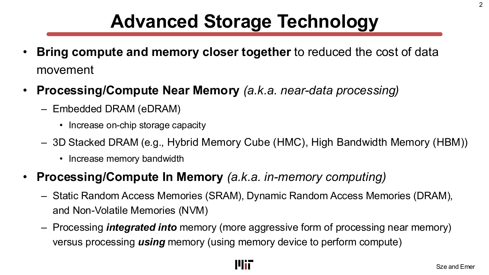

本講把這些技術組織成兩大策略，以攻克資料搬移問題：

- **鄰近記憶體的處理／運算（Processing/Compute Near Memory，近資料處理）：** 把運算*靠近*記憶體，但兩者仍物理分離。
  - *嵌入式 DRAM（eDRAM）* ——密度比 SRAM 高（比六電晶體 SRAM 高 2.85 倍），可在晶片上放更多儲存，避免昂貴的片外 DRAM 存取。DaDianNao 用 36 MB eDRAM 存放全連接層的權重，能效比 DDR3 高 321 倍。
  - *3D 疊層 DRAM* ——將多層 DRAM 堆疊在邏輯晶粒上方（混合記憶體立方體 HMC / 高頻寬記憶體 HBM）。NeuroCube 展示了比 DDR3 高 6.25 倍的頻寬；Tetris 將 HMC 與 Eyeriss 空間架構結合，達到比二維 DRAM 低 1.5 倍的能耗與高 4.1 倍的吞吐量。

- **記憶體內的處理／運算（Processing/Compute In Memory，記憶體內運算）：** 將運算*整合進*記憶體陣列本身，或*使用*記憶體元件來執行計算。這是本講其餘部分的核心主題。

### 片外 DRAM 存取成本是根本驅動力

記憶體存取成本的量化數據，是後續一切討論的基礎：

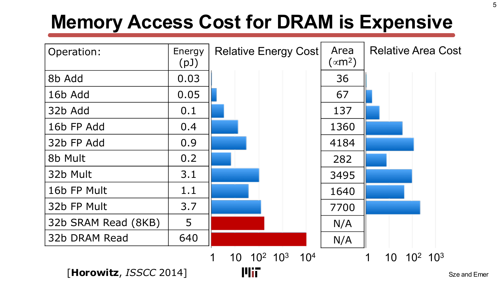

這些數字（來自 Horowitz, ISSCC 2014）觸目驚心：一次 32 位元 DRAM 讀取耗費 **640 pJ**，而一次 8 位元整數加法僅需 **0.03 pJ**，兩者比值超過 **20,000:1**。就算是片上 32 位元 SRAM 讀取（8 KB），也需要約 5 pJ，是 8b 加法的 167 倍。結論不可迴避：資料搬移是瓶頸，任何能降低其成本的方法都有巨大的價值。

> **為什麼重要：** L01 建立的能耗階層（RF 1× → DRAM 200×）如今有了實測矽晶片數據的支撐。CiM 是直接的架構回應：既然對權重陣列的讀取是最大的成本，如果那次讀取根本不發生——因為運算在陣列內部完成了——又如何？

---

## 第二章 — 類比交叉開關：CiM 的核心原語

> *投影片：L11-10 … L11-27*

### 傳統處理 vs. 記憶體內運算

在系統層級，對比最為鮮明：

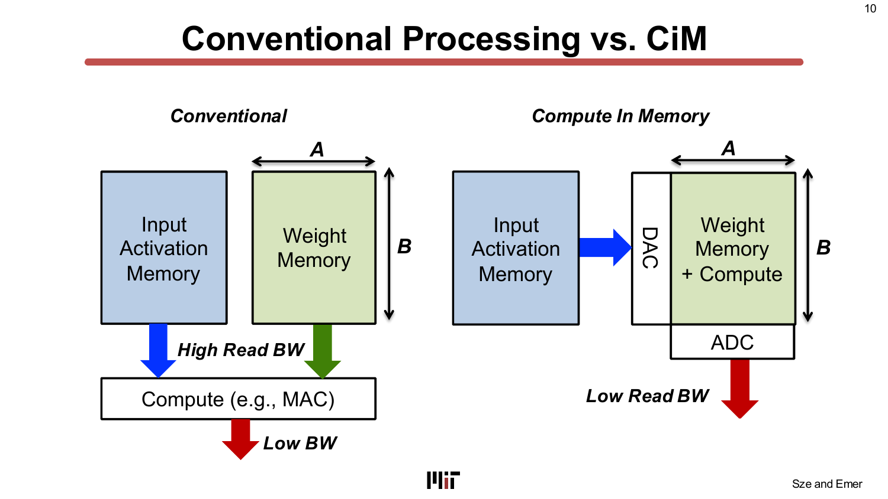

在*傳統*加速器中，權重存放在記憶體陣列中，必須透過高頻寬匯流排讀出到獨立的 MAC 單元。讀取匯流排是瓶頸：大量位元組必須走過漫長的導線，在每一跳都付出電容充放電能耗。在 *CiM* 加速器中，權重留在陣列中，輸入激活值以電壓（透過 DAC）送至陣列周邊電路，運算在陣列內部進行，只有一個低頻寬的電流加總輸出，再由 ADC 轉換為數位訊號。晶片內部的讀取頻寬大幅降低。

### 歐姆定律做乘法，克希荷夫定律做累加

物理機制簡潔優雅：

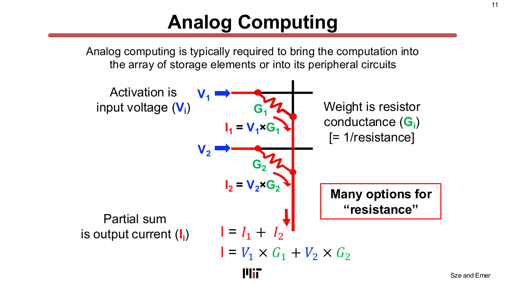

- 每個**權重**以元件的*電導*（conductance）G 來儲存（電導 = 1 / 電阻）。
- 每個**輸入激活值**以字線（word line）上的*電壓* V 來傳遞。
- 由歐姆定律，流過元件的電流為 I = V × G。這就是一次**乘法**。
- 同一位元線上的所有電流依克希荷夫電流定律自動相加：I_total = Σ Vᵢ × Gᵢ。這就是一次**累加**（點積）。

因此，一整列交叉開關可以在*一個時步*內完成整個點積——使用電路的物理特性，無需任何數位加法器樹。這是 CiM 倡導者稱之為「根本性不同的運算典範」的原因。

### CiM 陣列中的權重駐留資料流（weight-stationary dataflow）

CiM 陣列的自然資料流是**權重駐留（weight-stationary）**：權重寫入陣列一次後保持不動，輸入向量流串流通過。

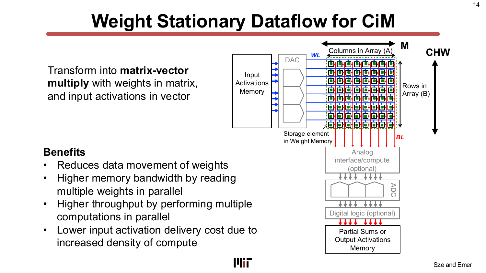

這個映射完美嵌入早先講次中引入的迴圈巢狀（loop nest）視角：M（輸出通道，對應權重矩陣的列）與 CHW（輸入通道—高度—寬度，對應權重矩陣的行）維度分別映射到陣列的列與行。好處包括：減少權重資料搬移（權重程式化後不再移動）、更高的記憶體讀取頻寬（一行同時並行讀取多個權重）、更高的吞吐量（多個點積運算同步執行），以及更低的輸入激活值傳遞成本（激活值一次同時傳遞給多列）。

### 設計考量與實際限制

類比運算引入了一系列會*削減*理想增益的實際限制：

1. **非線性與元件變異（製程/電壓/溫度 PVT）：** 類比數值對製程、電壓與溫度的變化非常敏感，限制了可達到的精度。
2. **每個權重所需的儲存元件數（權重切片 weight slicing）：** 每個元件通常只能儲存 1–4 位元的精度。一個完整的 8 位元權重需要多個元件（「位元切片 bit slices」），使陣列面積和 ADC 轉換次數倍增。
3. **陣列大小限制：** 字線與位元線的電阻和電容隨陣列尺寸增大。大型陣列降低穩健性與感測餘裕。當工作負載無法填滿整個陣列時，利用率下降。
4. **可並行激活的列數：** 受限於 ADC 可解析的範圍。更多並行列 → 更大的類比加總 → 需要更高解析度的 ADC → 指數級更高的能耗。
5. **可並行激活的行數：** 受限於 ADC 面積（每行一個 ADC 代價高昂）。
6. **輸入傳遞時間：** DAC 非線性迫使採用時間編碼的輸入（脈衝寬度調變 PWM），每個輸入需要多個週期，降低吞吐量。
7. **時域累加（temporal accumulation）：** 元件的一位元或兩位元操作需要多個週期的時域累加來建立多位元結果，進一步降低吞吐量。

這些限制意味著，類比運算的原始物理加速，會被陣列兩側數位介面的大量開銷顯著侵蝕。

> **為什麼重要：** 任何 CiM 所宣稱的增益，都必須對照這些開銷加以評估。其中的 ADC——它必須把類比位元線電流轉換回數位數字——最終是主導成本。下一章會精確量化這一點。

---

## 第三章 — Titanium Law 與 ADC 瓶頸

> *投影片：L11-29 … L11-52*

### CiM 加速器的能耗分解

當你把整個系統的能耗納入考量，能耗分布令人驚訝：

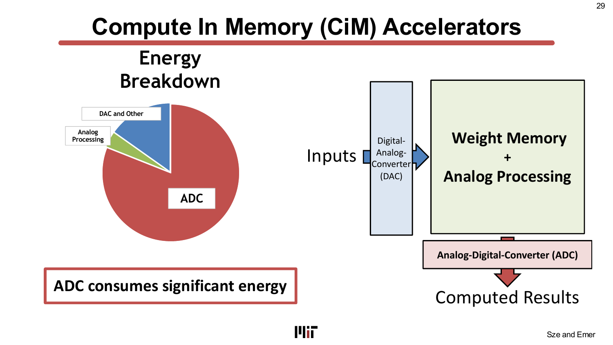

ADC（類比數位轉換器）消耗了系統總能耗的相當大一部分——在許多設計中，甚至超過類比交叉開關計算本身的能耗。DAC 能耗與其他類比處理的開銷更加劇了這一問題。CiM 所承諾的效率確實存在，但大部分被轉換介面的開銷所消耗。

### Titanium Law：ADC 能耗的封閉解析式

本講介紹了 Andrulis, ISCA 2023 提出的一個關鍵分析結果：

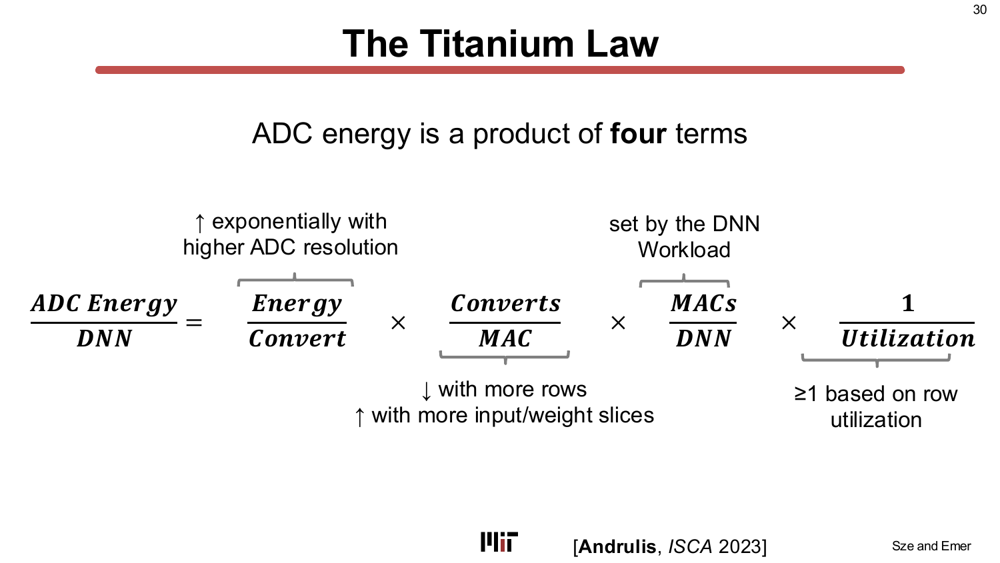

每次 DNN 推論的總 ADC 能耗是四個因子的乘積：

```
ADC 能耗        每次轉換     轉換次數      MAC 次數       1
────────── = ──────────── × ────────── × ────────── × ──────────
    DNN        的能耗         / MAC          / DNN        利用率
```

- **Energy/Convert（每次轉換能耗）：** 每次 ADC 轉換的能耗——隨 ADC 解析度（位元數）*指數級*增加。這是最陡峭的項。
- **Converts/MAC（每 MAC 轉換次數）：** 每次 MAC 所需的 ADC 轉換次數——由權重切片與輸入切片決定（表示所需精度的位元切片數量）。
- **MACs/DNN（每次 DNN 推論的 MAC 總次數）：** 由工作負載而非硬體決定。
- **1/Utilization（利用率倒數）：** 陣列利用率的懲罰項——恆大於等於 1，當工作負載無法填滿陣列維度時惡化。

這條定律揭示了根本的張力：降低 ADC 解析度（節省 Energy/Convert）需要更多切片（提高 Converts/MAC）；增大陣列（降低 1/Utilization）會增加類比加總範圍（提高所需 ADC 解析度）。每個旋鈕都會收緊另一個限制。

### 套用定律：為何 ISAAC 的取捨難以逃脫

ISAAC 設計（Shafiee, ISCA 2016）使用 128 列的 2 位元 memristor。套用 Titanium Law：

- 將列數增至 1024 列（降低 1/Utilization）但迫使 ADC 升至 11 位元解析度，ADC 能耗更加主導。
- 將每個 memristor 的位元數降至 1 位元（降低 Energy/Convert），但增加了 Converts/MAC——ADC 能耗再次上升。

兩個方向都使 ADC 能耗相對於交叉開關運算能耗更加惡化。這不是 ISAAC 的缺陷，而是設計空間中的基本張力。

### 兩種先前的逃脫路線及其代價

已有兩種策略被用來繞過 Titanium Law，各自付出代價：

1. **權重剪枝（weight-count-limited 設計）：** 透過剪枝網路來降低 MACs/DNN。這降低了「MACs/DNN」因子。代價：剪枝後的網路可能犧牲精度；更少的權重可能導致 CiM 陣列的利用率下降。
2. **低解析度 ADC（sum-fidelity-limited 設計）：** 使用更低解析度的 ADC，降低 Energy/Convert。代價：ADC 無法精確表示所有輸出值；必須透過重新訓練 DNN 來使其容忍低解析度讀出。

兩種方法都**需要重新訓練 DNN**才能保持精度——這耗費高昂，並將硬體設計與模型直接耦合在一起。

### RAELLA：免重新訓練地重塑分布

RAELLA（Andrulis, ISCA 2023）透過三種在*推論時*套用的互補技術，在不修改 DNN 的情況下逃脫瓶頸：

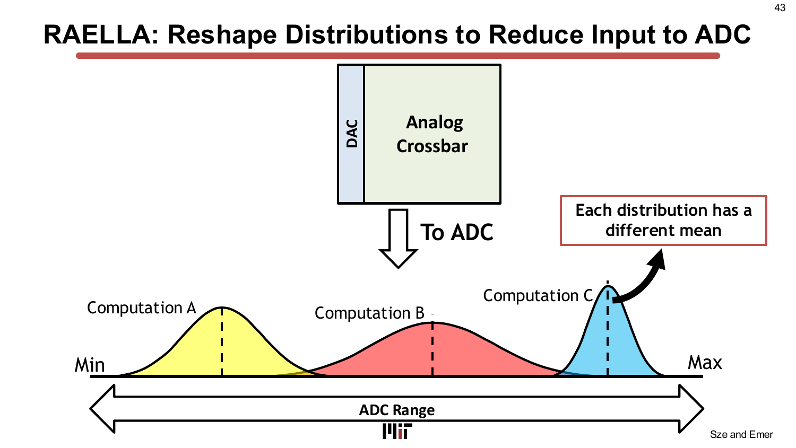

**技術一 — 中心 + 偏移量編碼（Center + Offset Encoding，平移分布均值）：**
每一行的權重被分解為*中心值*（均值）與*偏移量*（殘差）。中心值以高精度數位計算（代價低，因為它是純量乘法）。類比陣列只計算偏移量，其數值聚集在零附近——所需的 ADC 動態範圍遠小於原始計算。這使類比結果的分布向零偏移，降低了所需的 ADC 動態範圍。

**技術二 — 自適應權重切片（Adaptive Weight Slicing，只切分大結果的運算）：**
RAELLA 不是對所有權重都使用固定精度的切片，而是監控特定運算的結果是否超出 ADC 範圍。只有超範圍的行才會以更細的權重切片重新執行。這使大多數運算的 Converts/MAC 保持在低水平，同時妥善處理離群值。

**技術三 — 動態輸入切片（Dynamic Input Slicing，推測並恢復）：**
RAELLA 先以粗粒度輸入切片*推測*執行。若結果在範圍內，無需進一步動作。若超出範圍，再以更細的輸入切片重新執行恢復。這將額外 ADC 轉換的代價只攤分到需要的那部分輸入上。

三種技術合計達到 **ADC 輸入的 1024 倍縮減**，使更低解析度的 ADC 成為可能，且無精度損失：

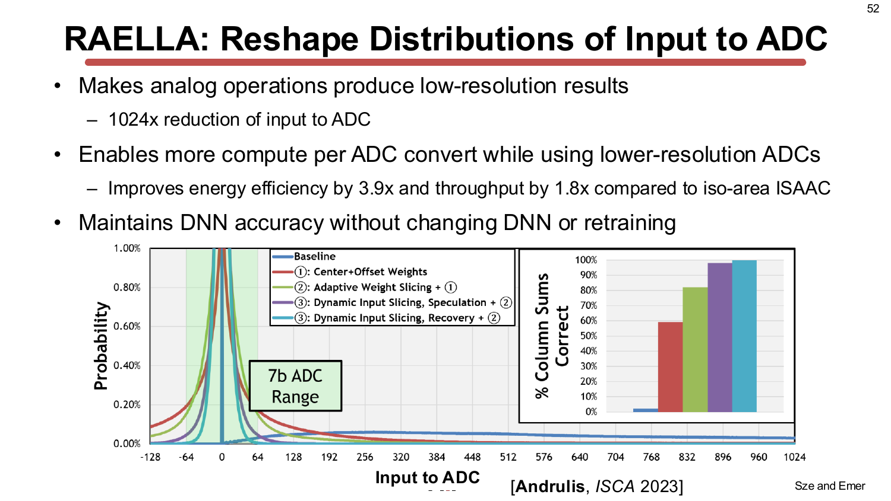

與等面積的 ISAAC 基準相比，RAELLA 達到 **3.9× 能效提升**與 **1.8× 吞吐量提升**，同時**在不修改或重新訓練 DNN 的情況下保持精度**。

> **為什麼重要：** Titanium Law 不只是一個描述性公式——它是一個設計指南針。RAELLA 展示了：只要對這條定律有足夠精確的理解，你就能重塑*輸入到瓶頸項*（透過降低 ADC 解析度來降低 Energy/Convert），而非只是調整彼此制衡的旋鈕。這是最具體形式的跨層協同設計。

---

## 第四章 — 跨基板的 CiM 技術

> *投影片：L11-53 … L11-60*

### 為 CiM 設計 DNN——不同的最佳化景觀

一個重要洞見：適合數位加速器的*最佳* DNN，在 CiM 加速器上未必是最佳的。取捨關係不同：

- **權重數量 vs. 利用率：** 剪枝權重在數位硬體上很理想（更少的 MAC），但在 CiM 上可能損害陣列利用率（更少的列被填充）。CiM 陣列在權重矩陣稠密時表現最好。
- **濾波器形狀：** 由於 CiM 是權重駐留的，它偏好*較少的激活值*相對於權重，因此較淺但濾波器較大的網路可能比較深但濾波器很小的網路更適合 CiM。
- **對非理想性的魯棒性：** 量化感知訓練（quantization-aware training）對 CiM 更重要，因為元件變異引入的雜訊需要 DNN 能夠容忍。

### 使用 SRAM 位元格的 CiM

基於 SRAM 的 CiM 利用存取電晶體的 I-V 關係來執行乘法。兩種實作：

- **電流模式（current-mode）：** 字線電壓調變電晶體電流；二進制權重存在位元格的狀態中。位元線電流相加得到部分和。受限於電晶體非線性。
- **電荷共享（charge-sharing）：** 使用顯式電容儲存電荷。位元格上的 XNOR 邏輯執行二進制乘法；位元線上的電荷共享執行加法（Vf = ½(V1 + V2)，是加總的縮放值）。比電流模式有更好的線性度與匹配性。

SRAM CiM 的吸引力在於它使用標準 SRAM 製程——無需特殊元件或製程修改。

### 使用 DRAM 的 CiM

基於 DRAM 的 CiM（Ambit, MICRO 2017）利用電荷共享執行**位元邏輯 AND 與 OR** 運算，資料完全不離開陣列：

- 同時激活三列會引發電荷共享，根據預充電電壓（AND: VDD/2 − δ，OR: VDD/2 + δ）解析為 AND 或 OR 結果。
- 多位元乘法需要多個週期的時域累加，但運算以完整的 DRAM 匯流排寬度並行執行——帶來跨列的大規模平行性。

### 使用非揮發性記憶體（memristor）的 CiM

非揮發性記憶體（ReRAM/RRAM、相變記憶體 PCM、自旋轉移力矩 STT-RAM）以無需供電也能保持的電阻狀態儲存資料。Memristor 尤其具有吸引力，因為：

- **電阻可直接程式化** ——權重以電導值編碼，這正是 CiM 的自然表示形式。
- **比 SRAM 密度更高** ——無需六電晶體位元格。
- **非揮發性** ——權重在斷電後仍存在，使推論可以不重新載入而即時開始。

挑戰在於每個元件的有限精度（通常 1–4 位元）和元件間的變異性，這使得權重切片和仔細校正變得更加必要。

> **為什麼重要：** 沒有哪一種基板在所有應用中都占主導地位。正確的選擇取決於目標應用（功耗、面積、延遲、精度）、DNN 架構與可取得的製造製程。這種多樣性正是需要一個能夠跨所有基板進行比較的建模框架的原因。

---

## 第五章 — CiMLoop：對整個堆疊建模

> *投影片：L11-60 … L11-75*

### CiM 的設計空間極為龐大

本講列舉了 CiM 堆疊每一層的設計選擇：

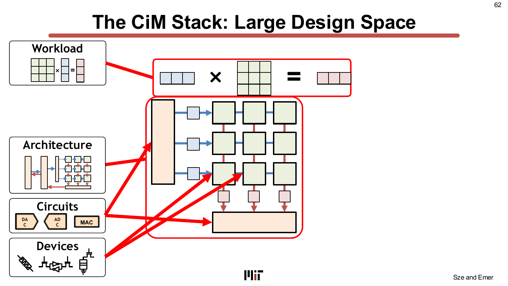

每一層都有多個選項：

- **裝置（Devices）：** SRAM、DRAM、ReRAM、STT-RAM、光子元件、超導電路。
- **電路（Circuits）：** DAC 類型（R-2R、脈衝列 pulse-train、電容式）、ADC 類型（Flash、SAR、積分式）、MAC 電路（電流模式、電荷共享、數位 XNOR）、稀疏性/AND 邏輯控制器。
- **架構（Architecture）：** 陣列維度、陣列數量、記憶體分行（banking）、周邊電路組織。
- **映射（Mapping）：** 哪些維度映射到列/行、迴圈順序、權重駐留 vs. 輸出駐留、批次大小。
- **工作負載（Workload）：** DNN 層的類型、形狀、稀疏性、精度。

面對如此眾多的相互作用選擇，手工分析無法系統性地探索這個空間。跨層的相依性（資料值影響元件能耗，而能耗依賴於編碼方式，編碼依賴於映射，映射依賴於架構……）使任何解耦分析都不夠精確。

### CiMLoop：靈活、精確、快速

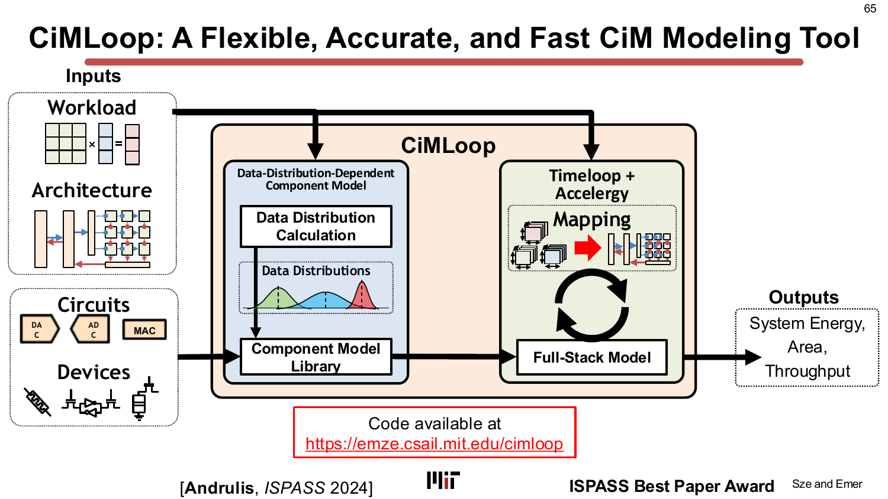

CiMLoop（Andrulis, ISPASS 2024，**最佳論文獎**）是基於 Timeloop+Accelergy 的工具，擴展以處理 CiM 的跨堆疊交互。其三個區別特性：

1. **靈活性（Flexibility）：** 使用者自訂規格描述任何裝置、電路或架構元件。函式庫包含 6T SRAM、8T SRAM、DRAM、ReRAM、多種 ADC 架構、DAC 架構以及光子元件的模型。使用者可透過外掛介面新增模型。

2. **精確性（Accuracy，資料值相關建模）：** 多數先前工具（Timeloop、NeuroSim）假設每次操作的能耗固定。CiMLoop 認識到在類比電路中，能耗取決於*實際被處理的數值*：電導更高的 memristor 在相同輸入電壓下耗散更多功率。CiMLoop 捕捉整條鏈：數值 → 二進制表示 → 編碼 → 位元指派到元件 → 每個元件的能耗。結果誤差在 **8% 以內**（相對於逐值模擬）。

3. **速度（Speed，統計建模）：** 精確的逐值模擬需要評估超過 10¹² 個數值組合。CiMLoop 改為計算*資料分布*（直方圖）並套用統計模型——與 NeuroSim 精度相近，但速度快 **>1000 倍**。與 Timeloop（快但不精確）相比，CiMLoop 速度相當但精確度高 10 倍。

### 蘋果對蘋果的比較與設計空間探索

有了共同的建模框架，來自不同論文的設計（不同技術節點、ADC 類型、記憶體元件）可以透過標準化至相同技術、ADC 與元件來公平比較：

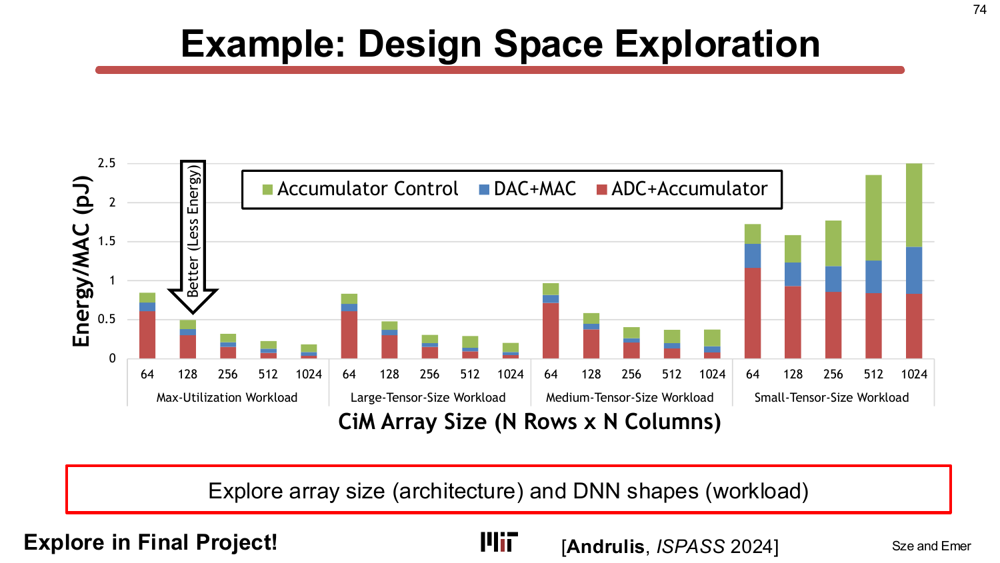

CiMLoop 也能探索陣列大小（架構決策）如何與 DNN 層形狀（工作負載屬性）交互作用——這是解耦工具無法回答的問題。這種聯合最佳化，正是課程期末專題所提議探索的方向。

### CiMLoop 促成的合作——以及光子運算

CiMLoop 已在 MIT 被用來為不只是傳統 CiM 建模，還包括：

- **電阻式記憶體 CiM**（與 Jesus del Alamo 團隊的合作）
- **超導電子學 CiM**（與 Karl Berggren 和 Neil Gershenfeld 的合作——起源於一個 6.5930/1 的期末專題！）
- **光學／光子運算**（與 Dirk Englund 團隊的合作）

光子學（photonics）前沿值得暫停一下：

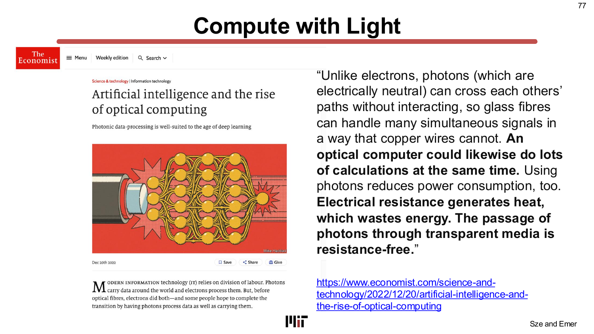

光子具備使其對 DNN 運算極具吸引力的特性：

- **與距離無關的能耗：** 在晶片上移動一個光子所消耗的能量幾乎與距離無關——與電子不同，電子傳輸時導線電阻造成的歐姆損耗與導線長度成正比。
- **被動乘法（passive multiplication）：** 光學調製器根據權重值縮放光信號強度，無需主動放大。
- **無電磁干擾：** 光子在線性介質中不相互作用，使得波長多工的密集互連成為可能。

2017 年的 Nature Photonics 論文（Shen 等人）展示了使用馬赫-曾德干涉儀（Mach-Zehnder interferometer）網路在光域執行矩陣乘積。Lightmatter 的 Envise 晶片基於此原理，據報告在執行 BERT 推論時比 NVIDIA A100 快 5 倍，功耗僅 1/6。

CiMLoop 的函式庫包含光子元件的模型（波導、微環諧振器、光電二極體、調製器驅動器），使相同的系統性協同設計方法論可以應用於光子 DNN 加速器。

> **為什麼重要：** 建模框架不是某一個設計點的產物——它是使整個 CiM DNN 加速領域更具可重現性與可比性的基礎設施。沒有它，每篇新論文都與不同技術節點、不同假設的基準做比較，難以衡量真正的進步。

---

## 獨立學習指南（Standalone Study Guide）

### 進入下一講前必須掌握

- 說明 compute-in-memory 如何透過把 MAC 移向 storage 來攻擊資料搬移成本。
- 描述 analog crossbar 的 multiply-accumulate 原語，以及 ADC/DAC overhead 為什麼重要。
- 說出 Titanium Law：隨 resolution 與 array size 增加，ADC cost 可能主導 analog CiM 能耗。
- 將 RAELLA 理解為 arithmetic reform，而不只是更好的 memory cell。
- 把 CiMLoop 視為跨 devices、circuits、architectures、mappings、workloads 的 modeling bridge。

### 自我檢核問題

1. Crossbar 中哪個部分執行乘法？哪個部分執行累加？
2. 為什麼把 ADC 納入後，analog CiM 可能失去能耗優勢？
3. 比較 CiM designs 時，為什麼需要 apples-to-apples modeling framework？

### 練習

1. 追蹤一次 vector-matrix multiply 如何通過 resistive crossbar，包含 input delivery 與 output conversion。
2. 列出三種 device-level nonidealities，並說明每一種如何表現為 model accuracy loss。
3. 依 precision、density、programmability 比較 SRAM CiM、DRAM CiM、ReRAM CiM 與 photonic computing。

### 常見誤區

- 把 analog CiM 當成「免費 MAC」。Data conversion、input drivers 與 peripheral circuits 往往才是主成本。
- 用 peak TOPS 比較論文，卻沒有 normalize precision、accuracy、technology node 與 array size。
- 忘記 advanced technologies 只是移動限制，而不是消除限制。

---

## 關鍵詞彙（Key Terms）

| 詞彙 | 說明 |
|---|---|
| **記憶體內運算（Compute-in-Memory, CiM）** | 使用記憶體元件的物理特性在儲存陣列內部執行算術（如 MAC），消除讀取資料的搬移。 |
| **鄰近資料處理（near-data processing）** | 把運算物理上靠近記憶體（但不在其內部），以縮短導線長度、降低電容能耗。包含 eDRAM 與 3D 疊層 DRAM。 |
| **eDRAM（嵌入式 DRAM）** | 整合在邏輯晶粒上的 DRAM；密度比 SRAM 高 2.85 倍，但比片外 DRAM 更昂貴。 |
| **HMC / HBM（混合記憶體立方體 / 高頻寬記憶體）** | 3D 疊層 DRAM 技術，將記憶體晶粒直接堆疊在邏輯晶粒上方，倍增頻寬並降低存取能耗。 |
| **類比交叉開關（analog crossbar）** | 由可程式化電阻（權重）組成的二維陣列，字線電壓（輸入）透過歐姆定律在位元線上產生電流（部分和）。 |
| **Memristor / ReRAM / RRAM** | 非揮發性電阻式記憶體元件，其電阻可程式化；用作類比 CiM 交叉開關中的權重元件。 |
| **DAC（數位類比轉換器）** | 將數位輸入激活值轉換為類比電壓/電流，傳遞至交叉開關字線。 |
| **ADC（類比數位轉換器）** | 將類比位元線電流轉換回數位部分和。多數 CiM 設計中的主導能耗與面積開銷。 |
| **權重切片（weight slicing）** | 將多位元權重分散在多個元件（位元切片）上，每個元件儲存較少位元；增加 ADC 轉換次數。 |
| **輸入切片（input slicing）** | 將多位元輸入激活值分解為位元串列週期；增加運算時間。 |
| **Titanium Law** | 表達 ADC 總能耗為四個因子之積的公式：Energy/Convert × Converts/MAC × MACs/DNN × 1/Utilization；各因子彼此制衡。 |
| **RAELLA** | 一種推論時技術（中心+偏移編碼、自適應權重切片、動態輸入切片），將 ADC 輸入縮減 1024 倍，且不需重新訓練 DNN。 |
| **CiMLoop** | MIT 的 Timeloop+Accelergy 延伸 CiM 建模工具；靈活的使用者自訂規格、資料值相關能耗精確度（誤差在 8% 以內）、比先前精確工具快 1000 倍以上。 |
| **脈衝寬度調變（Pulse-Width Modulation, PWM）** | 以脈衝時間長度編碼類比數值；當電壓調變不實際時用於 CiM 的輸入傳遞。 |
| **電荷共享（charge sharing）** | DRAM/SRAM CiM 中的技術：同時激活多列位元線，引發電荷平均，不需數位邏輯閘即可執行位元邏輯運算。 |
| **資料值相依性（data-value-dependence）** | 類比元件能耗取決於*被處理的實際數值*而非僅僅是操作次數的特性。 |
| **光子運算（photonic computing）** | 使用波導與調製器中的光學信號（光子）執行矩陣乘積，具備與距離無關的能耗且無電磁串擾。 |
| **CiM 堆疊（CiM stack）** | 跨層協同設計的五個層級：裝置 → 電路 → 架構 → 映射 → 工作負載。 |

---

## 重點回顧（Takeaways）

- **CiM 的根本動機**與 L01 建立的能耗階層相同：DRAM 存取的能耗約為一次 ALU 運算的 200 倍。CiM 讓讀取根本不發生——因為運算在陣列內部完成了。
- **類比交叉開關**利用歐姆定律（權重 = 電導，輸入 = 電壓，積 = 電流）與克希荷夫電流定律（累加 = 電流加總）實現乘加運算。這在物理上很優雅，但同時引入了對元件變異、非線性與有限精度的敏感性。
- **ADC 是實際 CiM 設計的主導成本**，而非交叉開關運算本身。ADC 能耗隨解析度指數增加；這由 **Titanium Law**（四因子乘積：Energy/Convert、Converts/MAC、MACs/DNN、1/Utilization）精確量化。
- Titanium Law 揭示了**根本的張力**：降低 ADC 解析度需要更多位元切片（更多轉換）；增大陣列列數降低利用率懲罰但提高了 ADC 解析度需求。先前的逃脫路線（剪枝、低解析度 ADC）都需要重新訓練。
- **RAELLA** 無需重新訓練，透過重塑進入 ADC 的*類比數值分布*來逃脫瓶頸——中心+偏移編碼、自適應權重切片、動態輸入切片——對比等面積 ISAAC 達到 3.9× 能效提升與 1.8× 吞吐量提升。
- **CiM 橫跨多種基板**：SRAM（製程相容，增益適中）、DRAM（電荷共享位元邏輯）、NVM/memristor（密度與非揮發性，但精度挑戰）。**沒有哪一種基板在所有應用中都占主導**。
- **跨層協同設計是必要的**：裝置物理、電路拓樸、陣列架構、資料流映射與 DNN 工作負載形狀彼此交互。**CiMLoop** 建模工具捕捉這些交互（資料值相關能耗，誤差在 8% 以內，比先前精確工具快 1000 倍），使跨設計的公平比較與設計空間探索成為可能。
- **光子運算**是一種新興基板，其中乘法是被動的、PE 間能耗與距離無關——這是與 CMOS 能耗縮放的潛在根本性轉變，由 CiMLoop 的光子元件函式庫建模。

---

## 與後續講次的連結（Connections）

- **L01 能耗階層（DRAM 200×）：** CiM 是對該階層最激進的架構回應——它完全消除了權重讀取成本。L11 是從第一天開始的能耗降低弧線的高潮。
- **L05–L06 資料流：** 早先講次介紹的權重駐留資料流，直接映射到 CiM 的權重駐留陣列。迴圈巢狀視角（M 列 × CHW 行）是相同的形式主義應用到新基板。
- **L07–L10 稀疏性：** 稀疏的權重降低了 MACs/DNN（Titanium Law 的一個因子），但也降低了陣列利用率（另一個因子）。這個交互作用並不簡單——稀疏性對 CiM 的效益不如對數位架構那麼直接。
- **L12 — 降低精度（Reduced Precision）：** 權重/輸入量化（TeAAL 金字塔的 Format 層）直接決定每個元件切片的精度、Converts/MAC 與 ADC 解析度——全都是 Titanium Law 的因子。精度與 CiM 的協同設計是一個自然的聯合問題。
- **Lab 5：** 課程的 CiM 實驗直接使用 CiMLoop 探索本講介紹的設計空間。這裡的概念（陣列大小、位元切片、ADC 成本）是學生將要調整的參數。
- **期末專題：** 跨陣列大小與 DNN 形狀的設計空間探索（CiMLoop 投影片中展示的內容）被明確提議為期末專題主題。以 CiMLoop 建模光子學也是一個可選的延伸方向。

---

## 附錄 — 投影片對照表（Slide-to-Section Map）

| 投影片 | 章節 |
|---|---|
| L11-1 | 標題 |
| L11-2 … L11-9 | 第一章 — 記憶體技術全貌；近資料處理（eDRAM、3D DRAM）；記憶體成本量化 |
| L11-10 … L11-27 | 第二章 — 類比交叉開關原理；權重駐留 CiM 資料流；實際設計限制（元件精度、陣列大小、ADC、輸入傳遞） |
| L11-28 … L11-52 | 第三章 — ISAAC 案例研究；CiM 能耗分解；Titanium Law；先前逃脫路線；RAELLA 技術與結果 |
| L11-53 … L11-59 | 第四章 — DNN/CiM 協同設計；SRAM CiM（電流模式、電荷共享）；DRAM CiM（Ambit 電荷共享 AND/OR）；研究全景 |
| L11-60 … L11-75 | 第五章 — CiM 堆疊；CiMLoop（靈活性、精確性、速度）；蘋果對蘋果比較；設計空間探索 |
| L11-75 … L11-80 | 第五章 — CiMLoop 促成的合作；光子運算前沿 |
| L11-81 | 總結與參考文獻 |
