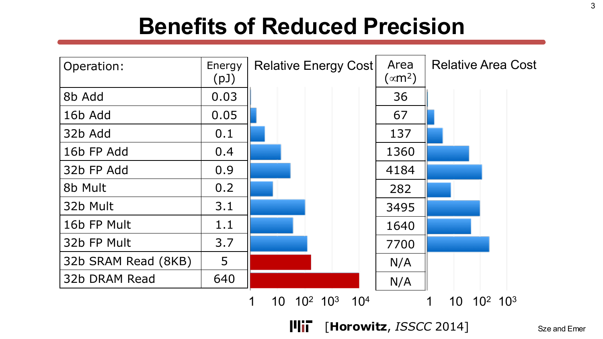
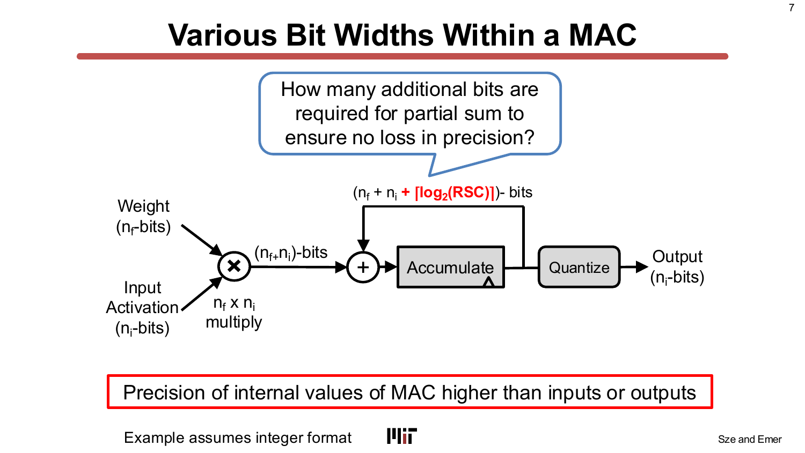
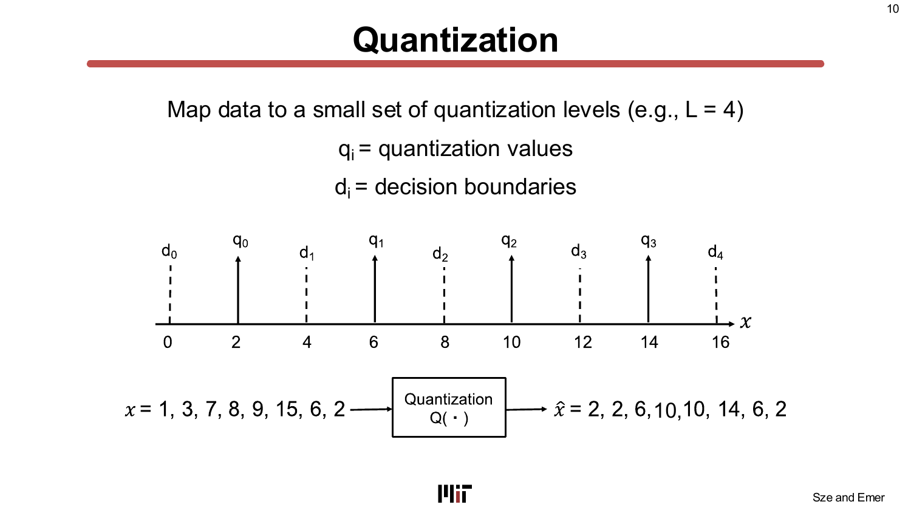
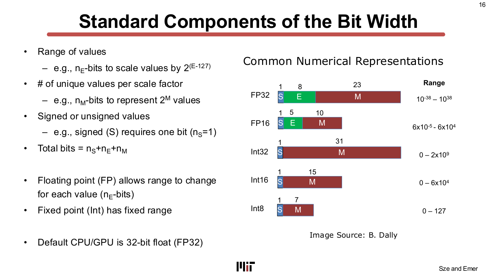
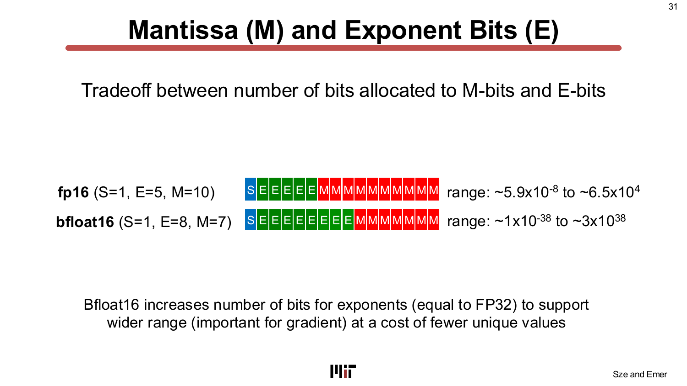
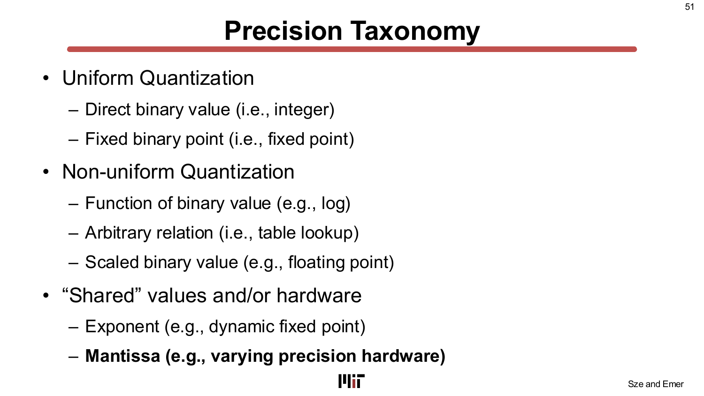
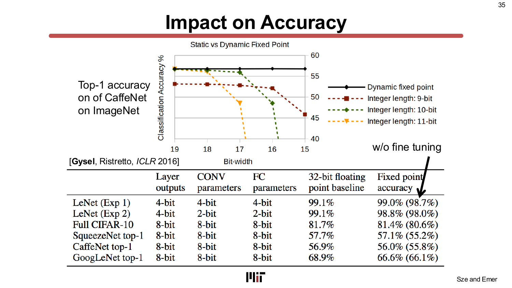
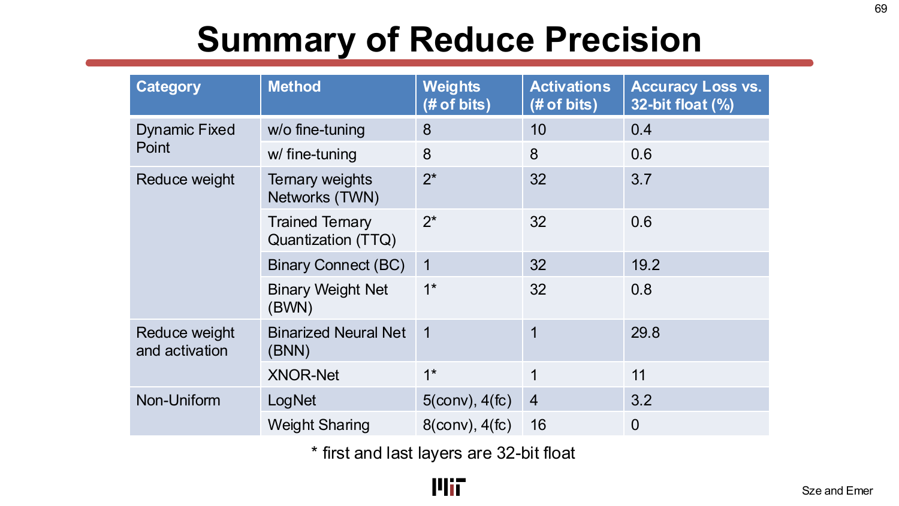

# L12 — 精度（Precision）

> **課程：** 6.5930/1 — 深度學習硬體架構（Hardware Architectures for Deep Learning）
> **講師：** Joel Emer 與 Vivienne Sze（MIT EECS）
> **講授日期：** 2025 年 3 月 16 日 · **投影片：** 76 頁 · **來源：** [`Lecture/L12 - Precision_r1.pdf`](../../Lecture/L12%20-%20Precision_r1.pdf)
>
> *本文是以「概念」為單位重建講課脈絡的導讀（walkthrough），依主題而非逐頁編排。每一節都標註其對應的投影片範圍，方便你對照原始投影片閱讀。*

---

## 一句話總結（TL;DR）

你在神經網路運算元（operand）上省下的每一個位元，都可以**雙重節能**——一次來自算術運算，一次來自記憶體存取。這一講的主題是**降低精度（reduced precision）**：系統性地把 32 位元浮點數換成更窄的格式（FP16、bfloat16、INT8、INT4，甚至 1 位元的二元網路），並分析這樣做對硬體的影響。本講建立了清晰的心智模型——*為什麼*縮減位元寬可以降低面積與能耗（乘法器成本隨位元數 O(n²) 成長）、*如何*在精度損失最小的情況下量化數值（均勻 vs. 非均勻、訓練後量化 vs. 量化感知訓練），以及業界已實際部署的成果——從 Google 8 位元整數 TPU、Nvidia 混合精度 GPU 張量核心，到開放的 MX（Microscaling）標準。貫穿全講的核心張力是**準確度－效率取捨（accuracy–efficiency tradeoff）**：每減少一個位元都能縮小成本，但也可能犧牲準確度，而如何拿捏，正是模型、數字格式與硬體協同設計（co-design）的核心問題。

---

## 學習目標（Learning Objectives）

讀完本講後，你應該能夠：

- 量化縮減運算元位元寬帶來的**能耗與面積節省**，並說明為何乘法器成本隨位元數呈 O(n²)，加法器僅呈 O(n)。
- 定義**量化（quantization）**，並區分均勻（uniform）與非均勻（non-uniform）量化方案（對數域、學習式碼本、浮點數）。
- 說明浮點格式中**尾數位元（mantissa bits, M）**與**指數位元（exponent bits, E）**各自的功能，並比較 FP32、FP16、bfloat16、INT8 和動態定點數（dynamic fixed-point）在範圍－精度取捨上的差異。
- 描述**精度分類法（precision taxonomy）**（均勻整數、定點數、對數域、學習式查找表、浮點數、動態定點數、二元／三元網路）。
- 說明訓練與推論各自的**混合精度（mixed precision）**策略（FP16 計算＋FP32 主權重）。
- 描述**精度可擴展乘加器（precision-scalable MAC）**架構（空間式、時序式／位元串列）及其面積－吞吐量－能耗取捨。
- 總結業界的**硬體生態**（TPU、Nvidia Pascal/Ampere、NVDLA、MX 標準、BitNet）。

---

## 第一章 — 為什麼要降低精度？能耗與面積的論證

> *投影片：L12-2 … L12-7*

### 協同設計的框架

第 12 講是兩講協同設計課程的第二講（繼稀疏性之後）。投影片在開頭便強調一個關鍵區別：協同設計方法**可能影響準確度**，因此每一項最佳化都必須與準確度－效率取捨一起評估——這一點不同於前幾講那些對準確度透明（accuracy-neutral）的純架構改變。

降低精度屬於**「縮減運算元大小」**的最佳化類別：縮短權重（weights）、啟動值（activations）和部分和（partial sums）的位元寬，使它們佔用更少的儲存空間與運算資源。

### 關鍵數據：能耗與面積 vs. 位元寬

本章最重要的表格（Horowitz, ISSCC 2014）列出了各種算術與記憶體操作的**能耗（pJ）與矽面積（µm²）**：

解讀這張表：

| 操作 | 能耗（pJ） | 面積（µm²） |
|---|---|---|
| 8 位元加法 | 0.03 | 36 |
| 16 位元加法 | 0.05 | 67 |
| 32 位元加法 | 0.1 | 137 |
| 16 位元浮點加法 | 0.4 | 1,360 |
| 32 位元浮點加法 | 0.9 | 4,184 |
| 8 位元乘法 | 0.2 | 282 |
| 32 位元乘法 | 3.1 | 3,495 |
| 16 位元浮點乘法 | 1.1 | 1,640 |
| 32 位元浮點乘法 | 3.7 | 7,700 |
| 32 位元 SRAM 讀取（8 KB） | 5 | — |
| 32 位元 DRAM 讀取 | 640 | — |

三項關鍵觀察：
1. **整數乘法的能耗與面積隨位元數大致呈 O(n²) 成長。** 從 8 位元到 32 位元整數乘法，能耗成長約 15 倍、面積成長約 12 倍。
2. **浮點數昂貴。** 32 位元浮點乘法消耗約 3.7 pJ、7,700 µm²——比 8 位元整數乘法**多約 18 倍能耗、27 倍面積**。
3. **記憶體主導能耗。** 一次 32 位元 DRAM 讀取耗費 640 pJ——是一次 32 位元整數乘法的 **170 倍以上**。縮減位元寬既能降低算術成本，也能降低記憶體流量。

### MAC 內部的精度傳播

MAC（乘加運算）包含三類運算元，各有不同的精度需求：輸入啟動值（n_i 位元）、權重（n_f 位元），以及部分和累加器（accumulator）。由於累加器需要累積最多 RSC 個（RSC = receptive field spatial cardinality，感受野空間大小）的部分積，它需要額外 **⌈log₂(RSC)⌉ 個位元**以避免溢位（overflow）。

以真實網路為例：AlexNet（RSC 最大 9,216）需要 14 個額外位元；VGG-16（RSC 最大 25,088）需要 15 個額外位元。這就是為什麼即使輸入是 8 位元，累加器仍常保持 32 位元——它是運算的內部「餘裕（headroom）」。

> **為什麼重要：** 把運算元位元寬從 32 縮到 8，整數乘法器的能耗可降低約 15 倍、面積可降低約 12 倍，同時也降低了記憶體流量——這兩項都是 DNN 加速器的最大開銷。本講的所有技術，都是在保持準確度的前提下達成這些節省的不同策略。

---

## 第二章 — 量化（Quantization）：核心概念

> *投影片：L12-10 … L12-15*

### 量化是什麼

**量化（quantization）**將實數值分布映射到有限個離散的**量化層級（quantization levels）**{q₀, q₁, …, q_{L-1}}，由**決策邊界（decision boundaries）**{d₁, d₂, …, d_{L-1}} 隔開。目標是在只使用 L 個層級的約束下，最小化**量化誤差（quantization error）**（原始值與重建值之差）。

所需位元數為 log₂(L)。「降低精度（reduced precision）」就是縮小 L（從而縮短位元數），以更粗糙的表示換取更小的儲存量與運算量。量化層級與邊界的最佳配置取決於資料的**概率密度函數（probability density function）**——這正是非均勻量化存在的動機。

### 範圍選擇：對稱 vs. 非對稱，以及截斷（clipping）

將實數範圍映射到量化層級的兩種模式：

- **對稱模式（symmetric mode）**：量化範圍以零為中心。硬體實作較簡單（不需要零點偏移）。
- **非對稱模式（asymmetric mode）**：範圍偏移以最佳覆蓋實際資料分布，使用一個零點偏移量（zero-point offset）。對於偏斜分布（例如 ReLU 後的非負啟動值），能更充分利用全部位元寬。

**截斷（clipping）／飽和（saturation）** 主動排除極端值：
- **DoReFa**：截斷啟動值至 [0, 1]。
- **ReLU6**：截斷啟動值至 [0, 6]。
- **PACT**：截斷啟動值至 [0, α]，其中 α 是一個**可學習參數**（與網路權重一起訓練）。

截斷用少量動態範圍的損失，換取主體分布更高的解析度。

> **為什麼重要：** 量化的準確度不僅取決於位元數，更取決於這些位元*如何*分配到數值範圍上。不良的範圍選擇會把大量層級浪費在極少出現的極端值上。

---

## 第三章 — 數字格式的分類法

> *投影片：L12-16 … L12-36*

### 數字格式的解剖

每一種數字表示法都有三個組成部分：**符號位（sign, S）**、**尾數／有效位（mantissa/significand, M）**（在給定尺度內編碼唯一數值的個數），以及（浮點數專有的）**指數（exponent, E）**（編碼尺度）。總位元數 = n_S + n_E + n_M。

| 格式 | S | E | M | 範圍 |
|---|---|---|---|---|
| FP32 | 1 | 8 | 23 | ~10⁻³⁸ 到 10³⁸ |
| FP16 | 1 | 5 | 10 | ~6×10⁻⁵ 到 6×10⁴ |
| bfloat16 | 1 | 8 | 7 | ~10⁻³⁸ 到 3×10³⁸ |
| Int32 | 1 | 0 | 31 | 0 到 2×10⁹ |
| Int8 | 1 | 0 | 7 | 0 到 127 |

核心設計選擇是如何**在 E 與 M 之間分配位元**：
- 更多 **E 位元** → 更寬的動態範圍（對訓練時的梯度很重要，因為梯度可能跨越許多個數量級）。
- 更多 **M 位元** → 範圍內更細的解析度（對推論精度與量化權重的準確度很重要）。

### bfloat16：針對訓練最佳化的格式

**bfloat16** 保留了 8 個指數位元（與 FP32 相同）但將尾數縮短至 7 位元。這使它在僅需 FP32 一半儲存量的情況下，具備**與 FP32 相同的動態範圍**——這就是它在訓練上被偏好的原因（梯度需要寬動態範圍）。相比之下，FP16 只有 5 個指數位元，在某些模型的梯度計算中會發生數值下溢（underflow）。

### 定點數（fixed-point）：範圍已知時的選擇

當數值範圍事先已知，可以完全省去指數，改用**定點格式（fixed-point format）**：一個符號位加上尾數位元，二進位小數點（binary point）的位置預先固定。8 位元定點數表示 −128 到 +127 的整數，或根據小數點位置表示小數。定點硬體更簡單（不需要指數對齊邏輯）且成本更低，代價是靈活性：所有數值共用同一個尺度因子。

### 動態定點數（dynamic fixed-point）：中間地帶

**動態定點數**（又稱區塊浮點數 block floating-point）在一**群**數值（例如同一層或同一通道的所有權重）之間共用單一尺度因子 **f**。群組內的每個數值以定點尾數儲存，尺度因子只需儲存一次並攤還至整個群組。

這嚴格介於定點數（全域單一尺度）與浮點數（每個數值獨立尺度）之間。尺度可隨層別、資料型別（權重 vs. 啟動值）和通道而異，但不能逐值改變。結果是在適度的儲存開銷下取得高準確度。

### 尾數－指數取捨

直接比較 fp16 與 bfloat16 的投影片將這個取捨具體化：

- **fp16**（S=1, E=5, M=10）：範圍約 5.9×10⁻⁸ 到約 6.5×10⁴——精度細、範圍窄。
- **bfloat16**（S=1, E=8, M=7）：範圍約 1×10⁻³⁸ 到約 3×10³⁸——範圍寬、精度較粗。

本講延伸至 **AdaptivFloat**（Tambe, DAC 2020），使指數偏置（exponent bias）可逐層配置；以及 **CFloat**（Tesla Dojo 2021），使 M 與 E 之間的位元分配完全可配置。

### Microscaling（MX）格式

AMD、ARM、Intel、Meta、Microsoft、Nvidia、Qualcomm 等公司組成的聯盟於 2023 年制定了 **MX（Microscaling）資料格式**標準。MX 格式在一個**區塊**的窄精度元素之間共用單一尺度因子（例如 MXFP8、MXFP6、MXFP4、MXINT8），本質上是細粒度的區塊浮點數，可達到：
- 以 MXINT8/MXFP8 對 FP32 預訓練模型進行推論，準確度損失極小。
- 以 MXFP6 訓練（權重、啟動值、梯度），損失極小（無需更改訓練配方）。
- 以 MXFP4 權重配合 MXFP6 啟動值和梯度訓練，僅有輕微損失。

> **為什麼重要：** 格式決定了你需要多少位元，以及能保留多少動態範圍。格式的不斷演進（FP32 → FP16 → bfloat16 → INT8 → MX 格式 → FP4）反映了業界持續在準確度－效率帕累托前沿（Pareto frontier）上尋找最佳點的努力。

---

## 第四章 — 非均勻量化（Non-Uniform Quantization）

> *投影片：L12-23 … L12-30*

### 動機：分布並不均勻

均勻量化（uniform quantization）將層級等距排列。但 DNN 的權重分布往往是**非均勻**的——集中在零附近、具有重尾（heavy tail）。非均勻量化在分布密集處分配更多層級、稀疏處分配更少，在相同位元數下可降低平均量化誤差。

### 對數域量化（log-domain quantization）

**對數量化（logarithmic quantization）**將尾數位元映射到對數尺度上。關鍵的硬體優勢：**在對數域中，乘法變成加法**（加法變成移位與比較）。投影片顯示，當權重和啟動值都在對數域時，乘加運算（MAC）退化為移位加法（shift-and-add）——一種硬體上成本更低的基本運算。

LogNet（Lee, ICASSP 2017；Miyashita, arXiv 2016）的成果：
- 卷積層（CONV）5 位元、全連接層（FC）4 位元的權重，啟動值 4 位元，在 AlexNet 上。
- 準確度損失：僅 **3.2%** top-1。
- 硬體：移位加法取代乘法器。

### 學習式（碼本）量化（learned / codebook quantization）

**權重共用（weight sharing）**（Han, ICLR 2016）對每一層的權重應用 k-means 分群，找出 U 個代表值。每個權重只儲存一個指向大小為 U 的碼本（codebook）的索引（log₂U 位元）。AlexNet 上的結果（**零準確度損失**）：
- 卷積層：每層 256 個唯一權重（8 位元索引）。
- 全連接層：每層 16 個唯一權重（4 位元索引）。

硬體含義：權重記憶體讀出窄索引；一個小型解量化查找表（dequantization table）在 MAC 之前將索引還原為全精度權重值。這減少了**儲存**量，但不降低 MAC 本身的精度——乘法器仍以全精度運算。

由此形成的精度分類法（precision taxonomy）：

- **均勻（Uniform）**：直接整數（direct binary value）、定點數（fixed-point）。
- **非均勻受約束（Non-uniform constrained）**：對數域（log-domain，數值是二進位值的函數）。
- **非均勻不受約束（Non-uniform unconstrained）**：學習式碼本（arbitrary mapping，以查找表實作）。
- **縮放二進位（Scaled binary）**：浮點數、動態定點數、MX 格式。
- **共享硬體（Shared hardware）**：精度可擴展乘加器（varying mantissa width）。

> **為什麼重要：** 非均勻量化在相同位元寬下可比均勻量化達到更好的準確度，但代價是更多硬體（對數的移位邏輯；碼本的查找表）。取捨在於硬體的簡潔性與量化保真度之間。

---

## 第五章 — 準確度影響與混合精度

> *投影片：L12-21 … L12-22, L12-35, L12-48, L12-70 … L12-74*

### 動態定點數的準確度影響

投影片顯示了 CaffeNet 在 ImageNet 上的 top-1 準確度，當位元寬從 16 位元逐步降低至 2 位元時（有無微調的比較）：

關鍵發現：
- **8 位元動態定點數，無微調**：相較 32 位元浮點數損失 0.4%。
- **8 位元動態定點數，有微調**：損失 0.6%。
- 微調（以量化算術重新訓練）在位元寬降至 8 以下時至關重要。

### 綜合準確度總結表

本講的總結表（投影片 69）是最有用的量化參考文獻，記錄了各種降低精度方法在 AlexNet 上的準確度損失：

| 類別 | 方法 | 權重（位元） | 啟動值（位元） | 準確度損失（%） |
|---|---|---|---|---|
| 均勻 | 動態定點數（無微調） | 8 | 10 | 0.4 |
| 均勻 | 動態定點數（有微調） | 8 | 8 | 0.6 |
| 三元 | 三元權重網路（TWN） | 2* | 32 | 3.7 |
| 三元 | 訓練三元量化（TTQ） | 2* | 32 | 0.6 |
| 二元 | Binary Connect（BC） | 1 | 32 | 19.2 |
| 二元 | 二元權重網路（BWN） | 1* | 32 | 0.8 |
| 二元 | 二元神經網路（BNN） | 1 | 1 | 29.8 |
| 二元 | XNOR-Net | 1* | 1 | 11 |
| 非均勻 | LogNet | 5(conv), 4(fc) | 4 | 3.2 |
| 非均勻 | 權重共用（Weight Sharing） | 8(conv), 4(fc) | 16 | 0 |

*\* 第一層和最後一層保持 32 位元浮點數*

規律清晰可見：**同時二元化權重和啟動值**（BNN）在 ImageNet 這類非瑣碎任務上造成災難性的準確度損失；**僅二元化權重**（BWN，帶尺度因子）將損失控制在 1% 以下；**8 位元均勻量化加微調**幾乎是無損的。

### 訓練的混合精度

以降低精度進行訓練比推論困難得多，因為**梯度**具有跨層變化的大動態範圍。業界標準解決方案（Narang, ICLR 2018）在前向與反向計算中使用 **FP16**，但保留 **FP32 主權重（master weights）**用於權重更新。這樣可以防止梯度下溢（underflow），同時將計算密集路徑的記憶體使用減半。

推論已以 8 位元整數為業界標準。4 位元研究正在進行中：
- **HFP8**（Sun, NeurIPS 2019）：前向使用 E=4, M=3；反向使用 E=5, M=2。
- **FP4 訓練**（Sun, NeurIPS 2020）：梯度使用以 4 為基底的對數格式（FP4），配合可訓練的逐層尺度因子與兩階段捨入（two-phase rounding）。

### 跨層的精度變化

並非每一層都需要相同的精度。投影片顯示，在不同層使用不同精度（例如某些層用 4 位元、其他層用 8 位元），可比在所有地方一律使用低位元寬取得更好的準確度－效率取捨。在總結表幾乎每一個方法中，頭尾兩層（第一層與最後一層）都被一致地保留在較高精度。

> **為什麼重要：** 8 位元整數推論已成熟且為業界標準。前沿是 **4 位元及以下**，在此精度下，量化感知訓練（QAT）、逐通道縮放和精心設計的格式都是保持準確度的必要條件。總結表就是這條前沿的量化計分板。

---

## 第六章 — 降低精度的硬體實作

> *投影片：L12-37 … L12-58*

### 業界硬體：從 TPU 到 MX 張量核心

本講調查了業界如何實際部署降低精度的硬體：

- **Google TPU**（Jouppi, ISCA 2017）：8 位元整數 MAC 搭配 32 位元累加器。設計選擇是主動的：減少精度而非靠頻寬解決問題。
- **Nvidia Pascal（2016）**：第一款加入 16 位元浮點（半精度）張量指令（>21 TFLOPS）和 8 位元整數推論指令（47 TOPS）的 GPU。
- **Nvidia Ampere 及之後**：混合精度張量核心，支援 FP64、FP32、TF32、FP16、bfloat16、INT8、INT4。
- **NVDLA**：支援 Binary/INT4/INT8/INT16/INT32/FP16/FP32/FP64。
- **Microsoft BrainWave**：自定義 8 位元與 9 位元浮點格式，用於 FPGA 上的 RNN/LSTM 推論。
- **Intel Nervana（FlexPoint）**：用於訓練的自定義格式。
- **TPU v2 & v3**：採用 bfloat16 進行訓練。
- **Nvidia NVFP4**（2024）：4 位元浮點推論，在精心管理量化開銷的情況下提供更高的計算吞吐量。
- **DeepSeek-V3**：在 6,710 億參數的規模上驗證了 FP8 混合精度訓練的有效性。

### 精度可擴展乘加器（precision-scalable MAC）

核心硬體挑戰：一個乘法器單元能否在不需要為每個精度各建一個物理乘法器的情況下，服務**不同的位元寬**？答案是肯定的，透過**精度可擴展乘加器（precision-scalable MACs）**。

本講將其分為三個家族：

**空間式精度可擴展乘加器（spatial precision-scalable MACs）**：重新連接部分積樹（partial-product tree）的接線以服務不同精度。在 8×8 位元時，所有加法器都被使用；在 4×4 位元時，同一組加法器樹的不同部分並行執行多個 4×4 乘法。收益是**在較低精度時提升吞吐量**（每個時脈週期可進行更多並行運算），而無需另設乘法器。

**時序式精度可擴展乘加器（temporal precision-scalable MACs）／位元串列處理（bit-serial processing）**：每個時脈週期處理運算元的一個位元面（bit-plane），累積部分結果。縮減位元寬可減少所需的週期數——加速比與位元寬縮減量成正比。Stripes（Judd, MICRO 2016）在 AlexNet 上用位元串列處理達到了相較 16 位元定點數 **1.92 倍的加速**。

**透過電壓縮放降低功耗**：關鍵路徑較短（來自更少的位元），MAC 可在**更低的電源電壓**下運行，降低動態功耗。Moons（VLSI 2016）在 AlexNet 第 2 層上展示了相較 16 位元定點數 **2.5 倍的功耗降低**。

Camus（JETCAS 2019）對 19 種精度可擴展乘加器設計的基準測試發現，在精度分布偏斜（例如 95% 數值在 2 或 4 位元、5% 在 8 位元）時，加入邏輯以在較低精度時提升利用率，反而可能*降低*整體收益。傳統資料閘控（data-gated）設計達到了 1.3 倍的能耗降低；加入空間分解推升至 1.6 倍——但額外複雜度的邊際效益遞減。

### 二元與三元網路——以及大型語言模型（LLM）

降低精度的極端情形：

- **Binary Connect**（Courbariaux, NeurIPS 2015）：權重 ∈ {−1, +1}，啟動值保持 32 位元浮點。MAC 退化為加減法；不需要乘法器。AlexNet 準確度損失：19%。
- **二元權重網路（BWN, Binary Weight Net）**（Rastegari, ECCV 2016）：權重 ∈ {−α, +α}，帶有逐濾波器的尺度因子 α（由濾波器權重的 ℓ₁-norm 決定）。AlexNet 準確度損失：僅 **0.8%**。
- **二元神經網路（BNN, Binarized Neural Network）**（Courbariaux, arXiv 2016）：權重與啟動值均 ∈ {−1, +1}。MAC 退化為 XNOR-popcount——一個極小的邏輯閘。準確度損失：29.8%。
- **XNOR-Net**（Rastegari, ECCV 2016）：權重 ∈ {−α, +α}、啟動值 ∈ {−βᵢ, +βᵢ}，帶有逐位置尺度因子。準確度損失：11%。
- **三元權重網路（TWN, Ternary Weight Net）**：權重 ∈ {−w, 0, +w}，加入零值增加稀疏性。準確度損失：3.7%。
- **訓練三元量化（TTQ, Trained Ternary Quantization）**：權重 ∈ {−w₁, 0, +w₂}，非對稱的可學習閾值。準確度損失：0.6%。

**BitNet**（Microsoft, 2024）將二元化推廣至**大型語言模型（LLM）**：1 位元權重（BitNet）和約 1.58 位元權重（Ternary BitNet，即 log₂(3) 位元），兩者均使用 8 位元啟動值，從頭訓練（trained from scratch）。這表明即使在 LLM 規模下，極端精度降低也是可行的——考慮到 LLM 服務的記憶體與能源成本，這是一項重要發現。

> **為什麼重要：** 硬體設計空間與數字格式設計空間相互映射：空間可重配給提升吞吐量，時序式位元串列給出線性加速比，對閒置邏輯的閘控（gating）降低能耗。挑戰在於增加靈活性始終帶來一定開銷，因此淨收益取決於工作負載的實際精度分布。

---

## 關鍵詞彙（Key Terms）

| 詞彙 | 說明 |
|---|---|
| **量化（quantization）** | 將實數值分布映射到 L 個離散量化層級，需要 ⌈log₂L⌉ 位元。 |
| **量化層級（quantization level）** | L 個離散數值（qᵢ）之一，量化後的表示只能取這些值。 |
| **量化誤差（quantization error）** | 原始實數值與其量化重建值之差。 |
| **定點數（fixed-point）** | 格式含符號位、尾數位，二進位小數點位置預先固定；無逐值指數。 |
| **浮點數（floating-point, FP）** | 格式含符號（S）、指數（E）、尾數（M）；二進位小數點位置隨值而變。 |
| **FP32** | IEEE 754 單精度：S=1, E=8, M=23。傳統基準。 |
| **FP16** | IEEE 754 半精度：S=1, E=5, M=10。比 FP32 範圍更窄。 |
| **bfloat16** | 腦浮點 16：S=1, E=8, M=7。與 FP32 範圍相同，精度較粗。訓練首選。 |
| **INT8 / INT4** | 8 位元 / 4 位元整數格式；無指數。推論的標準格式。 |
| **動態定點數（dynamic fixed-point）** | 區塊浮點數：一組數值（如同一層）共用單一尺度因子，逐值存定點尾數。 |
| **均勻量化（uniform quantization）** | 層級等距排列的量化（整數、定點數）。 |
| **非均勻量化（non-uniform quantization）** | 層級非等距排列的量化（對數域、碼本／學習式）。 |
| **對數域量化（log-domain quantization）** | 在對數尺度上量化；將乘法轉換為移位運算。 |
| **權重共用（weight sharing）** | 學習式碼本（k-means）量化：多個權重共用單一代表值。 |
| **訓練後量化（PTQ, post-training quantization）** | 在不重新訓練的情況下量化預訓練模型；速度快但在低位元寬時準確度較差。 |
| **量化感知訓練（QAT, quantization-aware training）** | 在訓練過程中模擬量化以最小化準確度損失；4 位元以下必需。 |
| **混合精度（mixed precision）** | 對不同張量或不同層使用不同位元寬（例如 FP16 計算＋FP32 主權重）。 |
| **對稱 / 非對稱量化（symmetric / asymmetric quantization）** | 量化範圍是否以零為中心（對稱）或偏移（非對稱）。 |
| **截斷 / 飽和（clipping / saturation）** | 限制量化範圍以排除極端值（例如 ReLU6、PACT）。 |
| **逐張量 / 逐通道縮放（per-tensor / per-channel scaling）** | 整個張量用一個尺度因子，vs. 每個輸出通道各一個。逐通道更精確。 |
| **二元 / 三元網路（binary / ternary nets）** | 極端精度降低：權重 ∈ {−1,+1}（二元）或 {−w,0,+w}（三元）。 |
| **XNOR-Net** | 二元權重、二元啟動值的網路，MAC 退化為 XNOR-popcount 運算。 |
| **MX（Microscaling）格式** | 業界標準的區塊浮點格式（MXFP8、MXFP6、MXFP4、MXINT8），用於窄精度計算。 |
| **位元串列 / 時序式 MAC（bit-serial / temporal MAC）** | 每個時脈週期處理一個位元面；位元寬越低 → 週期越少 → 線性加速。 |
| **精度可擴展乘加器（precision-scalable MAC）** | 可重配置為不同位元寬服務的單一乘法器（空間式或時序式分解）。 |
| **RSC（感受野空間大小）** | Receptive field spatial cardinality；決定部分和累加器所需的最少位元數。 |

---

## 重點回顧（Takeaways）

- 將運算元位元寬從 32 降至 8，整數乘法器的能耗可降低約 **15 倍**、面積可降低約 **12 倍**，同時也降低了記憶體流量——這兩項都是 DNN 加速器最大的開銷。
- **8 位元整數推論**已是業界標準，準確度損失幾乎可忽略不計（微調後 < 1%）。**4 位元訓練**是活躍的研究前沿。
- 三方格式選擇——**整數 vs. 定點數 vs. 浮點數**——在硬體簡潔性與動態範圍之間取捨。業界主流模式是訓練用 **bfloat16**（寬範圍）、推論用 **INT8**（硬體簡單）。
- **非均勻量化**（對數域、學習式碼本）在相同位元寬下比均勻量化更貼合資料分布，代價是需要額外的移位／查找邏輯。
- **量化感知訓練（QAT）** 在位元寬低於約 4 位元時是必要的；**訓練後量化（PTQ）** 在大多數模型的 8 位元以上通常已足夠。
- **二元與三元網路**實現了極端壓縮（每個權重 1–2 位元），但若無精心的尺度因子設計與 QAT，會有大量的準確度損失。
- **精度可擴展乘加器**（空間式和時序式／位元串列）讓單一硬體設計能服務多種位元寬，以設計複雜度換取靈活性。
- **MX 標準**和 NVFP4 等格式表明，4 位元及以下是新興前沿，已在 LLM 規模上得到驗證（DeepSeek-V3 使用 FP8、BitNet 使用 1 位元權重）。

---

## 與後續講次的連結（Connections）

- **資料屬性專屬最佳化（L01）：** 降低精度是 TeAAL 金字塔中兩項資料屬性最佳化的第二項（第一項是稀疏性，L07–L10）。兩者都透過縮小表示來降低資料搬移成本；降低精度還能降低算術成本。
- **稀疏性（L07–L10）：** 二元與三元網路自然地引入稀疏性（三元網路中的零值權重）。兩條協同設計軸線相互作用：更稀疏＋更低精度的網路可以疊加節省效果。
- **進階技術（L11）：** L11 涵蓋記憶體內運算（compute-in-memory），它本質上在類比或近數位精度下運作——使量化成為其準確度分析的核心。
- **資料流與映射（L05–L06）：** 混合精度與資料流選擇相互影響；UNPU 加速器（Lee, JSSC 2019）特意採用輸入駐留（input-stationary）資料流，正是因為其權重為降低精度格式，改變了權重 vs. 啟動值重用的相對成本。
- **模型協同設計：** WRPN（Mishra, ICLR 2018）顯示，增加通道寬度可補償降低精度所損失的準確度——這是模型形狀與數字格式共同最佳化的直接案例。

---

## 附錄 — 投影片對照表（Slide-to-Section Map）

| 投影片 | 章節 |
|---|---|
| L12-1 | 標題 |
| L12-2 … L12-7 | 第一章 — 為什麼要降低精度？能耗與面積的論證 |
| L12-10 … L12-15 | 第二章 — 量化：核心概念 |
| L12-16 … L12-36 | 第三章 — 數字格式的分類法 |
| L12-23 … L12-30 | 第四章 — 非均勻量化 |
| L12-21 … L12-22, L12-35, L12-48, L12-70 … L12-74 | 第五章 — 準確度影響與混合精度 |
| L12-37 … L12-58 | 第六章 — 降低精度的硬體實作 |
| L12-59 … L12-68 | 第六章 — 二元與三元網路 |
| L12-69 | 第五章 — 綜合準確度總結表 |
| L12-75 … L12-76 | 總結與推薦閱讀 |
